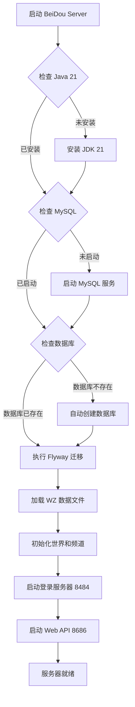
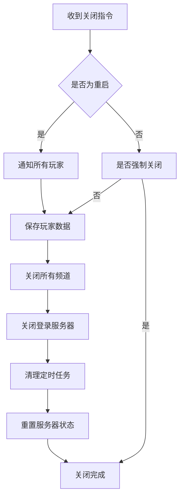
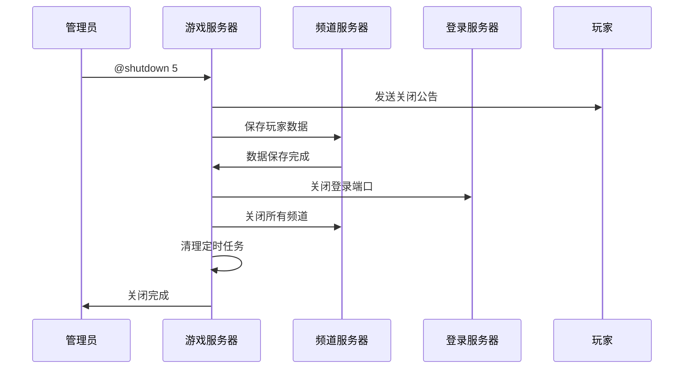

# 启动指南

## 1. 概述

本文档详细介绍 BeiDou-Server 游戏服务器的启动、停止和重启操作。服务器采用 Java 21 + Spring Boot 3.2.3 + Netty 4.1.109.Final 技术栈构建，支持 Windows 和 Linux 双平台运行。

### 1.1 服务端口说明

| 端口 | 用途 | 协议 |
|------|------|------|
| 8686 | Web API 服务 | HTTP |
| 8484 | 登录服务器 | TCP |
| 8600+ | 游戏频道（多通道） | TCP |

### 1.2 启动流程图



### 1.3 关闭流程图



## 2. 启动前检查

### 2.1 环境要求

在启动服务器之前，请确保满足以下环境要求：

| 组件 | 最低版本 | 推荐版本 |
|------|----------|----------|
| JDK | Java 21 | Java 21.0.2+ |
| MySQL | 8.0+ | 8.4.0 |
| 内存 | 4GB | 8GB+ |
| 磁盘 | 10GB | 20GB+ SSD |

### 2.2 检查 Java 环境

```bash
# 检查 Java 版本
java -version

# 应输出类似内容：
# java version "21.x.x"
# Java(TM) SE Runtime Environment (build 21.x.x)
```

### 2.3 检查 MySQL 服务

**Windows:**
```bash
# 检查 MySQL 服务状态
net start | findstr "MySQL"

# 启动 MySQL 服务
net start MySQL
```

**Linux:**
```bash
# 检查 MySQL 服务状态
sudo systemctl status mysql

# 启动 MySQL 服务
sudo systemctl start mysql

# 设置开机自启
sudo systemctl enable mysql
```

### 2.4 编译项目

如果尚未编译项目，请先执行编译：

```bash
# 使用 Maven 编译项目
mvn clean package -DskipTests
```

编译成功后，会在 `target/` 目录下生成 `BeiDou.jar` 文件。

## 3. 启动服务

### 3.1 Windows 启动

#### 方式一：使用启动脚本（推荐）

双击运行项目根目录下的 `launch.bat` 文件：

```batch
@echo off
@title BeiDou
chcp 65001
.\jdk-21.0.2\bin\java.exe -Dspring.config.location=application.yml -jar BeiDou.jar
pause
```

脚本会自动使用项目自带的 JDK 21.0.2 运行服务器。

#### 方式二：命令行启动

```batch
# 进入项目目录
cd d:\MapleStorySource\BeiDou-Server\gms-server

# 使用系统 Java 或指定 JDK
java -Dspring.config.location=application.yml -jar target\BeiDou.jar
```

#### 方式三：使用 IDEA 运行

1. 打开 IntelliJ IDEA
2. 选择 `Run` → `Edit Configurations`
3. 添加新的 `Application` 配置
4. 设置主类为 `org.gms.ServerApplication`
5. 设置 Working directory 为 `gms-server` 目录
6. 点击运行

### 3.2 Linux 启动

#### 方式一：使用启动脚本（推荐）

```bash
# 添加执行权限
chmod +x launch.sh

# 运行启动脚本
./launch.sh
```

`launch.sh` 脚本内容：
```bash
#!/bin/sh
./jdk-21.0.2/bin/java -Dspring.config.location=application.yml -jar BeiDou.jar &
```

#### 方式二：命令行启动

```bash
# 进入项目目录
cd /path/to/gms-server

# 前台运行
java -Dspring.config.location=application.yml -jar target/BeiDou.jar

# 后台运行
nohup java -Dspring.config.location=application.yml -jar target/BeiDou.jar > logs/beidou.log 2>&1 &
```

#### 方式三：使用 Systemd 服务

创建服务文件 `/etc/systemd/system/beidou.service`：

```ini
[Unit]
Description=BeiDou Game Server
After=network.target mysql.service

[Service]
Type=simple
User=beidou
WorkingDirectory=/opt/beidou-server
ExecStart=/usr/bin/java -Dspring.config.location=application.yml -Xms2G -Xmx4G -jar /opt/beidou-server/BeiDou.jar
Restart=on-failure
RestartSec=10

[Install]
WantedBy=multi-user.target
```

管理服务：

```bash
# 重载配置
sudo systemctl daemon-reload

# 启动服务
sudo systemctl start beidou

# 开机自启
sudo systemctl enable beidou

# 查看状态
sudo systemctl status beidou

# 查看日志
sudo journalctl -u beidou -f
```

### 3.3 Docker 启动

```bash
# 启动服务
docker-compose up -d

# 查看日志
docker-compose logs -f

# 停止服务
docker-compose down
```

## 4. 停止服务

### 4.1 正常停止

**方式一：使用快捷键**

在运行服务器的终端窗口中，按 `Ctrl + C` 发送中断信号，服务器会执行优雅关闭。

**方式二：通过管理命令**

服务器支持通过游戏内命令关闭服务器（需要管理员权限）：

```
@shutdown [分钟] [消息]
```

参数说明：
- `分钟`：倒计时时间，不指定则立即关闭
- `消息`：可选的关闭通知消息

**方式三：使用 PID**

```bash
# 查找进程 PID
jps -l

# 正常停止（发送 SIGTERM）
kill <PID>

# 强制停止（发送 SIGKILL）
kill -9 <PID>
```

### 4.2 优雅关闭过程

服务器关闭时，会执行以下操作：

1. **通知玩家**：向所有在线玩家发送关闭倒计时提示
2. **保存数据**：保存所有玩家的背包、任务、成就等数据
3. **关闭频道**：按顺序关闭所有游戏频道
4. **关闭登录服务器**：停止接受新的连接
5. **清理资源**：关闭定时任务、清理缓存、释放连接



## 5. 重启服务

### 5.1 热重启

在游戏内使用管理员命令重启：

```
@restart
```

此命令会触发服务器的内部重启流程，保留服务器实例但重新初始化所有状态。

### 5.2 冷重启

#### Windows

```batch
# 停止服务
taskkill /F /PID <PID>

# 等待几秒
timeout /t 5

# 重新启动
launch.bat
```

#### Linux

```bash
# 停止服务
kill <PID>

# 等待几秒
sleep 5

# 重新启动
./launch.sh
```

### 5.3 使用 Systemd 重启

```bash
sudo systemctl restart beidou
```

## 6. 配置说明

### 6.1 主要配置文件

项目使用 `src/main/resources/application.yml` 作为主配置文件。

### 6.2 核心配置项

```yaml
server:
  port: 8686                    # Web API 端口

app:
  vue: http://localhost:8787   # 前端地址

jwt:
  secret: "UUID"               # JWT 密钥（生产环境请自行修改）
  duration: 1800000             # Token 过期时间（毫秒）

mybatis-flex:
  datasource:
    mysql:
      driver-class-name: com.mysql.cj.jdbc.Driver
      url: jdbc:mysql://localhost:3306/beidou?useUnicode=true&characterEncoding=utf-8&useSSL=false&serverTimezone=Asia/Shanghai
      username: root             # 数据库用户名
      password: root             # 数据库密码

spring:
  flyway:
    validate-on-migrate: false  # Flyway 迁移验证
  servlet:
    multipart:
      max-file-size: 1MB         # 最大文件上传大小
      max-request-size: 10MB     # 最大请求大小
  jackson:
    time-zone: Asia/Shanghai     # 时区设置
    date-format: yyyy-MM-dd HH:mm:ss  # 日期格式

gms:
  service:
    language: zh-CN              # 语言设置：zh-CN / en-US
    rate-limit:
      enabled: false             # 是否开启限流
      limit: 10                  # 限流阈值
      duration: 1000             # 限流时间窗口
      auto-ban: false            # 是否自动封禁
    wan-host: 127.0.0.1          # 公网 IP
    lan-host: 127.0.0.1          # 局域网 IP
    localhost: 127.0.0.1          # 本地 IP
    login-port: 8484             # 登录服务器端口
```

### 6.3 启动参数

可通过三种方式传递配置参数（优先级从高到低）：

| 优先级 | 方式 | 示例 |
|--------|------|------|
| 1 | JVM 系统属性 | `-Dmybatis-flex.datasource.mysql.username=root` |
| 2 | 命令行参数 | `--mybatis-flex.datasource.mysql.username=root` |
| 3 | 环境变量 | `MYBATIS_FLEX_DATASOURCE_MYSQL_USERNAME=root` |
| 4 | 配置文件 | `application.yml` 中的值 |

### 6.4 JVM 参数建议

生产环境建议添加以下 JVM 参数：

```bash
java -Xms2G \                    # 初始堆内存
    -Xmx4G \                     # 最大堆内存
    -XX:+UseG1GC \               # 使用 G1 垃圾收集器
    -XX:MaxGCPauseMillis=200 \   # 最大 GC 停顿时间
    -XX:+UseStringDeduplication \ # 字符串去重
    -XX:+HeapDumpOnOutOfMemoryError \  # OOM 时生成堆转储
    -XX:HeapDumpPath=./logs/ \   # 堆转储文件路径
    -jar BeiDou.jar
```

## 7. 验证服务

### 7.1 检查进程

**Windows:**
```bash
jps -l
# 应看到 BeiDou.jar 进程
```

**Linux:**
```bash
ps aux | grep BeiDou
# 或
pgrep -f BeiDou.jar
```

### 7.2 检查端口

**Windows:**
```bash
netstat -ano | findstr "8686"
netstat -ano | findstr "8484"
```

**Linux:**
```bash
netstat -tlnp | grep "8686"
netstat -tlnp | grep "8484"
```

### 7.3 测试 API

```bash
# 测试健康检查
curl http://localhost:8686/actuator/health

# 测试 Web API
curl http://localhost:8686/

# 测试登录接口
curl -X POST http://localhost:8686/api/auth/login \
  -H "Content-Type: application/json" \
  -d '{
    "username": "admin",
    "password": "admin123"
  }'
```

### 7.4 查看日志

启动成功后会生成日志文件在 `logs/` 目录下：

```bash
# Windows
type logs\beidou.log

# Linux
tail -f logs/beidou.log
```

正常启动的日志输出：

```
 INFO ServerApplication - Starting ServerApplication...
 INFO Server - 欢迎使用 BeiDou Server
 INFO Server - 服务器版本: x.x.x
 INFO Server - 初始化中...
 INFO Server - 加载 WZ 数据...
 INFO Server - 初始化世界...
 INFO LoginServer - 登录服务器启动中，端口: 8484
 INFO ServerApplication - Started ServerApplication in x.xxx seconds
```

## 8. 常见问题

### 8.1 端口被占用

**问题**：启动时报错 `Port 8686/8484 is already in use`

**解决**：

**Windows:**
```bash
# 查找占用端口的进程
netstat -ano | findstr "8686"

# 结束进程
taskkill /PID <PID> /F
```

**Linux:**
```bash
# 查找占用端口的进程
lsof -i :8686

# 结束进程
kill -9 <PID>
```

### 8.2 数据库连接失败

**问题**：报错 `Connection refused` 或 `Unknown database 'beidou'`

**解决**：

1. 检查 MySQL 服务是否启动
2. 检查 `application.yml` 中的数据库配置
3. 确保数据库已创建（服务器启动时会自动创建）
4. 检查用户名密码是否正确

```bash
# 手动创建数据库
mysql -u root -p
CREATE DATABASE beidou DEFAULT CHARACTER SET utf8mb4 COLLATE utf8mb4_general_ci;
```

### 8.3 内存不足

**问题**：报错 `Could not reserve enough space for object heap`

**解决**：

1. 增加系统可用内存
2. 降低 JVM 堆内存设置：
```bash
java -Xms512m -Xmx2g -jar BeiDou.jar
```
3. 关闭其他占用内存的程序

### 8.4 JDK 版本不匹配

**问题**：报错 `Unsupported class file major version`

**解决**：

确保使用 JDK 21 或更高版本：

```bash
# 检查 Java 版本
java -version

# 如果版本不对，设置正确的 JAVA_HOME
export JAVA_HOME=/path/to/jdk-21
export PATH=$JAVA_HOME/bin:$PATH
```

### 8.5 数据库自动创建失败

**问题**：服务器启动时无法自动创建数据库

**解决**：

服务器依赖 `ServerApplication.initDb()` 方法自动创建数据库。如果此方法失败，可能原因包括：

1. MySQL 用户权限不足
2. JDBC URL 配置错误
3. 网络连接问题

建议手动创建数据库后重启服务器：

```sql
CREATE DATABASE beidou DEFAULT CHARACTER SET utf8mb4 COLLATE utf8mb4_general_ci;
GRANT ALL PRIVILEGES ON beidou.* TO 'root'@'localhost';
FLUSH PRIVILEGES;
```

### 8.6 Flyway 迁移失败

**问题**：数据库迁移脚本执行失败

**解决**：

1. 检查 `application.yml` 中 Flyway 配置
2. 确保数据库连接正常
3. 清理已部分执行的迁移：

```sql
-- 删除 Flyway 记录表
DROP TABLE IF EXISTS flyway_schema_history;
```

然后重启服务器。

## 9. 日志管理

### 9.1 日志位置

- 开发环境：控制台输出
- 生产环境：`logs/beidou.log`

### 9.2 日志级别配置

在 `application.yml` 中配置：

```yaml
logging:
  level:
    root: INFO
    org.gms: DEBUG
  file:
    name: logs/beidou.log
    max-size: 100MB
    max-history: 30
```

### 9.3 日志分析

常用日志分析命令：

```bash
# Linux: 查看错误日志
grep -i error logs/beidou.log

# Linux: 查看最近 100 行
tail -100 logs/beidou.log

# Linux: 实时查看日志
tail -f logs/beidou.log

# Linux: 查看指定时间的日志
sed -n '/2026-03-26 10:00:00/,/2026-03-26 11:00:00/p' logs/beidou.log
```

---

*文档版本: 1.0*
*最后更新: 2026-03-26*
