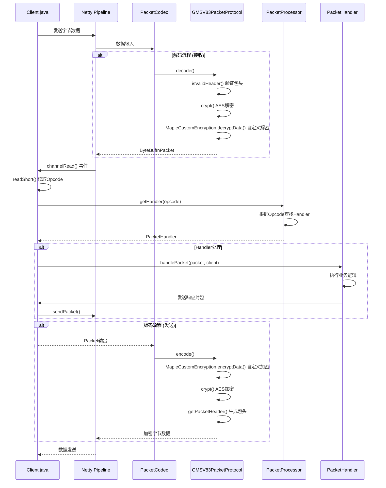

# 网络通信模块

## 1. 概述

BeiDou-Server 采用 Netty 4.1.109.Final 作为核心网络通信框架，实现了高性能、可扩展的游戏服务器网络通信层。本模块负责处理客户端与服务器之间的所有网络通信，包括登录认证、角色选择、游戏逻辑交互等。

### 1.1 网络架构

```
┌─────────────────────────────────────────────────────────────┐
│                        游戏客户端                             │
└────────────────────────────┬────────────────────────────────┘
                             │
┌────────────────────────────▼────────────────────────────────┐
│                      Netty 网络层                             │
│  ┌──────────────────┐           ┌──────────────────┐       │
│  │   LoginServer    │           │  ChannelServer   │       │
│  │   (端口 8484)     │           │  (端口 8600+)     │       │
│  └────────┬─────────┘           └────────┬─────────┘       │
│           │                              │                  │
│  ┌────────▼──────────────────────────────▼─────────┐       │
│  │              PacketCodec (加密/解密)             │       │
│  └────────┬──────────────────────────────┬─────────┘       │
│           │                              │                  │
│  ┌────────▼──────────────────────────────▼─────────┐       │
│  │              Client (会话管理)                    │       │
│  └────────┬──────────────────────────────┬─────────┘       │
│           │                              │                  │
│  ┌────────▼──────────────────────────────▼─────────┐       │
│  │          PacketProcessor (封包分发)              │       │
│  └────────┬──────────────────────────────┬─────────┘       │
│           │                              │                  │
│  ┌────────▼─────────┐           ┌────────▼─────────┐       │
│  │  Login Handlers  │           │ Channel Handlers │       │
│  │   (登录处理器)    │           │   (频道处理器)    │       │
│  └──────────────────┘           └──────────────────┘       │
└─────────────────────────────────────────────────────────────┘
```

### 1.2 端口配置

| 服务器类型 | 默认端口 | 说明 |
|-----------|---------|------|
| LoginServer | 8484 | 登录服务器，处理账号登录、角色列表等 |
| ChannelServer | 8600+ | 频道服务器，每个频道占用一个端口 |

频道端口计算公式：`BASE_PORT + (channel - 1) + (world * 100)`，其中 `BASE_PORT = 7575`。

---

## 2. Netty 架构与实现

### 2.1 核心组件

#### ServerChannelInitializer

`ServerChannelInitializer` 是 Netty Channel 的初始化器，负责配置客户端连接的管道（Pipeline）。

```java
// 位置: org.gms.net.netty.ServerChannelInitializer
```

**初始化流程：**

1. 生成发送和接收的初始化向量（IV）
2. 创建协议工厂（ProtocolFactory）
3. 发送初始握手包（Hello Packet）
4. 配置 Pipeline 处理器链

**Pipeline 配置：**

```
Inbound（入站）:
  IdleStateHandler → PacketCodec → Client

Outbound（出站）:
  Client → PacketCodec → ...
```

#### LoginServer

`LoginServer` 是登录服务器的实现，使用 Netty ServerBootstrap 启动。

```java
// 位置: org.gms.net.netty.LoginServer
```

**启动代码：**

```java
EventLoopGroup parentGroup = new NioEventLoopGroup();
EventLoopGroup childGroup = new NioEventLoopGroup();
ServerBootstrap bootstrap = new ServerBootstrap()
        .group(parentGroup, childGroup)
        .channel(NioServerSocketChannel.class)
        .childHandler(new LoginServerInitializer());
this.channel = bootstrap.bind(port).syncUninterruptibly().channel();
```

#### ChannelServer

`ChannelServer` 是频道服务器的实现，每个频道独立运行。

```java
// 位置: org.gms.net.netty.ChannelServer
```

### 2.2 Netty 线程模型

BeiDou-Server 采用 NIO 事件循环组处理网络事件：

- **parentGroup**：处理 Accept 事件（接收新连接）
- **childGroup**：处理 Read/Write 事件（数据读写）

---

## 3. 封包处理流程

### 3.1 封包处理 Mermaid 流程图



### 3.2 封包结构

```
┌──────────────────────────────────────────────────────────────┐
│                      封包结构                                  │
├────────┬────────┬────────┬────────────┬─────────────────────┤
│ Header │ Opcode │ Length │  Data      │                     │
│ 4bytes │ 2bytes │ Detect │ N bytes    │                     │
│        │        │ from   │            │                     │
│        │        │ Header │            │                     │
└────────┴────────┴────────┴────────────┴─────────────────────┘
```

- **Header（4字节）**：包含长度信息的加密包头
- **Opcode（2字节）**：操作码，标识封包类型
- **Data（N字节）**：实际业务数据

### 3.3 PacketProcessor 封包分发

`PacketProcessor` 是封包处理的核心分发器，根据 Opcode 将封包路由到对应的 Handler。

```java
// 位置: org.gms.net.PacketProcessor
```

**关键方法：**

```java
public PacketHandler getHandler(short packetId) {
    if (packetId > handlers.length) {
        return null;
    }
    return handlers[packetId];
}

public void registerHandler(Opcode code, PacketHandler handler) {
    handlers[code.getValue()] = handler;
}
```

**Handler 注册流程：**

```
PacketProcessor.reset(channel)
    ├── registerCommonHandlers()  // 通用处理器
    │       ├── KeepAliveHandler (PONG)
    │       └── CustomPacketHandler (CUSTOM_PACKET)
    │
    ├── registerLoginHandlers()  // 登录服务器处理器 (channel < 0)
    │       ├── LoginPasswordHandler
    │       ├── CharlistRequestHandler
    │       ├── CharSelectedHandler
    │       └── ... (更多登录相关Handler)
    │
    └── registerChannelHandlers()  // 频道服务器处理器 (channel >= 0)
            ├── GeneralChatHandler
            ├── WhisperHandler
            ├── NPC TalkHandler
            └── ... (100+ 游戏逻辑Handler)
```

---

## 4. 加密解密机制

### 4.1 加密体系概述

BeiDou-Server 采用多层加密机制保障通信安全：

```
┌─────────────────────────────────────────┐
│        自定义加密 (MapleCustomEncryption)   │
│     (字节位移、XOR、翻转等操作)              │
└────────────────────┬────────────────────┘
                     │
                     ▼
┌─────────────────────────────────────────┐
│         AES-OFB 加密 (MapleAESOFB)        │
│     (AES + Output Feedback Mode)         │
└────────────────────┬────────────────────┘
                     │
                     ▼
┌─────────────────────────────────────────┐
│              传输层 (Netty)                │
└─────────────────────────────────────────┘
```

### 4.2 MapleAESOFB 加密

`MapleAESOFB` 是基于 AES 的 OFB（Output Feedback）模式实现。

```java
// 位置: org.gms.net.encryption.MapleAESOFB
```

**特性：**

- 对称加密，发送和接收使用不同的 IV
- 使用固定的 AES 密钥
- 动态更新 IV（每处理一个封包后更新）

**密钥（固定）：**

```java
private final static SecretKeySpec skey = new SecretKeySpec(
    new byte[]{
        0x13, 0x00, 0x00, 0x00,
        0x08, 0x00, 0x00, 0x00,
        0x06, 0x00, 0x00, 0x00,
        (byte) 0xB4, 0x00, 0x00, 0x00,
        0x1B, 0x00, 0x00, 0x00,
        0x0F, 0x00, 0x00, 0x00,
        0x33, 0x00, 0x00, 0x00,
        0x52, 0x00, 0x00, 0x00
    }, "AES");
```

**加密流程：**

```java
public synchronized byte[] crypt(byte[] data) {
    int remaining = data.length;
    int llength = 0x5B0;  // 分块长度
    int start = 0;

    while (remaining > 0) {
        byte[] myIv = multiplyBytes(this.iv, 4, 4);
        if (remaining < llength) {
            llength = remaining;
        }
        for (int x = start; x < (start + llength); x++) {
            if ((x - start) % myIv.length == 0) {
                byte[] newIv = cipher.doFinal(myIv);
                System.arraycopy(newIv, 0, myIv, 0, myIv.length);
            }
            data[x] ^= myIv[(x - start) % myIv.length];
        }
        start += llength;
        remaining -= llength;
        llength = 0x5B4;
    }
    updateIv();
    return data;
}
```

### 4.3 MapleCustomEncryption 自定义加密

`MapleCustomEncryption` 提供额外的自定义加密层，使用字节位移和 XOR 操作。

```java
// 位置: org.gms.net.encryption.MapleCustomEncryption
```

**加密算法（6轮）：**

```java
public static byte[] encryptData(byte[] data) {
    for (int j = 0; j < 6; j++) {
        byte remember = 0;
        byte dataLength = (byte) (data.length & 0xFF);

        if (j % 2 == 0) {
            // 正向处理
            for (int i = 0; i < data.length; i++) {
                byte cur = data[i];
                cur = rollLeft(cur, 3);      // 左移3位
                cur += dataLength;           // 加上长度
                cur ^= remember;             // XOR前一个
                remember = cur;
                cur = rollRight(cur, dataLength & 0xFF);
                cur = ((byte) ((~cur) & 0xFF)); // 取反
                cur += 0x48;
                dataLength--;
                data[i] = cur;
            }
        } else {
            // 反向处理
            for (int i = data.length - 1; i >= 0; i--) {
                byte cur = data[i];
                cur = rollLeft(cur, 4);
                cur += dataLength;
                cur ^= remember;
                remember = cur;
                cur ^= 0x13;
                cur = rollRight(cur, 3);
                dataLength--;
                data[i] = cur;
            }
        }
    }
    return data;
}
```

### 4.4 初始化向量（IV）

`InitializationVector` 生成发送和接收的初始化向量。

```java
// 位置: org.gms.net.encryption.InitializationVector
```

**生成规则：**

```java
// 发送IV: [82, 48, 120, random]
public static InitializationVector generateSend() {
    byte[] ivSend = {82, 48, 120, getRandomByte()};
    return new InitializationVector(ivSend);
}

// 接收IV: [70, 114, 122, random]
public static InitializationVector generateReceive() {
    byte[] ivRecv = {70, 114, 122, getRandomByte()};
    return new InitializationVector(ivRecv);
}
```

### 4.5 完整加密流程

**发送封包（编码）：**

```
业务数据 → MapleCustomEncryption.encryptData() → MapleAESOFB.crypt() → 添加Header → Netty发送
```

**接收封包（解码）：**

```
Netty接收 → 读取Header → MapleAESOFB.crypt() → MapleCustomEncryption.decryptData() → 业务数据
```

---

## 5. Handler 处理器体系

### 5.1 处理器接口

```java
// 位置: org.gms.net.PacketHandler
public interface PacketHandler {
    void handlePacket(InPacket p, Client c);
    boolean validateState(Client c);
}
```

### 5.2 抽象基类

```java
// 位置: org.gms.net.AbstractPacketHandler
public abstract class AbstractPacketHandler implements PacketHandler {
    @Override
    public boolean validateState(Client c) {
        return c.isLoggedIn();  // 默认要求客户端已登录
    }
}
```

### 5.3 处理器分类

#### 通用处理器（Common Handlers）

| Handler | Opcode | 功能 |
|---------|--------|------|
| KeepAliveHandler | PONG | 心跳响应 |
| CustomPacketHandler | CUSTOM_PACKET | 自定义封包处理 |

#### 登录服务器处理器（Login Handlers）

| Handler | Opcode | 功能 |
|---------|--------|------|
| LoginPasswordHandler | LOGIN_PASSWORD | 密码登录 |
| GuestLoginHandler | GUEST_LOGIN | 游客登录 |
| CharlistRequestHandler | CHARLIST_REQUEST | 请求角色列表 |
| CharSelectedHandler | CHAR_SELECT | 角色选择 |
| CreateCharHandler | CREATE_CHAR | 创建角色 |
| DeleteCharHandler | DELETE_CHAR | 删除角色 |
| CheckCharNameHandler | CHECK_CHAR_NAME | 检查角色名 |
| RegisterPinHandler | REGISTER_PIN | 注册PIN码 |
| RegisterPicHandler | REGISTER_PIC | 注册PIC码 |
| ViewAllCharHandler | VIEW_ALL_CHAR | 查看所有角色 |

#### 频道服务器处理器（Channel Handlers）

频道服务器包含 **100+** 个处理器，覆盖游戏各种逻辑：

**移动与战斗：**

| Handler | Opcode | 功能 |
|---------|--------|------|
| MovePlayerHandler | MOVE_PLAYER | 玩家移动 |
| CloseRangeAttackHandler | CLOSE_RANGE_ATTACK | 近战攻击 |
| RangedAttackHandler | RANGED_ATTACK | 远程攻击 |
| MagicDamageHandler | MAGIC_ATTACK | 魔法攻击 |
| TakeDamageHandler | TAKE_DAMAGE | 受到伤害 |

**NPC 与对话：**

| Handler | Opcode | 功能 |
|---------|--------|------|
| NPCTalkHandler | NPC_TALK | NPC对话 |
| NPCMoreTalkHandler | NPC_TALK_MORE | NPC继续对话 |
| NPCShopHandler | NPC_SHOP | NPC商店 |
| NPCAnimationHandler | NPC_ACTION | NPC动作 |

**物品与背包：**

| Handler | Opcode | 功能 |
|---------|--------|------|
| ItemPickupHandler | ITEM_PICKUP | 捡起物品 |
| ItemMoveHandler | ITEM_MOVE | 移动物品 |
| InventoryMergeHandler | ITEM_SORT | 整理物品 |
| UseItemHandler | USE_ITEM | 使用物品 |
| ScrollHandler | USE_UPGRADE_SCROLL | 使用卷轴 |

**组队与社交：**

| Handler | Opcode | 功能 |
|---------|--------|------|
| PartyOperationHandler | PARTY_OPERATION | 组队操作 |
| BuddylistModifyHandler | BUDDYLIST_MODIFY | 好友列表修改 |
| GuildOperationHandler | GUILD_OPERATION | 公会操作 |
| WhisperHandler | WHISPER | 密语 |

---

## 6. Opcode 定义与使用

### 6.1 Opcode 接口

```java
// 位置: org.gms.net.opcodes.Opcode
public interface Opcode {
    int getValue();
    String getName();
}
```

### 6.2 RecvOpcode（接收操作码）

定义客户端发送给服务器的封包类型。

```java
// 位置: org.gms.net.opcodes.RecvOpcode
public enum RecvOpcode implements Opcode {
    // 登录相关 (0x00 - 0x20)
    LOGIN_PASSWORD(0x01),
    GUEST_LOGIN(0x02),
    CHARLIST_REQUEST(0x05),
    CHAR_SELECT(0x13),
    CREATE_CHAR(0x16),
    DELETE_CHAR(0x17),

    // 游戏逻辑 (0x26 - 0xFF)
    CHANGE_MAP(0x26),
    CHANGE_CHANNEL(0x27),
    MOVE_PLAYER(0x29),
    GENERAL_CHAT(0x31),
    NPC_TALK(0x3A),
    ITEM_PICKUP(0xCA),

    // 扩展操作码
    SET_HPMPALERT(0x1000),
    ;
}
```

### 6.3 SendOpcode（发送操作码）

定义服务器发送给客户端的封包类型。

```java
// 位置: org.gms.net.opcodes.SendOpcode
public enum SendOpcode implements Opcode {
    // 登录相关
    LOGIN_STATUS(0x00),
    SERVERLIST(0x0A),
    CHARLIST(0x0B),
    SERVER_IP(0x0C),

    // 游戏逻辑
    SPAWN_PLAYER(0xA0),
    REMOVE_PLAYER_FROM_MAP(0xA1),
    CHATTEXT(0xA2),
    INVENTORY_OPERATION(0x1D),
    STAT_CHANGED(0x1F),

    // 扩展操作码
    UPDATE_HPMPAALERT(0x1000),
    ;
}
```

### 6.4 Opcode 使用示例

```java
// 注册 Handler
registerHandler(RecvOpcode.NPC_TALK, new NPCTalkHandler());

// 在 Handler 中读取 Opcode
@Override
public void handlePacket(InPacket p, Client c) {
    short opcode = p.readShort();  // 读取 Opcode
    // ... 处理逻辑
}

// 创建响应封包
Packet packet = PacketCreator.getCharList(this, server, 0);
c.sendPacket(packet);
```

---

## 7. Client 会话管理

### 7.1 Client 类概述

`Client` 是客户端会话的核心管理类，继承自 `ChannelInboundHandlerAdapter`。

```java
// 位置: org.gms.client.Client
public class Client extends ChannelInboundHandlerAdapter {
    public enum Type {
        LOGIN,    // 登录服务器客户端
        CHANNEL   // 频道服务器客户端
    }
}
```

### 7.2 核心状态

```java
// 登录状态
public static final int LOGIN_NOTLOGGEDIN = 0;
public static final int LOGIN_SERVER_TRANSITION = 1;
public static final int LOGIN_LOGGEDIN = 2;

// 客户端属性
private io.netty.channel.Channel ioChannel;  // Netty Channel
private Character player;                     // 当前角色
private int channel = 1;                      // 所在频道
private int accId = -4;                       // 账号ID
private boolean loggedIn = false;             // 是否登录
private int world;                            // 所在世界
private String accountName;                   // 账号名
private int gmlevel;                          // GM等级
```

### 7.3 关键方法

```java
// 发送封包
public void sendPacket(Packet packet) {
    announcerLock.lock();
    try {
        ioChannel.writeAndFlush(packet);
    } finally {
        announcerLock.unlock();
    }
}

// 断开连接
public void disconnect(boolean shutdown, boolean cashshop) {
    if (canDisconnect()) {
        ThreadManager.getInstance().newTask(() -> disconnectInternal(shutdown, cashshop));
    }
}

// 获取当前角色
public Character getPlayer() {
    return player;
}
```

### 7.4 通道读取流程

```java
@Override
public void channelRead(ChannelHandlerContext ctx, Object msg) throws Exception {
    if (!(msg instanceof InPacket packet)) {
        log.warn("收到无效封包: {}", msg);
        return;
    }

    short opcode = packet.readShort();
    final PacketHandler handler = packetProcessor.getHandler(opcode);

    if (handler != null && handler.validateState(this)) {
        try {
            ThreadLocalUtil.setCurrentClient(this);
            MonitoredChrLogger.logPacketIfMonitored(this, opcode, packet.getBytes());
            handler.handlePacket(packet, this);
        } catch (final Throwable t) {
            // 错误处理
            enableActions();  // 解除客户端假死
        } finally {
            ThreadLocalUtil.removeCurrentClient();
        }
    }

    updateLastPacket();
}
```

---

## 8. 服务器架构

### 8.1 Server 单例

`Server` 是游戏服务器的核心单例类，管理所有世界、频道和玩家。

```java
// 位置: org.gms.net.server.Server
public final class Server {
    private static Server instance = null;

    public static Server getInstance() {
        if (instance == null) {
            instance = new Server();
        }
        return instance;
    }
}
```

### 8.2 Channel 频道类

`Channel` 代表一个独立的游戏频道实例。

```java
// 位置: org.gms.net.server.channel.Channel
public final class Channel {
    private final int port;
    private final String ip;
    private final int world;
    private final int channel;

    private PlayerStorage players;
    private ChannelServer channelServer;
    private MapManager mapManager;
    private EventScriptManager eventSM;
}
```

**端口计算：**

```java
this.port = BASE_PORT + (this.channel - 1) + (this.world * 100);
// 例如: world=0, channel=1 → port = 7575 + 0 + 0 = 7575
//       world=0, channel=2 → port = 7575 + 1 + 0 = 7576
//       world=1, channel=1 → port = 7575 + 0 + 100 = 7675
```

### 8.3 PlayerStorage 玩家存储

`PlayerStorage` 管理频道内的所有玩家。

```java
// 位置: org.gms.net.server.PlayerStorage
public class PlayerStorage {
    private final Map<Integer, Character> players = new ConcurrentHashMap<>();

    public void addPlayer(Character chr);
    public Character removePlayer(int chrId);
    public Character getCharacterById(int id);
    public Character getCharacterByName(String name);
    public Collection<Character> getAllCharacters();
}
```

---

## 9. 协议版本

### 9.1 版本常量

```java
// 位置: org.gms.constants.net.ServerConstants
public class ServerConstants {
    public static final short VERSION = 83;  // 当前支持 V83 版本
}
```

### 9.2 协议工厂

```java
// 位置: org.gms.net.encryption.protocol.ProtocolFactory
public class ProtocolFactory {
    private final Map<Short, PacketProtocol> PROTOCOLS = new HashMap<>();

    public ProtocolFactory(ClientCyphers clientCyphers) {
        PROTOCOLS.put(ProtocolConstants.GMS_V83, new GMSV83PacketProtocol(clientCyphers));
    }

    public PacketProtocol getProtocol(short version) {
        PacketProtocol protocol = PROTOCOLS.get(version);
        if (protocol == null) {
            throw new UnsupportedOperationException("不支持的版本: " + version);
        }
        return protocol;
    }
}
```

---

## 10. 安全性

### 10.1 反作弊机制

- **HWID 封禁**：硬件ID封禁
- **MAC 封禁**：MAC地址封禁
- **IP 封禁**：IP地址封禁
- **多开限制**：同一账号多开检测
- **异常行为检测**：检测异常封包模式

### 10.2 登录安全

- **BCrypt 密码哈希**：安全存储密码
- **PIN/PIC 码**：额外安全验证
- **登录状态管理**：防止重复登录

### 10.3 传输安全

- **AES-OFB 加密**：防止网络窃听
- **自定义加密层**：增加破解难度
- **封包头验证**：防止伪造封包

---

## 11. 相关文件路径

| 组件 | 文件路径 |
|------|----------|
| Netty 服务器 | `org.gms.net.netty.ServerChannelInitializer` |
| 登录服务器 | `org.gms.net.netty.LoginServer` |
| 频道服务器 | `org.gms.net.netty.ChannelServer` |
| 客户端会话 | `org.gms.client.Client` |
| 封包处理器 | `org.gms.net.PacketProcessor` |
| 封包处理器接口 | `org.gms.net.PacketHandler` |
| AES 加密 | `org.gms.net.encryption.MapleAESOFB` |
| 自定义加密 | `org.gms.net.encryption.MapleCustomEncryption` |
| 封包编码器 | `org.gms.net.encryption.PacketEncoder` |
| 封包解码器 | `org.gms.net.encryption.PacketDecoder` |
| 接收操作码 | `org.gms.net.opcodes.RecvOpcode` |
| 发送操作码 | `org.gms.net.opcodes.SendOpcode` |
| 服务器核心 | `org.gms.net.server.Server` |
| 频道类 | `org.gms.net.server.channel.Channel` |
| 玩家存储 | `org.gms.net.server.PlayerStorage` |

---

*文档版本: 1.0*
*最后更新: 2026-03-26*
