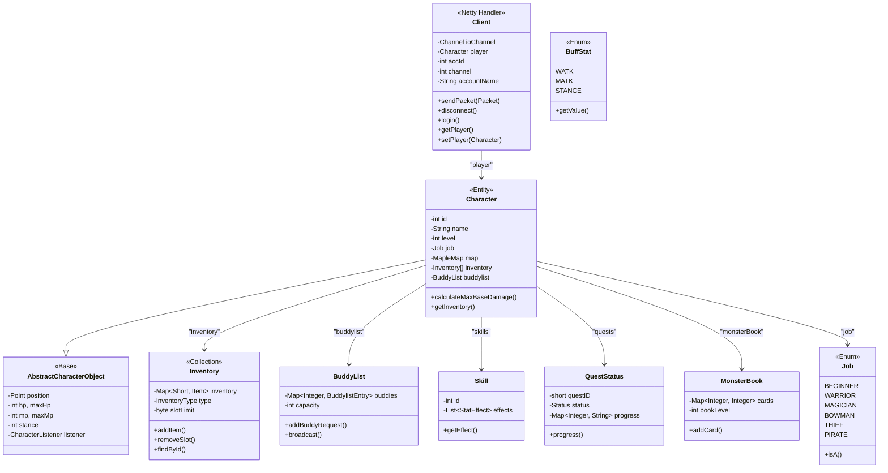
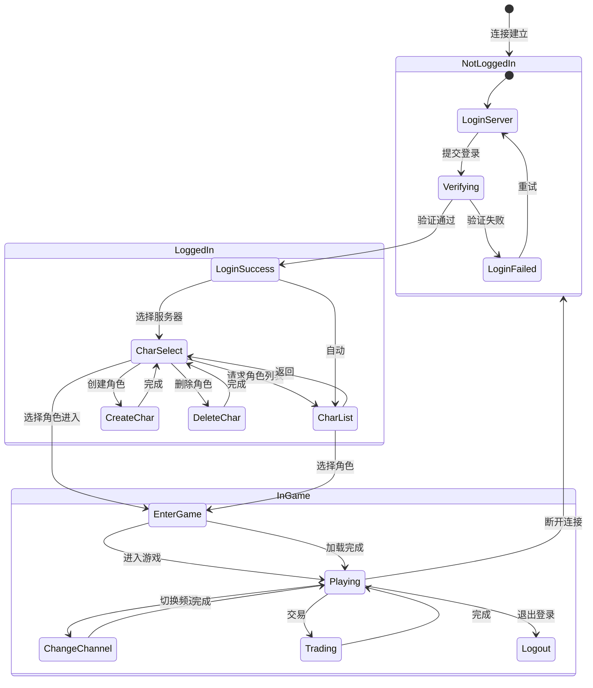

# 客户端管理模块

## 1. 概述

BeiDou-Server 的客户端管理模块 (`org.gms.client`) 是游戏服务器的核心模块之一，负责管理所有客户端连接、角色数据、会话状态以及玩家在游戏中的各种交互。本模块与网络通信模块（Netty）紧密配合，共同实现完整的游戏服务端功能。

### 1.1 模块架构

```
┌─────────────────────────────────────────────────────────────┐
│                      客户端模块 (org.gms.client)                │
├─────────────────────────────────────────────────────────────┤
│  ┌──────────────────┐  ┌──────────────────┐              │
│  │   Client.java     │  │  Character.java   │              │
│  │   (会话管理)       │  │   (角色实体)       │              │
│  └────────┬─────────┘  └────────┬─────────┘              │
│           │                    │                         │
│  ┌────────▼────────────────────▼─────────┐               │
│  │           核心组件层                      │               │
│  │  Inventory  |  BuddyList  |  Skill     │               │
│  │  QuestStatus  |  MonsterBook  |  Job    │               │
│  └────────┬────────────────────┬─────────┘               │
│           │                    │                         │
│  ┌────────▼────────────────────▼─────────┐               │
│  │           功能模块层                      │               │
│  │  command  |  creator  |  processor     │               │
│  │  inventory  |  autoban  |  keybind     │               │
│  └───────────────────────────────────────┘               │
└─────────────────────────────────────────────────────────────┘
```

### 1.2 包结构

| 包名 | 功能描述 | 核心类 |
|------|---------|--------|
| `org.gms.client` | 核心客户端和角色类 | `Client`, `Character` |
| `org.gms.client.inventory` | 背包物品系统 | `Inventory`, `Item`, `Equip` |
| `org.gms.client.command` | 命令系统 | `CommandsExecutor`, `Command` |
| `org.gms.client.creator` | 角色创建 | `CharacterFactory` |
| `org.gms.client.processor` | 状态处理器 | `AssignAPProcessor` |
| `org.gms.client.autoban` | 反作弊 | `AutobanManager` |
| `org.gms.client.keybind` | 快捷键绑定 | `KeyBinding` |

---

## 2. Client 会话管理

### 2.1 Client 类概述

`Client` 是客户端会话的核心管理类，继承自 Netty 的 `ChannelInboundHandlerAdapter`，负责处理客户端与服务器之间的所有交互。

```java
// 位置: org.gms.client.Client
public class Client extends ChannelInboundHandlerAdapter {
    public enum Type {
        LOGIN,    // 登录服务器客户端
        CHANNEL   // 频道服务器客户端
    }
}
```

### 2.2 核心状态与属性

```java
// 登录状态常量
public static final int LOGIN_NOTLOGGEDIN = 0;
public static final int LOGIN_SERVER_TRANSITION = 1;
public static final int LOGIN_LOGGEDIN = 2;

// 核心属性
private io.netty.channel.Channel ioChannel;  // Netty Channel
private Character player;                     // 当前角色
private int channel = 1;                      // 所在频道
private int accId = -4;                       // 账号ID
private boolean loggedIn = false;             // 是否登录
private int world;                            // 所在世界
private String accountName;                   // 账号名
private int gmlevel;                          // GM等级
private Hwid hwid;                           // 硬件ID
private Set<String> macs;                    // MAC地址集合
private String pin, pic;                      // PIN/PIC码
```

### 2.3 Client 创建方法

```java
// 创建登录服务器客户端
public static Client createLoginClient(long sessionId, String remoteAddress, 
                                       PacketProcessor packetProcessor, int world, int channel) {
    return new Client(Type.LOGIN, sessionId, remoteAddress, packetProcessor, world, channel);
}

// 创建频道服务器客户端
public static Client createChannelClient(long sessionId, String remoteAddress, 
                                         PacketProcessor packetProcessor, int world, int channel) {
    return new Client(Type.CHANNEL, sessionId, remoteAddress, packetProcessor, world, channel);
}

// 创建模拟客户端（用于测试）
public static Client createMock() {
    return new Client(null, -1, null, null, -123, -123);
}
```

### 2.4 关键方法

#### 封包发送

```java
public void sendPacket(Packet packet) {
    announcerLock.lock();
    try {
        ioChannel.writeAndFlush(packet);
    } finally {
        announcerLock.unlock();
    }
}
```

#### 角色管理

```java
public Character getPlayer() {
    return player;
}

public void setPlayer(Character player) {
    this.player = player;
    this.sysRescue = new SystemRescue();
}
```

#### 连接断开

```java
public final void disconnect(final boolean shutdown, final boolean cashshop) {
    if (canDisconnect()) {
        ThreadManager.getInstance().newTask(() -> disconnectInternal(shutdown, cashshop));
    }
}

public final void forceDisconnect() {
    if (canDisconnect()) {
        disconnectInternal(true, false);
    }
}
```

### 2.5 通道事件处理

```java
@Override
public void channelRead(ChannelHandlerContext ctx, Object msg) throws Exception {
    if (!(msg instanceof InPacket packet)) {
        log.warn("收到无效封包: {}", msg);
        return;
    }

    short opcode = packet.readShort();
    final PacketHandler handler = packetProcessor.getHandler(opcode);

    if (handler != null && handler.validateState(this)) {
        try {
            ThreadLocalUtil.setCurrentClient(this);
            MonitoredChrLogger.logPacketIfMonitored(this, opcode, packet.getBytes());
            handler.handlePacket(packet, this);
        } catch (final Throwable t) {
            enableActions();  // 解除客户端假死
        } finally {
            ThreadLocalUtil.removeCurrentClient();
        }
    }

    updateLastPacket();
}

@Override
public void channelInactive(ChannelHandlerContext ctx) {
    closeMapleSession();
}

@Override
public void exceptionCaught(ChannelHandlerContext ctx, Throwable cause) throws Exception {
    if (player != null && !player.isLoggedInWorld()) {
        sysRescue.setMapChange(player);  // 尝试解救卡地图的玩家
    }
    // ... 错误处理
}
```

### 2.6 登录安全

#### 登录流程

```java
public int login(String login, String pwd, Hwid hwid) {
    int loginok = 5;
    loginattempt++;

    if (loginattempt > 4) {
        loggedIn = false;
        SessionCoordinator.getInstance().closeSession(this, false);
        return 6;
    }

    // 查询账号信息
    try (Connection con = DatabaseConnection.getConnection();
         PreparedStatement ps = con.prepareStatement(
             "SELECT id, password, gender, banned, pin, pic, characterslots, tos, language FROM accounts WHERE name = ?")) {
        // ... 验证密码（支持BCrypt、SHA-1、SHA-512）
    }

    if (loginok == 0 || loginok == 4) {
        AntiMulticlientResult res = SessionCoordinator.getInstance()
            .attemptLoginSession(this, hwid, accId, loginok == 4);
        // ... 处理多开限制
    }

    return loginok;
}
```

#### PIN/PIC 验证

```java
public boolean checkPin(String other) {
    if (!(GameConfig.getServerBoolean("enable_pin") && !canBypassPin())) {
        return true;
    }

    pinattempt++;
    if (pinattempt > 5) {
        SessionCoordinator.getInstance().closeSession(this, false);
    }
    if (pin.equals(other)) {
        pinattempt = 0;
        LoginBypassCoordinator.getInstance().registerLoginBypassEntry(hwid, accId, false);
        return true;
    }
    return false;
}
```

---

## 3. Character 角色类

### 3.1 Character 类概述

`Character` 是游戏角色的核心实体类，继承自 `AbstractCharacterObject`，包含了角色的所有属性和行为。

```java
// 位置: org.gms.client.Character
public class Character extends AbstractCharacterObject {
    // 角色基础属性
    private int id;           // 角色ID
    private int accountId;    // 账号ID
    private int level;        // 等级
    private int job;          // 职业
    private String name;       // 角色名
    private int gender;       // 性别
    private int hair;          // 发型
    private int face;         // 脸型
    private int fame;         // 名声

    // 位置与地图
    private int mapId;
    private MapleMap map;

    // 背包系统
    private Inventory[] inventory;

    // 社会关系
    private BuddyList buddylist;
    private Party party;
    private GuildCharacter mgc;
    private FamilyEntry familyEntry;

    // 技能与状态
    private Map<Skill, SkillEntry> skills;
    private EnumMap<BuffStat, BuffStatValueHolder> effects;
    private Map<Disease, Pair<DiseaseValueHolder, MobSkill>> diseases;

    // 任务系统
    private Map<Short, QuestStatus> quests;
}
```

### 3.2 角色创建

```java
public static Character getDefault(Client c) {
    Character ret = new Character();
    ret.client = c;
    ret.setGMLevel(0);
    ret.hp = 50;
    ret.setMaxHp(50);
    ret.mp = 5;
    ret.setMaxMp(5);
    ret.attrStr = 12;
    ret.attrDex = 5;
    ret.attrInt = 4;
    ret.attrLuk = 4;
    ret.job = Job.BEGINNER;
    ret.level = 1;
    ret.accountId = c.getAccID();
    ret.buddylist = new BuddyList(20);
    // ... 初始化背包、快捷键等
    return ret;
}
```

### 3.3 角色属性系统

#### 基础属性

| 属性 | 方法 | 说明 |
|------|------|------|
| STR | `getStr()`, `addStr()` | 力量 |
| DEX | `getDex()`, `addDex()` | 敏捷 |
| INT | `getInt()`, `addInt()` | 智力 |
| LUK | `getLuk()`, `addLuk()` | 运气 |
| HP/MP | `getHp()`, `getMp()` | 生命/魔力 |

#### 本地属性计算

```java
// 本地属性（装备加成后的实际属性）
private transient int localstr, localdex, localluk, localint_, localmagic, localwatk;

// 计算最大物理伤害
public int calculateMaxBaseDamage(int watk, WeaponType weapon) {
    int mainstat, secondarystat;
    if (weapon == WeaponType.BOW || weapon == WeaponType.CROSSBOW || weapon == WeaponType.GUN) {
        mainstat = localdex;
        secondarystat = localstr;
    } else if (weapon == WeaponType.CLAW || weapon == WeaponType.DAGGER_THIEVES) {
        mainstat = localluk;
        secondarystat = localdex + localstr;
    } else {
        mainstat = localstr;
        secondarystat = localdex;
    }
    return (int) Math.ceil(((weapon.getMaxDamageMultiplier() * mainstat + secondarystat) / 100.0) * watk);
}
```

---

## 4. Inventory 背包系统

### 4.1 Inventory 类

`Inventory` 是背包的核心类，管理角色的物品栏。

```java
// 位置: org.gms.client.inventory.Inventory
public class Inventory implements Iterable<Item> {
    protected final Map<Short, Item> inventory;
    protected final InventoryType type;
    protected final Lock lock = new ReentrantLock(true);
    protected Character owner;
    protected byte slotLimit;
}
```

### 4.2 背包类型

```java
public enum InventoryType {
    EQUIPPED(-1),      // 装备栏
    EQUIP(-1),         // 装备背包
    USE(2),            // 消耗品
    SETUP(3),          // 设置栏
    ETC(4),            // 其他
    CASH(5),           // 现金栏
    CANHOLD(6);        // 可存放证明
}
```

### 4.3 背包操作

```java
// 添加物品
public void addItem(Item item) {
    lock.lock();
    try {
        inventory.put(item.getPosition(), item);
    } finally {
        lock.unlock();
    }
}

// 移除物品
public Item removeSlot(short slot) {
    lock.lock();
    try {
        return inventory.remove(slot);
    } finally {
        lock.unlock();
    }
}

// 查找物品
public Item findById(int itemId) {
    for (Item item : list()) {
        if (item.getItemId() == itemId) {
            return item;
        }
    }
    return null;
}

// 计算物品数量
public int countById(int itemId) {
    int qty = 0;
    for (Item item : list()) {
        if (item.getItemId() == itemId) {
            qty += item.getQuantity();
        }
    }
    return qty;
}
```

---

## 5. 社交系统

### 5.1 BuddyList 好友列表

`BuddyList` 管理角色的好友列表。

```java
// 位置: org.gms.client.BuddyList
public class BuddyList {
    public enum BuddyOperation {
        ADDED, DELETED
    }

    public enum BuddyAddResult {
        BUDDYLIST_FULL, ALREADY_ON_LIST, OK
    }

    private final Map<Integer, BuddylistEntry> buddies = new LinkedHashMap<>();
    private int capacity;
    private final Deque<CharacterNameAndId> pendingRequests = new LinkedList<>();

    // 添加好友请求
    public void addBuddyRequest(Client c, int cidFrom, String nameFrom, int channelFrom) {
        put(new BuddylistEntry(nameFrom, "Default Group", cidFrom, channelFrom, false));
        if (pendingRequests.isEmpty()) {
            c.sendPacket(PacketCreator.requestBuddylistAdd(cidFrom, c.getPlayer().getId(), nameFrom));
        } else {
            pendingRequests.push(new CharacterNameAndId(cidFrom, nameFrom));
        }
    }

    // 广播消息给所有在线好友
    public void broadcast(Packet packet, PlayerStorage pstorage) {
        for (int bid : getBuddyIds()) {
            Character chr = pstorage.getCharacterById(bid);
            if (chr != null && chr.isLoggedInWorld()) {
                chr.sendPacket(packet);
            }
        }
    }
}
```

### 5.2 好友条目标

```java
// 位置: org.gms.client.BuddylistEntry
public class BuddylistEntry {
    private final String name;
    private final String group;
    private final int characterId;
    private int channel;
    private boolean visible;

    public boolean isVisible() {
        return visible;
    }
}
```

---

## 6. 技能系统

### 6.1 Skill 技能类

```java
// 位置: org.gms.client.Skill
public class Skill {
    private final int id;
    private final List<StatEffect> effects = new ArrayList<>();
    private Element element;
    private int animationTime;
    private final int job;
    private boolean action;

    public StatEffect getEffect(int level) {
        return effects.get(level - 1);
    }

    public int getMaxLevel() {
        return effects.size();
    }

    public boolean isFourthJob() {
        if (job == 2212) return false;
        if (id == 22170001 || id == 22171003 || id == 22171004 || 
            id == 22181002 || id == 22181003) return true;
        return job % 10 == 2;
    }
}
```

### 6.2 BuffStat 增益状态

```java
// 位置: org.gms.client.BuffStat
public enum BuffStat {
    // 战斗属性
    WATK(0x100000000L),
    WDEF(0x200000000L),
    MATK(0x400000000L),
    MDEF(0x800000000L),
    ACC(0x1000000000L),
    AVOID(0x2000000000L),
    SPEED(0x8000000000L),
    JUMP(0x10000000000L),

    // 特殊状态
    STANCE(0x10L),
    SHARP_EYES(0x20L),
    MAGIC_GUARD(0x20000000000L),
    DARKSIGHT(0x40000000000L),
    BOOSTER(0x80000000000L),
    INVINCIBLE(0x800000000000L),

    // 异常状态
    STUN(0x2000000000000L),
    POISON(0x4000000000000L),
    SEAL(0x8000000000000L),
    DARKNESS(0x10000000000000L),

    // 经验/掉落加成
    EXP_BUFF(0x40000000L),
    MESO_UP_BY_ITEM(0x10000L),
    ITEM_UP_BY_ITEM(0x100000L);

    private final long i;
    private final boolean isFirst;

    BuffStat(long i, boolean isFirst) {
        this.i = i;
        this.isFirst = isFirst;
    }

    public long getValue() {
        return i;
    }
}
```

---

## 7. Job 职业系统

### 7.1 职业枚举

```java
// 位置: org.gms.client.Job
public enum Job {
    BEGINNER(0, "初心者"),
    WARRIOR(100, "战士"),
    FIGHTER(110, "剑客"),
    CRUSADER(111, "勇士"),
    HERO(112, "英雄"),
    MAGICIAN(200, "魔法师"),
    FP_WIZARD(210, "火毒法师"),
    BOWMAN(300, "弓箭手"),
    THIEF(400, "飞贼"),
    PIRATE(500, "海盗"),
    GM(900, "管理员"),
    SUPERGM(910, "超级管理员"),
    NOBLESSE(1000, "贵族"),
    LEGEND(2000, "冒险家"),
    ARAN1(2100, "战神");

    private final int id;
    private final String name;

    public boolean isA(Job basejob) {
        int basebranch = basejob.getId() / 10;
        return (getId() / 10 == basebranch && getId() >= basejob.getId()) || 
               (basebranch % 10 == 0 && getId() / 100 == basejob.getId() / 100);
    }

    public int getJobNiche() {
        return (id / 100) % 10;
    }
}
```

---

## 8. 任务系统

### 8.1 QuestStatus 任务状态

```java
// 位置: org.gms.client.QuestStatus
public class QuestStatus {
    public enum Status {
        UNDEFINED(-1),
        NOT_STARTED(0),
        STARTED(1),
        COMPLETED(2);
    }

    private final short questID;
    private Status status;
    private final Map<Integer, String> progress = new LinkedHashMap<>();
    private final List<Integer> medalProgress = new LinkedList<>();
    private int npc;
    private long completionTime, expirationTime;
    private int forfeited = 0, completed = 0;
    private String customData;

    // 更新任务进度
    public boolean progress(int id) {
        String currentStr = progress.get(id);
        if (currentStr == null) return false;

        int current = Integer.parseInt(currentStr);
        if (current >= this.getQuest().getMobAmountNeeded(id)) return false;

        String str = StringUtil.getLeftPaddedStr(Integer.toString(++current), '0', 3);
        progress.put(id, str);
        return true;
    }
}
```

---

## 9. 怪物手册

### 9.1 MonsterBook 怪物卡册

```java
// 位置: org.gms.client.MonsterBook
public final class MonsterBook {
    private int specialCard = 0;
    private int normalCard = 0;
    private int bookLevel = 1;
    private final Map<Integer, Integer> cards = new LinkedHashMap<>();
    private final Lock lock = new ReentrantLock();

    // 添加卡片
    public void addCard(final Client c, final int cardid) {
        c.getPlayer().getMap().broadcastMessage(
            c.getPlayer(), PacketCreator.showForeignCardEffect(c.getPlayer().getId()), false);

        lock.lock();
        try {
            Integer qty = cards.get(cardid);
            if (qty != null) {
                if (qty < 5) {
                    cards.put(cardid, qty + 1);
                }
            } else {
                cards.put(cardid, 1);
                if (cardid / 1000 >= 2388) {
                    specialCard++;
                } else {
                    normalCard++;
                }
            }
        } finally {
            lock.unlock();
        }

        calculateLevel();
        c.sendPacket(PacketCreator.addCard(false, cardid, qty + 1));
    }

    // 计算卡册等级
    private void calculateLevel() {
        int collectionExp = (normalCard + specialCard);
        int level = 0, expToNextlevel = 1;
        do {
            level++;
            expToNextlevel += level * 10;
        } while (collectionExp >= expToNextlevel);
        bookLevel = level;
    }
}
```

---

## 10. 命令系统

### 10.1 CommandsExecutor 命令执行器

`CommandsExecutor` 负责处理玩家输入的命令。

```java
// 位置: org.gms.client.command.CommandsExecutor
public class CommandsExecutor {
    private static final char USER_HEADING = '@';    // 普通用户命令前缀
    private static final char GM_HEADING = '!';       // GM命令前缀

    public void handle(Client client, String message) {
        if (client.tryacquireClient()) {
            try {
                handleInternal(client, message);
            } finally {
                client.releaseClient();
            }
        } else {
            client.getPlayer().dropMessage(5, "服务器繁忙，请稍后再试。");
        }
    }

    private void handleInternal(Client client, String message) {
        // 命令解析和执行
    }
}
```

### 10.2 命令等级

| 等级 | 前缀 | 说明 |
|------|------|------|
| 0 | `@` | 普通玩家命令 |
| 1-3 | `!` | GM命令 |
| 4-6 | `!` | 高级GM命令 |

---

## 11. 角色创建系统

### 11.1 CharacterFactory 角色工厂

```java
// 位置: org.gms.client.creator.CharacterFactory
public abstract class CharacterFactory {
    protected synchronized static int createNewCharacter(Client c, String name, int face, 
                                                         int hair, int skin, int gender, 
                                                         CharacterFactoryRecipe recipe) {
        // 检查角色槽位
        if (GameConfig.getServerBoolean("collective_chr_slot") ? 
            c.getAvailableCharacterSlots() <= 0 : c.getAvailableCharacterWorldSlots() <= 0) {
            return -3;
        }

        // 检查角色名
        if (!Character.canCreateChar(name)) {
            return -1;
        }

        Character newCharacter = Character.getDefault(c);
        newCharacter.setWorld(c.getWorld());
        newCharacter.setSkinColor(SkinColor.getById(skin));
        newCharacter.setGender(gender);
        newCharacter.setName(name);
        // ... 设置初始装备

        if (!newCharacter.insertNewChar(recipe)) {
            return -2;
        }

        c.sendPacket(PacketCreator.addNewCharEntry(newCharacter));
        return 0;
    }
}
```

### 11.2 职业创建器

| 创建器 | 职业 | 初始属性 |
|--------|------|---------|
| `BeginnerCreator` | 初心者 | STR:12 DEX:5 INT:4 LUK:4 |
| `WarriorCreator` | 战士 | STR:25 DEX:10 INT:4 LUK:5 |
| `MagicianCreator` | 魔法师 | STR:10 DEX:5 INT:20 LUK:5 |
| `BowmanCreator` | 弓箭手 | STR:12 DEX:25 INT:4 LUK:5 |
| `ThiefCreator` | 飞贼 | STR:12 DEX:25 INT:4 LUK:20 |
| `PirateCreator` | 海盗 | STR:15 DEX:20 INT:4 LUK:7 |

---

## 12. 类图

### 12.1 核心类关系图



### 12.2 客户端状态流转图



---

## 13. 相关文件路径

| 组件 | 文件路径 | 说明 |
|------|----------|------|
| 客户端会话 | `org.gms.client.Client` | Netty Handler，会话管理 |
| 角色实体 | `org.gms.client.Character` | 角色数据模型 |
| 背包系统 | `org.gms.client.inventory.Inventory` | 物品栏管理 |
| 物品类 | `org.gms.client.inventory.Item` | 物品数据 |
| 装备类 | `org.gms.client.inventory.Equip` | 装备属性 |
| 好友列表 | `org.gms.client.BuddyList` | 好友系统 |
| 技能类 | `org.gms.client.Skill` | 技能定义 |
| 增益状态 | `org.gms.client.BuffStat` | BUFF枚举 |
| 职业系统 | `org.gms.client.Job` | 职业枚举 |
| 任务状态 | `org.gms.client.QuestStatus` | 任务进度 |
| 怪物卡册 | `org.gms.client.MonsterBook` | 怪物收集 |
| 命令执行 | `org.gms.client.command.CommandsExecutor` | 命令处理 |
| 角色工厂 | `org.gms.client.creator.CharacterFactory` | 角色创建 |
| 反作弊 | `org.gms.client.autoban.AutobanManager` | 异常检测 |
| 快捷键 | `org.gms.client.keybind.KeyBinding` | 按键绑定 |

---

*文档版本: 1.0*
*最后更新: 2026-03-26*