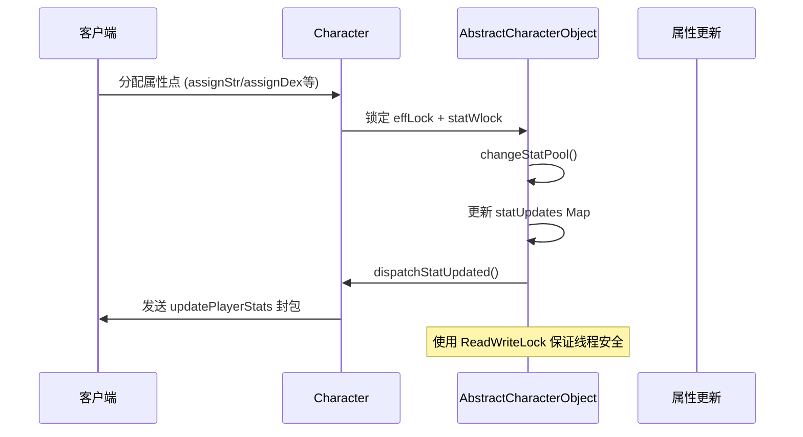
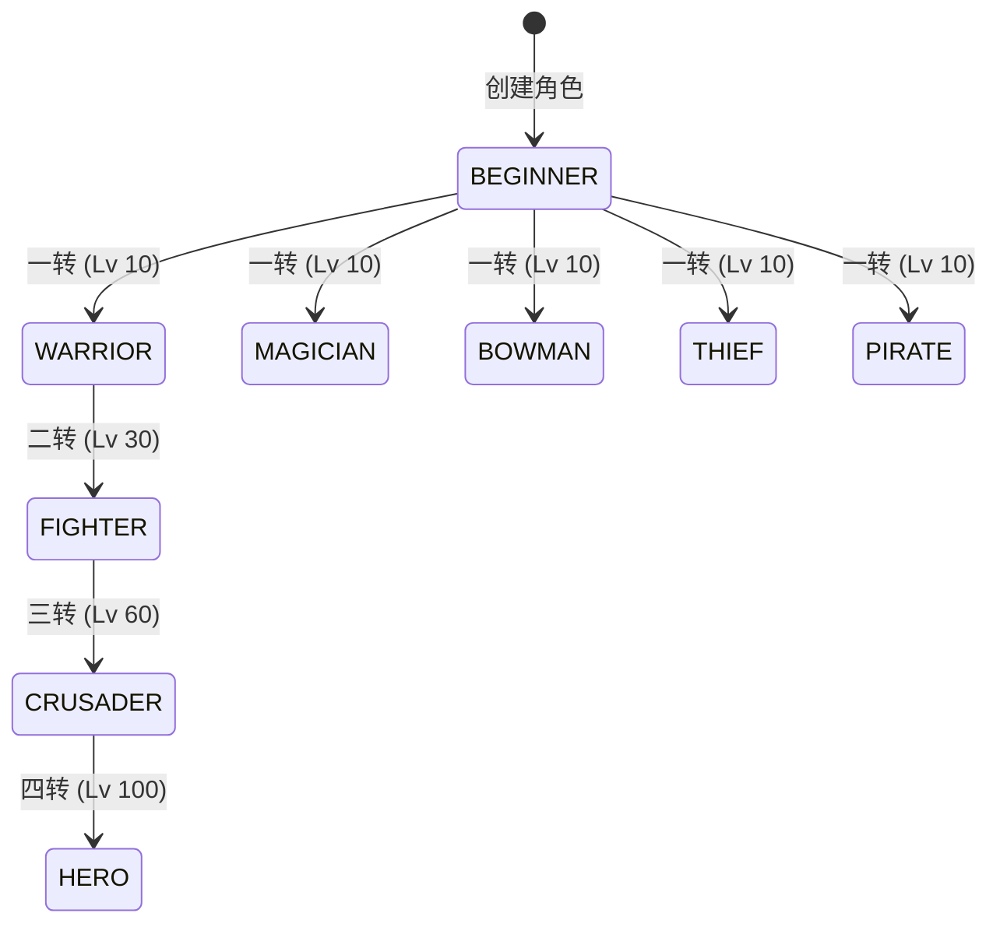
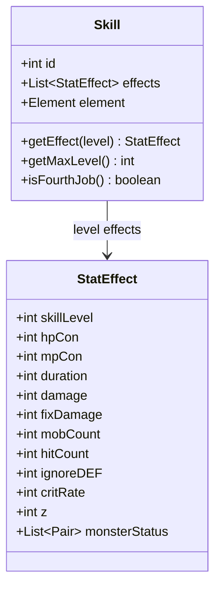
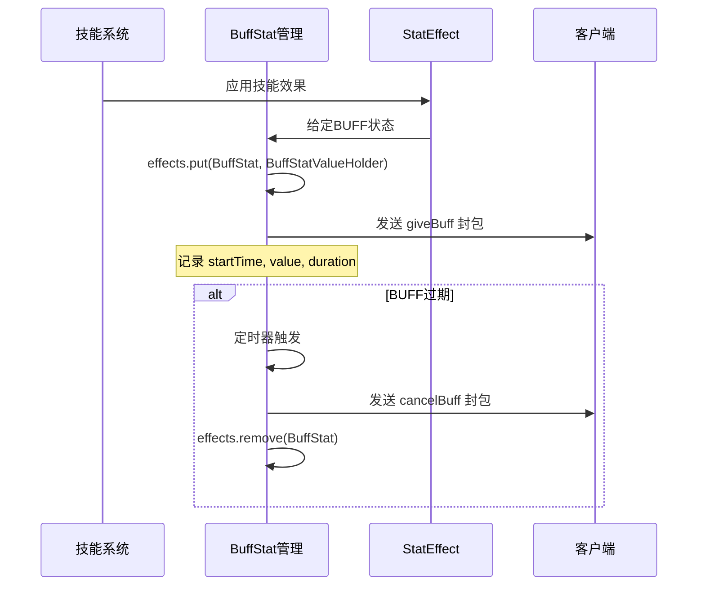
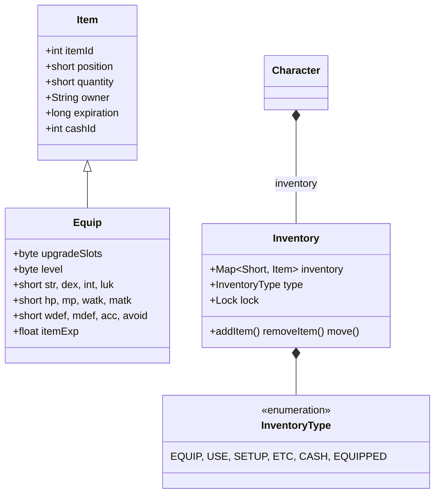
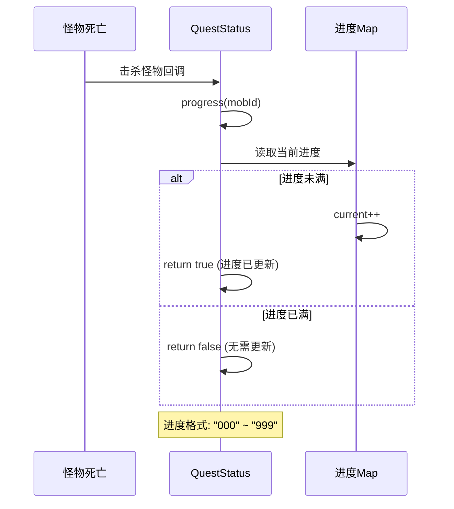
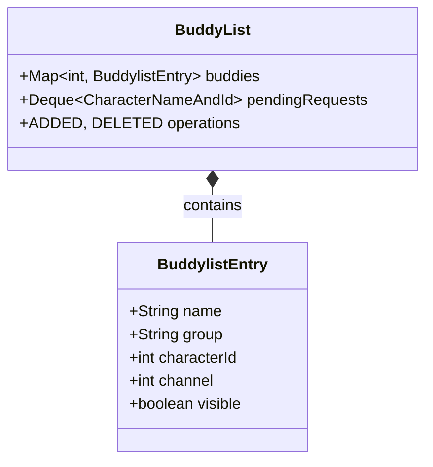

# 角色系统模块

## 1. 概述

BeiDou-Server 角色系统是游戏核心模块，负责管理玩家的角色数据、属性、技能、物品、任务等。本模块基于 `org.gms.client` 包实现，采用面向对象的设计，支持完整的角色生命周期管理。

### 1.1 角色系统架构

```mermaid
classDiagram
class Character "--1" extends AbstractCharacterObject
class AbstractCharacterObject
class Job
class Skill
class QuestStatus
class Inventory
class BuddyList
class BuffStat
class Stat
class Disease

Character *-- Job : job
Character *-- Inventory : inventory
Character *-- Skill : skills
Character *-- QuestStatus : quests
Character *-- BuddyList : buddylist
Character *-- "~Map" buffs : effects
Character *-- "~Map" summons : summons
Character *-- Pet : pets
Character *-- Mount : mapleMount
Character *-- MonsterBook : monsterBook
Character *-- FamilyEntry : familyEntry

AbstractCharacterObject *-- AbstractCharacterListener : listener
AbstractCharacterObject *-- Stat : statUpdates
```

---

## 2. 核心类结构

### 2.1 Character 角色主类

`Character` 是角色系统的核心类，继承自 `AbstractCharacterObject`，负责管理角色的所有数据。

```java
// 位置: org.gms.client.Character
public class Character extends AbstractCharacterObject {
    // 基础属性
    private int world;
    private int id;
    private int accountId;
    private int level;
    private int rank;
    private int jobRank;
    private int gender;
    private int hair;
    private int face;
    private int fame;
    private int questFame;

    // 职业与属性
    private Job job = Job.BEGINNER;
    private int attrStr, attrDex, attrInt, attrLuk;
    private int hp, maxHp, mp, maxMp;

    // 背包系统
    private Inventory[] inventory;

    // 技能系统
    private final Map<Skill, SkillEntry> skills;
    private final SkillMacro[] skillMacros = new SkillMacro[5];

    // 任务系统
    private final Map<Short, QuestStatus> quests;

    // BUFF系统
    private final EnumMap<BuffStat, BuffStatValueHolder> effects;
    private final Map<BuffStat, Byte> buffEffectsCount;

    // 社交系统
    private BuddyList buddylist;
    private Party party;
    private GuildCharacter mgc;

    // 召唤物与宠物
    private final Map<Integer, Summon> summons;
    private final Pet[] pets = new Pet[3];
    private Mount mapleMount;

    // 冷却系统
    private final Map<Integer, CooldownValueHolder> coolDowns;

    // 状态效果
    private final EnumMap<Disease, Pair<DiseaseValueHolder, MobSkill>> diseases;

    // 线程锁
    private final Lock chrLock = new ReentrantLock(true);
    private final Lock evtLock = new ReentrantLock(true);
    private final Lock petLock = new ReentrantLock(true);
}
```

### 2.2 AbstractCharacterObject 抽象基类

`AbstractCharacterObject` 提供角色属性的基础实现，包含 HP/MP 管理、属性点分配等核心功能。

```java
// 位置: org.gms.client.AbstractCharacterObject
public abstract class AbstractCharacterObject extends AbstractAnimatedMapObject {
    // 基础属性
    protected int attrStr, attrDex, attrLuk, attrInt;
    protected int hp, maxHp, mp, maxMp;
    protected int hpMpApUsed;
    protected int remainingAp;
    protected int[] remainingSp = new int[10];

    // 临时计算属性（装备加成后）
    protected transient int clientMaxHp, clientMaxMp;
    protected transient int localMaxHp = 50, localMaxMp = 5;

    // 线程安全
    protected final Lock effLock = new ReentrantLock(true);
    protected final Lock statRlock, statWlock;

    // 属性获取
    public int getStr(), getDex(), getInt(), getLuk()
    public int getHp(), getMp(), getMaxHp(), getMaxMp()
    public int getRemainingAp(), getRemainingSp(int jobid)

    // 属性分配
    public boolean assignStr(int x), assignDex(int x), assignInt(int x), assignLuk(int x)
    public boolean assignHP(int deltaHP, int deltaAp), assignMP(int deltaMP, int deltaAp)

    // HP/MP管理
    public void addHP(int delta), addMP(int delta), addMPHP(int hpDelta, int mpDelta)
    public void addMaxHP(int delta), addMaxMP(int delta)
    public void healHpMp()
}
```

---

## 3. 属性系统

### 3.1 Stat 统计枚举

`Stat` 枚举定义角色可更新的统计类型，用于客户端同步和属性变更通知。

```java
// 位置: org.gms.client.Stat
public enum Stat {
    SKIN(0x1),
    FACE(0x2),
    HAIR(0x4),
    LEVEL(0x10),
    JOB(0x20),
    STR(0x40),
    DEX(0x80),
    INT(0x100),
    LUK(0x200),
    HP(0x400),
    MAXHP(0x800),
    MP(0x1000),
    MAXMP(0x2000),
    AVAILABLEAP(0x4000),
    AVAILABLESP(0x8000),
    EXP(0x10000),
    FAME(0x20000),
    MESO(0x40000),
    PET(0x180008),
    GACHAEXP(0x200000);
}
```

### 3.2 属性更新流程



---

## 4. 职业系统

### 4.1 Job 职业枚举

`Job` 枚举定义所有游戏职业，支持冒险家、骑士团、英雄、反抗者等多个职业分支。

```java
// 位置: org.gms.client.Job
public enum Job {
    // 冒险家
    BEGINNER(0),
    WARRIOR(100), FIGHTER(110), CRUSADER(111), HERO(112),
    PAGE(120), WHITEKNIGHT(121), PALADIN(122),
    SPEARMAN(130), DRAGONKNIGHT(131), DARKKNIGHT(132),
    MAGICIAN(200), FP_WIZARD(210), FP_MAGE(211), FP_ARCHMAGE(212),
    IL_WIZARD(220), IL_MAGE(221), IL_ARCHMAGE(222),
    CLERIC(230), PRIEST(231), BISHOP(232),
    BOWMAN(300), HUNTER(310), RANGER(311), BOWMASTER(312),
    CROSSBOWMAN(320), SNIPER(321), MARKSMAN(322),
    THIEF(400), ASSASSIN(410), HERMIT(411), NIGHTLORD(412),
    BANDIT(420), CHIEFBANDIT(421), SHADOWER(422),
    PIRATE(500), BRAWLER(510), MARAUDER(511), BUCCANEER(512),
    GUNSLINGER(520), OUTLAW(521), CORSAIR(522),

    // 骑士团
    NOBLESSE(1000),
    DAWNWARRIOR1(1100), DAWNWARRIOR2(1110), DAWNWARRIOR3(1111), DAWNWARRIOR4(1112),
    BLAZEWIZARD1(1200), BLAZEWIZARD2(1210), BLAZEWIZARD3(1211), BLAZEWIZARD4(1212),
    WINDARCHER1(1300), WINDARCHER2(1310), WINDARCHER3(1311), WINDARCHER4(1312),
    NIGHTWALKER1(1400), NIGHTWALKER2(1410), NIGHTWALKER3(1411), NIGHTWALKER4(1412),
    THUNDERBREAKER1(1500), THUNDERBREAKER2(1510), THUNDERBREAKER3(1511), THUNDERBREAKER4(1512),

    // 英雄/传说
    LEGEND(2000), EVAN(2001),
    ARAN1(2100), ARAN2(2110), ARAN3(2111), ARAN4(2112),

    // GM
    GM(900), SUPERGM(910);
}
```

### 4.2 职业判断方法

```java
// 判断职业是否属于某基础职业
public boolean isA(Job basejob) {
    int basebranch = basejob.getId() / 10;
    return (getId() / 10 == basebranch && getId() >= basejob.getId())
        || (basebranch % 10 == 0 && getId() / 100 == basejob.getId() / 100);
}

// 获取职业风格
public Job getJobStyle(byte opt) {
    return Job.getJobStyleInternal(this.getJob().getId(), opt);
}
```

### 4.3 转职系统



**转职实现：**

```java
public synchronized void changeJob(Job newJob) {
    // 1. 更新职业
    this.job = newJob;

    // 2. 分配技能点
    int spGain = 1;
    if (GameConstants.hasSPTable(newJob)) {
        spGain += 2;
    }
    gainSp(spGain, GameConstants.getSkillBook(newJob.getId()), true);

    // 3. 分配属性点
    if (newJob.getId() % 100 >= 1) {
        gainAp(5, true);
    }

    // 4. 增加HP/MP
    int addhp = 0, addmp = 0;
    int job_ = job.getId() % 1000;
    if (job_ == 100) {  // 战士
        addhp += Randomizer.rand(200, 250);
    } else if (job_ == 200) {  // 法师
        addmp += Randomizer.rand(100, 150);
    }
    addMaxMPMaxHP(addhp, addmp, true);

    // 5. 广播职业变更
    broadcastChangeJob();
}
```

---

## 5. 技能系统

### 5.1 Skill 技能类

`Skill` 类定义单个技能的元数据，包含技能等级效果、元素属性、动画时间等。

```java
// 位置: org.gms.client.Skill
public class Skill {
    private final int id;
    private final List<StatEffect> effects;
    private Element element;
    private int animationTime;
    private final int job;
    private boolean action;

    public int getMaxLevel()
    public boolean isFourthJob()
    public boolean isBeginnerSkill()
    public StatEffect getEffect(int level)
    public void setElement(Element elem)
}
```

### 5.2 SkillFactory 技能工厂

`SkillFactory` 负责从 WZ 文件加载所有技能数据。

```java
// 位置: org.gms.client.SkillFactory
public class SkillFactory {
    private static volatile Map<Integer, Skill> skills = new HashMap<>();
    private static final DataProvider datasource = DataProviderFactory.getDataProvider(WZFiles.SKILL);

    public static Skill getSkill(int id) {
        return skills.get(id);
    }

    public static void loadAllSkills() {
        // 从 WZ/Skill.wz 遍历所有职业目录加载技能
    }
}
```

### 5.3 技能等级效果

技能的效果通过 `StatEffect` 实现，每个技能可拥有多个等级的效果数据。



### 5.4 技能管理方法

```java
// 获取技能等级
public byte getSkillLevel(Skill skill) {
    SkillEntry ret = skills.get(skill);
    return ret != null ? ret.skillLevel : 0;
}

// 改变技能等级
public void changeSkillLevel(Skill skill, byte newLevel, int masterLevel, long expiration) {
    skills.put(skill, new SkillEntry(newLevel, masterLevel, expiration));
}

// 施放技能
public void changeSkillLevel(Skill skill, (byte) 0, 10, -1);
```

---

## 6. BUFF与状态系统

### 6.1 BuffStat BUFF状态枚举

`BuffStat` 枚举定义所有BUFF状态类型，包括增益效果和状态效果。

```java
// 位置: org.gms.client.BuffStat
public enum BuffStat {
    // 攻击增益
    WATK(0x100000000L),
    MATK(0x400000000L),
    ACC(0x1000000000L),
    AVOID(0x2000000000L),
    SPEED(0x8000000000L),
    JUMP(0x10000000000L),

    // 防御增益
    WDEF(0x200000000L),
    MDEF(0x800000000L),

    // 特殊状态
    MORPH(0x2L),
    STANCE(0x10L),
    SHARP_EYES(0x20L),
    MANA_REFLECTION(0x40L),
    INFINITY(0x200L),

    // 职业增益
    MAPLE_WARRIOR(0x8L),
    COMBO(0x20000000000000L),
    ENERGY_CHARGE(0x4000000000000L),
    ARAN_COMBO(0x1000000000L),

    // 状态效果
    DARKSIGHT(0x40000000000L),
    BOOSTER(0x8000000000000L),
    POWERGUARD(0x100000000000L),

    // HP/MP回复
    HPREC(0x2000000L),
    MPREC(0x4000000L),

    // 经验/掉落增益
    EXP_BUFF(0x40000000L),
    MESO_UP(0x200000000000000L),
    ITEM_UP_BY_ITEM(0x100000L),

    // 异常状态
    STUN(0x2000000000000L),
    POISON(0x4000000000000L),
    SEAL(0x8000000000000L),
    DARKNESS(0x10000000000000L),
    WEAKEN(0x4000000000000000L);
}
```

### 6.2 Disease 异常状态枚举

`Disease` 定义角色受到的各种异常状态。

```java
// 位置: org.gms.client.Disease
public enum Disease {
    SLOW(0x1),
    SEDUCE(0x80),
    ZOMBIFY(0x4000),
    CONFUSE(0x80000),
    STUN(0x2000000000000L),
    POISON(0x4000000000000L),
    SEAL(0x8000000000000L),
    DARKNESS(0x10000000000000L),
    WEAKEN(0x4000000000000000L),
    CURSE(0x8000000000000000L);
}
```

### 6.3 BUFF处理流程



---

## 7. 物品与背包系统

### 7.1 Inventory 背包类

`Inventory` 管理角色的各类物品背包，采用线程安全设计。

```java
// 位置: org.gms.client.inventory.Inventory
public class Inventory implements Iterable<Item> {
    protected final Map<Short, Item> inventory;
    protected final InventoryType type;
    protected final Lock lock = new ReentrantLock(true);
    protected Character owner;
    protected byte slotLimit;

    // 背包操作
    public short addItem(Item item)
    public Item getItem(short slot)
    public void removeItem(short slot, short quantity, boolean allowZero)
    public void move(short sSlot, short dSlot, short slotMax)
    public short getNextFreeSlot()
    public short getNumFreeSlot()
    public boolean isFull()

    // 查询方法
    public Item findById(int itemId)
    public List<Item> listById(int itemId)
    public int countById(int itemId)
}
```

### 7.2 InventoryType 背包类型枚举

```java
// 位置: org.gms.client.inventory.InventoryType
public enum InventoryType {
    UNDEFINED(0),
    EQUIP(1),        // 装备
    USE(2),          // 消耗品
    SETUP(3),        // 装饰品
    ETC(4),          // 其他
    CASH(5),         // 现金物品
    CANHOLD(6),      // 扩展栏(验证用)
    EQUIPPED(-1);    // 已装备
}
```

### 7.3 Equip 装备类

`Equip` 继承自 `Item`，包含装备的强化等级、属性加成、升级槽等信息。

```java
// 位置: org.gms.client.inventory.Equip
public class Equip extends Item {
    private byte upgradeSlots;     // 升级槽
    private byte level;           // 当前等级
    private byte itemLevel;       // 装备等级
    private short str, dex, _int, luk;
    private short hp, mp, watk, matk;
    private short wdef, mdef, acc, avoid;
    private short hands, speed, jump;
    private float itemExp;        // 装备经验
    private boolean isUpgradeable; // 可升级标志

    // 装备升级
    public void gainLevel(Client c)
    public synchronized void gainItemExp(Client c, int gain)

    // 属性获取
    public Map<StatUpgrade, Short> getStats()
}
```

### 7.4 物品系统架构



### 7.5 背包操作示例

```java
// 获取角色背包
Inventory equipInventory = character.getInventory(InventoryType.EQUIP);
Inventory useInventory = character.getInventory(InventoryType.USE);

// 添加物品
Item newItem = new Item(itemId, (short) 0, (short) quantity);
short slot = equipInventory.addItem(newItem);

// 移动物品
equipInventory.move(fromSlot, toSlot, (short) 1);

// 删除物品
equipInventory.removeItem(slot, (short) 1, false);
```

---

## 8. 任务系统

### 8.1 QuestStatus 任务状态类

`QuestStatus` 管理单个任务的执行状态和进度。

```java
// 位置: org.gms.client.QuestStatus
public class QuestStatus {
    public enum Status {
        NOT_STARTED(0),
        STARTED(1),
        COMPLETED(2);
    }

    private final short questID;
    private Status status;
    private final Map<Integer, String> progress;  // 怪物击杀进度
    private final List<Integer> medalProgress;   // 勋章进度
    private int npc;
    private long completionTime, expirationTime;
    private String customData;

    // 任务进度
    public boolean progress(int mobId)
    public String getProgress(int mobId)
    public void setProgress(int mobId, String pr)
    public void resetAllProgress()

    // 任务状态
    public Status getStatus()
    public final void setStatus(Status status)
}
```

### 8.2 任务进度追踪



### 8.3 任务存储结构

```java
// Character中的任务存储
private final Map<Short, QuestStatus> quests;

// 获取任务状态
public QuestStatus getQuestStatus(short questId) {
    return quests.get(questId);
}

// 开始任务
public void startQuest(int questId, int npcId) {
    Quest quest = Quest.getInstance(questId);
    QuestStatus qs = new QuestStatus(quest, QuestStatus.Status.STARTED, npcId);
    quests.put((short) questId, qs);
}

// 完成任务
public void completeQuest(int questId, int npcId) {
    QuestStatus qs = quests.get((short) questId);
    qs.setStatus(QuestStatus.Status.COMPLETED);
}
```

---

## 9. 社交系统

### 9.1 BuddyList 好友列表类

`BuddyList` 管理角色的好友列表，支持在线状态追踪。

```java
// 位置: org.gms.client.BuddyList
public class BuddyList {
    private final Map<Integer, BuddylistEntry> buddies;
    private int capacity;
    private final Deque<CharacterNameAndId> pendingRequests;

    // 好友操作
    public boolean contains(int characterId)
    public boolean containsVisible(int characterId)
    public BuddylistEntry get(int characterId)
    public void put(BuddylistEntry entry)
    public void remove(int characterId)

    // 容量管理
    public boolean isFull()
    public int getCapacity()

    // 广播消息
    public void broadcast(Packet packet, PlayerStorage pstorage)
}
```

### 9.2 社交关系类型



---

## 10. 冷却系统

### 10.1 CooldownValueHolder 冷却持有类

`CooldownValueHolder` 管理技能的冷却时间。

```java
// 位置: org.gms.net.server.PlayerCoolDownValueHolder
public class CooldownValueHolder {
    private final int skillId;
    private final long startTime;
    private final long length;

    public boolean hasExpired() {
        return System.currentTimeMillis() - startTime >= length;
    }

    public long getRemainingTime() {
        return Math.max(0, length - (System.currentTimeMillis() - startTime));
    }
}
```

### 10.2 冷却管理

```java
// 添加冷却
public void addCooldown(int skillId, long startTime, long length) {
    this.coolDowns.put(skillId, new CooldownValueHolder(skillId, startTime, length));
}

// 检查冷却
public boolean onCooldown(int skillId) {
    CooldownValueHolder holder = coolDowns.get(skillId);
    return holder != null && !holder.hasExpired();
}

// 移除冷却
public void removeCooldown(int skillId) {
    coolDowns.remove(skillId);
}
```

---

## 11. 角色创建与数据加载

### 11.1 默认角色创建

```java
// 位置: org.gms.client.Character
public static Character getDefault(Client c) {
    Character ret = new Character();
    ret.client = c;
    ret.setGMLevel(0);
    ret.hp = 50;
    ret.setMaxHp(50);
    ret.mp = 5;
    ret.setMaxMp(5);
    ret.attrStr = 12;
    ret.attrDex = 5;
    ret.attrInt = 4;
    ret.attrLuk = 4;
    ret.job = Job.BEGINNER;
    ret.level = 1;
    ret.accountId = c.getAccID();
    ret.buddylist = new BuddyList(20);

    // 初始化背包
    for (InventoryType type : InventoryType.values()) {
        byte b = type == InventoryType.CASH ? 96 : 24;
        inventory[type.ordinal()] = new Inventory(ret, type, b);
    }

    return ret;
}
```

### 11.2 角色数据保存

角色数据通过 `CharacterService` 进行数据库存取。

```java
// 保存触发时机
- 玩家主动断开连接
- 定时自动保存 (每5分钟)
- 切换频道/地图时
- 服务器关闭时

// 保存内容
- 基础属性 (HP, MP, STR, DEX, INT, LUK)
- 等级、经验值
- 背包物品
- 技能等级
- 任务进度
- 好友列表
```

---

## 12. 相关文件路径

| 组件 | 文件路径 |
|------|----------|
| 角色主类 | `org.gms.client.Character` |
| 角色基类 | `org.gms.client.AbstractCharacterObject` |
| 职业枚举 | `org.gms.client.Job` |
| 技能类 | `org.gms.client.Skill` |
| 技能工厂 | `org.gms.client.SkillFactory` |
| 任务状态 | `org.gms.client.QuestStatus` |
| 背包类 | `org.gms.client.inventory.Inventory` |
| 装备类 | `org.gms.client.inventory.Equip` |
| 背包类型 | `org.gms.client.inventory.InventoryType` |
| BUFF状态 | `org.gms.client.BuffStat` |
| 统计枚举 | `org.gms.client.Stat` |
| 异常状态 | `org.gms.client.Disease` |
| 好友列表 | `org.gms.client.BuddyList` |
| 角色监听器 | `org.gms.client.CharacterListener` |

---

## 13. 线程安全设计

角色系统采用多锁策略保证线程安全：

```java
// 角色锁分层
private final Lock chrLock = new ReentrantLock(true);    // 角色数据锁
private final Lock evtLock = new ReentrantLock(true);    // 事件锁
private final Lock petLock = new ReentrantLock(true);     // 宠物锁
private final Lock prtLock = new ReentrantLock();        // 组队锁
private final Lock cpnLock = new ReentrantLock();        // 冷却锁

// 属性读写锁
protected final Lock statRlock;  // 读锁
protected final Lock statWlock;  // 写锁

// 背包锁 (每个Inventory独立锁)
protected final Lock lock = new ReentrantLock(true);
```

---

## 14. 封包交互

### 14.1 属性更新封包

```java
// 发送属性更新
List<Pair<Stat, Integer>> statup = new ArrayList<>();
statup.add(new Pair<>(Stat.HP, hp));
statup.add(new Pair<>(Stat.MP, mp));
statup.add(new Pair<>(Stat.MAXHP, clientMaxHp));
statup.add(new Pair<>(Stat.MAXMP, clientMaxMp));
sendPacket(PacketCreator.updatePlayerStats(statup, true, this));
```

### 14.2 BUFF封包

```java
// 给定BUFF
sendPacket(PacketCreator.giveBuff(stat, value, duration, effect));

// 取消BUFF
sendPacket(PacketCreator.cancelBuff(buffstats));
```

---

*文档版本: 1.0*
*最后更新: 2026-03-26*