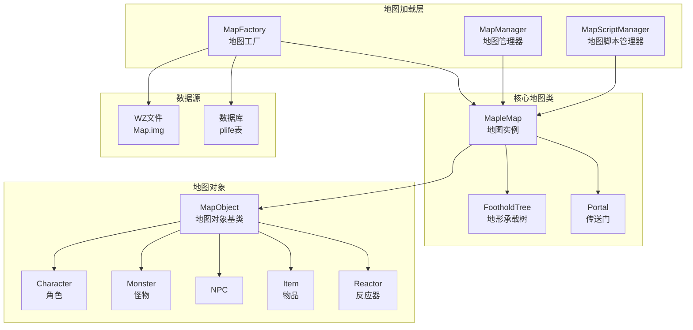
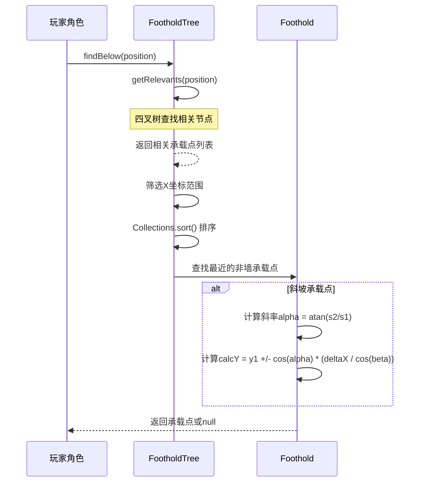
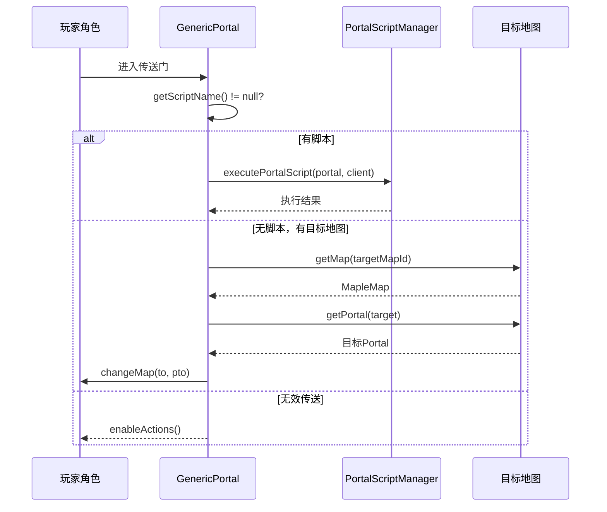
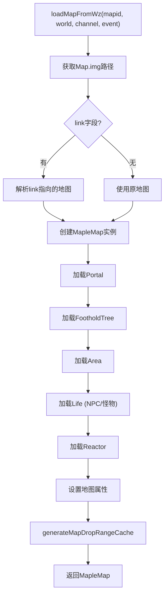
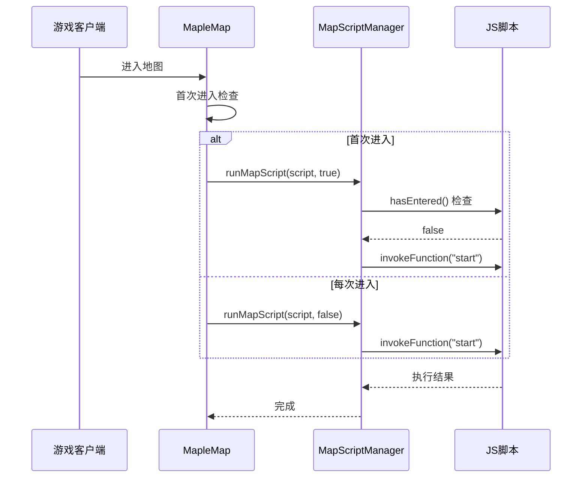
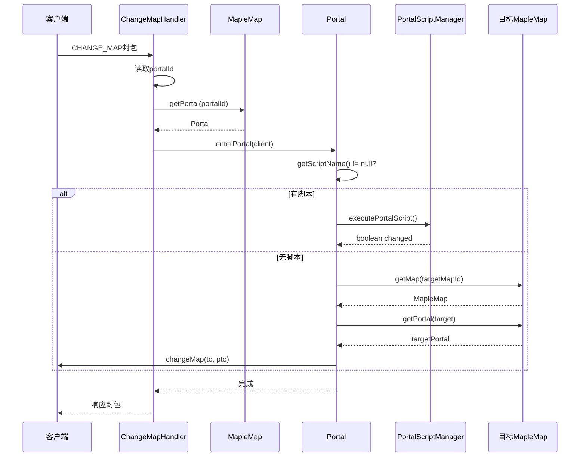
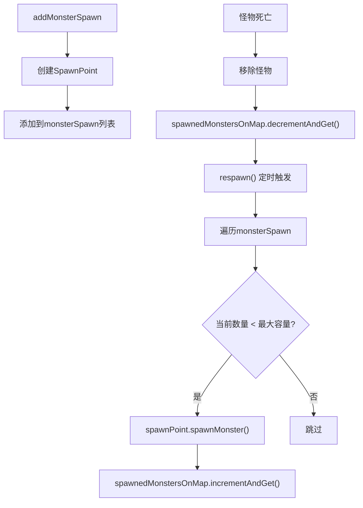

# 地图系统模块

## 1. 概述

BeiDou-Server 地图系统是游戏世界的核心组成部分，负责管理游戏中的所有地图场景。本模块基于 `org.gms.server.maps` 包实现，提供了地图加载、对象管理、传送机制、脚本触发等核心功能。玩家在游戏中的所有活动都依赖于地图系统，包括移动、战斗、物品掉落、NPC交互等。

### 1.1 地图系统架构



### 1.2 核心类职责

| 类名 | 职责 | 位置 |
|------|------|------|
| MapleMap | 地图核心类，管理地图上的所有对象和逻辑 | `org.gms.server.maps.MapleMap` |
| MapFactory | 静态工厂类，负责从WZ文件加载地图数据 | `org.gms.server.maps.MapFactory` |
| MapManager | 地图管理器，缓存和管理频道内的地图实例 | `org.gms.server.maps.MapManager` |
| MapScriptManager | 地图脚本管理器，执行地图入口脚本 | `org.gms.scripting.map.MapScriptManager` |
| FootholdTree | 四叉树结构，存储和管理地形承载点 | `org.gms.server.maps.FootholdTree` |
| Portal | 传送门接口，定义传送门行为 | `org.gms.server.maps.Portal` |

---

## 2. 地图数据结构

### 2.1 MapleMap 核心属性

`MapleMap` 是地图系统的核心类，每个地图实例包含以下关键属性：

```java
// 位置: org.gms.server.maps.MapleMap
public class MapleMap {
    private final int mapid;                    // 地图ID
    private final int channel;                  // 所在频道
    private final int world;                    // 所在世界
    private final int returnMapId;              // 返回地图ID
    private byte monsterRate;                   // 怪物刷新倍率

    // 地图边界
    private Rectangle mapArea = new Rectangle();
    private Pair<Integer, Integer> xLimits;     // X轴范围缓存

    // 对象集合
    private final Map<Integer, MapObject> mapobjects = new LinkedHashMap<>();
    private final Collection<Character> characters = new LinkedHashSet<>();
    private final Map<Integer, Portal> portals = new HashMap<>();
    private FootholdTree footholds = null;     // 地形承载树

    // 事件与脚本
    private EventInstanceManager event = null;
    private String onFirstUserEnter;             // 首次进入脚本
    private String onUserEnter;                  // 每次进入脚本

    // 地图属性
    private int fieldLimit = 0;                 // 地图限制
    private int timeLimit;                      // 时间限制
    private boolean clock;                      // 是否显示时钟
    private boolean boat;                       // 是否有船
    private boolean town;                       // 是否为城镇
    private int decHP = 0;                      // 血量消耗
    private int protectItem = 0;                // 保护物品ID
}
```

### 2.2 地图边界系统

地图使用矩形边界系统来限制玩家和对象的活动范围：

```java
// 设置线边界（VRTop, VRBottom, VRLeft, VRRight）
map.setMapLineBoundings(bounds[0], bounds[1], bounds[2], bounds[3]);

// 设置点边界（用于旧版地图）
map.setMapPointBoundings(bounds[0], bounds[1], bounds[2], bounds[3]);
```

**边界计算：**

- `VRTop/VRBottom`：垂直方向的范围
- `VRLeft/VRRight`：水平方向的左右边界
- 地图中心点：`centerX, centerY` 取负值作为坐标原点

### 2.3 地图ID体系

地图ID采用9位数字编码，结构如下：

```
┌─────────────────────────────────────────────┐
│              地图ID结构                       │
├──────────┬──────────┬──────────┬─────────────┤
│  大区域   │  子区域   │  地图编号  │   地图子号   │
│ (1位)    │ (2位)    │ (3位)    │   (3位)     │
└──────────┴──────────┴──────────┴─────────────┘

例如: 100000000 → 1区/维多利亚港/001/000
```

**地图名称解析（MapFactory.getMapStringName）：**

| 地图ID范围 | 区域名称 |
|-----------|---------|
| < 100000000 | maple（楓之谷） |
| 100000000 ~ ORBIS | victoria（金银岛） |
| ORBIS ~ ELLIN_FOREST | ossyria（神秘岛） |
| ELLIN_FOREST ~ 400000000 | elin（艾琳森林） |
| SINGAPORE ~ 560000000 | singapore（新加坡） |
| NEW_LEAF_CITY ~ 620000000 | MasteriaGL（克拉齐亚） |

---

## 3. 地形系统

### 3.1 Foothold 承载点

`Foothold` 是地图上的地形承载点，用于支持玩家和怪物的站立和移动：

```java
// 位置: org.gms.server.maps.Foothold
public class Foothold {
    private final Point x1, y1;  // 起始点
    private final Point x2, y2;  // 终止点
    private final int id;        // 承载点ID

    // 前后连接点（用于跳跃路径规划）
    private int prev;
    private int next;
}
```

**承载点类型：**

- **普通承载点**：支持站立和行走
- **斜坡承载点**：Y坐标不同，需要计算角色位置
- **墙壁（Wall）**：阻挡移动

### 3.2 FootholdTree 四叉树

`FootholdTree` 使用四叉树数据结构高效管理大量承载点：

```java
// 位置: org.gms.server.maps.FootholdTree
public class FootholdTree {
    private FootholdTree nw, ne, sw, se;  // 四个子节点
    private final List<Foothold> footholds = new LinkedList<>();
    private final Point p1, p2;          // 节点边界
    private final Point center;           // 中心点
    private static final int maxDepth = 8; // 最大深度
}
```

**四叉树构建过程：**

```
loadMapFromWz()
    │
    ├── 遍历Map/MapX/XXXXXXXXX.img/foothold
    │       │
    │       └── 读取每个承载点的 x1, y1, x2, y2
    │
    ├── 创建 FootholdTree(lBound, uBound)
    │
    └── 对每个Foothold调用 insert(fh)
            │
            └── 递归插入到对应象限
```

**查找功能：**

```java
// 查找角色下方的承载点
public Foothold findBelow(Point p) {
    // 1. 获取相关的承载点列表
    List<Foothold> relevants = getRelevants(p);

    // 2. 筛选X坐标范围内的承载点
    List<Foothold> xMatches = new LinkedList<>();
    for (Foothold fh : relevants) {
        if (fh.getX1() <= p.x && fh.getX2() >= p.x) {
            xMatches.add(fh);
        }
    }

    // 3. 排序并返回最近的承载点
    Collections.sort(xMatches);
    for (Foothold fh : xMatches) {
        if (!fh.isWall() && fh.getY1() >= p.y) {
            return fh;
        }
    }
    return null;
}

// 查找墙壁
public Foothold findWall(Point p1, Point p2) {
    // 用于碰撞检测
}
```

### 3.3 地形查找流程图



---

## 4. 传送门系统

### 4.1 Portal 接口

`Portal` 接口定义了传送门的基本行为：

```java
// 位置: org.gms.server.maps.Portal
public interface Portal {
    int TELEPORT_PORTAL = 1;    // 传送门
    int MAP_PORTAL = 2;         // 地图传送门
    int DOOR_PORTAL = 6;        // 门传送门

    int getType();
    int getId();
    Point getPosition();
    String getName();
    String getTarget();          // 目标传送点名称
    String getScriptName();      // 脚本名称
    int getTargetMapId();        // 目标地图ID
    void enterPortal(Client c);  // 进入传送门
}
```

### 4.2 GenericPortal 实现

`GenericPortal` 是Portal接口的主要实现类：

```java
// 位置: org.gms.server.maps.GenericPortal
public class GenericPortal implements Portal {
    private String name;           // 传送点名称（如 "sp" = start point）
    private String target;         // 目标传送点名称
    private Point position;        // 位置
    private int targetmap;         // 目标地图ID
    private final int type;        // 传送门类型
    private boolean status = true; // 状态
    private int id;                // 传送门ID
    private String scriptName;     // 脚本名称
}
```

### 4.3 PortalFactory 传送门工厂

`PortalFactory` 负责从WZ文件加载传送门数据：

```java
// 位置: org.gms.server.maps.PortalFactory
public class PortalFactory {
    private int nextDoorPortal;

    public Portal makePortal(int type, Data portal) {
        GenericPortal ret;
        if (type == Portal.MAP_PORTAL) {
            ret = new MapPortal();
        } else {
            ret = new GenericPortal(type);
        }
        loadPortal(ret, portal);
        return ret;
    }

    private void loadPortal(GenericPortal myPortal, Data portal) {
        myPortal.setName(DataTool.getString(portal.getChildByPath("pn")));
        myPortal.setTarget(DataTool.getString(portal.getChildByPath("tn")));
        myPortal.setTargetMapId(DataTool.getInt(portal.getChildByPath("tm")));
        myPortal.setPosition(new Point(x, y));
        myPortal.setScriptName(DataTool.getString("script", portal, null));
    }
}
```

### 4.4 传送流程图



### 4.5 传送门类型

| 类型 | 值 | 说明 | 示例 |
|------|---|------|------|
| TELEPORT_PORTAL | 1 | 普通传送门 | 自由市场传送门 |
| MAP_PORTAL | 2 | 地图传送门 | 村庄入口 |
| DOOR_PORTAL | 6 | 门传送门 | 城镇门 |

---

## 5. 地图对象系统

### 5.1 MapObject 接口

所有地图对象都实现 `MapObject` 接口：

```java
// 位置: org.gms.server.maps.MapObject
public interface MapObject {
    int getObjectId();
    void setObjectId(int id);
    MapObjectType getType();
    Point getPosition();
    void setPosition(Point position);
    void sendSpawnData(Client client);   // 发送生成数据
    void sendDestroyData(Client client); // 发送销毁数据
    void nullifyPosition();
}
```

### 5.2 MapObjectType 枚举

```java
// 位置: org.gms.server.maps.MapObjectType
public enum MapObjectType {
    NPC,            // NPC
    MONSTER,        // 怪物
    ITEM,           // 物品
    PLAYER,         // 玩家
    DOOR,           // 门
    SUMMON,         // 召唤物
    MIST,           // 迷雾
    REACTOR,        // 反应器
    HIRED_MERCHANT, // 雇佣商人
    PLAYER_SHOP,    // 玩家商店
    KITE,           // 风筝
    TOWN_PORTAL,    // 城镇传送门
    PART,           // 部件
    KILL_COUNT,     // 击杀计数
}
```

### 5.3 对象管理

MapleMap 使用 `ReadWriteLock` 管理并发访问：

```java
private final Lock chrRLock;
private final Lock chrWLock;
private final Lock objectRLock;
private final Lock objectWLock;

// 添加角色
public void addPlayer(Character chr) {
    chrWLock.lock();
    try {
        characters.add(chr);
    } finally {
        chrWLock.unlock();
    }
}

// 获取角色
public List<Character> getCharacters() {
    chrRLock.lock();
    try {
        return new ArrayList<>(characters);
    } finally {
        chrRLock.unlock();
    }
}

// 广播封包
public void broadcastPacket(Packet packet) {
    chrRLock.lock();
    try {
        characters.forEach(chr -> chr.sendPacket(packet));
    } finally {
        chrRLock.unlock();
    }
}
```

### 5.4 对象类型查询

```java
// 获取范围内的对象
public List<MapObject> getMapObjectsInRect(Rectangle box, List<MapObjectType> types) {
    objectRLock.lock();
    try {
        List<MapObject> ret = new LinkedList<>();
        for (MapObject l : mapobjects.values()) {
            if (types.contains(l.getType()) && box.contains(l.getPosition())) {
                ret.add(l);
            }
        }
        return ret;
    } finally {
        objectRLock.unlock();
    }
}
```

---

## 6. 地图加载机制

### 6.1 MapFactory 加载流程



### 6.2 从WZ文件加载

```java
// 位置: org.gms.server.maps.MapFactory
public static MapleMap loadMapFromWz(int mapid, int world, int channel, EventInstanceManager event) {
    // 1. 获取地图数据路径
    String mapName = getMapName(mapid);  // e.g., "Map/Map1/100000000.img"
    Data mapData = mapSource.getData(mapName);
    Data infoData = mapData.getChildByPath("info");

    // 2. 处理链接地图（Dojo等）
    String link = DataTool.getString(infoData.getChildByPath("link"), "");
    if (!link.equals("")) {
        mapName = getMapName(Integer.parseInt(link));
        mapData = mapSource.getData(mapName);
    }

    // 3. 创建地图实例
    MapleMap map = new MapleMap(mapid, world, channel, returnMapId, monsterRate);

    // 4. 加载传送门
    PortalFactory portalFactory = new PortalFactory();
    for (Data portal : mapData.getChildByPath("portal")) {
        map.addPortal(portalFactory.makePortal(type, portal));
    }

    // 5. 加载地形
    FootholdTree fTree = new FootholdTree(lBound, uBound);
    for (Foothold fh : allFootholds) {
        fTree.insert(fh);
    }
    map.setFootholds(fTree);

    // 6. 加载Life（怪物、NPC等）
    loadLifeFromWz(map, mapData);

    return map;
}
```

### 6.3 从数据库加载

`plife` 表存储数据库中的动态Life数据：

```sql
-- plife表结构
CREATE TABLE plife (
    life INT,          -- Life ID
    type VARCHAR(1),   -- 类型: m=怪物, n=NPC
    map INT,           -- 地图ID
    world INT,         -- 世界ID
    cy INT,            -- 中心Y
    f INT,             -- 朝向
    fh INT,            -- Foothold ID
    rx0 INT,           -- 有效X范围
    rx1 INT,
    x INT,             -- X坐标
    y INT,             -- Y坐标
    hide INT,          -- 是否隐藏
    mobtime INT,       -- 刷新时间
    team INT           -- 队伍
);
```

### 6.4 MapManager 缓存管理

```java
// 位置: org.gms.server.maps.MapManager
public class MapManager {
    private final Map<Integer, MapleMap> maps = new HashMap<>();

    public MapleMap getMap(int mapid) {
        mapsRLock.lock();
        try {
            MapleMap map = maps.get(mapid);
        } finally {
            mapsRLock.unlock();
        }

        return (map != null) ? map : loadMapFromWz(mapid, true);
    }

    public MapleMap getDisposableMap(int mapid) {
        return loadMapFromWz(mapid, false);  // 不缓存的临时地图
    }
}
```

---

## 7. 地图脚本系统

### 7.1 MapScriptManager

`MapScriptManager` 负责执行地图入口脚本：

```java
// 位置: org.gms.scripting.map.MapScriptManager
public class MapScriptManager extends AbstractScriptManager {
    private static final MapScriptManager instance = new MapScriptManager();
    private final Map<String, Invocable> scripts = new HashMap<>();

    public boolean runMapScript(Client c, String mapScriptPath, boolean firstUser) {
        // 检查首次进入标记
        if (firstUser) {
            Character chr = c.getPlayer();
            int mapid = chr.getMapId();
            if (chr.hasEntered(mapScriptPath, mapid)) {
                return false;  // 已进入过
            } else {
                chr.enteredScript(mapScriptPath, mapid);
            }
        }

        // 执行脚本
        Invocable iv = scripts.get(mapScriptPath);
        if (iv != null) {
            iv.invokeFunction("start", new MapScriptMethods(c));
            return true;
        }

        // 加载新脚本
        iv = (Invocable) getInvocableScriptEngine("map/" + mapScriptPath + ".js");
        scripts.put(mapScriptPath, iv);
        iv.invokeFunction("start", new MapScriptMethods(c));
        return true;
    }
}
```

### 7.2 地图脚本触发时机

```java
// MapleMap.java
public void firstEnter(List<Character> characters) {
    if (onFirstUserEnter != null && !onFirstUserEnter.equals(String.valueOf(mapid))) {
        MapScriptManager.getInstance().runMapScript(client, onFirstUserEnter, true);
    }
}

public void checkUserEnter(int portalId) {
    if (onUserEnter != null && !onUserEnter.equals(String.valueOf(mapid))) {
        MapScriptManager.getInstance().runMapScript(client, onUserEnter, false);
    }
}
```

### 7.3 脚本触发流程



---

## 8. 传送处理流程

### 8.1 CHANGE_MAP 封包处理

玩家切换地图时，客户端发送 `CHANGE_MAP` 封包：

```java
// 位置: org.gms.net.server.channel.handler.ChangeMapHandler
@Override
public void handlePacket(InPacket p, Client c) {
    Character chr = c.getPlayer();

    // 读取传送门ID
    int portalId = p.readInt();
    boolean lostEquip = p.readByte() != 0;
    boolean isOnFoot = p.readByte() != 0;

    // 获取传送门
    MapleMap map = chr.getMap();
    Portal portal = map.getPortal(portalId);

    // 检查地图限制
    if (FieldLimit.CANNOTENTERMAP.check(chr)) {
        chr.dropMessage(5, "You cannot enter this map.");
        chr.dropMessage(5, "You cannot enter this map.");
        return;
    }

    // 进入传送门
    portal.enterPortal(c);
}
```

### 8.2 完整传送流程



---

## 9. 怪物系统

### 9.1 刷新机制

MapleMap 管理怪物的刷新和重生：

```java
private final Collection<SpawnPoint> monsterSpawn = Collections.synchronizedList(new LinkedList<>());
private final AtomicInteger spawnedMonstersOnMap = new AtomicInteger(0);

// 添加怪物刷新点
public void addMonsterSpawn(Monster monster, int mobTime, int team) {
    SpawnPoint spawnPoint = new SpawnPoint(monster, mobTime, team);
    monsterSpawn.add(spawnPoint);
}

// 刷新所有怪物
public void respawn() {
    for (SpawnPoint spawnPoint : monsterSpawn) {
        spawnPoint.spawnMonster(monsterSpawn);
    }
}
```

### 9.2 怪物刷新流程



---

## 10. 物品与掉落系统

### 10.1 物品掉落管理

```java
private final Map<MapItem, Long> droppedItems = new LinkedHashMap<>();
private final AtomicInteger droppedItemCount = new AtomicInteger(0);
private ScheduledFuture<?> itemMonitor = null;

// 掉落物品
public void spawnItemDrop(Character chr, Item item, Point dropPos, Point serverPos, boolean ffa) {
    // 创建MapItem对象
    // 添加到droppedItems
    // 广播生成封包给客户端
}

// 定时检查过期物品
private void startItemMonitor() {
    itemMonitor = TimerManager.getInstance().schedule("ItemMonitor", () -> {
        checkDroppedItems();
    }, itemMonitorTimeout);
}
```

### 10.2 掉落范围计算

```java
private static final Map<Integer, Pair<Integer, Integer>> dropBoundsCache = new HashMap<>(100);

// 生成掉落范围缓存
public void generateMapDropRangeCache() {
    // 遍历所有foothold
    // 计算minX和maxX
    // 存入dropBoundsCache
}
```

---

## 11. 相关文件路径

| 组件 | 文件路径 |
|------|----------|
| 地图核心类 | `org.gms.server.maps.MapleMap` |
| 地图工厂 | `org.gms.server.maps.MapFactory` |
| 地图管理器 | `org.gms.server.maps.MapManager` |
| 地图脚本管理 | `org.gms.scripting.map.MapScriptManager` |
| 传送门接口 | `org.gms.server.maps.Portal` |
| 传送门实现 | `org.gms.server.maps.GenericPortal` |
| 传送门工厂 | `org.gms.server.maps.PortalFactory` |
| 地形承载树 | `org.gms.server.maps.FootholdTree` |
| 承载点 | `org.gms.server.maps.Foothold` |
| 地图对象接口 | `org.gms.server.maps.MapObject` |
| 对象类型枚举 | `org.gms.server.maps.MapObjectType` |
| 切换地图处理器 | `org.gms.net.server.channel.handler.ChangeMapHandler` |

---

*文档版本: 1.0*
*最后更新: 2026-03-26*
