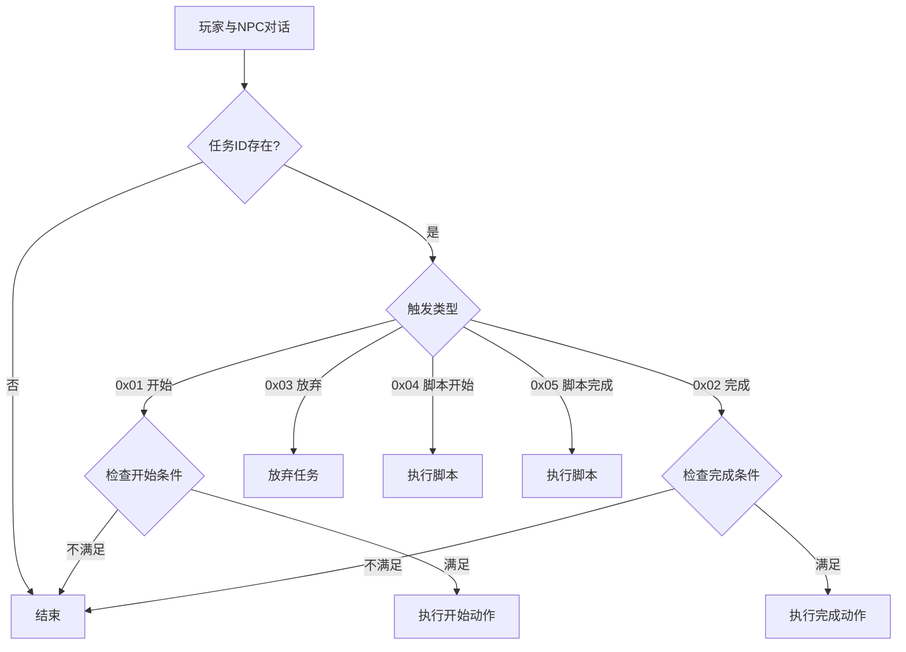
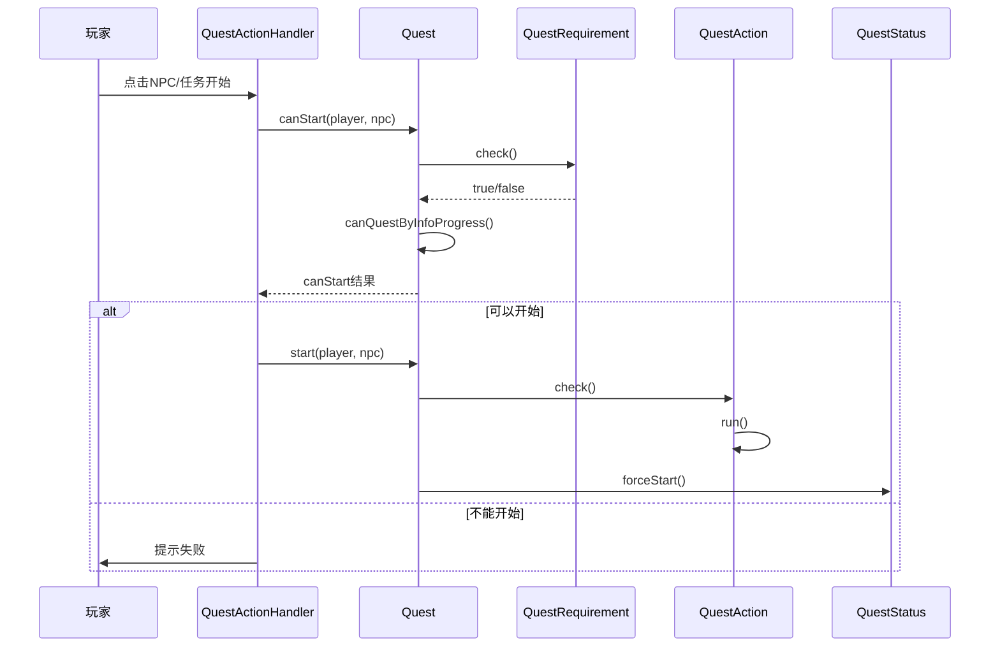
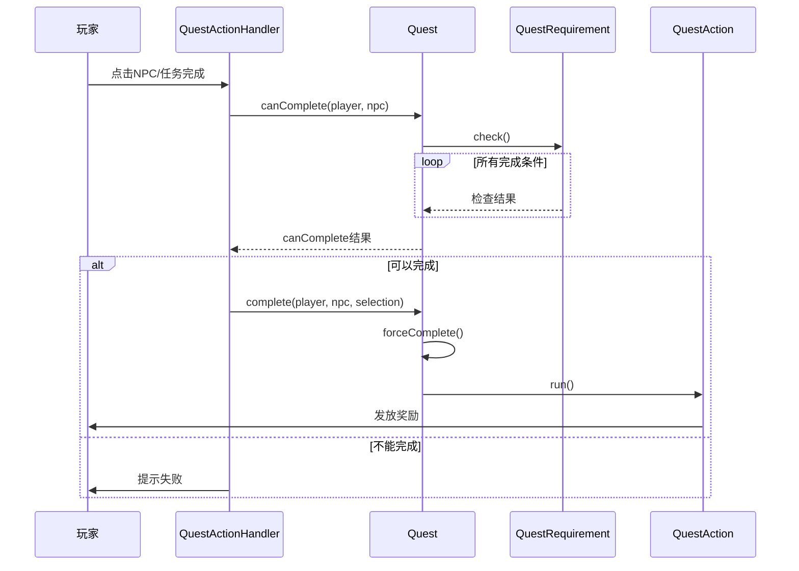
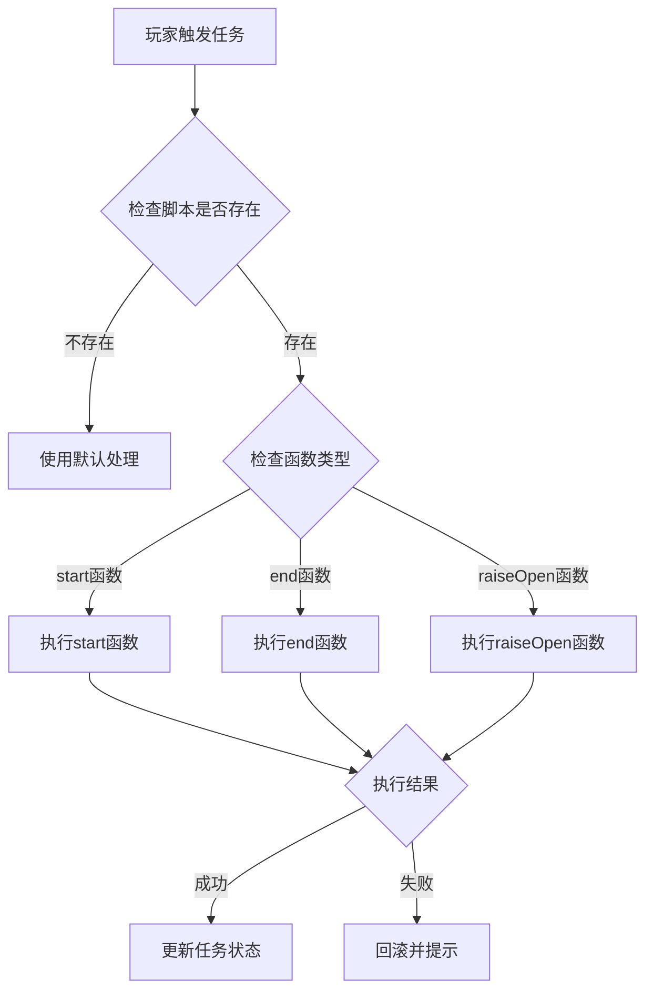
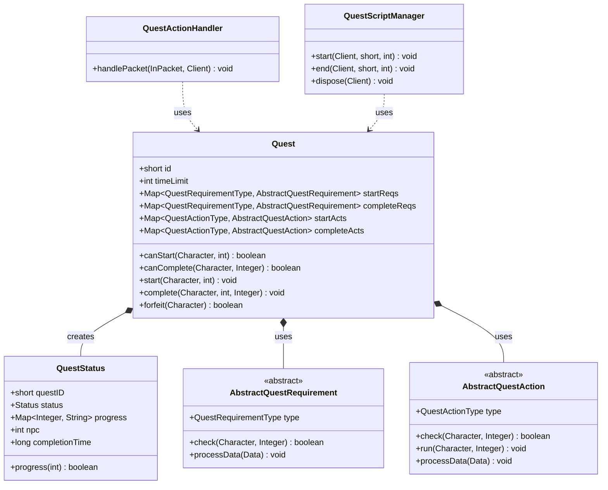
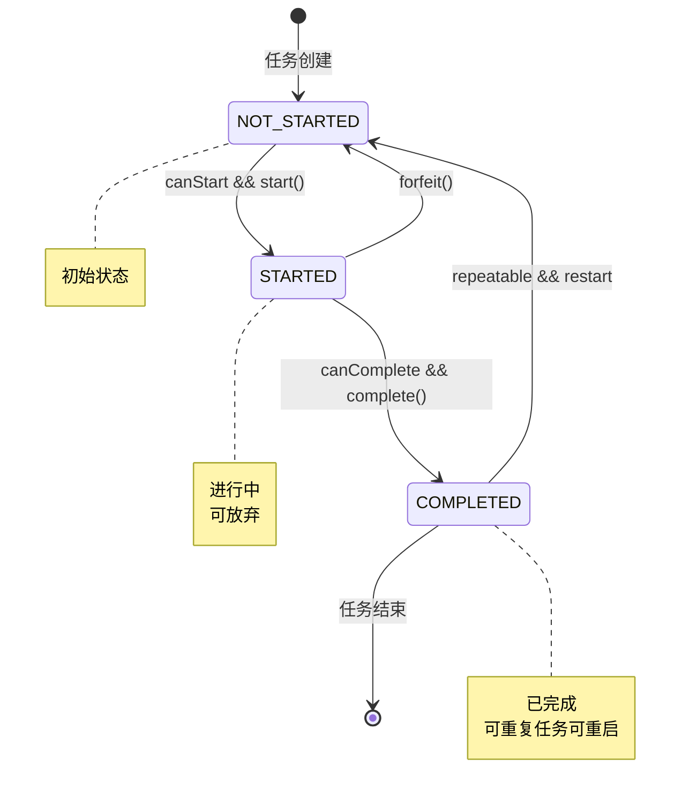
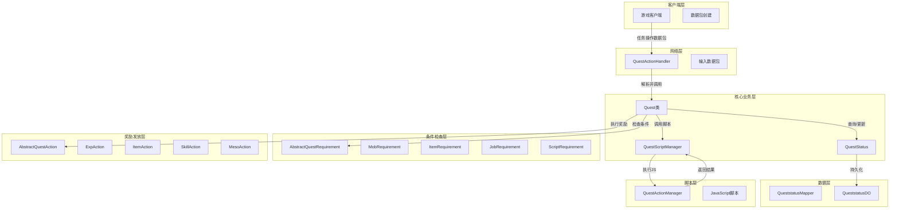

# 任务系统模块

## 1. 任务系统概述

任务系统是 MapleStory 游戏服务器的核心模块之一，负责管理玩家的任务流程。本服务器实现了一套完整的任务生命周期管理，包括任务触发、条件判断、奖励发放和进度追踪。

### 1.1 核心特性

- **任务数据加载**: 从 WZ 资源文件（QuestInfo.img, Act.img, Check.img）加载任务配置
- **条件检测**: 支持多种任务前置条件（等级、物品、怪物、完成其他任务等）
- **奖励机制**: 支持经验、金币、物品、技能、荣誉值等多种奖励类型
- **脚本集成**: 支持 JavaScript 脚本实现复杂的任务对话和流程控制
- **时间限制**: 支持任务时效性和完成时间限制

## 2. Quest 类结构分析

`Quest.java` 是任务系统的核心类，负责任务数据的加载和管理。

### 2.1 类结构

```java
public class Quest {
    private short id;                                    // 任务ID
    private int timeLimit, timeLimit2;                   // 时间限制
    private Map<QuestRequirementType, AbstractQuestRequirement> startReqs;  // 接受条件
    private Map<QuestRequirementType, AbstractQuestRequirement> completeReqs; // 完成条件
    private Map<QuestActionType, AbstractQuestAction> startActs;    // 接受奖励
    private Map<QuestActionType, AbstractQuestAction> completeActs; // 完成奖励
    private List<Integer> relevantMobs;                   // 相关怪物列表
    private boolean autoStart, autoPreComplete, autoComplete;  // 自动触发标记
    private boolean repeatable;                           // 可重复任务标记
    private String name, parent;                          // 任务名称和父任务
}
```

### 2.2 核心方法

| 方法 | 说明 |
|------|------|
| `getInstance(int id)` | 获取任务实例（带缓存） |
| `canStart(Character chr, int npcid)` | 检查角色是否可以接受任务 |
| `canComplete(Character chr, Integer npcid)` | 检查角色是否可以完成任务 |
| `start(Character chr, int npc)` | 开始任务 |
| `complete(Character chr, int npc, Integer selection)` | 完成任务 |
| `forfeit(Character chr)` | 放弃任务 |
| `forceStart(Character chr, int npc)` | 强制开始任务 |
| `forceComplete(Character chr, int npc)` | 强制完成任务 |

## 3. 任务数据模型

### 3.1 QuestStatus 状态

```java
public enum Status {
    UNDEFINED(-1),    // 未定义
    NOT_STARTED(0),   // 未开始
    STARTED(1),       // 进行中
    COMPLETED(2);     // 已完成
}
```

### 3.2 任务进度追踪

`QuestStatus` 类存储玩家的任务进度：

```java
public class QuestStatus {
    private short questID;              // 任务ID
    private Status status;             // 当前状态
    private Map<Integer, String> progress;  // 怪物击杀进度
    private List<Integer> medalProgress;    // 勋章进度
    private int npc;                   // 关联NPC
    private long completionTime;       // 完成时间
    private long expirationTime;       // 过期时间
    private int forfeited;             // 放弃次数
    private int completed;             // 完成次数
    private String customData;          // 自定义数据
}
```

### 3.3 数据库实体

任务状态通过 MyBatis-Flex 映射到数据库：

| 字段 | 类型 | 说明 |
|------|------|------|
| queststatusid | Long | 主键 |
| characterid | Integer | 角色ID |
| quest | Integer | 任务ID |
| status | Integer | 状态 |
| time | Integer | 时间 |
| expires | Long | 过期时间戳 |
| forfeited | Integer | 放弃次数 |
| completed | Integer | 完成次数 |
| info | Integer | 扩展信息 |

## 4. 任务触发机制

### 4.1 触发类型

1. **NPC 对话触发**: 通过与 NPC 对话开始或完成任务
2. **自动触发**: `autoStart` 标记的任务自动开始
3. **脚本触发**: 通过 JavaScript 脚本控制复杂流程

### 4.2 触发流程图



### 4.3 QuestActionHandler 处理

```java
public final void handlePacket(InPacket p, Client c) {
    byte action = p.readByte();      // 0-5代表不同操作
    short questid = p.readShort();     // 任务ID
    switch (action) {
        case 0: // 恢复丢失物品
            quest.restoreLostItem(player, itemid);
            break;
        case 1: // 开始任务
            if (quest.canStart(player, npc)) {
                QuestScriptManager.getInstance().start(c, questid, npc);
            }
            break;
        case 2: // 完成任务
            if (quest.canComplete(player, npc)) {
                QuestScriptManager.getInstance().end(c, questid, npc);
            }
            break;
        case 3: // 放弃任务
            quest.forfeit(player);
            break;
    }
}
```

## 5. 任务流程

### 5.1 任务接受流程



### 5.2 任务完成流程



## 6. 任务条件判断

### 6.1 条件类型枚举

```java
public enum QuestRequirementType {
    JOB(0),           // 职业条件
    ITEM(1),          // 物品条件
    QUEST(2),         // 前置任务
    MIN_LEVEL(3),      // 最低等级
    MAX_LEVEL(4),     // 最高等级
    END_DATE(5),      // 结束日期
    MOB(6),           // 怪物击杀
    NPC(7),           // NPC条件
    FIELD_ENTER(8),   // 地图进入
    INTERVAL(9),      // 重复间隔
    SCRIPT(10),       // 脚本条件
    PET(11),          // 宠物条件
    MIN_PET_TAMENESS(12),  // 宠物驯服度
    MONSTER_BOOK(13), // 怪物图鉴
    INFO_NUMBER(15),  // 信息数值
    INFO_EX(16),      // 扩展信息
    COMPLETED_QUEST(17), // 已完成任务
    MESO(21),         // 金币条件
    BUFF(22),         // BUFF状态
    EXCEPT_BUFF(23);  // 无BUFF状态
}
```

### 6.2 条件检查示例 - 怪物击杀条件

```java
public class MobRequirement extends AbstractQuestRequirement {
    Map<Integer, Integer> mobs = new HashMap<>();  // mobId -> 需要数量

    @Override
    public boolean check(Character chr, Integer npcid) {
        QuestStatus status = chr.getQuest(Quest.getInstance(questID));
        for (Integer mobID : mobs.keySet()) {
            int countReq = mobs.get(mobID);
            int progress = Integer.parseInt(status.getProgress(mobID));
            if (progress < countReq) {
                return false;
            }
        }
        return true;
    }
}
```

### 6.3 条件检查流程

```java
public boolean canStart(Character chr, int npcid) {
    // 1. 检查任务状态
    if (!canStartQuestByStatus(chr)) {
        return false;
    }

    // 2. 检查所有开始条件
    for (AbstractQuestRequirement r : startReqs.values()) {
        if (!r.check(chr, npcid)) {
            return false;
        }
    }

    // 3. 检查信息进度
    return canQuestByInfoProgress(chr);
}
```

## 7. 任务奖励机制

### 7.1 奖励类型枚举

```java
public enum QuestActionType {
    EXP(0),           // 经验值
    ITEM(1),          // 物品
    NEXTQUEST(2),     // 下一任务
    MESO(3),         // 金币
    QUEST(4),         // 任务奖励
    SKILL(5),         // 技能
    FAME(6),          // 荣誉值
    BUFF(7),          // BUFF
    PETSKILL(8),      // 宠物技能
    PETTAMENESS(14),  // 宠物驯服度
    PETSPEED(15),     // 宠物速度
    INFO(16);         // 信息
}
```

### 7.2 经验奖励示例

```java
public class ExpAction extends AbstractQuestAction {
    int exp;

    @Override
    public void run(Character chr, Integer extSelection) {
        if (!GameConfig.getServerBoolean("use_quest_rate")) {
            chr.gainExp(NumberTool.floatToInt(exp * chr.getExpRate()), true, true);
        } else {
            chr.gainExp(NumberTool.floatToInt(exp * chr.getQuestExpRate()), true, true);
        }
    }
}
```

### 7.3 物品奖励处理

```java
public class ItemAction extends AbstractQuestAction {
    List<ItemData> items = new ArrayList<>();

    @Override
    public void run(Character chr, Integer extSelection) {
        for (ItemData item : items) {
            if (item.getCount() < 0) {  // 扣除物品
                InventoryManipulator.removeById(chr.getClient(), type, itemid, quantity);
            } else {                    // 给予物品
                InventoryManipulator.addById(chr.getClient(), itemid, (short) count, "", -1, expiration);
            }
        }
    }
}
```

### 7.4 奖励发放流程

```java
public void complete(Character chr, int npc, Integer selection) {
    if (autoPreComplete || canComplete(chr, npc)) {
        // 1. 前置检查
        Collection<AbstractQuestAction> acts = completeActs.values();
        for (AbstractQuestAction a : acts) {
            if (!a.check(chr, selection)) {
                return;
            }
        }
        // 2. 强制完成
        forceComplete(chr, npc);
        // 3. 执行奖励
        for (AbstractQuestAction a : acts) {
            a.run(chr, selection);
        }
    }
}
```

## 8. 脚本集成

### 8.1 脚本管理器

`QuestScriptManager` 负责管理 JavaScript 脚本的执行：

```java
public class QuestScriptManager extends AbstractScriptManager {
    private Map<Client, QuestActionManager> qms = new HashMap<>();
    private Map<Client, Invocable> scripts = new HashMap<>();

    public void start(Client c, short questid, int npc) {
        ScriptEngine engine = getQuestScriptEngine(c, questid);
        engine.put("qm", qm);
        Invocable iv = (Invocable) engine;
        iv.invokeFunction("start", (byte) 1, (byte) 0, 0);
    }

    public void end(Client c, short questid, int npc) {
        ScriptEngine engine = getQuestScriptEngine(c, questid);
        engine.put("qm", qm);
        Invocable iv = (Invocable) engine;
        iv.invokeFunction("end", (byte) 1, (byte) 0, 0);
    }
}
```

### 8.2 脚本结构

```javascript
var status = -1;

function start(mode, type, selection) {
    if (mode == -1) {
        qm.dispose();
    } else {
        if (mode == 0 && type > 0) {
            qm.dispose();
            return;
        }

        if (mode == 1) {
            status++;
        } else {
            status--;
        }

        if (status == 0) {
            qm.sendNext("任务开始对话文本");
        } else if (status == 1) {
            qm.forceStartQuest();
            qm.dispose();
        }
    }
}

function end(mode, type, selection) {
    // 类似结构
    qm.forceCompleteQuest();
    qm.dispose();
}
```

### 8.3 QuestActionManager API

| 方法 | 说明 |
|------|------|
| `forceStartQuest()` | 强制开始任务 |
| `forceCompleteQuest()` | 强制完成任务 |
| `sendNext(text)` | 发送下一对话框 |
| `sendAcceptDecline(text)` | 发送接受/拒绝对话框 |
| `message(text)` | 发送消息 |
| `dispose()` | 释放资源 |
| `getPlayer()` | 获取玩家对象 |
| `getNpc()` | 获取当前NPC |

### 8.4 脚本执行流程



## 9. 相关代码示例

### 9.1 获取任务实例

```java
// 获取任务实例
Quest quest = Quest.getInstance(questId);

// 检查是否可以开始
if (quest.canStart(player, npcId)) {
    quest.start(player, npcId);
}

// 检查是否可以完成
if (quest.canComplete(player, npcId)) {
    quest.complete(player, npcId);
}
```

### 9.2 获取任务状态

```java
// 获取玩家任务状态
QuestStatus status = player.getQuest(quest);

// 检查状态
if (status.getStatus() == QuestStatus.Status.STARTED) {
    // 任务进行中
    String progress = status.getProgress(mobId);
}

// 更新进度
status.setProgress(mobId, "001");
```

### 9.3 放弃任务

```java
if (quest.forfeit(player)) {
    player.sendPacket(PacketCreator.questExpire(quest.getId()));
}
```

## 10. Mermaid 架构图

### 10.1 任务系统整体架构



### 10.2 任务流程状态机



### 10.3 任务系统组件交互



## 11. 关键文件列表

| 文件路径 | 说明 |
|----------|------|
| `src/main/java/org/gms/server/quest/Quest.java` | 任务核心类 |
| `src/main/java/org/gms/client/QuestStatus.java` | 任务状态类 |
| `src/main/java/org/gms/server/quest/QuestActionType.java` | 奖励类型枚举 |
| `src/main/java/org/gms/server/quest/QuestRequirementType.java` | 条件类型枚举 |
| `src/main/java/org/gms/net/server/channel/handlers/QuestActionHandler.java` | 任务网络处理器 |
| `src/main/java/org/gms/scripting/quest/QuestScriptManager.java` | 脚本管理器 |
| `src/main/java/org/gms/scripting/quest/QuestActionManager.java` | 脚本动作管理器 |
| `src/main/java/org/gms/server/quest/actions/AbstractQuestAction.java` | 奖励动作基类 |
| `src/main/java/org/gms/server/quest/requirements/AbstractQuestRequirement.java` | 条件检查基类 |
| `src/main/java/org/gms/dao/entity/QueststatusDO.java` | 数据库实体 |
| `scripts/quest/*.js` | 任务脚本文件 |
