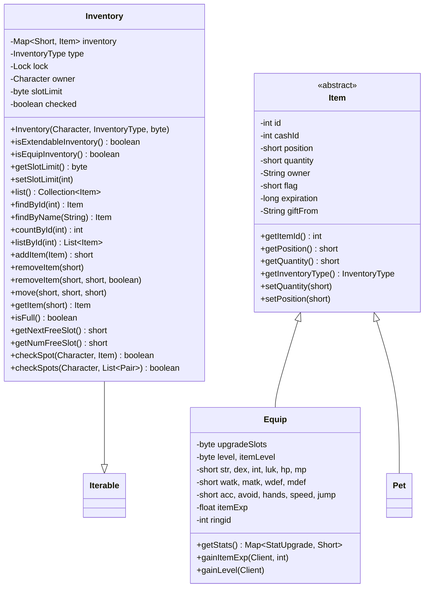
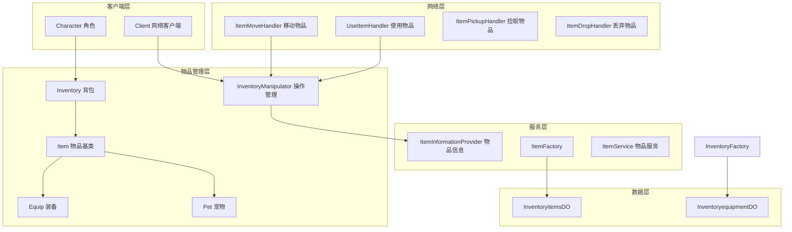
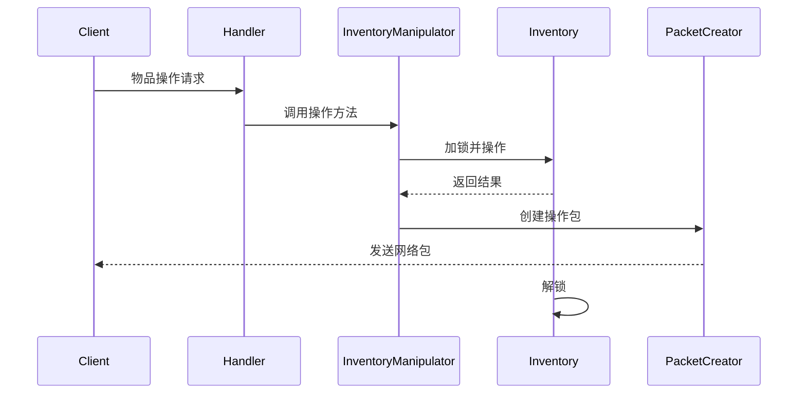
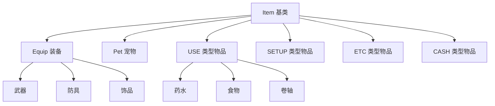

# 物品系统模块

## 1. 物品系统概述

物品系统是 MapleStory 游戏服务器的核心模块之一，负责管理游戏中的所有物品、装备、背包及物品相关的操作逻辑。该系统基于 Java + Spring Boot 架构，使用 Netty 进行网络通信，实现了完整的物品管理功能链。

### 1.1 系统特点

- **多种物品类型支持**：装备、消耗品、设置物品、杂项、现金物品
- **线程安全**：使用 `ReentrantLock` 实现并发控制
- **灵活的背包管理**：支持多类型背包、槽位限制、自动堆叠
- **完整的数据持久化**：通过 MyBatis 与数据库交互
- **物品交易机制**：支持玩家间交易、商店交易、丢置物品

## 2. Inventory 类结构

`Inventory` 类是背包系统的核心类，用于管理特定类型的物品集合。

### 2.1 类结构图



### 2.2 核心属性

| 属性 | 类型 | 说明 |
|------|------|------|
| `inventory` | `Map<Short, Item>` | 物品映射，key 为槽位号 |
| `type` | `InventoryType` | 背包类型 |
| `lock` | `Lock` | 线程锁，保证并发安全 |
| `owner` | `Character` | 背包所有者 |
| `slotLimit` | `byte` | 槽位上限 |
| `checked` | `boolean` | 背包是否已检查 |

### 2.3 核心方法

```java
// 添加物品到背包
public short addItem(Item item) {
    short slotId = addSlot(item);
    if (slotId == -1) {
        return -1;
    }
    item.setPosition(slotId);
    return slotId;
}

// 移动物品（支持堆叠）
public void move(short sSlot, short dSlot, short slotMax) {
    lock.lock();
    try {
        Item source = inventory.get(sSlot);
        Item target = inventory.get(dSlot);
        // ... 移动逻辑
    } finally {
        lock.unlock();
    }
}

// 获取下一可用槽位
public short getNextFreeSlot() {
    for (short i = 1; i <= slotLimit; i++) {
        if (!inventory.containsKey(i)) {
            return i;
        }
    }
    return -1;
}
```

## 3. 物品数据模型

### 3.1 Item 类

`Item` 是所有物品的基类，包含物品的基本属性：

```java
public class Item implements Comparable<Item> {
    private final int id;              // 物品ID
    private int cashId;                // 现金物品唯一ID
    private int sn;                    // 序列号
    private short position;            // 背包槽位
    private short quantity;           // 数量
    private int petid = -1;            // 宠物ID
    private Pet pet = null;           // 宠物对象
    private String owner = "";        // 物品所有者
    protected List<String> itemLog;   // 物品日志
    private short flag;               // 物品标志
    private long expiration = -1;     // 过期时间
    private String giftFrom = "";     // 礼物来源
}
```

### 3.2 Equip 类

`Equip` 扩展 `Item`，表示可装备的物品，包含属性加成：

```java
public class Equip extends Item {
    private byte upgradeSlots;        // 升级槽位
    private byte level;               // 等级
    private byte itemLevel;          // 物品等级
    private short str, dex, _int, luk, hp, mp;  // 属性值
    private short watk, matk;        // 攻击
    private short wdef, mdef;        // 防御
    private short acc, avoid;        // 命中、躲避
    private short hands, speed, jump; // 手腕、速度、跳跃
    private float itemExp;           // 物品经验值
    private int ringid = -1;        // 戒指ID
    
    // 升级相关
    public synchronized void gainItemExp(Client c, int gain);
    private void gainLevel(Client c);
}
```

### 3.3 Pet 类

宠物类，继承自 `Item`：

```java
public class Pet extends Item {
    private String name;              // 宠物名
    private int level;              // 等级
    private int closeness;          // 亲密度
    private int fullness;           // 饱食度
    private short slots;            // 可用槽位
    private boolean summoned;       // 是否召唤
}
```

## 4. 物品类型分类

### 4.1 InventoryType 枚举

```java
public enum InventoryType {
    UNDEFINED(0),    // 未定义
    EQUIP(1),        // 装备
    USE(2),          // 消耗品
    SETUP(3),        // 设置物品（装饰品）
    ETC(4),          // 杂项
    CASH(5),         // 现金物品
    CANHOLD(6),      // 可持有（临时）
    EQUIPPED(-1);    // 已装备
    
    private final byte type;
    private final String name;
}
```

### 4.2 物品类型判断

`ItemConstants` 提供物品类型判断：

```java
public final class ItemConstants {
    // 装备判断
    public static boolean isEquipment(int itemId) {
        return itemId < 2000000 && itemId != 0;
    }
    
    // 武器判断
    public static boolean isWeapon(int itemId) {
        return itemId >= 1302000 && itemId < 1493000;
    }
    
    // 可充电物品（飞镖、子弹）
    public static boolean isRechargeable(int itemId) {
        return isThrowingStar(itemId) || isBullet(itemId);
    }
    
    // 宠物判断
    public static boolean isPet(int itemId) {
        return itemId / 1000 == 5000;
    }
    
    // 消耗品判断
    public static boolean isConsumable(int itemId) {
        return isPotion(itemId) || isFood(itemId);
    }
    
    // 弓/弩箭判断
    public static boolean isArrow(int itemId) {
        return isArrowForBow(itemId) || isArrowForCrossBow(itemId);
    }
}
```

### 4.3 物品ID与类型对应关系

| ID范围 | 类型 | 说明 |
|--------|------|------|
| 1000000-1999999 | EQUIP | 装备 |
| 2000000-2999999 | USE | 消耗品 |
| 3000000-3999999 | SETUP | 设置物品 |
| 4000000-4999999 | ETC | 杂项物品 |
| 5000000-5999999 | CASH | 现金物品 |

## 5. 物品装备系统

### 5.1 装备穿戴

`InventoryManipulator.equip()` 处理装备穿戴：

```java
public static void equip(Client c, short src, short dst) {
    Character chr = c.getPlayer();
    Inventory eqpInv = chr.getInventory(InventoryType.EQUIP);
    Inventory eqpdInv = chr.getInventory(InventoryType.EQUIPPED);
    
    Equip source = (Equip) eqpInv.getItem(src);
    
    // 检查性别限制
    int itemGender = ItemId.getGender(source.getItemId());
    if (itemGender != 2 && itemGender != chr.getGender()) {
        // 性别不符
        return;
    }
    
    // 检查装备要求
    if (!ii.canWearEquipment(chr, source, dst)) {
        return;
    }
    
    // 处理双武器冲突
    switch (dst) {
        case -11: // 盾牌位置
            if (ii.isTwoHanded(source.getItemId())) {
                // 需要卸下另一把武器
            }
            break;
    }
    
    // 执行穿戴
    source.setPosition(dst);
    chr.equippedItem(source);
    eqpdInv.addItemFromDB(source);
}
```

### 5.2 装备卸下

```java
public static void unequip(Client c, short src, short dst) {
    Character chr = c.getPlayer();
    Inventory eqpInv = chr.getInventory(InventoryType.EQUIP);
    Inventory eqpdInv = chr.getInventory(InventoryType.EQUIPPED);
    
    Equip source = (Equip) eqpdInv.getItem(src);
    if (source == null) return;
    
    // 卸下装备
    chr.unequippedItem(source);
    eqpdInv.removeSlot(src);
    
    source.setPosition(dst);
    eqpInv.addItemFromDB(source);
}
```

### 5.3 装备升级系统

装备支持经验值累积和等级提升：

```java
public synchronized void gainItemExp(Client c, int gain) {
    // 获取装备最大等级
    int equipMaxLevel = Math.min(30, ii.getEquipLevel(getItemId(), true));
    if (itemLevel >= equipMaxLevel) return;
    
    // 计算经验值修正
    float masteryModifier = ...;
    float elementModifier = isElemental ? 0.85f : 0.6f;
    float baseExpGain = gain * elementModifier * masteryModifier;
    
    itemExp += baseExpGain;
    
    // 升级判定
    if (itemExp >= expNeeded) {
        while (itemExp >= expNeeded) {
            itemExp -= expNeeded;
            gainLevel(c);  // 执行升级
        }
    }
}
```

## 6. 物品交易机制

### 6.1 物品丢置

```java
public static void drop(Client c, InventoryType type, short src, short quantity) {
    Character chr = c.getPlayer();
    Inventory inv = chr.getInventory(type);
    Item source = inv.getItem(src);
    
    // 检查数量
    if (source.getQuantity() < quantity) return;
    
    // 分割堆叠
    if (quantity < source.getQuantity()) {
        Item target = source.copy();
        target.setQuantity(quantity);
        source.setQuantity((short)(source.getQuantity() - quantity));
        
        // 在地图生成掉落
        map.spawnItemDrop(chr, chr, target, dropPos, true, true);
    } else {
        // 整个物品掉落
        map.spawnItemDrop(chr, chr, source, dropPos, true, true);
    }
}
```

### 6.2 物品捡取

```java
public static boolean addFromDrop(Client c, Item item, boolean show) {
    Character chr = c.getPlayer();
    InventoryType type = item.getInventoryType();
    Inventory inv = chr.getInventory(type);
    
    // 检查物品是否可拾取
    ItemInformationProvider ii = ItemInformationProvider.getInstance();
    if (ii.isPickupRestricted(item.getItemId())) {
        if (chr.haveItemWithId(item.getItemId(), true)) {
            return false;
        }
    }
    
    // 添加到背包
    return addFromDropInternal(c, chr, type, inv, item, show, item.getPetId());
}
```

### 6.3 物品移动/合并

```java
public static void move(Client c, InventoryType type, short src, short dst) {
    Inventory inv = c.getPlayer().getInventory(type);
    Item source = inv.getItem(src);
    Item initialTarget = inv.getItem(dst);
    
    // 同一物品合并
    if (initialTarget != null && 
        initialTarget.getItemId() == source.getItemId() &&
        !ItemConstants.isRechargeable(source.getItemId()) &&
        isSameOwner(source, initialTarget)) {
        // 堆叠合并
        if ((olddstQ + oldsrcQ) > slotMax) {
            // 分割到多个槽位
        } else {
            // 完全合并
        }
    } else {
        // 交换位置
        swap(source, initialTarget);
    }
}
```

## 7. 物品背包管理

### 7.1 背包空间检查

```java
public static boolean checkSpace(Client c, int itemid, int quantity, String owner) {
    InventoryType type = ItemConstants.getInventoryType(itemid);
    Inventory inv = chr.getInventory(type);
    
    // 可拾取限制检查
    if (ii.isPickupRestricted(itemid)) {
        if (haveItemWithId(inv, itemid)) return false;
    }
    
    // 计算所需槽位
    short slotMax = ii.getSlotMax(c, itemid);
    int numSlotsNeeded = (int) Math.ceil((double) quantity / slotMax);
    
    return !inv.isFull(numSlotsNeeded - 1);
}
```

### 7.2 添加物品

```java
public static boolean addById(Client c, int itemId, short quantity) {
    return addById(c, itemId, quantity, null, -1, -1);
}

private static boolean addByIdInternal(...) {
    // 非装备物品处理
    if (!type.equals(InventoryType.EQUIP)) {
        short slotMax = ii.getSlotMax(c, itemId);
        List<Item> existing = inv.listById(itemId);
        
        // 尝试堆叠到现有槽位
        while (quantity > 0) {
            if (existing.hasNext()) {
                Item eItem = existing.next();
                // 增加到现有堆叠
            } else {
                // 使用新槽位
                Item nItem = new Item(itemId, (short) 0, newQ, petid);
                short newSlot = inv.addItem(nItem);
            }
        }
    }
}
```

### 7.3 移除物品

```java
public static void removeFromSlot(Client c, InventoryType type, short slot, 
                                   short quantity, boolean fromDrop) {
    Inventory inv = chr.getInventory(type);
    Item item = inv.getItem(slot);
    
    // 处理已装备物品
    if (type == InventoryType.EQUIPPED) {
        chr.unequippedItem((Equip) item);
    }
    
    // 处理宠物
    if (item.getPetId() > -1) {
        chr.unEquipPet(pet, true);
    }
    
    inv.removeItem(slot, quantity, allowZero);
}
```

## 8. 物品使用逻辑

### 8.1 使用物品处理器

`UseItemHandler` 处理消耗品使用：

```java
public final void handlePacket(InPacket p, Client c) {
    short slot = p.readShort();
    int itemId = p.readInt();
    Item toUse = chr.getInventory(InventoryType.USE).getItem(slot);
    
    if (toUse != null && toUse.getQuantity() > 0 && toUse.getItemId() == itemId) {
        // 治愈药水
        if (itemId == ItemId.ALL_CURE_POTION) {
            chr.dispelDebuffs();
        }
        // 城镇传送卷轴
        else if (ItemConstants.isTownScroll(itemId)) {
            ii.getItemEffect(toUse.getItemId()).applyTo(chr);
        }
        // 通用物品效果
        else {
            ii.getItemEffect(toUse.getItemId()).applyTo(chr);
        }
        
        // 移除已使用物品
        remove(c, slot);
    }
}
```

### 8.2 物品效果系统

物品效果通过 `StatEffect` 类实现：

```java
// ItemInformationProvider 获取物品效果
public StatEffect getItemEffect(int itemId) {
    if (!itemEffects.containsKey(itemId)) {
        Data data = itemData.resolve(".img/" + itemId);
        if (data != null) {
            itemEffects.put(itemId, StatEffect.loadFromData(data));
        }
    }
    return itemEffects.get(itemId);
}
```

## 9. 相关代码示例

### 9.1 创建物品并添加到背包

```java
// 创建新物品
Item newItem = new Item(itemId, (short) 0, quantity, petid);
newItem.setOwner(owner);
newItem.setExpiration(expiration);

// 检查空间
if (InventoryManipulator.checkSpace(client, itemId, quantity, owner)) {
    // 添加物品
    boolean success = InventoryManipulator.addById(client, itemId, quantity, owner, petid);
}
```

### 9.2 装备强化

```java
Equip equip = (Equip) inventory.getItem(slot);
// 装备经验值获取
equip.gainItemExp(client, monsterExp);
// 获取装备属性
Map<StatUpgrade, Short> stats = equip.getStats();
```

### 9.3 背包遍历

```java
Inventory inv = character.getInventory(InventoryType.EQUIP);
for (Item item : inv.list()) {
    if (item.getItemId() == targetId) {
        // 处理物品
    }
}
```

## 10. Mermaid 架构图

### 10.1 物品系统整体架构



### 10.2 物品操作流程



### 10.3 物品类型分类



## 11. 核心文件列表

| 文件路径 | 说明 |
|----------|------|
| `client/inventory/Inventory.java` | 背包核心类 |
| `client/inventory/Item.java` | 物品基类 |
| `client/inventory/Equip.java` | 装备类 |
| `client/inventory/Pet.java` | 宠物类 |
| `client/inventory/InventoryType.java` | 背包类型枚举 |
| `client/inventory/manipulator/InventoryManipulator.java` | 背包操作类 |
| `constants/inventory/ItemConstants.java` | 物品常量 |
| `server/ItemInformationProvider.java` | 物品信息服务 |
| `client/inventory/ItemFactory.java` | 物品工厂 |
| `net/server/channel/handlers/UseItemHandler.java` | 使用物品处理器 |
| `net/server/channel/handlers/ItemMoveHandler.java` | 移动物品处理器 |
| `net/server/channel/handlers/ItemPickupHandler.java` | 捡取物品处理器 |
| `net/server/channel/handlers/ItemDropHandler.java` | 丢弃物品处理器 |
