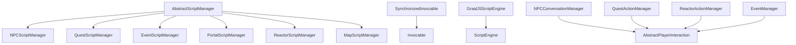
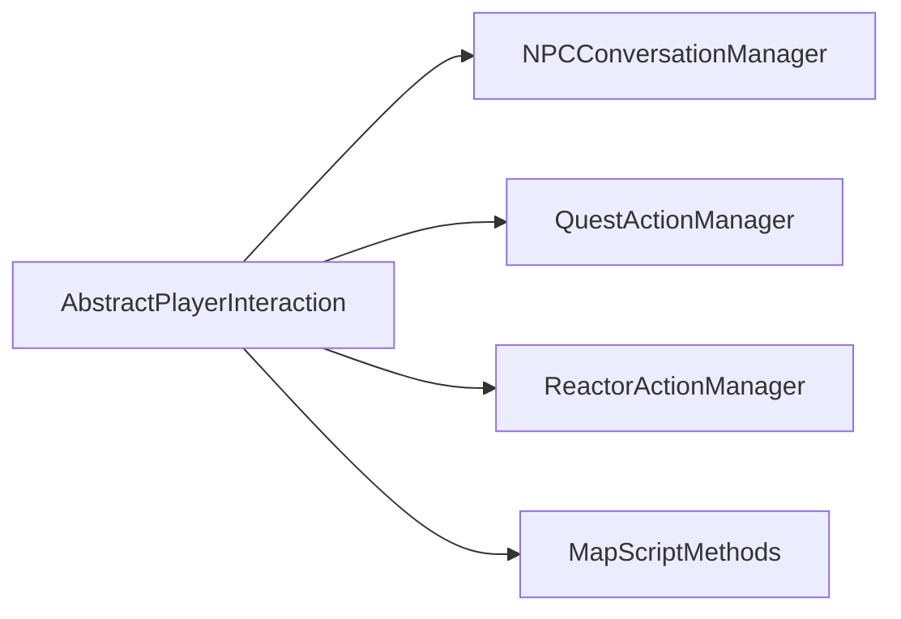
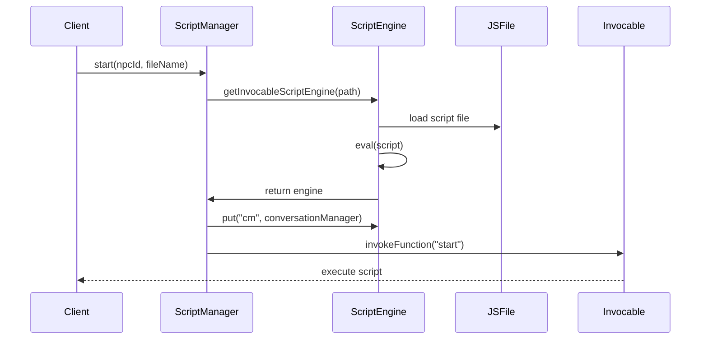
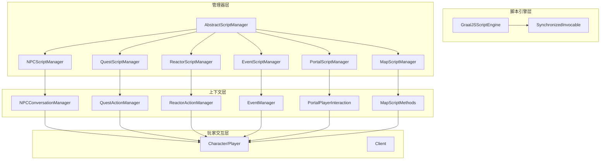
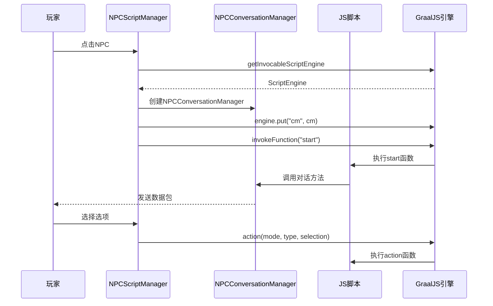

# 脚本系统模块

## 1. 概述

脚本系统是 MapleStory 模拟器的核心模块之一，负责在服务器运行时动态执行游戏逻辑脚本。通过脚本系统，开发者可以在不修改核心代码的情况下，灵活地定义 NPC 对话、任务流程、地图事件、传送门行为和反应器（Reactor）交互等游戏内容。

本游戏服务器使用 **GraalVM JavaScript** 作为脚本引擎，通过 **javax.script** API 与 Java 代码进行交互，实现脚本与服务器端的无缝集成。

## 2. GraalVM JS 集成

### 2.1 依赖配置

项目在 `pom.xml` 中引入了 GraalVM JS 相关依赖：

```xml
<!-- Scripting -->
<dependency>
    <groupId>org.graalvm.js</groupId>
    <artifactId>js</artifactId>
    <version>${graalvm-js.version}</version>
</dependency>
<dependency>
    <groupId>org.graalvm.js</groupId>
    <artifactId>js-scriptengine</artifactId>
    <version>${graalvm-js-scriptengine.version}</version>
</dependency>
```

版本信息：
- `graalvm-js.version`: 23.0.4
- `graalvm-js-scriptengine.version`: 24.0.1

### 2.2 引擎初始化

脚本引擎通过 `ScriptEngineManager` 获取 GraalJS 引擎实例：

```java
// AbstractScriptManager.java
sef = new ScriptEngineManager().getEngineByName("graal.js").getFactory();
```

### 2.3 主机访问权限

为允许脚本调用 Java 类和方法，需要启用 Polyglot 主机访问权限：

```java
private void enableScriptHostAccess(GraalJSScriptEngine engine) {
    Bindings bindings = engine.getBindings(ScriptContext.ENGINE_SCOPE);
    bindings.put("polyglot.js.allowHostAccess", true);
    bindings.put("polyglot.js.allowHostClassLookup", true);
}
```

## 3. 脚本引擎架构

### 3.1 核心类图



### 3.2 类说明

| 类名 | 职责 |
|------|------|
| `AbstractScriptManager` | 所有脚本管理器的基类，负责脚本引擎的加载和初始化 |
| `SynchronizedInvocable` | 线程安全的 Invocable 包装器，用于 GraalVM 的并发访问控制 |
| `NPCScriptManager` | 管理 NPC 对话脚本的执行 |
| `QuestScriptManager` | 管理任务脚本的开始、结束和RaiseOpen |
| `EventScriptManager` | 管理频道事件的脚本执行和生命周期 |
| `PortalScriptManager` | 管理传送门脚本的执行 |
| `ReactorScriptManager` | 管理反应器的 hit、act、touch、untouch 事件 |
| `MapScriptManager` | 管理地图进入脚本 |

## 4. 脚本管理机制

### 4.1 脚本文件组织

```
scripts/
├── npc/           # NPC 对话脚本
├── quest/         # 任务脚本
├── event/         # 事件脚本
├── portal/        # 传送门脚本
├── reactor/       # 反应器脚本
├── map/           # 地图脚本
├── item/          # 物品脚本
└── BeiDouSpecial/ # 特殊北斗脚本
```

### 4.2 多语言支持

系统支持按语言加载不同的脚本文件夹，优先级顺序为：
1. `scripts-{language}/` (如 `scripts-zh-CN/`)
2. `scripts/`

```java
String scriptName = "scripts";
String scriptLangName = scriptName + "-" + serviceProperty.getLanguage();

Path scriptPath = Path.of(scriptName, path);
Path scriptLangPath = Path.of(scriptLangName, path);

Path actualPath;
if (Files.exists(scriptLangPath)) {
    actualPath = scriptLangPath;
} else if (Files.exists(scriptPath)) {
    actualPath = scriptPath;
}
```

### 4.3 脚本引擎缓存

每个客户端可以缓存自己的脚本引擎实例，避免重复加载：

```java
public ScriptEngine getInvocableScriptEngine(String path, Client c) {
    ScriptEngine engine = c.getScriptEngine("scripts/" + path);
    if (engine == null) {
        engine = getInvocableScriptEngine(path);
        c.setScriptEngine(path, engine);
    }
    return engine;
}
```

## 5. 脚本执行上下文

### 5.1 NPC 脚本上下文 (cm)

`NPCConversationManager` 提供给 NPC 脚本使用，主要方法：

**对话方法：**
- `sendNext(text)` - 显示带"下一步"按钮的对话框
- `sendPrev(text)` - 显示带"上一步"按钮的对话框
- `sendNextPrev(text)` - 显示带"上一步"和"下一步"按钮的对话框
- `sendOk(text)` - 显示带"确定"按钮的对话框
- `sendYesNo(text)` - 显示是/否选择对话框
- `sendAcceptDecline(text)` - 显示接受/拒绝对话框
- `sendSimple(text)` - 显示选项列表对话框
- `sendGetNumber(text, def, min, max)` - 获取数字输入
- `sendGetText(text)` - 获取文本输入
- `sendStyle(text, styles)` - 显示样式选择对话框

**玩家数据操作：**
- `getPlayer()` - 获取当前玩家对象
- `getNpc()` - 获取 NPC ID
- `getMeso()` / `gainMeso(amount)` - 金币操作
- `gainExp(amount)` - 经验值操作
- `changeJob(job)` - 转职
- `setHair(id)` / `setFace(id)` / `setSkin(color)` - 外观设置

**物品和任务：**
- `gainItem(itemId, quantity)` - 给予物品
- `hasItem(itemId, quantity)` - 检查物品
- `startQuest(questId)` / `completeQuest(questId)` - 任务操作
- `openShopNPC(shopId)` - 打开商店

### 5.2 任务脚本上下文 (qm)

`QuestActionManager` 提供给任务脚本使用：

- `sendNext(text)` - 显示下一对话
- `forceStartQuest()` / `forceCompleteQuest()` - 强制开始/完成任务
- `startQuest()` / `completeQuest()` - 正常开始/完成任务
- `getJob()` - 获取当前职业
- `gainReward()` - 获取任务奖励

### 5.3 反应器脚本上下文 (rm)

`ReactorActionManager` 提供给反应器脚本使用：

- `spawnMonster(monsterId)` - 生成怪物
- `spawnMonster(monsterId, x, y)` - 在指定位置生成怪物
- `dropItem(itemId, meso, x, y)` - 掉落物品

### 5.4 事件脚本上下文 (em)

`EventManager` 提供给事件脚本使用：

- `getChannel()` - 获取所在频道
- `getMap(mapId)` - 获取指定地图
- `getPlayer()` - 获取玩家对象
- `schedule(callback, delay)` - 延迟执行
- `registerPlayer(player)` - 注册玩家到事件

## 6. 脚本 API 暴露

### 6.1 对话管理器继承关系



### 6.2 AbstractPlayerInteraction 通用 API

所有对话管理器继承自 `AbstractPlayerInteraction`，提供通用操作：

- `warp(mapId)` / `warp(mapId, portal)` - 传送玩家
- `getPlayer()` - 获取玩家对象
- `getClient()` - 获取客户端连接
- `hasItem(itemId)` / `hasItem(itemId, quantity)` - 检查物品
- `gainItem(itemId, quantity)` - 给予物品
- `removeItem(itemId)` - 移除物品
- `getInventory(invType)` - 获取背包
- `startQuest(questId)` / `completeQuest(questId)` - 任务操作
- `getMap() ` - 获取当前地图

## 7. 脚本加载和编译

### 7.1 加载流程



### 7.2 脚本初始化代码

```java
protected ScriptEngine getInvocableScriptEngine(String path) {
    Path actualPath = resolveScriptPath(path);
    if (actualPath == null) {
        return null;
    }
    
    ScriptEngine engine = sef.getScriptEngine();
    GraalJSScriptEngine graalScriptEngine = (GraalJSScriptEngine) engine;
    enableScriptHostAccess(graalScriptEngine);
    
    try (BufferedReader br = Files.newBufferedReader(actualPath, StandardCharsets.UTF_8)) {
        engine.eval(br);
    } catch (final ScriptException | IOException t) {
        log.warn("Error loading script: {}", path, t);
        return null;
    }
    
    return graalScriptEngine;
}
```

## 8. 常见脚本示例

### 8.1 NPC 脚本模板

```javascript
var status;

function start() {
    status = -1;
    action(1, 0, 0);
}

function action(mode, type, selection) {
    if (mode == -1) {
        cm.dispose();
    } else {
        if (mode == 0 && type > 0) {
            cm.dispose();
            return;
        }
        if (mode == 1) {
            status++;
        } else {
            status--;
        }

        if (status == 0) {
            cm.sendOk("您好，我是示例NPC。");
            cm.dispose();
        }
    }
}
```

### 8.2 任务脚本模板

```javascript
var status = -1;

function start(mode, type, selection) {
    if (mode == -1) {
        qm.dispose();
    } else {
        if (mode == 0 && type > 0) {
            qm.dispose();
            return;
        }

        if (mode == 1) {
            status++;
        } else {
            status--;
        }

        if (status == 0) {
            qm.sendNext("欢迎接受这个任务。");
        } else if (status == 1) {
            qm.forceStartQuest();
            qm.dispose();
        }
    }
}

function end(mode, type, selection) {
    // 类似 start 函数的结构
    // 用于任务完成时的对话
}
```

### 8.3 反应器脚本示例

```javascript
function hit() {
    // 玩家首次击中反应器时调用
}

function act() {
    // 每次反应器动作时调用
    rm.spawnMonster(100); // 生成怪物
}

function touch() {
    // 玩家接触反应器时调用
}

function untouch() {
    // 玩家离开反应器时调用
}
```

### 8.4 传送门脚本示例

```javascript
// PortalScript 接口实现
function enter(player) {
    if (player.getLevel() >= 30) {
        player.warp(100000000); // 前往射手村
        return true;
    }
    player.dropMessage("等级不足30级无法使用此传送门。");
    return false;
}
```

## 9. 相关代码示例

### 9.1 获取脚本引擎

```java
// 获取带缓存的脚本引擎
ScriptEngine engine = getInvocableScriptEngine("npc/9000000.js", client);

// 获取不带缓存的脚本引擎
ScriptEngine engine = getInvocableScriptEngine("quest/1000.js");
```

### 9.2 调用脚本函数

```java
Invocable invocable = (Invocable) engine;

// 调用无参数函数
invocable.invokeFunction("start");

// 调用带参数的函数
invocable.invokeFunction("action", mode, type, selection);

// 调用对象方法
invocable.invokeMethod(object, "methodName", args);
```

### 9.3 脚本重置

```java
// 重置特定脚本的上下文
resetContext("npc/9000000.js", client);

// 重置所有脚本
client.getScriptEngines().clear();
```

### 9.4 线程安全的调用

对于事件脚本，使用 `SynchronizedInvocable` 保证线程安全：

```java
Invocable iv = SynchronizedInvocable.of((Invocable) engine);
```

## 10. Mermaid 架构图

### 10.1 整体架构



### 10.2 NPC 脚本执行流程



## 11. 附录

### 11.1 相关源文件

| 文件路径 | 说明 |
|----------|------|
| `src/main/java/org/gms/scripting/AbstractScriptManager.java` | 脚本管理器基类 |
| `src/main/java/org/gms/scripting/SynchronizedInvocable.java` | 线程安全调用包装器 |
| `src/main/java/org/gms/scripting/npc/NPCScriptManager.java` | NPC 脚本管理器 |
| `src/main/java/org/gms/scripting/npc/NPCConversationManager.java` | NPC 对话上下文 |
| `src/main/java/org/gms/scripting/quest/QuestScriptManager.java` | 任务脚本管理器 |
| `src/main/java/org/gms/scripting/event/EventScriptManager.java` | 事件脚本管理器 |
| `src/main/java/org/gms/scripting/portal/PortalScriptManager.java` | 传送门脚本管理器 |
| `src/main/java/org/gms/scripting/reactor/ReactorScriptManager.java` | 反应器脚本管理器 |
| `src/main/java/org/gms/scripting/map/MapScriptManager.java` | 地图脚本管理器 |
| `src/main/java/org/gms/scripting/item/ItemScriptManager.java` | 物品脚本管理器 |

### 11.2 脚本目录结构

```
项目根目录/
├── scripts/                    # 默认脚本目录
│   ├── npc/                   # NPC 脚本 (722 个)
│   ├── quest/                 # 任务脚本 (267 个)
│   ├── event/                 # 事件脚本 (110 个)
│   ├── portal/                # 传送门脚本 (463 个)
│   ├── reactor/               # 反应器脚本 (292 个)
│   ├── map/                   # 地图脚本 (91 个)
│   └── item/                  # 物品脚本
├── scripts-zh-CN/             # 中文脚本目录
│   ├── npc/                   # 中文 NPC 脚本
│   ├── quest/                 # 中文任务脚本
│   └── ...
└── scripts-en-US/            # 英文脚本目录 (可选)
```

### 11.3 配置参数

在 `ServiceProperty` 中配置服务器语言设置，系统自动选择对应语言的脚本文件夹。

### 11.4 注意事项

1. **线程安全**: EventScriptManager 使用 `SynchronizedInvocable` 保证线程安全
2. **脚本缓存**: 客户端脚本引擎会被缓存，避免重复加载
3. **错误处理**: 脚本执行异常会被捕获并记录，脚本上下文会被正确清理
4. **多语言**: 优先加载对应语言的脚本文件夹，找不到时回退到默认 `scripts/` 目录
