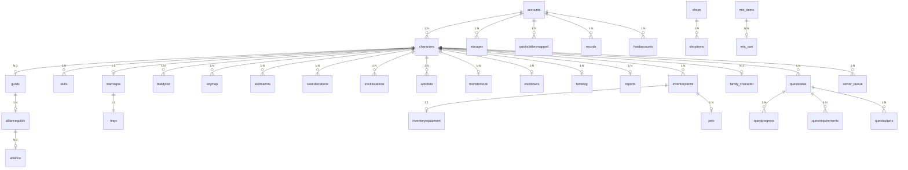
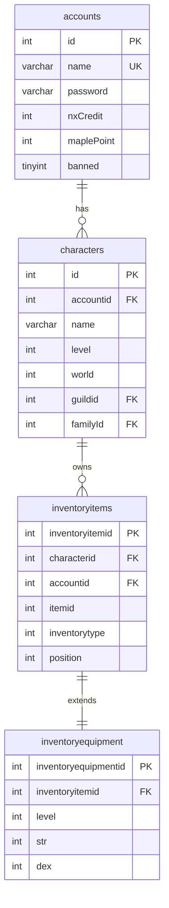
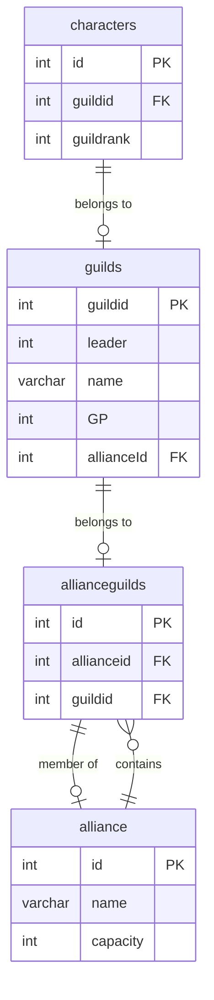
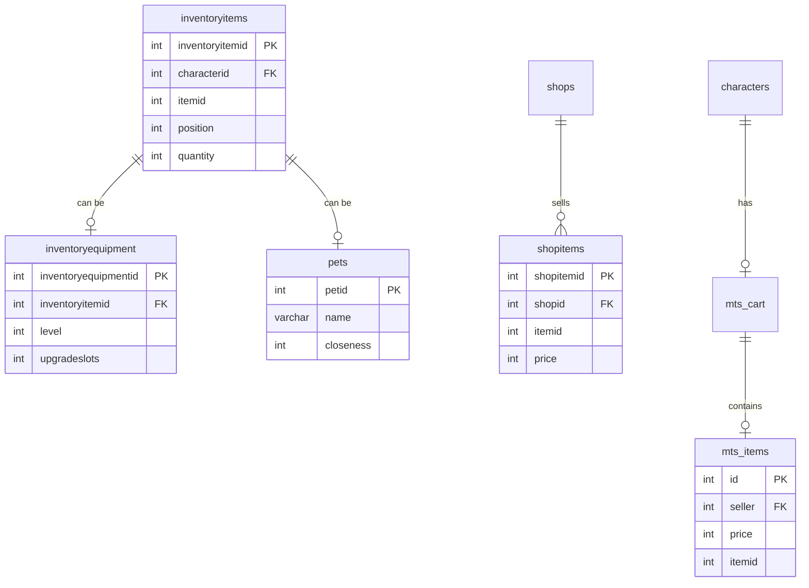
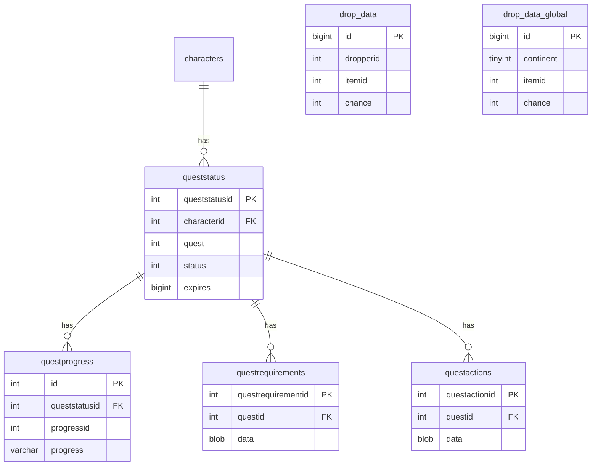

# 数据库架构

## 1. 数据库设计原则

### 1.1 架构概览

BeiDou-Server 采用 MySQL 8.0+ 作为主数据库，结合 Flyway 实现版本化管理，MyBatis-Flex 作为 ORM 框架，Druid 作为连接池。

```
┌─────────────────────────────────────────────────────────┐
│                    应用层 (Application)                  │
│  ┌─────────────────────────────────────────────────┐    │
│  │              MyBatis-Flex ORM 框架               │    │
│  └─────────────────────────────────────────────────┘    │
│                          │                              │
│  ┌─────────────────────────────────────────────────┐    │
│  │              Druid 连接池 (1.2.22)               │    │
│  └─────────────────────────────────────────────────┘    │
│                          │                              │
│  ┌─────────────────────────────────────────────────┐    │
│  │              MySQL 8.0+ 数据库                   │    │
│  └─────────────────────────────────────────────────┘    │
└─────────────────────────────────────────────────────────┘
```

### 1.2 设计规范

- **第三范式 (3NF)**: 减少数据冗余，保证数据完整性
- **表命名**: 使用小写下划线命名法，如 `character_items`
- **主键策略**: 优先使用自增主键 `AUTO_INCREMENT`
- **索引策略**: 针对高频查询字段建立索引
- **外键约束**: 关键关联表使用外键保证参照完整性
- **字符集**: 统一使用 `utf8mb4` 支持完整 Unicode

### 1.3 数据库配置

```yaml
# application.yml
mybatis-flex:
  datasource:
    mysql:
      type: com.alibaba.druid.pool.DruidDataSource
      driver-class-name: com.mysql.cj.jdbc.Driver
      url: jdbc:mysql://localhost:3306/beidou?useUnicode=true&characterEncoding=utf-8&useSSL=false&serverTimezone=Asia/Shanghai
      username: root
      password: root
      # 连接池配置
      initial-size: 5
      max-active: 100
      max-wait: 60000
      min-idle: 10

spring:
  flyway:
    validate-on-migrate: false
```

### 1.4 技术栈

| 组件 | 版本 | 说明 |
|------|------|------|
| MySQL | 8.4.0+ | 主数据库 |
| MyBatis-Flex | 1.8.9 | ORM 框架 |
| Druid | 1.2.22 | 连接池 |
| Flyway | 9.15.2 | 数据库版本管理 |

---

## 2. Flyway 版本管理

### 2.1 版本策略

BeiDou-Server 使用 Flyway 进行数据库版本管理，迁移脚本位于 `src/main/resources/db/migration/` 目录。

### 2.2 迁移文件清单

项目共包含 **93 个**数据库迁移脚本，按版本分类如下：

#### V1.0.x - 基础表结构 (1-49)

| 版本 | 文件名 | 功能说明 |
|------|--------|----------|
| V1.0.0 | `V1.0.0__create_accounts.sql` | 创建账号表 |
| V1.0.1 | `V1.0.1__create_alliance.sql` | 创建联盟表、联盟公会表 |
| V1.0.2 | `V1.0.2__create_area_info.sql` | 创建地图区域信息表 |
| V1.0.3 | `V1.0.3__create_bosslog.sql` | 创建Boss日志表（日/周） |
| V1.0.4 | `V1.0.4__create_bbs.sql` | 创建论坛帖子/回复表 |
| V1.0.5 | `V1.0.5__create_buddies.sql` | 创建好友列表表 |
| V1.0.6 | `V1.0.6__create_characters.sql` | 创建角色表 |
| V1.0.7 | `V1.0.7__create_cooldowns.sql` | 创建冷却时间表 |
| V1.0.8 | `V1.0.8__create_drop_data.sql` | 创建掉落数据表、全局掉落表 |
| V1.0.9 | `V1.0.9__create_dueyi.sql` | 创建杜伊快递表 |
| V1.0.10 | `V1.0.10__create_eventstats.sql` | 创建事件状态表 |
| V1.0.11 | `V1.0.11__create_famelog.sql` | 创建声望日志表 |
| V1.0.12 | `V1.0.12__create_family.sql` | 创建家族表、家族权限表 |
| V1.0.13 | `V1.0.13__create_fredstorage.sql` | 创建弗雷德仓库表 |
| V1.0.14 | `V1.0.14__create_gifts.sql` | 创建礼物表 |
| V1.0.15 | `V1.0.15__create_guilds.sql` | 创建公会表 |
| V1.0.16 | `V1.0.16__create_hwid.sql` | 创建HWID账号表、HWID封禁表 |
| V1.0.17 | `V1.0.17__create_inventory.sql` | 创建物品表、装备表、商人物品表 |
| V1.0.18 | `V1.0.18__create_ban.sql` | 创建IP封禁表、MAC封禁表、MAC过滤器表 |
| V1.0.19 | `V1.0.19__create_keymap.sql` | 创建快捷键映射表 |
| V1.0.20 | `V1.0.20__create_maker.sql` | 创建制造数据表（配方、试剂、奖励） |
| V1.0.21 | `V1.0.21__create_marriages.sql` | 创建婚姻表 |
| V1.0.22 | `V1.0.22__create_medalmaps.sql` | 创建奖章地图表 |
| V1.0.23 | `V1.0.23__create_monster.sql` | 创建怪物图鉴表、怪物卡片数据表 |
| V1.0.24 | `V1.0.24__create_mts.sql` | 创建拍卖行购物车表、拍卖行物品表 |
| V1.0.25 | `V1.0.25__create_namechanges.sql` | 创建改名记录表 |
| V1.0.26 | `V1.0.26__create_newyear.sql` | 创建新年贺卡表 |
| V1.0.27 | `V1.0.27__create_notes.sql` | 创建备忘录表 |
| V1.0.28 | `V1.0.28__create_nx.sql` | 创建NX码表、NX码物品表、NX优惠券表 |
| V1.0.29 | `V1.0.29__create_pets.sql` | 创建宠物表、宠物忽略表 |
| V1.0.30 | `V1.0.30__create_playerdiseases.sql` | 创建玩家异常状态表 |
| V1.0.31 | `V1.0.31__create_playernpcs.sql` | 创建玩家NPC表、玩家NPC装备表、玩家NPC位置表 |
| V1.0.32 | `V1.0.32__create_plife.sql` | 创建玩家生命表（地图生命物） |
| V1.0.33 | `V1.0.33__create_quest.sql` | 创建任务状态表、任务进度表、任务需求表、任务动作表 |
| V1.0.34 | `V1.0.34__create_quickslotkeymapped.sql` | 创建快捷栏映射表 |
| V1.0.35 | `V1.0.35__create_reactordrops.sql` | 创建反应堆掉落表 |
| V1.0.36 | `V1.0.36__create_reports.sql` | 创建举报记录表 |
| V1.0.37 | `V1.0.37__create_responses.sql` | 创建响应表 |
| V1.0.38 | `V1.0.38__create_rings.sql` | 创建戒指表 |
| V1.0.39 | `V1.0.39__create_savedlocations.sql` | 创建保存位置表 |
| V1.0.40 | `V1.0.40__create_server_queue.sql` | 创建服务器队列表 |
| V1.0.41 | `V1.0.41__create_shopitems.sql` | 创建商店物品表 |
| V1.0.42 | `V1.0.42__create_shops.sql` | 创建商店表 |
| V1.0.43 | `V1.0.43__create_skill.sql` | 创建技能表、技能宏表 |
| V1.0.44 | `V1.0.44__create_specialcashitems.sql` | 创建特殊现金物品表 |
| V1.0.45 | `V1.0.45__create_storages.sql` | 创建仓库表 |
| V1.0.46 | `V1.0.46__create_trocklocations.sql` | 创建瞬移地图表 |
| V1.0.47 | `V1.0.47__create_wishlists.sql` | 创建心愿单表 |
| V1.0.48 | `V1.0.48__create_worldtransfers.sql` | 创建世界转移表 |
| V1.0.49 | `V1.0.49__some_alter.sql` | 添加外键约束 |

#### V1.0.x - 数据初始化 (50-66)

| 版本 | 文件名 | 功能说明 |
|------|--------|----------|
| V1.0.50 | `V1.0.50__drop_data_global_insert_old_data.sql` | 初始化全局掉落数据 |
| V1.0.51 | `V1.0.51__drop_data_insert_old_data.sql` | 批量插入掉落数据（约36000+行） |
| V1.0.52 | `V1.0.52__monstercarddata_insert_data.sql` | 插入怪物卡片数据 |
| V1.0.53 | `V1.0.53__maker_insert_data.sql` | 插入制造数据 |
| V1.0.54 | `V1.0.54__nxcoupons_insert_data.sql` | 插入NX优惠券数据 |
| V1.0.55 | `V1.0.55__shopitems_insert_data.sql` | 插入商店物品数据 |
| V1.0.56 | `V1.0.56__shops_insert_data.sql` | 插入商店数据 |
| V1.0.57 | `V1.0.57__specialcashitems_insert_data.sql` | 插入特殊现金物品数据 |
| V1.0.58 | `V1.0.58__reactordrops_insert_data.sql` | 插入反应堆掉落数据 |
| V1.0.59 | `V1.0.59__reactordrops_update_quest_reactor_items.sql` | 更新任务反应堆物品 |
| V1.0.60-64 | `V1.0.60-64__reactordrops_*.sql` | 更新各副本奖励盒子 |
| V1.0.65 | `V1.0.65__reactordrops_delete_all_unused_content.sql` | 删除未使用内容 |
| V1.0.66 | `V1.0.66__shopupdate.sql` | 更新商店数据 |

#### V1.1.x - 安全增强 (67-68)

| 版本 | 文件名 | 功能说明 |
|------|--------|----------|
| V1.1.1 | `V1.1.1__update_admin_account.sql` | 更新管理员账号 |
| V1.1.2 | `V1.1.2__create_extend_value.sql` | 创建扩展值表 |
| V1.1.3 | `V1.1.3__create_modified_cash_item.sql` | 创建商城物品修改表 |

#### V1.3.x - 配置系统 (69-73)

| 版本 | 文件名 | 功能说明 |
|------|--------|----------|
| V1.3.0 | `V1.3.0__create_world_prop.sql` | 创建大区配置表 |
| V1.3.1 | `V1.3.1__create_server_prop.sql` | 创建服务器配置表 |
| V1.3.2 | `V1.3.2__create_hp_mp_alert.sql` | 创建血蓝警戒表 |
| V1.3.3 | `V1.3.3__create_gachapon.sql` | 创建转蛋表 |

#### V1.4.x - 转蛋系统 (74-78)

| 版本 | 文件名 | 功能说明 |
|------|--------|----------|
| V1.4.0 | `V1.4.0__create_gachapon_reward.sql` | 创建转蛋奖励表 |
| V1.4.1 | `V1.4.1__create_gachapon_reward_pool.sql` | 创建转蛋奖池表 |
| V1.4.2 | `V1.4.2__update_gachapon_pool_name.sql` | 更新转蛋奖池名称 |
| V1.4.3 | `V1.4.3__create_characterexplogs.sql` | 创建角色经验日志表 |

#### V1.5.x - 命令系统 (79-80)

| 版本 | 文件名 | 功能说明 |
|------|--------|----------|
| V1.5.1 | `V1.5.1__create_command_info.sql` | 创建命令信息表（含194条GM命令） |
| V1.5.2 | `V1.5.2__update_characterexplogs.sql` | 更新角色经验日志表 |

#### V1.7.x - 游戏配置 (81-85)

| 版本 | 文件名 | 功能说明 |
|------|--------|----------|
| V1.7.0 | `V1.7.0__create_game_config.sql` | 创建游戏配置表（含253条配置） |
| V1.7.1 | `V1.7.1__create_lang_resources.sql` | 创建语言资源表 |
| V1.7.2 | `V1.7.2__insert_shops.sql` | 插入商店初始数据 |
| V1.7.3 | `V1.7.3__insert_dongfangshenzhou_data.sql` | 插入东方神话数据（怪物掉落、商店） |

#### V1.8.x - 游戏配置更新 (86-92)

| 版本 | 文件名 | 功能说明 |
|------|--------|----------|
| V1.8.1 | `V1.8.1__insert_game_config_steal_quest_item.sql` | 插入偷窃任务物品配置 |
| V1.8.2-4 | `V1.8.2-4__insert_game_config_add_param.sql` | 添加游戏配置参数 |
| V1.8.5 | `V1.8.5__update_game_config_param.sql` | 更新游戏配置参数 |

#### V2.0.x - 高级配置 (93-95)

| 版本 | 文件名 | 功能说明 |
|------|--------|----------|
| V2.0.0 | `V2.0.0_insert_game_config_quest_complete_gain_max_hp.sql` | 任务完成增加HP配置 |
| V2.0.1 | `V2.0.1_insert_game_config_lock_level_.sql` | 锁定等级配置 |
| V2.0.2 | `V2.0.2_insert_game_config_rescue_same_map_slow_level.sql` | 同地图救援和慢速等级配置 |

---

## 3. 核心表结构

### 3.1 账号系统

#### accounts - 账号表

| 字段名 | 类型 | 说明 |
|--------|------|------|
| id | INT(11) | 主键 |
| name | VARCHAR(13) | 账号名，唯一 |
| password | VARCHAR(128) | 密码（BCrypt加密） |
| pin | VARCHAR(10) | PIN码 |
| pic | VARCHAR(26) | PIC码 |
| loggedin | TINYINT(4) | 登录状态 |
| lastlogin | TIMESTAMP | 最后登录时间 |
| createdat | TIMESTAMP | 创建时间 |
| birthday | DATE | 生日 |
| banned | TINYINT(1) | 封禁状态 |
| banreason | TEXT | 封禁原因 |
| macs | TINYTEXT | MAC地址列表 |
| nxCredit | INT(11) | NX点数 |
| maplePoint | INT(11) | 枫叶点数 |
| nxPrepaid | INT(11) | 预付NX |
| characterslots | TINYINT(2) | 角色栏位数 |
| gender | TINYINT(2) | 性别 |
| tempban | TIMESTAMP | 临时封禁时间 |
| greason | TINYINT(4) | 封禁原因编号 |
| tos | TINYINT(1) | 服务条款同意 |
| webadmin | INT(1) | Web管理级别 |
| nick | VARCHAR(20) | 昵称 |
| mute | INT(1) | 禁言状态 |
| email | VARCHAR(45) | 邮箱 |
| ip | TEXT | IP地址 |
| rewardpoints | INT(11) | 奖励点数 |
| votepoints | INT(11) | 投票点数 |
| hwid | VARCHAR(12) | 硬件ID |
| language | INT(1) | 语言设置 |

**索引**: `name` (唯一索引), `ranking1` (id, banned), 联合索引

#### hwidaccounts - HWID账号关联表

| 字段名 | 类型 | 说明 |
|--------|------|------|
| accountid | INT(11) | 账号ID（主键） |
| hwid | VARCHAR(40) | 硬件ID（主键） |
| relevance | TINYINT(2) | 关联类型 |
| expiresat | TIMESTAMP | 过期时间 |

#### hwidbans - HWID封禁表

| 字段名 | 类型 | 说明 |
|--------|------|------|
| hwidbanid | INT(10) | 主键 |
| hwid | VARCHAR(30) | 硬件ID（唯一） |

#### ipbans - IP封禁表

| 字段名 | 类型 | 说明 |
|--------|------|------|
| ipbanid | INT(10) | 主键 |
| ip | VARCHAR(40) | IP地址 |
| aid | VARCHAR(40) | 账号ID |

#### macbans - MAC封禁表

| 字段名 | 类型 | 说明 |
|--------|------|------|
| macbanid | INT(10) | 主键 |
| mac | VARCHAR(30) | MAC地址（唯一） |
| aid | VARCHAR(40) | 账号ID |

### 3.2 角色系统

#### characters - 角色表

| 字段名 | 类型 | 说明 |
|--------|------|------|
| id | INT(11) | 主键 |
| accountid | INT(11) | 账号ID |
| world | INT(11) | 世界/大区ID |
| name | VARCHAR(13) | 角色名 |
| level | INT(11) | 等级 |
| exp | INT(11) | 经验值 |
| str | INT(11) | 力量 |
| dex | INT(11) | 敏捷 |
| int | INT(11) | 智力 |
| luk | INT(11) | 运气 |
| hp | INT(11) | 当前HP |
| mp | INT(11) | 当前MP |
| maxhp | INT(11) | 最大HP |
| maxmp | INT(11) | 最大MP |
| meso | INT(11) | 金币 |
| job | INT(11) | 职业 |
| skincolor | INT(11) | 肤色 |
| gender | INT(11) | 性别 |
| fame | INT(11) | 人气 |
| hair | INT(11) | 发型 |
| face | INT(11) | 脸型 |
| ap | INT(11) | 可分配属性点 |
| sp | VARCHAR(128) | 可分配技能点 |
| map | INT(11) | 当前地图 |
| spawnpoint | INT(11) | 出生点 |
| gm | TINYINT(1) | GM等级 |
| party | INT(11) | 组队ID |
| guildid | INT(10) | 公会ID |
| guildrank | INT(10) | 公会职位 |
| familyId | INT(11) | 家族ID |
| monsterbookcover | INT(11) | 怪物图鉴封面 |
| ... | ... | ...（更多字段） |

**索引**: `accountid`, `party`, `ranking1` (level, exp), `ranking2` (gm, job)

### 3.3 物品系统

#### inventoryitems - 背包物品表

| 字段名 | 类型 | 说明 |
|--------|------|------|
| inventoryitemid | INT(10) | 主键 |
| type | TINYINT(3) | 类型 |
| characterid | INT(11) | 角色ID |
| accountid | INT(11) | 账号ID |
| itemid | INT(11) | 物品ID |
| inventorytype | INT(11) | 背包类型 |
| position | INT(11) | 位置 |
| quantity | INT(11) | 数量 |
| owner | TINYTEXT | 所有者 |
| petid | INT(11) | 宠物ID |
| flag | INT(11) | 标志 |
| expiration | BIGINT(20) | 过期时间 |
| giftFrom | VARCHAR(26) | 赠送者 |

**索引**: `CHARID` (characterid)

#### inventoryequipment - 装备表

| 字段名 | 类型 | 说明 |
|--------|------|------|
| inventoryequipmentid | INT(10) | 主键 |
| inventoryitemid | INT(10) | 物品ID（外键） |
| upgradeslots | INT(11) | 升级次数 |
| level | INT(11) | 强化等级 |
| str/dex/int/luk | INT(11) | 四维属性 |
| hp/mp | INT(11) | HP/MP加成 |
| watk/matk | INT(11) | 攻击/魔法攻击 |
| wdef/mdef | INT(11) | 防御 |
| acc/avoid | INT(11) | 命中/回避 |
| speed/jump | INT(11) | 移动/跳跃速度 |
| locked | INT(11) | 锁定状态 |
| vicious | INT(11) | 恶意值 |
| itemlevel | INT(11) | 装备等级 |
| itemexp | INT(11) | 装备经验 |

**索引**: `INVENTORYITEMID` (外键)

### 3.4 技能系统

#### skills - 角色技能表

| 字段名 | 类型 | 说明 |
|--------|------|------|
| id | INT(11) | 主键 |
| skillid | INT(11) | 技能ID |
| characterid | INT(11) | 角色ID（外键） |
| skilllevel | INT(11) | 技能等级 |
| masterlevel | INT(11) |  mastery level |
| expiration | BIGINT(20) | 过期时间 |

**索引**: `skillpair` (skillid, characterid) 唯一索引

**外键约束**: `skills_chrid_fk` → `characters(id)` ON DELETE CASCADE

#### skillmacros - 技能宏表

| 字段名 | 类型 | 说明 |
|--------|------|------|
| id | INT(11) | 主键 |
| characterid | INT(11) | 角色ID |
| position | TINYINT(1) | 位置 |
| skill1/skill2/skill3 | INT(11) | 技能ID |
| name | VARCHAR(13) | 宏名称 |
| shout | TINYINT(1) | 喊话标志 |

#### keymap - 快捷键映射表

| 字段名 | 类型 | 说明 |
|--------|------|------|
| id | INT(11) | 主键 |
| characterid | INT(11) | 角色ID |
| key | INT(11) | 键位 |
| type | INT(11) | 类型 |
| action | INT(11) | 操作 |

### 3.5 任务系统

#### queststatus - 任务状态表

| 字段名 | 类型 | 说明 |
|--------|------|------|
| queststatusid | INT(10) | 主键 |
| characterid | INT(11) | 角色ID |
| quest | INT(11) | 任务ID |
| status | INT(11) | 状态 |
| time | INT(11) | 时间 |
| expires | BIGINT(20) | 过期时间 |
| forfeited | INT(11) | 放弃次数 |
| completed | INT(11) | 完成次数 |
| info | TINYINT(3) | 信息 |

#### questprogress - 任务进度表

| 字段名 | 类型 | 说明 |
|--------|------|------|
| id | INT(10) | 主键 |
| characterid | INT(11) | 角色ID |
| queststatusid | INT(10) | 任务状态ID |
| progressid | INT(11) | 进度ID |
| progress | VARCHAR(15) | 进度内容 |

### 3.6 公会/联盟系统

#### guilds - 公会表

| 字段名 | 类型 | 说明 |
|--------|------|------|
| guildid | INT(10) | 主键 |
| leader | INT(10) | 会长ID |
| GP | INT(10) | 公会积分 |
| name | VARCHAR(45) | 公会名 |
| rank1-5title | VARCHAR(45) | 职位名称 |
| capacity | INT(10) | 容量 |
| notice | VARCHAR(101) | 公告 |
| allianceId | INT(11) | 联盟ID |

**索引**: `guildid, name`

#### alliance - 联盟表

| 字段名 | 类型 | 说明 |
|--------|------|------|
| id | INT(10) | 主键 |
| name | VARCHAR(13) | 联盟名 |
| capacity | INT(10) | 容量 |
| rank1-5 | VARCHAR(11) | 职位名称 |

#### allianceguilds - 联盟公会表

| 字段名 | 类型 | 说明 |
|--------|------|------|
| id | INT(10) | 主键 |
| allianceid | INT(10) | 联盟ID |
| guildid | INT(10) | 公会ID |

### 3.7 家族系统

#### family_character - 家族角色表

| 字段名 | 类型 | 说明 |
|--------|------|------|
| cid | INT(11) | 角色ID（主键） |
| familyid | INT(11) | 家族ID |
| seniorid | INT(11) | 前辈ID |
| reputation | INT(11) | 声望 |
| todaysrep | INT(11) | 今日声望 |
| totalreputation | INT(11) | 总声望 |
| reptosenior | INT(11) | 贡献给前辈 |
| lastresettime | BIGINT(20) | 重置时间 |

**索引**: `cid, familyid`

**外键约束**: `family_character_ibfk_1` → `characters(id)` ON DELETE CASCADE

### 3.8 社交系统

#### buddies - 好友列表表

| 字段名 | 类型 | 说明 |
|--------|------|------|
| id | INT(11) | 主键 |
| characterid | INT(11) | 角色ID |
| buddyid | INT(11) | 好友ID |
| pending | TINYINT(4) | 待确认 |
| group | VARCHAR(17) | 分组 |

#### marriages - 婚姻表

| 字段名 | 类型 | 说明 |
|--------|------|------|
| marriageid | INT(10) | 主键 |
| husbandid | INT(10) | 丈夫ID |
| wifeid | INT(10) | 妻子ID |

#### rings - 戒指表

| 字段名 | 类型 | 说明 |
|--------|------|------|
| id | INT(11) | 主键 |
| partnerRingId | INT(11) | 伴侣戒指ID |
| partnerChrId | INT(11) | 伴侣角色ID |
| itemid | INT(11) | 物品ID |
| partnername | VARCHAR(255) | 伴侣名称 |

### 3.9 交易系统

#### shops - 商店表

| 字段名 | 类型 | 说明 |
|--------|------|------|
| shopid | INT(10) | 主键 |
| npcid | INT(11) | NPC ID |

#### shopitems - 商店物品表

| 字段名 | 类型 | 说明 |
|--------|------|------|
| shopitemid | INT(10) | 主键 |
| shopid | INT(10) | 商店ID |
| itemid | INT(11) | 物品ID |
| price | INT(11) | 价格 |
| pitch | INT(11) | 税后价格 |
| position | INT(11) | 排序位置 |

#### mts_items - 拍卖行物品表

| 字段名 | 类型 | 说明 |
|--------|------|------|
| id | INT(10) | 主键 |
| tab | INT(11) | 标签页 |
| itemid | INT(10) | 物品ID |
| quantity | INT(11) | 数量 |
| seller | INT(11) | 卖家ID |
| price | INT(11) | 价格 |
| ... | ... | ...（更多字段） |

### 3.10 配置表

#### game_config - 游戏配置表

| 字段名 | 类型 | 说明 |
|--------|------|------|
| id | BIGINT | 主键 |
| config_type | VARCHAR(32) | 配置类型 |
| config_sub_type | VARCHAR(32) | 配置子类型 |
| config_clazz | VARCHAR(256) | Java类型 |
| config_code | VARCHAR(64) | 配置编码 |
| config_value | VARCHAR(256) | 配置值 |
| config_desc | VARCHAR(512) | 配置描述 |
| update_time | TIMESTAMP | 更新时间 |

**配置分类**:
- `world`: 大区配置（经验倍率、掉落倍率等）
- `server/Core`: 服务器核心配置
- `server/Game Mechanics`: 游戏机制配置
- `server/Safe`: 安全配置
- `server/Net`: 网络配置
- `server/Debug`: 调试配置
- `server/GM`: GM配置

#### world_prop - 大区配置表

| 字段名 | 类型 | 说明 |
|--------|------|------|
| id | BIGINT | 大区ID |
| flag | TINYINT | 大区标志 |
| server_message | VARCHAR(255) | 滚动消息 |
| exp_rate | DECIMAL(40,3) | 经验倍率 |
| meso_rate | DECIMAL(40,3) | 金币倍率 |
| drop_rate | DECIMAL(40,3) | 掉落倍率 |
| boss_drop_rate | DECIMAL(40,3) | BOSS掉落倍率 |
| quest_rate | DECIMAL(40,3) | 任务倍率 |
| ... | ... | ... |

#### command_info - GM命令表

| 字段名 | 类型 | 说明 |
|--------|------|------|
| id | INT | 主键 |
| syntax | VARCHAR(30) | 命令语法 |
| level | INT | 命令等级（0-6） |
| enabled | TINYINT(1) | 是否启用 |
| clazz | VARCHAR(50) | 后端Java类名 |
| default_level | INT | 默认命令等级 |

**命令等级说明**:
- 0: 普通玩家
- 1: 初级GM
- 2: 中级GM
- 3: 高级GM
- 4: 资深GM
- 5: 管理员
- 6: 超级管理员

---

## 4. ER 关联关系图

### 4.1 核心实体关系



### 4.2 账号-角色关系图



### 4.3 公会联盟关系图



### 4.4 物品交易关系图



### 4.5 任务系统关系图



---

## 5. 索引策略与优化

### 5.1 索引分类

#### 主键索引 (Primary Key)
- `accounts.id` - 自增主键
- `characters.id` - 自增主键
- `inventoryitems.inventoryitemid` - 自增主键
- `skills.id` - 自增主键

#### 唯一索引 (Unique Key)
- `accounts.name` - 账号唯一登录名
- `drop_data(dropperid, itemid)` - 怪物掉落唯一组合
- `skills(skillid, characterid)` - 角色技能唯一组合
- `macbans.mac` - MAC地址唯一
- `hwidbans.hwid` - HWID唯一

#### 普通索引 (Index/Key)
- `characters.accountid` - 按账号查询角色
- `characters.party` - 按队伍查询
- `characters(level, exp)` - 等级排名
- `characters(gm, job)` - GM和职业筛选
- `inventoryitems.characterid` - 角色物品查询
- `famelog.characterid` - 声望日志查询

#### 联合索引
- `accounts(id, banned)` - 账号状态查询
- `accounts(id, nxCredit, maplePoint, nxPrepaid)` - 账号资产查询
- `characters(id, accountid, world)` - 角色多条件查询
- `characters(id, accountid, name)` - 角色名称查询
- `drop_data(dropperid, itemid)` - 掉落查询

### 5.2 高频查询优化

#### 角色登录查询
```sql
-- 优化：使用 accountid 索引快速定位角色列表
SELECT * FROM characters WHERE accountid = ? ORDER BY level DESC;
```

#### 物品查询
```sql
-- 优化：characterid 索引加速物品加载
SELECT * FROM inventoryitems WHERE characterid = ? AND inventorytype = ?;
```

#### 技能查询
```sql
-- 优化：唯一索引 skillpair 直接定位
SELECT * FROM skills WHERE characterid = ? AND skillid = ?;
```

#### 掉落数据查询
```sql
-- 优化：dropperid 索引加速怪物掉落查询
SELECT * FROM drop_data WHERE dropperid = ? ORDER BY chance DESC;
```

### 5.3 性能注意事项

#### 避免全表扫描
- 确保所有 WHERE 条件字段有索引
- 使用 EXPLAIN 分析查询计划
- 避免在索引列上使用函数

#### 分页优化
```sql
-- 优化：使用延迟关联
SELECT c.*, i.*
FROM characters c
INNER JOIN (SELECT id FROM characters ORDER BY level DESC LIMIT 100000, 10) t
ON c.id = t.id;
```

#### 批量操作
- 使用 INSERT ... VALUES (...), (...), (...) 批量插入
- 避免循环内单条 INSERT

---

## 6. 外键约束与数据完整性

### 6.1 级联删除约束

| 源表 | 目标表 | 约束类型 | 说明 |
|------|--------|----------|------|
| characters | monsterbook | ON DELETE CASCADE | 删除角色时清除图鉴 |
| characters | skills | ON DELETE CASCADE | 删除角色时清除技能 |
| characters | famelog | ON DELETE CASCADE | 删除角色时清除声望日志 |
| characters | family_character | ON DELETE CASCADE | 删除角色时清除家族记录 |
| pets | petignores | ON DELETE CASCADE | 删除宠物时清除忽略列表 |
| accounts | quickslotkeymapped | ON DELETE CASCADE | 删除账号时清除快捷栏 |

### 6.2 外键约束脚本

```sql
-- V1.0.49__some_alter.sql

-- 杜伊快递外键
ALTER TABLE dueyitems
    ADD CONSTRAINT dueyitems_ibfk_1 
    FOREIGN KEY (PackageId) REFERENCES dueypackages (PackageId) ON DELETE CASCADE;

-- 声望日志外键
ALTER TABLE famelog
    ADD CONSTRAINT famelog_ibfk_1 
    FOREIGN KEY (characterid) REFERENCES characters (id) ON DELETE CASCADE;

-- 家族角色外键
ALTER TABLE family_character
    ADD CONSTRAINT family_character_ibfk_1 
    FOREIGN KEY (cid) REFERENCES characters (id) ON DELETE CASCADE;

-- 技能外键
ALTER TABLE skills
    ADD CONSTRAINT skills_chrid_fk 
    FOREIGN KEY (characterid) REFERENCES characters (id) ON DELETE CASCADE;

-- 宠物忽略外键
ALTER TABLE petignores
    ADD CONSTRAINT fk_petignorepetid 
    FOREIGN KEY (petid) REFERENCES pets (petid) ON DELETE CASCADE;

-- 快捷栏外键
ALTER TABLE quickslotkeymapped
    ADD CONSTRAINT quickslotkeymapped_accountid_fk 
    FOREIGN KEY (accountid) REFERENCES accounts (id) ON DELETE CASCADE;
```

### 6.3 数据一致性维护

- 事务内操作：涉及多表的业务逻辑使用事务包裹
- 延迟删除：使用逻辑删除标记代替物理删除
- 定期校验：使用定时任务检查数据一致性

---

## 7. 数据库维护

### 7.1 备份策略

| 备份类型 | 频率 | 说明 |
|----------|------|------|
| 全量备份 | 每日 | 完整数据库备份 |
| 增量备份 | 每小时 | 基于binlog的增量 |
| 表备份 | 每周 | 关键表单独备份 |

### 7.2 监控指标

| 指标 | 阈值 | 说明 |
|------|------|------|
| 连接数 | max_active | Druid连接池上限 |
| 查询耗时 | 100ms | 慢查询阈值 |
| 死锁 | 0 | 不允许死锁 |
| 表空间 | 80% | 告警阈值 |

### 7.3 常用维护SQL

```sql
-- 检查表状态
SHOW TABLE STATUS FROM beidou;

-- 分析表（更新统计信息）
ANALYZE TABLE characters;

-- 优化表（整理碎片）
OPTIMIZE TABLE inventoryitems;

-- 检查外键
SELECT * FROM information_schema.TABLE_CONSTRAINTS 
WHERE TABLE_SCHEMA = 'beidou' AND CONSTRAINT_TYPE = 'FOREIGN KEY';

-- 查看慢查询
SHOW FULL PROCESSLIST;
SELECT * FROM performance_schema.events_statements_summary_by_digest 
ORDER BY SUM_TIMER_WAIT DESC LIMIT 10;
```

---

## 8. 版本信息

| 项目 | 版本 | 说明 |
|------|------|------|
| MySQL | 8.4.0+ | 数据库版本 |
| MyBatis-Flex | 1.8.9 | ORM框架 |
| Druid | 1.2.22 | 连接池 |
| Flyway | 9.15.2 | 版本管理 |
| 迁移脚本 | V1.0.0 - V2.0.2 | 共93个脚本 |

### 文档版本

- **版本**: 1.0
- **创建日期**: 2026-03-26
- **最后更新**: 2026-03-26
- **文档作者**: create-docs-group-b

---

*文档版本: 1.0*
*最后更新: 2026-03-26*
