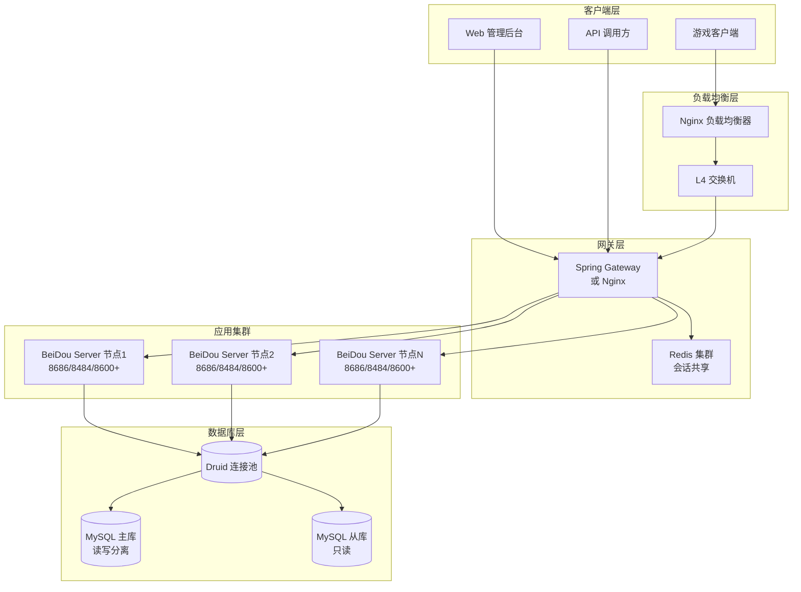
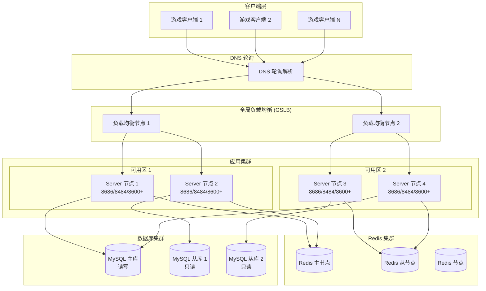
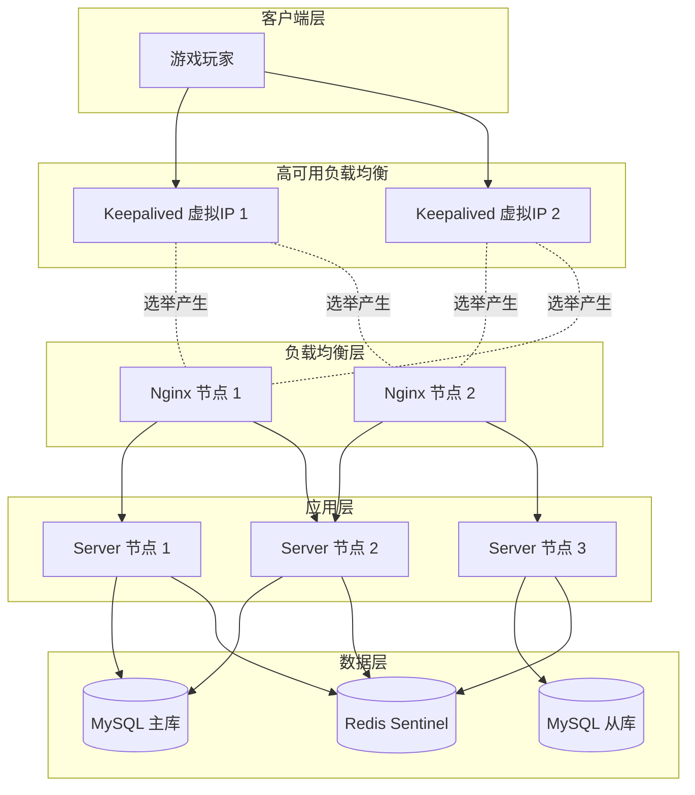

# 部署方案

## 1. 概述

本文档详细介绍 BeiDou-Server 生产环境的部署方案，涵盖单机部署、Docker 容器化部署、集群部署以及负载均衡配置。BeiDou-Server 是一个基于 Java 21、Spring Boot 3.2.3 和 Netty 4.1.109.Final 的 MapleStory 游戏服务器，采用多进程架构，包含 Web API 服务器、登录服务器和多个频道服务器。

### 1.1 部署架构图



### 1.2 服务器端口说明

| 端口 | 类型 | 说明 | 协议 |
|------|------|------|------|
| 8686 | TCP | Web API 服务端口 | HTTP/HTTPS |
| 8484 | TCP | 登录服务器端口 | TCP (自定义协议) |
| 8600+ | TCP | 频道服务器端口 | TCP (自定义协议) |

## 2. 单机部署

单机部署适用于小规模玩家（100 人以下），所有服务运行在同一台服务器上。

### 2.1 系统要求

| 组件 | 最低要求 | 推荐配置 |
|------|----------|----------|
| 操作系统 | Windows Server 2019 / Ubuntu 20.04+ | Windows Server 2022 / Ubuntu 22.04+ |
| CPU | 4 核 2.0GHz+ | 8 核 3.0GHz+ |
| 内存 | 8GB RAM | 16GB RAM+ |
| 硬盘 | 100GB SSD | 256GB SSD |
| 网络 | 100Mbps | 1Gbps |
| JDK | Java 21 | Java 21 |
| MySQL | 8.0+ | 8.4.0 |

### 2.2 部署步骤

#### 步骤 1: 安装依赖

```bash
# Ubuntu/Debian
sudo apt update
sudo apt install -y openjdk-21-jdk maven mysql-server

# CentOS/RHEL
sudo yum install -y java-21-openjdk-devel maven mysql-server
```

#### 步骤 2: 配置 MySQL

```bash
# 启动 MySQL
sudo systemctl start mysql
sudo systemctl enable mysql

# 安全配置
sudo mysql_secure_installation
```

创建数据库和用户：

```sql
CREATE DATABASE beidou DEFAULT CHARACTER SET utf8mb4 COLLATE utf8mb4_general_ci;
CREATE USER 'beidou'@'localhost' IDENTIFIED BY 'your_strong_password';
GRANT ALL PRIVILEGES ON beidou.* TO 'beidou'@'localhost';
GRANT SELECT ON performance_schema.user_variables_by_thread TO 'beidou'@'localhost';
GRANT SHOW VIEW ON mysql.* TO 'beidou'@'localhost';
FLUSH PRIVILEGES;
```

#### 步骤 3: 配置应用

创建生产环境配置文件 `src/main/resources/application-prod.yml`：

```yaml
server:
  port: 8686

mybatis-flex:
  datasource:
    mysql:
      type: com.alibaba.druid.pool.DruidDataSource
      driver-class-name: com.mysql.cj.jdbc.Driver
      url: jdbc:mysql://localhost:3306/beidou?useUnicode=true&characterEncoding=utf-8&useSSL=false&serverTimezone=Asia/Shanghai
      username: beidou
      password: ${DB_PASSWORD}
      initial-size: 10
      max-active: 100
      min-idle: 10
      max-wait: 60000

springdoc:
  api-docs:
    enabled: false
  swagger-ui:
    enabled: false

gms:
  service:
    language: zh-CN
    rate-limit:
      enabled: true
      limit: 10
      duration: 1000
      auto-ban: true
    wan-host: 你的公网IP
    lan-host: 192.168.1.100
    localhost: 127.0.0.1
    login-port: 8484
```

#### 步骤 4: 编译项目

```bash
# 清理并打包
mvn clean package -DskipTests

# 生成的可执行 JAR 文件位于 target/BeiDou.jar
```

#### 步骤 5: 配置 JVM 参数

创建启动脚本 `start.sh`：

```bash
#!/bin/bash

JAVA_OPTS="-Xms4G -Xmx8G"
JAVA_OPTS="$JAVA_OPTS -XX:+UseG1GC"
JAVA_OPTS="$JAVA_OPTS -XX:MaxGCPauseMillis=200"
JAVA_OPTS="$JAVA_OPTS -XX:+UseStringDeduplication"
JAVA_OPTS="$JAVA_OPTS -XX:+HeapDumpOnOutOfMemoryError"
JAVA_OPTS="$JAVA_OPTS -XX:HeapDumpPath=./logs/"
JAVA_OPTS="$JAVA_OPTS -Djava.security.egd=file:/dev/./urandom"

export DB_PASSWORD="your_strong_password"

nohup java $JAVA_OPTS -Dspring.config.location=application-prod.yml -jar BeiDou.jar > logs/beidou.log 2>&1 &

echo $! > beidou.pid
echo "BeiDou Server started with PID: $(cat beidou.pid)"
```

设置执行权限：

```bash
chmod +x start.sh
```

#### 步骤 6: 使用 Systemd 管理服务

创建服务文件 `/etc/systemd/system/beidou.service`：

```ini
[Unit]
Description=BeiDou Game Server
After=network.target mysql.service
Wants=mysql.service

[Service]
Type=simple
User=beidou
WorkingDirectory=/opt/beidou-server
Environment="DB_PASSWORD=your_strong_password"
ExecStart=/usr/bin/java -Xms4G -Xmx8G -XX:+UseG1GC -XX:MaxGCPauseMillis=200 -XX:+HeapDumpOnOutOfMemoryError -XX:HeapDumpPath=/opt/beidou-server/logs/ -Dspring.config.location=application-prod.yml -jar /opt/beidou-server/BeiDou.jar
Restart=on-failure
RestartSec=10
StandardOutput=append:/opt/beidou-server/logs/stdout.log
StandardError=append:/opt/beidou-server/logs/stderr.log

[Install]
WantedBy=multi-user.target
```

管理服务：

```bash
# 重载配置
sudo systemctl daemon-reload

# 启动服务
sudo systemctl start beidou

# 开机自启
sudo systemctl enable beidou

# 查看状态
sudo systemctl status beidou

# 查看日志
sudo journalctl -u beidou -f
```

## 3. Docker 部署

Docker 部署提供更好的隔离性和可移植性，适合中大规模部署。

### 3.1 Dockerfile

创建 `Dockerfile`：

```dockerfile
# 构建阶段
FROM maven:3.9-eclipse-temurin-21 AS builder

WORKDIR /build

COPY pom.xml .
COPY src ./src

RUN mvn clean package -DskipTests

# 运行阶段
FROM eclipse-temurin:21-jre-jammy

LABEL maintainer="BeiDou Team"
LABEL description="BeiDou Game Server"

WORKDIR /app

# 创建非 root 用户
RUN groupadd -r beidou && useradd -r -g beidou beidou

# 创建日志目录
RUN mkdir -p /app/logs && chown -R beidou:beidou /app

COPY --from=builder /build/target/BeiDou.jar /app/BeiDou.jar

EXPOSE 8686 8484 8600-8620

USER beidou

ENTRYPOINT ["java", "-Xms2G", "-Xmx4G", "-XX:+UseG1GC", "-jar", "BeiDou.jar"]
```

### 3.2 Docker Compose 配置

创建 `docker-compose.yml`：

```yaml
version: '3.8'

services:
  mysql:
    image: mysql:8.4.0
    container_name: beidou-mysql
    restart: unless-stopped
    environment:
      MYSQL_ROOT_PASSWORD: ${MYSQL_ROOT_PASSWORD}
      MYSQL_DATABASE: beidou
      MYSQL_USER: ${MYSQL_USER}
      MYSQL_PASSWORD: ${MYSQL_PASSWORD}
    ports:
      - "3306:3306"
    volumes:
      - mysql-data:/var/lib/mysql
      - ./mysql/conf.d:/etc/mysql/conf.d
    command:
      - --character-set-server=utf8mb4
      - --collation-server=utf8mb4_general_ci
      - --default-authentication-plugin=mysql_native_password
      - --max-connections=500
      - --innodb-buffer-pool-size=1G
    networks:
      - beidou-net
    healthcheck:
      test: ["CMD", "mysqladmin", "ping", "-h", "localhost"]
      interval: 10s
      timeout: 5s
      retries: 5

  redis:
    image: redis:7-alpine
    container_name: beidou-redis
    restart: unless-stopped
    ports:
      - "6379:6379"
    volumes:
      - redis-data:/data
    command: redis-server --appendonly yes
    networks:
      - beidou-net
    healthcheck:
      test: ["CMD", "redis-cli", "ping"]
      interval: 10s
      timeout: 5s
      retries: 5

  app:
    build:
      context: .
      dockerfile: Dockerfile
    container_name: beidou-server
    restart: unless-stopped
    depends_on:
      mysql:
        condition: service_healthy
      redis:
        condition: service_healthy
    ports:
      - "8686:8686"
      - "8484:8484"
      - "8600-8620:8600-8620"
    environment:
      - SPRING_PROFILES_ACTIVE=prod
      - DB_PASSWORD=${DB_PASSWORD}
      - REDIS_HOST=redis
      - REDIS_PORT=6379
    volumes:
      - ./logs:/app/logs
      - ./config:/app/config
    networks:
      - beidou-net
    mem_limit: 4g
    cpus: 2

  nginx:
    image: nginx:alpine
    container_name: beidou-nginx
    restart: unless-stopped
    ports:
      - "80:80"
      - "443:443"
    volumes:
      - ./nginx/nginx.conf:/etc/nginx/nginx.conf:ro
      - ./nginx/ssl:/etc/nginx/ssl:ro
    depends_on:
      - app
    networks:
      - beidou-net

networks:
  beidou-net:
    driver: bridge

volumes:
  mysql-data:
  redis-data:
```

### 3.3 环境变量文件

创建 `.env` 文件（不要提交到版本控制）：

```env
# MySQL 配置
MYSQL_ROOT_PASSWORD=your_root_password
MYSQL_USER=beidou
MYSQL_PASSWORD=your_db_password

# 应用配置
DB_PASSWORD=your_db_password
```

### 3.4 启动 Docker 服务

```bash
# 构建镜像
docker-compose build

# 启动所有服务
docker-compose up -d

# 查看服务状态
docker-compose ps

# 查看应用日志
docker-compose logs -f app

# 查看所有日志
docker-compose logs -f

# 停止服务
docker-compose down

# 重新构建并启动
docker-compose up -d --build
```

## 4. 集群部署

对于大规模部署（500+ 玩家），建议采用集群部署方案。

### 4.1 集群架构图



### 4.2 MySQL 数据库集群配置

#### 4.2.1 主从复制配置

主库 `my.cnf` 配置：

```ini
[mysqld]
server-id = 1
log-bin = mysql-bin
binlog-format = ROW
binlog-row-image = FULL
sync-binlog = 1
gtid-mode = ON
enforce-gtid-consistency = ON
max-connections = 500
innodb-buffer-pool-size = 4G
innodb-log-file-size = 1G
innodb-flush-log-at-trx-commit = 1
character-set-server = utf8mb4
collation-server = utf8mb4_general_ci
```

从库 `my.cnf` 配置：

```ini
[mysqld]
server-id = 2
log-bin = mysql-bin
binlog-format = ROW
binlog-row-image = FULL
relay-log = relay-bin
read-only = ON
gtid-mode = ON
enforce-gtid-consistency = ON
max-connections = 500
innodb-buffer-pool-size = 4G
character-set-server = utf8mb4
collation-server = utf8mb4_general_ci
```

#### 4.2.2 配置主从复制

```sql
-- 主库创建复制用户
CREATE USER 'repl'@'%' IDENTIFIED BY 'repl_password';
GRANT REPLICATION SLAVE ON *.* TO 'repl'@'%';
FLUSH PRIVILEGES;

-- 在从库执行
CHANGE MASTER TO
    MASTER_HOST='主库IP',
    MASTER_USER='repl',
    MASTER_PASSWORD='repl_password',
    MASTER_AUTO_POSITION=1;

START SLAVE;
SHOW SLAVE STATUS\G;
```

### 4.3 Redis 集群配置

```bash
# 创建 Redis 集群目录
mkdir -p /opt/redis-cluster

# 节点 1 配置 (7000)
cat > /opt/redis-cluster/7000.conf << EOF
port 7000
cluster-enabled yes
cluster-config-file nodes-7000.conf
cluster-node-timeout 5000
appendonly yes
dir /data
maxmemory 2gb
maxmemory-policy allkeys-lru
EOF

# 节点 2 配置 (7001)
cat > /opt/redis-cluster/7001.conf << EOF
port 7001
cluster-enabled yes
cluster-config-file nodes-7001.conf
cluster-node-timeout 5000
appendonly yes
dir /data
maxmemory 2gb
maxmemory-policy allkeys-lru
EOF

# 启动集群节点
redis-server /opt/redis-cluster/7000.conf
redis-server /opt/redis-cluster/7001.conf

# 创建集群
redis-cli --cluster create 127.0.0.1:7000 127.0.0.1:7001 --cluster-replicas 1
```

### 4.4 应用节点配置

每个应用节点运行独立的 BeiDou Server 实例，共享同一数据库集群和 Redis 集群。

节点配置示例 (`application-cluster.yml`)：

```yaml
server:
  port: 8686

mybatis-flex:
  datasource:
    mysql:
      url: jdbc:mysql://db-cluster.example.com:3306,db-replica1.example.com:3306/beidou?useUnicode=true&characterEncoding=utf-8&useSSL=false&serverTimezone=Asia/Shanghai&allowMultiQueries=true&useUnicode=true&characterEncoding=UTF-8
      username: beidou
      password: ${DB_PASSWORD}
      # 读写分离配置
      hikari:
        minimum-idle: 20
        maximum-pool-size: 100
        connection-timeout: 30000
        idle-timeout: 600000
        max-lifetime: 1800000

spring:
  redis:
    cluster:
      nodes: redis-1:7000,redis-2:7001,redis-3:7002
    password: ${REDIS_PASSWORD}
    timeout: 5000
    lettuce:
      pool:
        max-active: 50
        max-idle: 20
        min-idle: 10

gms:
  service:
    language: zh-CN
    rate-limit:
      enabled: true
      limit: 100
      duration: 1000
      auto-ban: true
    wan-host: 负载均衡器IP
    lan-host: 192.168.1.x
    localhost: 127.0.0.1
    login-port: 8484
```

## 5. 负载均衡配置

### 5.1 Nginx 配置

创建 `nginx/nginx.conf`：

```nginx
user nginx;
worker_processes auto;
error_log /var/log/nginx/error.log warn;
pid /var/run/nginx.pid;

events {
    worker_connections 4096;
    use epoll;
    multi_accept on;
}

http {
    include /etc/nginx/mime.types;
    default_type application/octet-stream;

    log_format main '$remote_addr - $remote_user [$time_local] "$request" '
                    '$status $body_bytes_sent "$http_referer" '
                    '"$http_user_agent" "$http_x_forwarded_for"';

    access_log /var/log/nginx/access.log main;

    sendfile on;
    tcp_nopush on;
    tcp_nodelay on;
    keepalive_timeout 65;
    types_hash_max_size 2048;

    # Gzip 压缩
    gzip on;
    gzip_vary on;
    gzip_proxied any;
    gzip_comp_level 6;
    gzip_types text/plain text/css text/xml application/json application/javascript application/rss+xml application/atom+xml image/svg+xml;

    upstream beidou_api {
        least_conn;
        server 192.168.1.101:8686 weight=5;
        server 192.168.1.102:8686 weight=5;
        server 192.168.1.103:8686 weight=5;
        keepalive 32;
    }

    upstream beidou_login {
        ip_hash;
        server 192.168.1.101:8484 weight=5;
        server 192.168.1.102:8484 weight=5;
        server 192.168.1.103:8484 weight=5;
    }

    upstream beidou_channel {
        ip_hash;
        server 192.168.1.101:8600 weight=5;
        server 192.168.1.101:8601 weight=5;
        server 192.168.1.102:8600 weight=5;
        server 192.168.1.102:8601 weight=5;
        server 192.168.1.103:8600 weight=5;
        server 192.168.1.103:8601 weight=5;
    }

    server {
        listen 80;
        server_name game.example.com;

        # Web API 代理
        location /api/ {
            proxy_pass http://beidou_api/api/;
            proxy_set_header Host $host;
            proxy_set_header X-Real-IP $remote_addr;
            proxy_set_header X-Forwarded-For $proxy_add_x_forwarded_for;
            proxy_set_header X-Forwarded-Proto $scheme;
            proxy_connect_timeout 60s;
            proxy_send_timeout 60s;
            proxy_read_timeout 60s;
        }

        # Swagger 文档
        location /swagger-ui/ {
            proxy_pass http://beidou_api/swagger-ui/;
            proxy_set_header Host $host;
            proxy_set_header X-Real-IP $remote_addr;
        }

        # OpenAPI 文档
        location /v3/api-docs/ {
            proxy_pass http://beidou_api/v3/api-docs/;
            proxy_set_header Host $host;
            proxy_set_header X-Real-IP $remote_addr;
        }

        # 登录端口 (TCP 代理)
        location /login {
            proxy_pass http://beidou_login;
            proxy_bind $remote_addr transparent;
            proxy_set_header Host $host;
            tcp_nodelay on;
            proxy_connect_timeout 60s;
        }

        # 频道端口 (TCP 代理)
        location /channel {
            proxy_pass http://beidou_channel;
            proxy_bind $remote_addr transparent;
            proxy_set_header Host $host;
            tcp_nodelay on;
            proxy_connect_timeout 60s;
        }
    }

    # HTTPS 配置
    server {
        listen 443 ssl http2;
        server_name game.example.com;

        ssl_certificate /etc/nginx/ssl/cert.pem;
        ssl_certificate_key /etc/nginx/ssl/key.pem;
        ssl_session_timeout 1d;
        ssl_session_cache shared:SSL:50m;
        ssl_session_tickets off;

        ssl_protocols TLSv1.2 TLSv1.3;
        ssl_ciphers ECDHE-ECDSA-AES128-GCM-SHA256:ECDHE-RSA-AES128-GCM-SHA256:ECDHE-ECDSA-AES256-GCM-SHA384:ECDHE-RSA-AES256-GCM-SHA384;
        ssl_prefer_server_ciphers off;

        # 同 HTTP 配置
        location /api/ {
            proxy_pass http://beidou_api/api/;
            proxy_set_header Host $host;
            proxy_set_header X-Real-IP $remote_addr;
            proxy_set_header X-Forwarded-For $proxy_add_x_forwarded_for;
            proxy_set_header X-Forwarded-Proto $scheme;
        }
    }
}
```

### 5.2 TCP 负载均衡 (HAProxy)

如果使用 L4 交换机构建更高效的 TCP 负载均衡，HAProxy 配置如下：

```ini
global
    log /dev/log local0
    log /dev/log local1 notice
    chroot /var/lib/haproxy
    stats socket /run/haproxy/admin.sock mode 660 level admin
    stats timeout 30s
    user haproxy
    group haproxy
    daemon
    maxconn 4096

defaults
    log global
    mode tcp
    option tcplog
    option dontlognull
    timeout connect 5000ms
    timeout client 50000ms
    timeout server 50000ms

# 登录服务器负载均衡
listen login_servers
    bind *:8484
    mode tcp
    balance source
    server login1 192.168.1.101:8484 check inter 2000 rise 2 fall 3
    server login2 192.168.1.102:8484 check inter 2000 rise 2 fall 3
    server login3 192.168.1.103:8484 check inter 2000 rise 2 fall 3

# 频道服务器负载均衡
listen channel_servers
    bind *:8600
    mode tcp
    balance source
    server channel1 192.168.1.101:8600 check inter 2000 rise 2 fall 3
    server channel2 192.168.1.101:8601 check inter 2000 rise 2 fall 3
    server channel3 192.168.1.102:8600 check inter 2000 rise 2 fall 3
    server channel4 192.168.1.102:8601 check inter 2000 rise 2 fall 3
    server channel5 192.168.1.103:8600 check inter 2000 rise 2 fall 3
    server channel6 192.168.1.103:8601 check inter 2000 rise 2 fall 3

# HTTP API 负载均衡
listen http_api
    bind *:8686
    mode http
    balance roundrobin
    option httpchk GET /actuator/health
    http-check expect status 200
    server api1 192.168.1.101:8686 check inter 2000 rise 2 fall 3
    server api2 192.168.1.102:8686 check inter 2000 rise 2 fall 3
    server api3 192.168.1.103:8686 check inter 2000 rise 2 fall 3

# 统计页面
listen stats
    bind *:8404
    mode http
    stats enable
    stats uri /stats
    stats refresh 30s
```

## 6. 高可用配置

### 6.1 高可用架构图



### 6.2 Keepalived 配置

主节点 `keepalived.conf`：

```ini
! Configuration File for keepalived

global_defs {
    router_id NGINX_MASTER
    script_user root
    enable_script_security
}

vrrp_script check_nginx {
    script "/etc/keepalived/check_nginx.sh"
    interval 2
    weight -20
    fall 2
    rise 1
}

vrrp_instance VI_1 {
    state MASTER
    interface eth0
    virtual_router_id 51
    priority 100
    advert_int 1
    unicast_peer {
        192.168.1.102
    }

    authentication {
        auth_type PASS
        auth_pass 1111
    }

    virtual_ipaddress {
        192.168.1.200/24 dev eth0
    }

    track_script {
        check_nginx
    }

    notify_master "/etc/keepalived/notify.sh master"
    notify_backup "/etc/keepalived/notify.sh backup"
    notify_fault "/etc/keepalived/notify.sh fault"
}
```

健康检查脚本 `/etc/keepalived/check_nginx.sh`：

```bash
#!/bin/bash
if [ `ps -C nginx --no-header | wc -l` -eq 0 ]; then
    systemctl stop keepalived
    exit 1
fi
exit 0
```

## 7. 监控与日志

### 7.1 监控指标

| 指标类别 | 监控项 | 告警阈值 |
|----------|--------|----------|
| 系统 | CPU 使用率 | > 80% |
| 系统 | 内存使用率 | > 85% |
| 系统 | 磁盘使用率 | > 90% |
| 应用 | JVM 堆内存 | > 80% |
| 应用 | 活跃线程数 | > 500 |
| 应用 | API 响应时间 | > 500ms |
| 数据库 | 连接池使用率 | > 80% |
| 数据库 | 慢查询数量 | > 10/min |
| 游戏 | 在线人数 | 突然下降 |
| 游戏 | 登录失败率 | > 10% |

### 7.2 日志配置

使用 Log4j2 配置日志输出到 ELK 栈：

```xml
<?xml version="1.0" encoding="UTF-8"?>
<Configuration status="WARN">
    <Properties>
        <Property name="LOG_PATTERN">%d{yyyy-MM-dd HH:mm:ss.SSS} [%t] %-5level %logger{36} - %msg%n</Property>
        <Property name="APP_NAME">beidou</Property>
    </Properties>

    <Appenders>
        <Console name="Console" target="SYSTEM_OUT">
            <PatternLayout pattern="${LOG_PATTERN}"/>
        </Console>

        <RollingFile name="RollingFile" fileName="logs/${APP_NAME}.log"
                     filePattern="logs/${APP_NAME}-%d{yyyy-MM-dd}-%i.log.gz">
            <PatternLayout pattern="${LOG_PATTERN}"/>
            <Policies>
                <TimeBasedTriggeringPolicy interval="1"/>
                <SizeBasedTriggeringPolicy size="100MB"/>
            </Policies>
            <DefaultRolloverStrategy max="30" fileIndex="min"/>
        </RollingFile>

        <!-- JSON 格式日志用于 ELK -->
        <RollingFile name="JsonFile" fileName="logs/${APP_NAME}-json.log"
                     filePattern="logs/${APP_NAME}-json-%d{yyyy-MM-dd}-%i.log.gz">
            <JsonTemplateLayout/>
            <Policies>
                <TimeBasedTriggeringPolicy interval="1"/>
                <SizeBasedTriggeringPolicy size="100MB"/>
            </Policies>
            <DefaultRolloverStrategy max="7" fileIndex="min"/>
        </RollingFile>
    </Appenders>

    <Loggers>
        <Root level="info">
            <AppenderRef ref="Console"/>
            <AppenderRef ref="RollingFile"/>
            <AppenderRef ref="JsonFile"/>
        </Root>

        <!-- 应用日志 -->
        <Logger name="org.gms" level="debug" additivity="false">
            <AppenderRef ref="RollingFile"/>
        </Logger>

        <!-- SQL 日志 -->
        <Logger name="org.gms.dao" level="info" additivity="false">
            <AppenderRef ref="RollingFile"/>
        </Logger>

        <!-- Netty 日志 -->
        <Logger name="io.netty" level="warn" additivity="false">
            <AppenderRef ref="Console"/>
        </Logger>
    </Loggers>
</Configuration>
```

### 7.3 健康检查端点

Spring Boot Actuator 端点配置：

```yaml
management:
  endpoints:
    web:
      exposure:
        include: health,info,metrics,prometheus
  endpoint:
    health:
      show-details: when_authorized
  health:
    redis:
      enabled: true
    db:
      enabled: true
```

健康检查：

```bash
# 检查应用健康状态
curl http://localhost:8686/actuator/health

# 获取 Prometheus 指标
curl http://localhost:8686/actuator/prometheus
```

## 8. 安全配置

### 8.1 生产环境安全清单

- [ ] 修改所有默认密码
- [ ] 使用强 JWT Secret (UUID)
- [ ] 关闭 Swagger API 文档
- [ ] 配置防火墙规则
- [ ] 启用 SSL/TLS 加密
- [ ] 配置 IP 白名单（如果需要）
- [ ] 启用限流功能
- [ ] 启用慢查询日志
- [ ] 配置数据库连接加密

### 8.2 防火墙规则

```bash
# Ubuntu/Debian (UFW)
sudo ufw default deny incoming
sudo ufw allow 22/tcp    # SSH
sudo ufw allow 80/tcp    # HTTP
sudo ufw allow 443/tcp   # HTTPS
sudo ufw allow 8686/tcp  # Web API
sudo ufw allow 8484/tcp  # Login Server
sudo ufw allow 8600:8700/tcp  # Channel Servers
sudo ufw enable
```

### 8.3 数据库安全连接

生产环境 MySQL SSL 连接配置：

```yaml
mybatis-flex:
  datasource:
    mysql:
      url: jdbc:mysql://db.example.com:3306/beidou?useUnicode=true&characterEncoding=utf-8&useSSL=true&serverTimezone=Asia/Shanghai&requireSSL=true&verifyServerCertificate=true
      username: beidou
      password: ${DB_PASSWORD}
      ssl-properties:
        trustCertificateKeyStoreUrl: file:/opt/ssl/client-cert.pem
        trustCertificateKeyStorePassword: your_keystore_password
```

## 9. 备份与恢复

### 9.1 数据库备份脚本

创建备份脚本 `backup.sh`：

```bash
#!/bin/bash

# 配置
BACKUP_DIR="/opt/backups/mysql"
DATE=$(date +%Y%m%d_%H%M%S)
DB_NAME="beidou"
DB_USER="beidou"
DB_PASS="your_password"
RETENTION_DAYS=7

# 创建备份目录
mkdir -p ${BACKUP_DIR}

# 执行备份
mysqldump -u ${DB_USER} -p${DB_PASS} \
    --single-transaction \
    --routines \
    --triggers \
    --events \
    --master-data=2 \
    --flush-logs \
    ${DB_NAME} | gzip > ${BACKUP_DIR}/${DB_NAME}_${DATE}.sql.gz

# 计算校验和
sha256sum ${BACKUP_DIR}/${DB_NAME}_${DATE}.sql.gz > ${BACKUP_DIR}/${DB_NAME}_${DATE}.sql.gz.sha256

# 清理过期备份
find ${BACKUP_DIR} -name "${DB_NAME}_*.sql.gz" -mtime +${RETENTION_DAYS} -delete
find ${BACKUP_DIR} -name "${DB_NAME}_*.sha256" -mtime +${RETENTION_DAYS} -delete

# 上传到远程存储 (可选)
# rclone copy ${BACKUP_DIR}/${DB_NAME}_${DATE}.sql.gz remote:backups/

echo "Backup completed: ${DB_NAME}_${DATE}.sql.gz"
```

### 9.2 恢复数据库

```bash
# 解压备份
gunzip < beidou_20260326_120000.sql.gz | mysql -u beidou -p beidou

# 或先解压再导入
gunzip beidou_20260326_120000.sql.gz
mysql -u beidou -p beidou < beidou_20260326_120000.sql
```

## 10. 性能优化

### 10.1 JVM 调优

针对不同服务器配置的 JVM 参数建议：

**低配置服务器 (4核/8GB)**:
```bash
java -Xms2G -Xmx4G \
     -XX:+UseG1GC \
     -XX:MaxGCPauseMillis=200 \
     -XX:+HeapDumpOnOutOfMemoryError \
     -XX:HeapDumpPath=./logs/ \
     -Djava.security.egd=file:/dev/./urandom
```

**中等配置服务器 (8核/16GB)**:
```bash
java -Xms4G -Xmx8G \
     -XX:+UseG1GC \
     -XX:MaxGCPauseMillis=200 \
     -XX:+UseStringDeduplication \
     -XX:+HeapDumpOnOutOfMemoryError \
     -XX:HeapDumpPath=./logs/ \
     -XX:MetaspaceSize=256M \
     -XX:MaxMetaspaceSize=512M \
     -Djava.security.egd=file:/dev/./urandom
```

**高配置服务器 (16核/32GB)**:
```bash
java -Xms8G -Xmx16G \
     -XX:+UseG1GC \
     -XX:MaxGCPauseMillis=200 \
     -XX:+UseStringDeduplication \
     -XX:+HeapDumpOnOutOfMemoryError \
     -XX:HeapDumpPath=./logs/ \
     -XX:MetaspaceSize=512M \
     -XX:MaxMetaspaceSize=1G \
     -XX:+ParallelRefProcEnabled \
     -Djava.security.egd=file:/dev/./urandom
```

### 10.2 MySQL 调优

```ini
[mysqld]
# 连接优化
max_connections = 500
max_connect_errors = 100000
wait_timeout = 600
interactive_timeout = 600

# 缓冲区优化
innodb-buffer-pool-size = 8G
innodb-log-file-size = 2G
innodb-log-buffer-size = 64M
innodb-flush-log-at-trx-commit = 2
key-buffer-size = 256M
sort-buffer-size = 4M
read-buffer-size = 4M
join-buffer-size = 4M

# 查询缓存 (MySQL 8.0 已移除，此处仅作参考)
# query-cache-type = 0
# query-cache-size = 0

# 字符集
character-set-server = utf8mb4
collation-server = utf8mb4_general_ci

# 慢查询日志
slow-query-log = 1
slow-query-log-file = /var/log/mysql/slow.log
long-query-time = 2

# 其他优化
tmp-table-size = 256M
max-heap-table-size = 256M
table-open-cache = 4000
thread-cache-size = 50
```

## 11. 故障排查

### 11.1 常见问题

| 问题 | 可能原因 | 解决方案 |
|------|----------|----------|
| 服务启动失败 | 端口被占用 | 检查并释放端口 |
| 数据库连接失败 | 密码错误或权限不足 | 检查数据库配置 |
| 登录服务器无响应 | 防火墙阻止 | 开放 8484 端口 |
| 频道服务器无法连接 | 端口映射错误 | 检查 8600+ 端口 |
| 内存使用过高 | JVM 堆内存不足 | 调整 -Xmx 参数 |
| API 响应缓慢 | 数据库连接池不足 | 增加连接池大小 |
| 玩家频繁掉线 | 网络不稳定或限流过严 | 检查网络和限流配置 |

### 11.2 诊断命令

```bash
# 检查端口占用
netstat -tlnp | grep -E "8686|8484|8600"

# 检查 Java 进程
jps -l
jstack <pid>

# 查看日志
tail -f logs/beidou.log

# 检查数据库连接
mysql -u beidou -p -e "SHOW PROCESSLIST;"

# 检查 Redis 连接
redis-cli -h localhost -p 6379 INFO clients

# 网络延迟测试
ping game.example.com
telnet game.example.com 8484
```

---

*文档版本: 1.0*
*最后更新: 2026-03-26*
