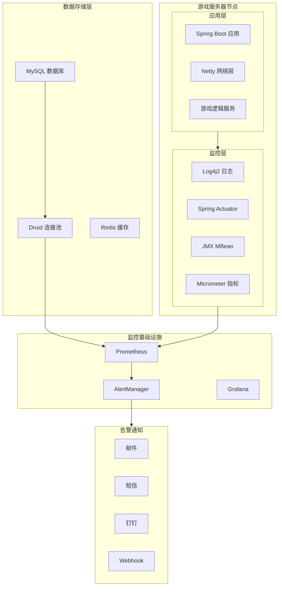
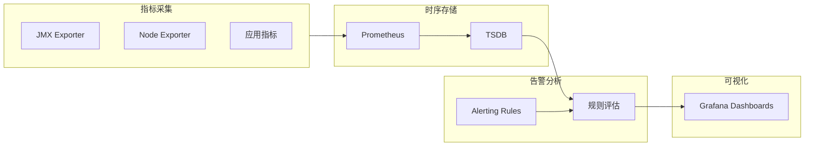
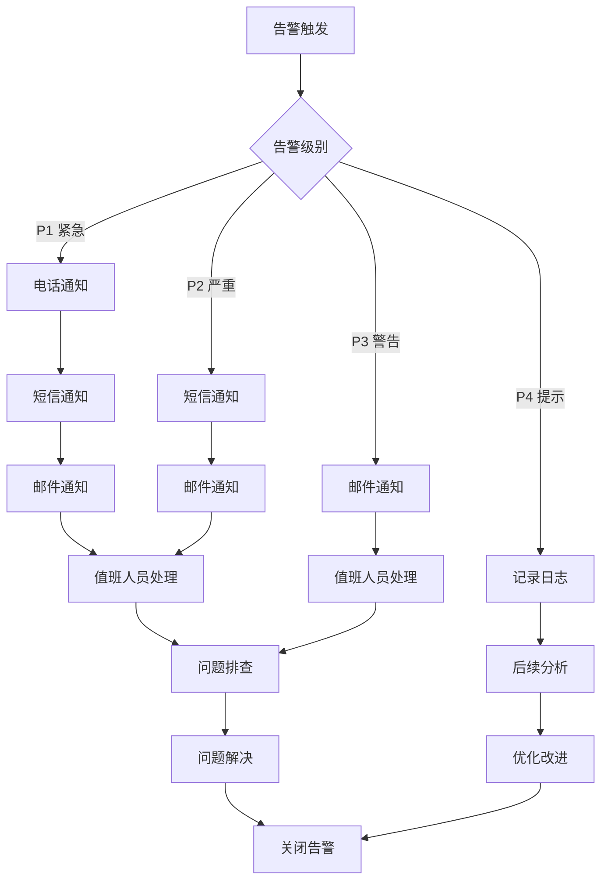

# 监控告警

## 1. 监控概述

### 1.1 监控目标

BeiDou-Server 监控系统旨在实时采集、分析和展示游戏服务器的运行状态，及时发现并处理各类异常情况，确保游戏服务的高可用性和稳定性。

### 1.2 监控范围

| 监控类别 | 监控内容 |
|---------|---------|
| 服务器基础监控 | CPU、内存、磁盘、网络 |
| 应用监控 | Spring Boot 应用健康状态 |
| 网络监控 | Netty 连接数、流量、封包处理 |
| 数据库监控 | 连接池状态、慢查询 |
| 游戏业务监控 | 在线玩家数、活跃会话 |
| 日志监控 | 错误日志、异常告警 |

### 1.3 技术选型

- **日志框架**: Log4j2
- **数据库连接池**: Druid (提供内置监控)
- **网络框架**: Netty (支持 JMX 监控)
- **应用监控**: Spring Boot Actuator
- **连接池监控**: Druid Monitor

## 2. 核心监控指标

### 2.1 服务器基础指标

| 指标名称 | 指标说明 | 正常范围 | 告警阈值 |
|---------|---------|---------|---------|
| CPU 使用率 | 服务器 CPU 占用 | < 70% | > 85% |
| 内存使用率 | JVM 和系统内存占用 | < 80% | > 90% |
| 磁盘使用率 | 服务器磁盘空间 | < 70% | > 85% |
| 网络 I/O | 入站/出站流量 | 基准的 80% | > 基准的 150% |

### 2.2 Netty 网络指标

| 指标名称 | 指标说明 | 正常范围 | 告警阈值 |
|---------|---------|---------|---------|
| Active Connections | 当前活跃连接数 | < 5000 | > 8000 |
| Connection创建速率 | 新建连接每秒数量 | < 100/s | > 200/s |
| 封包接收速率 | 接收封包每秒数量 | 基准值 | > 基准值的 200% |
| 封包发送速率 | 发送封包每秒数量 | 基准值 | > 基准值的 200% |
| 字节入站速率 | 入站字节每秒 | < 100MB/s | > 200MB/s |
| 字节出站速率 | 出站字节每秒 | < 100MB/s | > 200MB/s |
| 平均封包延迟 | 封包处理平均耗时 | < 10ms | > 50ms |

### 2.3 数据库指标

| 指标名称 | 指标说明 | 正常范围 | 告警阈值 |
|---------|---------|---------|---------|
| Druid 活跃连接数 | 当前使用的连接数 | < 70% 最大值 | > 90% 最大值 |
| Druid 空闲连接数 | 空闲可用连接数 | > 5 | < 2 |
| 连接获取等待时间 | 获取连接等待时间 | < 100ms | > 500ms |
| 执行SQL数量 | 每秒执行SQL数 | 基准值 | > 基准值 300% |
| 活跃事务数 | 当前活跃事务数 | < 50 | > 100 |

### 2.4 游戏业务指标

| 指标名称 | 指标说明 | 正常范围 | 告警阈值 |
|---------|---------|---------|---------|
| 在线玩家数 | 当前在线玩家总数 | 服务器容量内 | > 服务器容量 |
| 每频道玩家数 | 各频道平均玩家数 | < 频道容量 80% | > 频道容量 |
| 登录成功率 | 登录请求成功比例 | > 95% | < 90% |
| 角色数据同步 | 角色数据保存延迟 | < 5s | > 30s |
| 封包错误率 | 封包处理错误比例 | < 1% | > 5% |

## 3. 日志监控

### 3.1 日志配置

项目使用 Log4j2 作为日志框架，配置示例：

```xml
<?xml version="1.0" encoding="UTF-8"?>
<Configuration status="WARN">
    <Properties>
        <Property name="LOG_HOME">logs</Property>
        <Property name="LOG_PATTERN">%d{yyyy-MM-dd HH:mm:ss.SSS} [%t] %-5level %logger{36} - %msg%n</Property>
    </Properties>

    <Appenders>
        <!-- 控制台输出 -->
        <Console name="Console" target="SYSTEM_OUT">
            <PatternLayout pattern="${LOG_PATTERN}"/>
        </Console>

        <!-- 通用日志文件 -->
        <RollingFile name="CommonLog" fileName="${LOG_HOME}/beidou.log"
                     filePattern="${LOG_HOME}/beidou-%d{yyyy-MM-dd}-%i.log">
            <PatternLayout pattern="${LOG_PATTERN}"/>
            <Policies>
                <TimeBasedTriggeringPolicy interval="1"/>
                <SizeBasedTriggeringPolicy size="100MB"/>
            </Policies>
            <DefaultRolloverStrategy max="30"/>
        </RollingFile>

        <!-- 错误日志单独记录 -->
        <RollingFile name="ErrorLog" fileName="${LOG_HOME}/error.log"
                     filePattern="${LOG_HOME}/error-%d{yyyy-MM-dd}-%i.log">
            <ThresholdFilter level="ERROR" onMatch="ACCEPT" onMismatch="DENY"/>
            <PatternLayout pattern="${LOG_PATTERN}"/>
            <Policies>
                <TimeBasedTriggeringPolicy interval="1"/>
                <SizeBasedTriggeringPolicy size="50MB"/>
            </Policies>
            <DefaultRolloverStrategy max="60"/>
        </RollingFile>

        <!-- Netty 网络日志 -->
        <RollingFile name="NettyLog" fileName="${LOG_HOME}/netty.log"
                     filePattern="${LOG_HOME}/netty-%d{yyyy-MM-dd}-%i.log">
            <PatternLayout pattern="${LOG_PATTERN}"/>
            <Policies>
                <TimeBasedTriggeringPolicy interval="1"/>
                <SizeBasedTriggeringPolicy size="100MB"/>
            </Policies>
            <DefaultRolloverStrategy max="14"/>
        </RollingFile>
    </Appenders>

    <Loggers>
        <!-- Netty 日志 -->
        <Logger name="io.netty" level="INFO" additivity="false">
            <AppenderRef ref="NettyLog"/>
            <AppenderRef ref="Console"/>
        </Logger>

        <!-- 游戏业务日志 -->
        <Logger name="org.gms" level="DEBUG" additivity="false">
            <AppenderRef ref="CommonLog"/>
            <AppenderRef ref="Console"/>
        </Logger>

        <!-- 错误日志 -->
        <Logger name="org.gms.exception" level="ERROR" additivity="false">
            <AppenderRef ref="ErrorLog"/>
            <AppenderRef ref="Console"/>
        </Logger>

        <Root level="INFO">
            <AppenderRef ref="CommonLog"/>
            <AppenderRef ref="Console"/>
        </Root>
    </Loggers>
</Configuration>
```

### 3.2 日志级别说明

| 级别 | 使用场景 |
|-----|---------|
| ERROR | 系统错误、异常情况、数据损坏 |
| WARN | 潜在问题、连接池警告、反作弊触发 |
| INFO | 服务器启停、用户登录登出、重大游戏事件 |
| DEBUG | 封包收发、调试信息、开发环境详细日志 |

### 3.3 关键日志关键字

| 关键字 | 含义 | 建议操作 |
|-------|-----|---------|
| OutOfMemoryError | 内存溢出 | 立即告警，触发应急预案 |
| NullPointerException | 空指针异常 | 分析堆栈，定位问题 |
| Connection refused | 连接被拒绝 | 检查网络和数据库连接 |
| Timeout | 操作超时 | 检查数据库和外部服务响应 |
| Exception | 一般异常 | 根据上下文分析处理 |
| Banned | 封禁触发 | 检查反作弊系统 |
| DDoS | 疑似攻击 | 启动防护流程 |

### 3.4 日志分析命令

```bash
# 统计错误日志数量
grep -c "ERROR" logs/error.log

# 查找最近 5 分钟的错误日志
grep "ERROR" logs/beidou.log | awk '$1" "$2 > "'$(date -d '5 minutes ago' '+%Y-%m-%d %H:%M')'"'

# 分析封包处理延迟日志
grep "packet.*latency" logs/netty.log | awk '{print $NF}' | sort -n | tail -10

# 统计在线玩家波动
grep "Player.*login\|Player.*logout" logs/beidou.log | awk '{print $1" "$2}' | uniq -c
```

## 4. 性能监控

### 4.1 Spring Boot Actuator 端点

项目已集成 Spring Boot Actuator，配置以下端点：

```yaml
management:
  endpoints:
    web:
      exposure:
        include: health,info,metrics,prometheus
  endpoint:
    health:
      show-details: always
  metrics:
    tags:
      application: BeiDou-Server
```

常用端点：

| 端点 | 地址 | 说明 |
|-----|-----|-----|
| 健康检查 | GET /actuator/health | 应用健康状态 |
| 应用信息 | GET /actuator/info | 应用基本信息 |
| 指标列表 | GET /actuator/metrics | 可用指标列表 |
| JVM 指标 | GET /actuator/metrics/jvm.* | JVM 相关指标 |
| Netty 指标 | GET /actuator/metrics/netty.* | Netty 指标 |
| 数据库指标 | GET /actuator/metrics/druid.* | Druid 连接池指标 |

### 4.2 Druid 连接池监控

Druid 提供内置的监控页面，访问地址：`/druid/index.html`

监控内容包括：
- 数据源状态
- SQL 监控（执行次数、耗时、并发数）
- 连接池状态（活跃、空闲、等待）
- 防火墙监控（SQL 注入防护）

### 4.3 自定义监控指标

项目可扩展以下自定义指标：

```java
// 在 Spring Bean 中注入 MeterRegistry
@Autowired
private MeterRegistry meterRegistry;

// 记录在线玩家数
Gauge.builder("gms.online.players", playerManager, 
    pm -> pm.getOnlinePlayers().size())
    .description("Current online player count")
    .register(meterRegistry);

// 记录封包处理时间
Timer.builder("gms.packet.processing")
    .description("Packet processing time")
    .register(meterRegistry);

// 记录登录成功/失败次数
Counter.builder("gms.login.attempts")
    .tag("result", "success")
    .register(meterRegistry);
```

## 5. 告警规则配置

### 5.1 告警级别定义

| 级别 | 名称 | 说明 | 通知方式 |
|-----|-----|-----|---------|
| P1 | 紧急 | 服务不可用，影响所有用户 | 电话 + 短信 + 邮件 |
| P2 | 严重 | 服务降级，影响大部分用户 | 短信 + 邮件 |
| P3 | 警告 | 潜在问题，需要关注 | 邮件 |
| P4 | 提示 | 异常信息，记录分析 | 日志记录 |

### 5.2 告警规则示例

#### 5.2.1 服务器资源告警

```yaml
# CPU 使用率告警
alert: cpu_usage_high
expr: cpu_usage > 85
duration: 5m
severity: P2
message: "服务器 CPU 使用率超过 85%，当前值: {{ $value }}%"
action: check_process_and_restart_if_needed

# 内存使用率告警
alert: memory_usage_high
expr: memory_usage > 90
duration: 3m
severity: P1
message: "服务器内存使用率超过 90%，当前值: {{ $value }}%"
action: trigger_memory_dump_and_alert

# 磁盘空间告警
alert: disk_space_low
expr: disk_free < 10
duration: 1m
severity: P2
message: "服务器磁盘空间不足，可用空间: {{ $value }}GB"
action: cleanup_logs_and_notify
```

#### 5.2.2 网络连接告警

```yaml
# Netty 连接数过高告警
alert: netty_connections_high
expr: netty_active_connections > 8000
duration: 2m
severity: P2
message: "Netty 活跃连接数超过 8000，当前值: {{ $value }}"
action: check_for_ddos_or_bots

# 封包延迟过高告警
alert: packet_latency_high
expr: packet_avg_latency_ms > 50
duration: 5m
severity: P3
message: "封包平均延迟超过 50ms，当前值: {{ $value }}ms"
action: check_server_load_and_optimize
```

#### 5.2.3 数据库连接告警

```yaml
# 数据库连接池告警
alert: druid_pool_exhausted
expr: druid_active_connections / druid_max_connections > 0.9
duration: 1m
severity: P1
message: "数据库连接池使用率超过 90%，可能面临连接耗尽"
action: check_long_running_queries_and_kill

# 慢查询告警
alert: slow_query
expr: slow_query_count > 10
duration: 5m
severity: P3
message: "过去 5 分钟内发现 {{ $value }} 条慢查询"
action: analyze_and_optimize_queries
```

#### 5.2.4 游戏业务告警

```yaml
# 在线玩家数异常告警
alert: online_players_anomaly
expr: online_players > server_capacity OR online_players < expected_min
duration: 10m
severity: P3
message: "在线玩家数异常，当前值: {{ $value }}"
action: check_server_status_and_user_reports

# 登录失败率告警
alert: login_failure_rate_high
expr: login_failures / login_attempts > 0.1
duration: 5m
severity: P2
message: "登录失败率超过 10%，可能存在攻击或服务问题"
action: check_for_brute_force_and_verify_services
```

## 6. 告警通知方式

### 6.1 通知渠道配置

| 通知方式 | 配置难度 | 响应速度 | 适用场景 |
|---------|---------|---------|---------|
| 邮件通知 | 低 | 慢 | P3/P4 级别告警 |
| 短信通知 | 中 | 快 | P1/P2 级别告警 |
| 电话通知 | 高 | 最快 | P1 级别紧急告警 |
| 钉钉/企业微信 | 中 | 快 | P2/P3 级别告警 |
| 自定义 Webhook | 中 | 快 | 集成第三方系统 |

### 6.2 钉钉群机器人配置

```yaml
# config/dingtalk.yml
dingtalk:
  webhook: https://oapi.dingtalk.com/robot/send?access_token=YOUR_TOKEN
  secret: YOUR_SECRET
  enabled: true
```

告警消息格式：

```json
{
    "msgtype": "markdown",
    "markdown": {
        "title": "BeiDou-Server 告警",
        "text": "## 🔴 告警通知\n\n**级别**: P1 紧急\n\n**告警名称**: CPU 使用率过高\n\n**当前值**: 92%\n\n**持续时间**: 5 分钟\n\n**触发时间**: 2026-03-26 10:30:00\n\n**服务器**: game-server-01\n\n[查看详情](http://monitor.example.com)"
    }
}
```

### 6.3 Prometheus AlertManager 配置

```yaml
# alertmanager.yml
global:
  smtp_smarthost: 'smtp.example.com:587'
  smtp_from: 'alert@example.com'
  smtp_auth_username: 'alert'
  smtp_auth_password: 'password'

route:
  group_by: ['alertname', 'severity']
  group_wait: 30s
  group_interval: 5m
  repeat_interval: 4h
  receiver: 'default-receiver'
  routes:
    - match:
        severity: critical
      receiver: 'critical-receiver'
    - match:
        severity: warning
      receiver: 'warning-receiver'

receivers:
  - name: 'default-receiver'
    email_configs:
      - to: 'oncall@example.com'
  - name: 'critical-receiver'
    webhook_configs:
      - url: 'http://dingtalk-hook:5000/send'
    email_configs:
      - to: 'critical@example.com'
```

## 7. 监控工具推荐

### 7.1 监控方案对比

| 工具 | 复杂度 | 功能完善度 | 告警能力 | 推荐场景 |
|-----|-------|----------|---------|---------|
| Spring Boot Admin | 低 | 中 | 中 | 小型部署 |
| Prometheus + Grafana | 高 | 高 | 强 | 中大型部署 |
| ELK Stack | 中 | 高 | 中 | 日志分析为主 |
| Druid Monitor | 低 | 中 | 弱 | 数据库专项监控 |
| Pinpoint | 中 | 高 | 中 | 链路追踪 |

### 7.2 推荐方案：Prometheus + Grafana

#### 7.2.1 架构组件

```
┌─────────────┐    ┌─────────────┐    ┌─────────────┐
│  Game Server│    │   MySQL     │    │   Druid     │
│  (JMX Exporter)│  │ (Exporter)  │    │ (Built-in)  │
└──────┬──────┘    └──────┬──────┘    └──────┬──────┘
       │                  │                  │
       ▼                  ▼                  ▼
┌─────────────────────────────────────────────────┐
│                   Prometheus                      │
│         (指标采集和存储，时序数据库)              │
└───────────────────────┬─────────────────────────┘
                        │
                        ▼
┌─────────────────────────────────────────────────┐
│                    Grafana                       │
│              (可视化监控面板)                     │
└───────────────────────┬─────────────────────────┘
                        │
                        ▼
                 ┌─────────────┐
                 │  AlertManager│
                 │   (告警管理)  │
                 └──────┬──────┘
                        │
          ┌─────────────┼─────────────┐
          ▼             ▼             ▼
     ┌─────────┐  ┌─────────┐  ┌─────────┐
     │  邮件   │  │  钉钉    │  │  短信   │
     └─────────┘  └─────────┘  └─────────┘
```

#### 7.2.2 JMX Exporter 配置

```yaml
# jmx-config.yml
hostPort: 127.0.0.1:9010
lowercaseOutputName: true
lowercaseOutputLabelNames: true
rules:
  - pattern: '.*'
```

启动参数：
```bash
java -javaagent:jmx_prometheus_javaagent-0.20.0.jar=config.yaml:9010 \
     -jar BeiDou.jar
```

#### 7.2.3 Prometheus 配置

```yaml
# prometheus.yml
global:
  scrape_interval: 15s
  evaluation_interval: 15s

scrape_configs:
  - job_name: 'beioud-server'
    static_configs:
      - targets: ['localhost:9010']
    metrics_path: '/metrics'

  - job_name: 'druid'
    static_configs:
      - targets: ['localhost:8080/druid']
```

### 7.3 轻量级方案：Spring Boot Admin

#### 7.3.1 依赖引入

```xml
<dependency>
    <groupId>de.codecentric</groupId>
    <artifactId>spring-boot-admin-starter-server</artifactId>
    <version>3.2.0</version>
</dependency>
```

#### 7.3.2 客户端配置

```yaml
spring:
  boot:
    admin:
      client:
        url: http://admin-server:8080
        instance:
          name: BeiDou-Server
```

### 7.4 日志分析方案：ELK Stack

```
┌───────────┐    ┌───────────┐    ┌───────────┐    ┌───────────┐
│ Log4j2    │───▶│  Filebeat │───▶│  Logstash │───▶│Elasticsearch│
│ (日志输出) │    │ (日志收集) │    │ (日志处理) │    │ (日志存储)  │
└───────────┘    └───────────┘    └───────────┘    └─────┬─────┘
                                                           │
                                                           ▼
                                                     ┌───────────┐
                                                     │  Kibana   │
                                                     │ (日志展示) │
                                                     └───────────┘
```

## 8. 监控面板示例

### 8.1 Grafana 面板 JSON

```json
{
  "dashboard": {
    "title": "BeiDou-Server 监控面板",
    "panels": [
      {
        "title": "服务器状态概览",
        "type": "stat",
        "gridPos": {"h": 8, "w": 24},
        "targets": [
          {"expr": "up{job='beidou-server'}", "legendFormat": "服务器状态"},
          {"expr": "gms_online_players", "legendFormat": "在线玩家"}
        ]
      },
      {
        "title": "Netty 连接数趋势",
        "type": "graph",
        "gridPos": {"h": 8, "w": 12},
        "targets": [
          {"expr": "netty_active_connections", "legendFormat": "活跃连接"},
          {"expr": "rate(netty_connections_total[5m])", "legendFormat": "新建连接速率"}
        ]
      },
      {
        "title": "JVM 内存使用",
        "type": "graph",
        "gridPos": {"h": 8, "w": 12},
        "targets": [
          {"expr": "jvm_memory_used_bytes{area='heap'}", "legendFormat": "堆内存使用"},
          {"expr": "jvm_memory_max_bytes{area='heap'}", "legendFormat": "堆内存最大"}
        ]
      },
      {
        "title": "数据库连接池状态",
        "type": "gauge",
        "gridPos": {"h": 8, "w": 8},
        "targets": [
          {"expr": "druid_active_connections / druid_max_connections * 100", "legendFormat": "连接池使用率"}
        ]
      },
      {
        "title": "封包处理延迟",
        "type": "graph",
        "gridPos": {"h": 8, "w": 16},
        "targets": [
          {"expr": "rate(gms_packet_processing_seconds_sum[5m]) / rate(gms_packet_processing_seconds_count[5m])", "legendFormat": "平均延迟"}
        ]
      }
    ]
  }
}
```

### 8.2 监控指标汇总表

| 指标分类 | 指标名称 | 单位 | 采集方式 |
|---------|---------|-----|---------|
| 服务器 | cpu_usage | % | node_exporter |
| 服务器 | memory_usage | % | node_exporter |
| 服务器 | disk_free | GB | node_exporter |
| JVM | jvm_memory_used | bytes | JMX |
| JVM | jvm_gc_pause | ms | Micrometer |
| Netty | netty_active_connections | count | JMX |
| Netty | netty_bytes_rcvd | bytes/s | JMX |
| Netty | netty_bytes_sent | bytes/s | JMX |
| 数据库 | druid_active_connections | count | Druid |
| 数据库 | druid_pooling_count | count | Druid |
| 游戏 | gms_online_players | count | 自定义 |
| 游戏 | gms_login_total | count | 自定义 |
| 游戏 | gms_packet_error_total | count | 自定义 |

## 9. Mermaid 监控架构图

### 9.1 整体监控架构



### 9.2 数据采集流程



### 9.3 告警处理流程



---

*文档版本: 1.0*
*最后更新: 2026-03-26*
