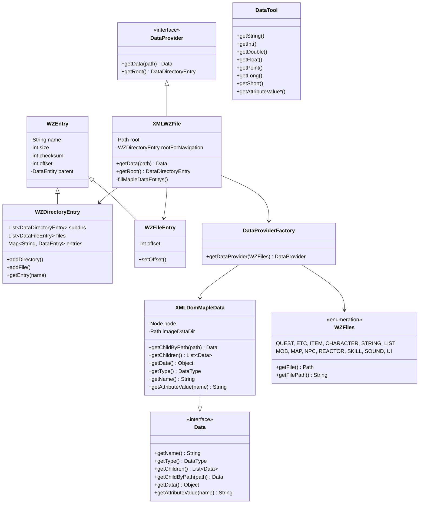
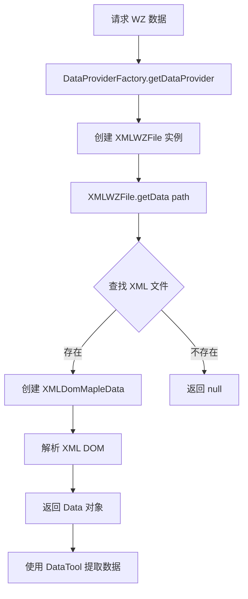
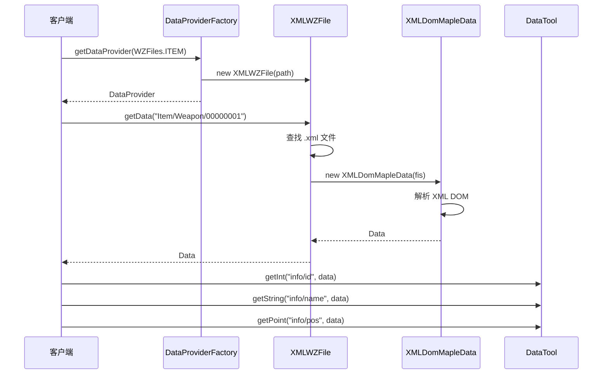
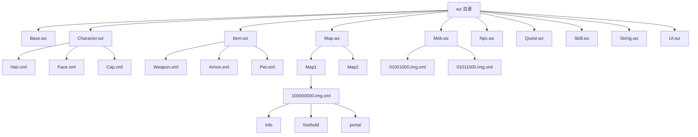
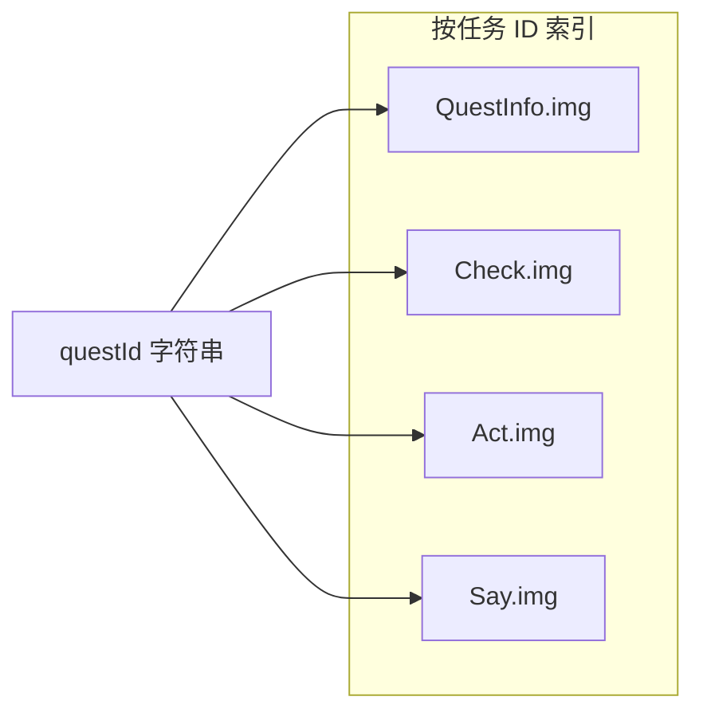
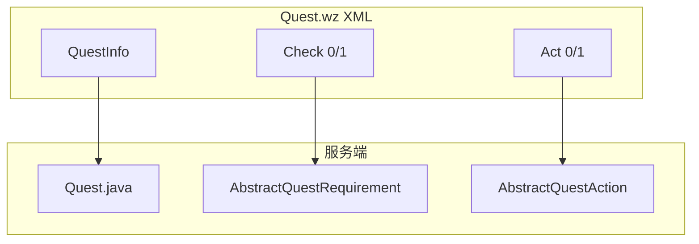

# WZ 数据解析

**文档内导航：** [§1 概述](#1-wz文件概述) · [§2 结构](#2-wz文件结构) · [§3 解析器](#3-wz解析器架构) · [§4 类型](#4-常见wz类型) · [§5 DataTool](#5-数据提取方法) · [§6 示例](#6-相关代码示例) · [§7 架构图](#7-mermaid架构图) · [**§8 Quest.wz**](#quest-wz-data)

## 1. WZ文件概述

WZ文件是MapleStory（冒险岛）游戏中用于存储游戏数据的一种专有格式。WZ文件包含了游戏客户端所需的各类资源数据，如地图信息、怪物数据、NPC数据、道具数据、技能数据等。

本项目采用**XML格式**存储WZ数据，存放在`wz/`目录下，每个WZ文件对应一个子目录（如`Map.wz/`、`Mob.wz/`等），内部包含多个`.xml`文件。

### WZ文件目录结构

```
wz/
├── Base.wz/          # 基础数据
├── Character.wz/     # 角色相关数据
├── Effect.wz/        # 效果数据
├── Etc.wz/           # 杂项数据
├── Item.wz/          # 道具数据
├── Map.wz/           # 地图数据
├── Mob.wz/           # 怪物数据
├── Morph.wz/         # 变身数据
├── Npc.wz/           # NPC数据
├── Quest.wz/          # 任务数据（核心 XML 结构见 [§8](#quest-wz-data)）
├── Reactor.wz/        # 反应堆数据
├── Skill.wz/          # 技能数据
├── Sound.wz/         # 声音数据
├── String.wz/        # 字符串数据
├── TamingMob.wz/     # 驯服怪物数据
└── UI.wz/            # UI数据
```

## 2. WZ文件结构

### 2.1 XML格式结构

每个WZ数据文件（如`.img.xml`）采用XML格式存储，主要包含以下节点类型：

| 节点名称 | 类型 | 说明 |
|---------|------|------|
| `imgdir` | PROPERTY | 目录节点，包含子节点 |
| `canvas` | CANVAS | 图片/画布数据 |
| `vector` | VECTOR | 二维坐标点（x, y） |
| `int` | INT | 整数类型 |
| `short` | SHORT | 短整数类型 |
| `double` | DOUBLE | 双精度浮点数 |
| `float` | FLOAT | 单精度浮点数 |
| `string` | STRING | 字符串类型 |
| `sound` | SOUND | 音频数据 |
| `uol` | UOL | 指向其他节点的引用 |
| `convex` | CONVEX | 凸多边形数据 |
| `null` | IMG_0x00 | 空值 |

### 2.2 节点属性

每个XML节点都包含以下标准属性：

- `name`: 节点名称标识
- `value`: 节点的值（部分类型具备）

示例XML结构：
```xml
<imgdir name="info">
    <int name="id" value="100000"/>
    <string name="name" value="橡果".
    <vector name="pos" x="0" y="0"/>
</imgdir>
```

## 3. WZ解析器架构

### 3.1 核心类图



### 3.2 解析流程



### 3.3 核心接口说明

#### DataProvider 接口

```java
public interface DataProvider {
    Data getData(String path);           // 根据路径获取数据
    DataDirectoryEntry getRoot();         // 获取根目录条目
}
```

#### Data 接口

```java
public interface Data extends DataEntity, Iterable<Data> {
    String getName();                    // 获取节点名称
    DataType getType();                  // 获取数据类型
    List<Data> getChildren();             // 获取所有子节点
    Data getChildByPath(String path);     // 按路径获取子节点
    Object getData();                     // 获取节点数据值
    String getAttributeValue(String name); // 获取属性值
}
```

## 4. 常见WZ类型

### 4.1 WZFiles 枚举

`WZFiles`定义了所有支持的WZ文件类型：

```java
public enum WZFiles {
    QUEST("Quest"),      // 任务数据
    ETC("Etc"),          // 杂项数据
    ITEM("Item"),        // 道具数据
    CHARACTER("Character"), // 角色数据
    STRING("String"),    // 字符串数据
    LIST("List"),        // 列表数据
    MOB("Mob"),          // 怪物数据
    MAP("Map"),          // 地图数据
    NPC("Npc"),          // NPC数据
    REACTOR("Reactor"),  // 反应堆数据
    SKILL("Skill"),      // 技能数据
    SOUND("Sound"),      // 声音数据
    UI("UI");            // UI数据

    public Path getFile();     // 获取文件路径
    public String getFilePath(); // 获取文件路径字符串
}
```

### 4.2 DataType 枚举

```java
public enum DataType {
    NONE,               // 无类型
    IMG_0x00,           // NULL/空值
    SHORT,              // 短整数
    INT,                // 整数
    FLOAT,              // 单精度浮点
    DOUBLE,             // 双精度浮点
    STRING,             // 字符串
    EXTENDED,           // 扩展类型
    PROPERTY,           // 属性/目录
    CANVAS,             // 画布/图片
    VECTOR,             // 坐标向量
    CONVEX,             // 凸多边形
    SOUND,              // 音频
    UOL,                // 引用
    UNKNOWN_TYPE,       // 未知类型
    UNKNOWN_EXTENDED_TYPE // 未知扩展类型
}
```

## 5. 数据提取方法

### 5.1 使用 DataTool 工具类

`DataTool`提供了便捷的静态方法用于提取各种类型的数据：

```java
// 字符串提取
String name = DataTool.getString(data);
String name = DataTool.getString("info/name", data);
String name = DataTool.getString("info/name", data, "默认名称");

// 整数提取
int id = DataTool.getInt(data);
int id = DataTool.getInt("info/id", data);
int id = DataTool.getInt("info/id", data, 0);
int id = DataTool.getIntConvert("info/id", data);  // 支持字符串转整数

// 浮点数提取
double d = DataTool.getDouble(data);
float f = DataTool.getFloat(data);

// 坐标提取
Point pos = DataTool.getPoint(data);
Point pos = DataTool.getPoint("info/pos", data);
Point pos = DataTool.getPoint("info/pos", data, new Point(0, 0));

// 长整数提取
long l = DataTool.getLong("info/value", data);
long l = DataTool.getLong("info/value", data, 0L);

// 属性提取
String value = DataTool.getAttributeValue(data, "name");
int value = DataTool.getAttributeValueInt(data, "id", 0);
```

### 5.2 路径访问模式

使用`getChildByPath`方法可以通过路径访问深层数据：

```java
// 获取嵌套数据
Data info = data.getChildByPath("info");
Data id = data.getChildByPath("info/id");
Data pos = data.getChildByPath("info/position/coord");

// 支持相对路径
Data parent = data.getChildByPath("..");
```

### 5.3 遍历子节点

```java
// 遍历所有子节点
for (Data child : data.getChildren()) {
    String name = child.getName();
    DataType type = child.getType();
    Object value = child.getData();
}

// 使用迭代器
Iterator<Data> iter = data.iterator();
while (iter.hasNext()) {
    Data child = iter.next();
    // 处理子节点
}
```

## 6. 相关代码示例

### 6.1 获取WZ数据提供器

```java
import org.gms.provider.DataProvider;
import org.gms.provider.DataProviderFactory;
import org.gms.provider.wz.WZFiles;
import org.gms.provider.Data;

// 获取道具数据提供器
DataProvider itemProvider = DataProviderFactory.getDataProvider(WZFiles.ITEM);

// 获取地图数据
DataProvider mapProvider = DataProviderFactory.getDataProvider(WZFiles.MAP);
Data mapData = mapProvider.getData("Map/Map1/100000000");
```

### 6.2 读取道具信息

```java
import org.gms.provider.Data;
import org.gms.provider.DataTool;
import org.gms.provider.DataProvider;
import org.gms.provider.DataProviderFactory;
import org.gms.provider.wz.WZFiles;

public void loadItemData() {
    DataProvider itemProvider = DataProviderFactory.getDataProvider(WZFiles.ITEM);
    Data itemData = itemProvider.getData("Item/Weapon/00000001.img.xml");

    if (itemData != null) {
        Data info = itemData.getChildByPath("info");

        // 提取各项属性
        int itemId = DataTool.getInt("itemId", info);
        String name = DataTool.getString("name", info);
        int price = DataTool.getInt("price", info, 0);
        int slotMax = DataTool.getInt("slotMax", info, 100);
    }
}
```

### 6.3 读取怪物数据

```java
public void loadMobData() {
    DataProvider mobProvider = DataProviderFactory.getDataProvider(WZFiles.MOB);
    Data mobData = mobProvider.getData("Mob/01001000.img.xml");

    if (mobData != null) {
        Data info = mobData.getChildByPath("info");

        int mobId = DataTool.getInt("id", info);
        String mobName = DataTool.getString("name", info);
        int level = DataTool.getInt("level", info, 1);
        int hp = DataTool.getInt("maxHP", info, 0);
        int mp = DataTool.getInt("maxMP", info, 0);
        int exp = DataTool.getInt("exp", info, 0);

        // 获取坐标信息
        Data speedData = info.getChildByPath("speed");
        if (speedData != null) {
            Point speed = DataTool.getPoint(speedData);
        }
    }
}
```

### 6.4 读取地图数据

```java
public void loadMapData() {
    DataProvider mapProvider = DataProviderFactory.getDataProvider(WZFiles.MAP);
    Data mapData = mapProvider.getData("Map/Map1/100000000.img.xml");

    if (mapData != null) {
        // 获取地图信息节点
        Data info = mapData.getChildByPath("info");

        // 提取地图属性
        int bgm = DataTool.getInt("bgm", info);
        int mapId = DataTool.getInt("mapId", info);
        int returnMap = DataTool.getInt("returnMap", info);

        // 获取链接信息
        Data linkData = info.getChildByPath("link");
        if (linkData != null) {
            String linkName = DataTool.getString(linkData);
        }

        // 遍历所有子节点
        for (Data child : mapData.getChildren()) {
            System.out.println("节点: " + child.getName() + ", 类型: " + child.getType());
        }
    }
}
```

### 6.5 字符串数据读取

```java
public void loadStringData() {
    DataProvider stringProvider = DataProviderFactory.getDataProvider(WZFiles.STRING);

    // 读取物品名称
    Data itemStringData = stringProvider.getData("String/Item.img.xml");
    if (itemStringData != null) {
        Data item3000 = itemStringData.getChildByPath("3000");
        if (item3000 != null) {
            String name = DataTool.getString("name", item3000);
            String desc = DataTool.getString("desc", item3000);
        }
    }

    // 读取NPC名称
    Data npcStringData = stringProvider.getData("String/Npc.img.xml");
    if (npcStringData != null) {
        Data npc9000018 = npcStringData.getChildByPath("9000018");
        if (npc9000018 != null) {
            String name = DataTool.getString("name", npc9000018);
        }
    }
}
```

### 6.6 多语言支持

项目支持多语言WZ数据，通过`wz-{locale}/`目录下的文件覆盖默认语言：

```java
// WZFiles.getFile() 自动处理语言优先级
// 优先取语言文件夹（如 wz-zh-CN/），没有则取 wz/
Path wzPath = WZFiles.ITEM.getFile();
// 返回 wz-zh-CN/Item.wz 或 wz/Item.wz
```

## 7. Mermaid架构图

### 7.1 完整数据加载流程



### 7.2 WZ文件组织结构



### 7.3 数据类型层次

```mermaid
classDiagram
    class DataType {
        <<enumeration>>
        NONE
        IMG_0x00
        SHORT
        INT
        FLOAT
        DOUBLE
        STRING
        EXTENDED
        PROPERTY
        CANVAS
        VECTOR
        CONVEX
        SOUND
        UOL
    }

    class "基本类型" {
        SHORT, INT, FLOAT, DOUBLE, STRING
    }

    class "复杂类型" {
        PROPERTY, CANVAS, VECTOR, CONVEX, SOUND, UOL
    }

    class "特殊类型" {
        NONE, IMG_0x00, EXTENDED
    }

    DataType <|-- 基本类型
    DataType <|-- 复杂类型
    DataType <|-- 特殊类型
```

<a id="quest-wz-data"></a>

## 8. Quest.wz 任务数据

本节说明 `Quest.wz/` 下与任务逻辑最相关的四个 XML 文件（`QuestInfo.img.xml`、`Check.img.xml`、`Act.img.xml`、`Say.img.xml`）的结构，以及它们如何通过**任务 ID**（根下 `imgdir` 的 `name`，十进制字符串）互相关联。通用 WZ 节点类型见 [§2](#2-wz文件结构)。

**交叉引用（建议配合阅读）：**

- 服务端任务生命周期、条件/奖励枚举与脚本入口： [11-quest-module.md](11-quest-module.md)
- 任务脚本（`scripts/quest/{QuestID}.js`）、`qm` API： [28-scripting-development.md](28-scripting-development.md) 中「任务脚本」相关章节
- 通过数字 ID 反查 NPC / 地图 / 怪物 / 物品名称：仓库根目录 [`glossary/`](../glossary/) 下各 JSON（如 `npc.json`、`map.json`、`mob.json`、物品分类 JSON）

### 8.1 四份数据的分工与任务 ID

同一 `questId` 在四份文件中各出现一次（同为 `imgdir name="{questId}"`），合起来描述该任务的展示文案、条件、奖励与（客户端）对话。

| 文件 | 服务端是否加载 | 作用概要 |
|------|----------------|----------|
| QuestInfo.img | 是 | 任务名称、分组、自动标记、时限、任务栏多行摘要等 |
| Check.img | 是 | 子目录 `0` = 接受条件，`1` = 完成条件 |
| Act.img | 是 | 子目录 `0` = 接受时动作，`1` = 完成时动作 |
| Say.img | 否（本仓库 Java 未引用） | NPC 任务对话树，供官方客户端使用 |

`Quest` 在 [`Quest.java`](../src/main/java/org/gms/server/quest/Quest.java) 中读取前三者；`loadAllQuests()` 遍历 **`QuestInfo.img` 的子节点** 作为任务清单并构造缓存。若某 ID 在 `Check.img` 中不存在，`Quest` 构造函数会提前返回，该 ID 可能仅用于 info 类或其它扩展逻辑（见源码注释 `most likely infoEx`）。



### 8.2 QuestInfo.img.xml

- **根节点**：`QuestInfo.img`。
- **每个任务**：`imgdir name="{questId}"`。
- **常用字段**（与 [`Quest` 构造函数](../src/main/java/org/gms/server/quest/Quest.java) 一致）：
  - `name`：任务名称。
  - `parent`、`order`：父任务名与组内顺序（客户端任务 UI 分组）。
  - `area`：区域分类（客户端）。
  - `timeLimit`：**秒**；接受任务时过期时间 = 当前时间 + `timeLimit` 秒（见 `forceStart` 中 `SECONDS.toMillis`）。
  - `timeLimit2`：**毫秒**；若大于 0，直接加到当前时间戳上作为过期时间（与 `timeLimit` 单位不同）。
  - `autoStart`、`autoPreComplete`、`autoComplete`：自动开始/预完成/自动完成，含义见 [11-quest-module.md](11-quest-module.md) 与源码。
  - `viewMedalItem`：勋章物品 ID；非 0 时登记到全局 `medals` 映射。
- **编号字符串** `string name="0"`, `"1"`, `"2"` …：任务日志/任务栏多行说明，客户端展示用；文中常含富文本标记（如 `#b`/`#k` 颜色、`#p` NPC、`#m` 地图、`#t`/`#i`/`#c` 物品等），与客户端一致。

### 8.3 Check.img.xml（条件，对应「开始 / 完成」）

- **根节点**：`Check.img`；**每个任务**：`imgdir name="{questId}"`。
- **`imgdir name="0"`**：**开始条件**（服务端 `startReqs`）。子节点名映射到 [`QuestRequirementType`](../src/main/java/org/gms/server/quest/QuestRequirementType.java)（`getByWZName`）。
- **`imgdir name="1"`**：**完成条件**（服务端 `completeReqs`）。映射方式相同。

常见 WZ 子节点名与含义（完整列表以源码 `getByWZName` 为准）：

| WZ 名 | 含义 |
|--------|------|
| `npc` | 指定 NPC ID |
| `item` | 物品列表（子项含 `id`、`count` 等） |
| `mob` | 击杀要求（子项 `id` 等） |
| `job` | 可接职业列表 |
| `lvmin` / `lvmax` | 等级上下限 |
| `quest` | 前置任务；子项 `id` + `state`，`state` 对应 [`QuestStatus.Status`](../src/main/java/org/gms/client/QuestStatus.java)：`0` 未开始、`1` 进行中、`2` 已完成 |
| `interval` | 重复间隔（与可重复任务相关） |
| `start` / `end` | 活动期时间字符串（如 `YYYYMMDDHH`） |
| `startscript` / `endscript` | 脚本名；用于 `SCRIPT` 类型及 `hasScriptRequirement` |
| `infoNumber` / `infoex` | 与 info 进度、`canQuestByInfoProgress` 联动 |
| `money` / `buff` / `exceptbuff` | 金币、Buff 状态要求等 |

同一类型在 `startReqs`/`completeReqs` 中通常各至多一条（`EnumMap` 覆盖）；`INTERVAL` 会标记任务可重复。

### 8.4 Act.img.xml（动作，对应「接受 / 完成」时效果）

- **根节点**：`Act.img`；**每个任务**：`imgdir name="{questId}"`。
- **`imgdir name="0"`**：**接受任务时执行**（`startActs`）。
- **`imgdir name="1"`**：**完成任务时执行**（`completeActs`）。

子节点名映射到 [`QuestActionType`](../src/main/java/org/gms/server/quest/QuestActionType.java)（`getByWZName`），例如：

| WZ 名 | 类型 | 说明 |
|--------|------|------|
| `exp` | 经验 | |
| `item` | 物品 | `count` 为负表示扣除；可有 `prop`、`job`、`gender`、`period` 等（见 [`ItemAction`](../src/main/java/org/gms/server/quest/actions/ItemAction.java)） |
| `money` | 金币 | |
| `nextQuest` | 下一任务 | |
| `skill` | 技能 | |
| `pop` | 人气 | |
| `buffItemID` | Buff 道具 | |
| `petskill` / `pettameness` / `petspeed` | 宠物相关 | |
| `info` | 任务 info 记录 | |

`Act.img` 中也可能出现 **`string` 节点或 `yes`/`no` 目录** 等对话类数据，映射为 `QuestActionType` 的 `ZERO` 等时，[`getAction`](../src/main/java/org/gms/server/quest/Quest.java) **不会生成可执行动作**，服务端实际对话由 [任务脚本](28-scripting-development.md) 驱动；这类节点更偏**客户端**或历史结构。

### 8.5 Say.img.xml（NPC 对话）

- **根节点**：`Say.img`；**每个任务**：`imgdir name="{questId}"`。
- 习惯上 **`0`** / **`1`** 仍表示与「开始 / 完成」相关的对话阶段（与 Check/Act 编号一致）。
- 常见结构：`string name="n"` 多轮台词；`imgdir name="yes"` / `no` 分支；`stop` 下再分 `npc`、`item` 等，表示**条件不满足时的提示**；`ask` 等整型控制是否进入提问类对话。

本仓库服务端**不加载** `Say.img`。实现 NPC 任务对话与 `forceStartQuest` / `forceCompleteQuest` 时，应使用 [`scripts/quest/`](../scripts/) 下脚本，见 [28-scripting-development.md](28-scripting-development.md)。

### 8.6 小结：数据流与文档索引



- WZ 解析通用方式仍遵循 [§3](#3-wz解析器架构)、[§5](#5-数据提取方法)。
- 任务条件与奖励的**业务语义**（枚举、流程图）以 [11-quest-module.md](11-quest-module.md) 为准。
- **脚本与 WZ 的关系**：有 `startscript`/`endscript` 或复杂分支时，行为以脚本 + `Quest` 检查共同为准；`Say.img` 可视为客户端侧默认文案参考。

