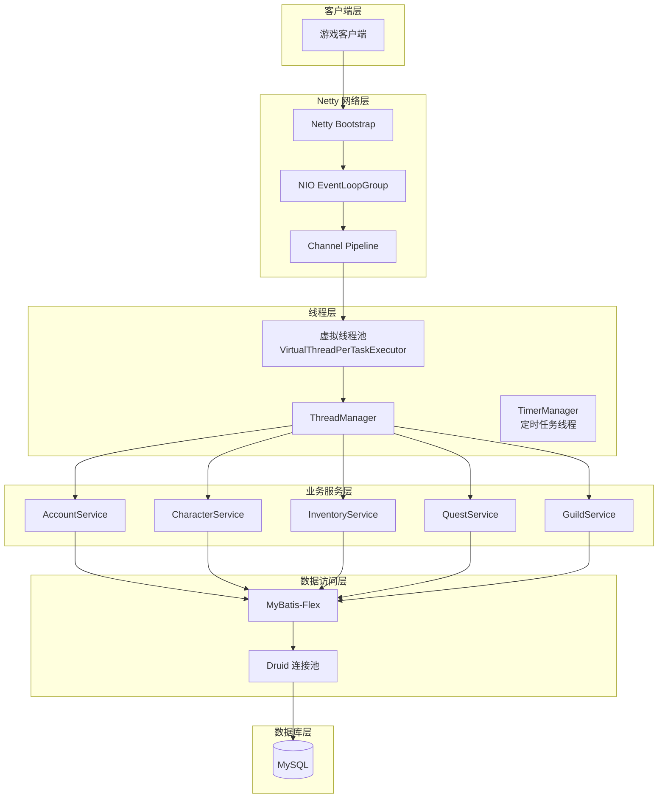
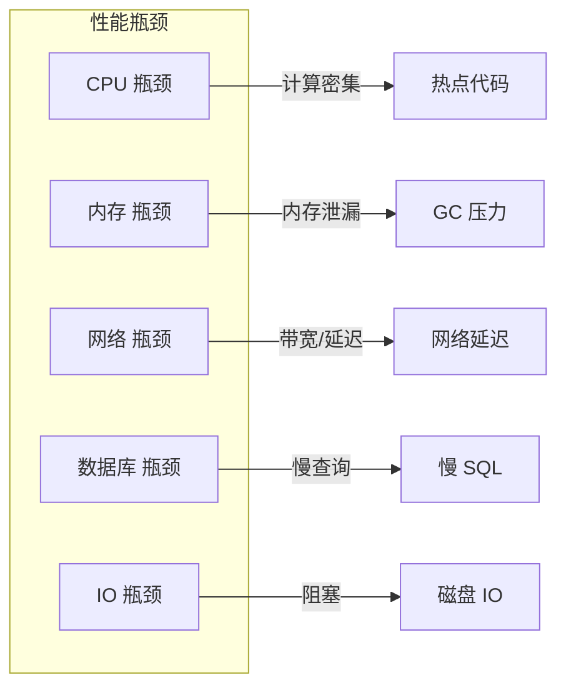

# 性能分析

## 1. 性能分析概述

### 1.1 文档目的

本文档旨在为 BeiDou-Server（MapleStory 游戏服务器模拟器）提供全面的性能分析指南，帮助开发者识别、诊断和优化系统性能瓶颈。

### 1.2 项目技术栈

| 组件 | 技术选型 | 版本 | 性能特点 |
|------|---------|------|---------|
| 核心框架 | Spring Boot | 3.2.3 | 自动化配置，内嵌 Undertow |
| Java 版本 | Java | 21 | 虚拟线程支持，轻量级并发 |
| 网络框架 | Netty | 4.1.109.Final | NIO 高性能网络通信 |
| 数据库 | MySQL | 8.0+ | 关系型数据存储 |
| 连接池 | Druid | 1.2.22 | 高性能连接池管理 |
| ORM 框架 | MyBatis-Flex | 1.8.9 | 轻量级 ORM |
| 脚本引擎 | GraalVM JS | 23.0.4 | 高性能 JavaScript 执行 |
| 日志框架 | Log4j2 | - | 异步日志记录 |

### 1.3 性能架构图



---

## 2. 性能瓶颈分析

### 2.1 常见瓶颈分类



### 2.2 瓶颈识别清单

| 瓶颈类型 | 症状表现 | 诊断工具 |
|---------|---------|---------|
| CPU 瓶颈 | CPU 使用率持续 > 80%，响应时间长 | JProfiler, async-profiler |
| 内存瓶颈 | 内存持续增长，频繁 Full GC | VisualVM, GC logs |
| 网络瓶颈 | 连接超时，吞吐量低 | Wireshark, Netty TrafficCounter |
| 数据库瓶颈 | SQL 执行时间长，连接池耗尽 | MySQL EXPLAIN, Druid Monitor |
| IO 瓶颈 | 磁盘 IO 等待高，阻塞线程 | iostat, Arthas |

### 2.3 游戏服务器特定瓶颈

#### 2.3.1 封包处理瓶颈

```java
// 位置: org.gms.client.Client.channelRead
// 潜在瓶颈点分析
@Override
public void channelRead(ChannelHandlerContext ctx, Object msg) throws Exception {
    if (!(msg instanceof InPacket packet)) {
        return;
    }

    short opcode = packet.readShort();
    final PacketHandler handler = packetProcessor.getHandler(opcode);

    if (handler != null && handler.validateState(this)) {
        try {
            ThreadLocalUtil.setCurrentClient(this);
            // 瓶颈1: Handler 处理可能耗时
            handler.handlePacket(packet, this);
        } finally {
            ThreadLocalUtil.removeCurrentClient();
        }
    }

    updateLastPacket();  // 瓶颈2: 心跳更新
}
```

**关键瓶颈点：**
- `handler.handlePacket()`: 业务逻辑执行时间
- `packetProcessor.getHandler()`: 频繁调用的查找操作
- `ThreadLocalUtil`: 线程本地变量操作开销

#### 2.3.2 多玩家同步瓶颈

```java
// 位置: org.gms.net.server.PlayerStorage
// ConcurrentHashMap 并发访问
private final Map<Integer, Character> players = new ConcurrentHashMap<>();

public void broadcastPacket(Packet packet) {
    players.values().forEach(chr -> chr.getClient().sendPacket(packet));
}
```

**潜在问题：**
- `ConcurrentHashMap` 在高并发下可能成为热点
- `broadcastPacket` 遍历所有玩家可能导致锁竞争

---

## 3. CPU 性能分析

### 3.1 CPU 热点识别

#### 3.1.1 加密解密运算

```java
// 位置: org.gms.net.encryption.MapleAESOFB
// 加密运算热点
public synchronized byte[] crypt(byte[] data) {
    int remaining = data.length;
    int llength = 0x5B0;
    int start = 0;

    while (remaining > 0) {
        byte[] myIv = multiplyBytes(this.iv, 4, 4);
        if (remaining < llength) {
            llength = remaining;
        }
        for (int x = start; x < (start + llength); x++) {
            if ((x - start) % myIv.length == 0) {
                byte[] newIv = cipher.doFinal(myIv);
                System.arraycopy(newIv, 0, myIv, 0, myIv.length);
            }
            data[x] ^= myIv[(x - start) % myIv.length];
        }
        // ...
    }
}
```

**优化建议：**
- 使用 `Cipher.update()` 替代 `doFinal()` 减少加密调用次数
- 考虑使用 Netty 的 `CipherHandler` 硬件加速

#### 3.1.2 自定义加密

```java
// 位置: org.gms.net.encryption.MapleCustomEncryption
// 6 轮加密循环
public static byte[] encryptData(byte[] data) {
    for (int j = 0; j < 6; j++) {
        // 每轮都要遍历整个数据包
        if (j % 2 == 0) {
            for (int i = 0; i < data.length; i++) {
                // 字节位移、XOR、取反等运算
            }
        } else {
            for (int i = data.length - 1; i >= 0; i--) {
                // 逆向遍历
            }
        }
    }
}
```

### 3.2 CPU 分析工具

#### 3.2.1 async-profiler 使用

```bash
# 火焰图生成
async-profiler.sh start -e cpu -f profile.html -d 60 <pid>

# 查找热点方法
async-profiler.sh profiler.sh -e cpu -d 30 -o flat <pid>
```

#### 3.2.2 JFR (Java Flight Recorder)

```java
// 启动 JFR 录制
-XX:StartFlightRecording:disk=true,filename=recording.jfr

// 分析录制文件
jfr print --events CPULoad,GCHeapUsage recording.jfr
```

### 3.3 虚拟线程优化

```java
// 位置: org.gms.server.ThreadManager
// 虚拟线程配置
public void start() {
    // 虚拟线程不建议池化
    executorService = Executors.newVirtualThreadPerTaskExecutor();
}
```

**虚拟线程优势：**
- 极低的创建成本（vs 平台线程）
- 自动内存管理
- 适用于 I/O 密集型任务

**注意事项：**
- 避免在虚拟线程中使用 `ThreadLocal` 大量数据
- `synchronized` 可能导致虚拟线程虚拟化

---

## 4. 内存性能分析

### 4.1 内存泄漏检测

#### 4.1.1 常见泄漏场景

| 泄漏场景 | 原因 | 诊断方法 |
|---------|------|---------|
| ThreadLocal 未清理 | Handler 处理完成后未移除 | Heap Dump 分析 |
| 缓存未过期 | 角色/公会数据长期缓存 | 缓存大小监控 |
| 监听器未注销 | 事件监听器累积 | Reference 跟踪 |
| 静态集合膨胀 | 静态 Map 持续增长 | JMap histo 分析 |

#### 4.1.2 ThreadLocal 泄漏案例

```java
// 位置: org.gms.util.ThreadLocalUtil
public class ThreadLocalUtil {
    private static final ThreadLocal<Client> currentClient = new ThreadLocal<>();

    public static void setCurrentClient(Client client) {
        currentClient.set(client);
    }

    public static void removeCurrentClient() {
        currentClient.remove();  // 必须在 finally 中调用
    }
}
```

**正确使用模式：**

```java
try {
    ThreadLocalUtil.setCurrentClient(this);
    handler.handlePacket(packet, this);
} finally {
    ThreadLocalUtil.removeCurrentClient();  // 确保清理
}
```

### 4.2 堆内存分析

#### 4.2.1 内存区域划分

```
JVM 堆内存
├── Young Generation (年轻代)
│   ├── Eden Space
│   └── Survivor S0 / S1
├── Old Generation (老年代)
│   └── 长期存活对象
└── Metaspace (元空间)
    └── 类元数据
```

#### 4.2.2 内存配置建议

```bash
# 推荐 JVM 参数
JAVA_OPTS="-Xms4g -Xmx4g \
            -XX:+UseG1GC \
            -XX:MaxGCPauseMillis=200 \
            -XX:+HeapDumpOnOutOfMemoryError \
            -XX:HeapDumpPath=./logs/heapdump.hprof \
            -XX:+PrintGCDetails \
            -Xlog:gc*:file=./logs/gc.log:time"
```

### 4.3 GC 性能分析

#### 4.3.1 G1 GC 调优参数

| 参数 | 默认值 | 建议值 | 说明 |
|-----|-------|-------|------|
| `-XX:MaxGCPauseMillis` | 200ms | 100-200ms | 最大 GC 暂停时间 |
| `-XX:G1HeapRegionSize` | 自动 | 4-16MB | Region 大小 |
| `-XX:InitiatingHeapOccupancyPercent` | 45 | 40-50 | 触发 Mixed GC 阈值 |

#### 4.3.2 GC 日志分析

```bash
# 分析 GC 日志
jstat -gcutil <pid> 1000

# 输出示例
S0     S1     E      O      M     CCS    YGC     YGCT    FGC    FGCT     GCT
0.00  12.34  45.67  78.90  91.23  88.45     123   4.567    10   1.234   5.801
```

---

## 5. 网络性能分析

### 5.1 Netty 性能调优

#### 5.1.1 EventLoopGroup 配置

```java
// 位置: org.gms.net.netty.ChannelServer
// NIO 事件循环组配置
EventLoopGroup parentGroup = new NioEventLoopGroup();  // Accept 线程
EventLoopGroup childGroup = new NioEventLoopGroup();   // Read/Write 线程

ServerBootstrap bootstrap = new ServerBootstrap()
    .group(parentGroup, childGroup)
    .channel(NioServerSocketChannel.class)
    .childHandler(new ChannelServerInitializer(world, channel));
```

**调优建议：**
- `parentGroup` 线程数 = CPU 核心数
- `childGroup` 线程数 = CPU 核心数 * 2（I/O 密集型）

#### 5.1.2 Channel Pipeline 配置

```java
// 位置: org.gms.net.netty.ServerChannelInitializer
// Pipeline 配置
void initPipeline(SocketChannel socketChannel, Client client) {
    // 加密握手
    final InitializationVector sendIv = InitializationVector.generateSend();
    final InitializationVector recvIv = InitializationVector.generateReceive();
    final ProtocolFactory protocolFactory = new ProtocolFactory(ClientCyphers.of(sendIv, recvIv));

    setUpHandlers(socketChannel.pipeline(), protocolFactory, client);
}

private void setUpHandlers(ChannelPipeline pipeline, ProtocolFactory protocolFactory, Client client) {
    pipeline.addLast("IdleStateHandler", new IdleStateHandler(0, 0, 30));  // 30秒心跳
    pipeline.addLast("PacketCodec", new PacketCodec(protocolFactory));
    pipeline.addLast("Client", client);
}
```

### 5.2 连接管理

#### 5.2.1 心跳机制

```java
// 位置: org.gms.net.netty.ServerChannelInitializer
private static final int IDLE_TIME_SECONDS = 30;

// IdleStateHandler 配置
// 如果 30 秒内没有读写事件，触发 IdleStateEvent
pipeline.addLast("IdleStateHandler", new IdleStateHandler(0, 0, IDLE_TIME_SECONDS));
```

#### 5.2.2 Netty ByteBuf 优化

```java
// ByteBuf 池化配置
// 在 Netty 启动时配置
EventLoopGroup bossGroup = new NioEventLoopGroup();
EventLoopGroup workerGroup = new NioEventLoopGroup();

// 启用 ByteBuf 池化 (默认启用)
// -Dio.netty.leakDetection.level=disabled 用于生产环境
// -Dio.netty.leakDetection.level=paranoia 用于调试
```

### 5.3 网络流量监控

```java
// 位置: org.gms.net.StatsCounter
// 可添加流量统计
public class StatsCounter {
    private final AtomicLong bytesReceived = new AtomicLong();
    private final AtomicLong bytesSent = new AtomicLong();
    private final AtomicLong packetsReceived = new AtomicLong();
    private final AtomicLong packetsSent = new AtomicLong();

    public void recordReceived(int bytes) {
        bytesReceived.addAndGet(bytes);
        packetsReceived.incrementAndGet();
    }
}
```

---

## 6. 数据库性能分析

### 6.1 Druid 连接池配置

#### 6.1.1 连接池参数

```yaml
# application.yml
mybatis-flex:
  datasource:
    mysql:
      type: com.alibaba.druid.pool.DruidDataSource
      # 基础配置
      driver-class-name: com.mysql.cj.jdbc.Driver
      url: jdbc:mysql://localhost:3306/beidou
      username: root
      password: root
      # 连接池配置
      initial-size: 10
      max-active: 100
      min-idle: 10
      max-wait: 60000
      # 连接检测
      validation-query: SELECT 1
      test-while-idle: true
      test-on-borrow: false
      test-on-return: false
```

#### 6.1.2 连接池调优建议

| 参数 | 说明 | 建议值 |
|-----|------|-------|
| `initial-size` | 初始连接数 | 5-10 |
| `max-active` | 最大活跃连接 | 100-200 |
| `min-idle` | 最小空闲连接 | 10-20 |
| `max-wait` | 获取连接超时 | 60000ms |
| `time-between-eviction-runs-millis` | 清理线程运行间隔 | 60000ms |
| `min-evictable-idle-time-millis` | 最小空闲时间 | 300000ms |

### 6.2 SQL 性能优化

#### 6.2.1 慢查询检测

```sql
-- 启用慢查询日志
SET GLOBAL slow_query_log = 'ON';
SET GLOBAL long_query_time = 1;  -- 超过 1 秒记录

-- 查看慢查询
SHOW VARIABLES LIKE 'slow_query_log';
SELECT * FROM mysql.slow_log;
```

#### 6.2.2 MyBatis-Flex 优化

```java
// 位置: org.gms.dao.mapper
// 使用 MyBatis-Flex 查询优化

// 1. 分页查询
@Select("SELECT * FROM characters WHERE account_id = #accountId")
List<Character> findByAccountId(long accountId);

// 2. 批量操作
default int[] batchInsert(List<Character> characters) {
    return Arrays.stream(characters.toArray())
        .mapToInt(this::insert)
        .toArray();
}

// 3. 关联查询优化
@Select("""
    SELECT c.*, a.account_name 
    FROM characters c 
    LEFT JOIN accounts a ON c.account_id = a.id 
    WHERE c.id = #id
    """)
CharacterVO findCharacterWithAccount(long id);
```

### 6.3 数据库索引优化

#### 6.3.1 关键索引

```sql
-- 账号查询索引
CREATE INDEX idx_accounts_name ON accounts(name);

-- 角色查询索引
CREATE INDEX idx_characters_account ON characters(account_id);
CREATE INDEX idx_characters_name ON characters(name);

-- 物品查询索引
CREATE INDEX idx_inventory_character ON inventory(character_id);
CREATE INDEX idx_inventory_item ON inventory(item_id);

-- 好友列表索引
CREATE INDEX idx_buddylist_character ON buddylist(character_id);
```

#### 6.3.2 索引使用分析

```sql
-- 查看查询执行计划
EXPLAIN SELECT * FROM characters WHERE account_id = 123;

-- 关键字段解读
-- type: 查询类型 (ALL < index < range < ref < eq_ref < const)
-- key: 实际使用的索引
-- rows: 扫描的行数
-- Extra: 额外信息 (Using filesort, Using index 等)
```

---

## 7. 分析工具使用

### 7.1 诊断工具矩阵

| 工具 | 用途 | 适用场景 |
|-----|------|---------|
| JStack | 线程 Dump | 死锁、线程阻塞分析 |
| JMap | 堆 Dump | 内存泄漏分析 |
| JStat | GC 统计 | GC 频率、内存趋势 |
| JProfiler | Profiling | CPU/内存热点分析 |
| async-profiler | 火焰图 | 低开销性能分析 |
| Arthas | 在线诊断 | 生产环境排查 |
| Druid Monitor | SQL 监控 | 数据库连接池监控 |

### 7.2 JStack 线程分析

```bash
# 生成线程Dump
jstack -l <pid> > threaddump.log

# 分析死锁
jstack -l <pid> | grep -A 10 "Deadlock"

# 查找Blocked线程
jstack -l <pid> | grep -A 5 "Blocked"
```

### 7.3 Arthas 常用命令

```bash
# 启动 Arthas
java -jar arthas-boot.jar <pid>

# 常用命令
dashboard          # 查看系统整体情况
thread -n 10       # 查看前10个最忙线程
trace <class> <method>  # 方法调用追踪
monitor <class> <method> # 方法调用统计
heapdump           # 堆内存Dump
```

### 7.4 Druid Monitor 配置

```java
// 位置: org.gms.config.DruidStatViewServlet
// 启用 Druid Web 监控
@Configuration
public class DruidConfig {
    @Bean
    public ServletRegistrationBean<StatViewServlet> druidStatViewServlet() {
        ServletRegistrationBean<StatViewServlet> bean = 
            new ServletRegistrationBean<>(new StatViewServlet(), "/druid/*");
        
        // 监控页面访问配置
        bean.addInitParameter("loginUsername", "admin");
        bean.addInitParameter("loginPassword", "druid");
        bean.addInitParameter("allow", "127.0.0.1");
        
        return bean;
    }
}
```

---

## 8. Profiling 方法

### 8.1 CPU Profiling

#### 8.1.1 采样分析

```bash
# 使用 async-profiler 生成火焰图
./profiler.sh -d 60 -f profile.html <pid>

# 参数说明
# -d 60: 采样 60 秒
# -f profile.html: 输出 HTML 格式
# -e cpu: CPU 时间采样
# -e alloc: 内存分配采样
```

#### 8.1.2 火焰图解读

```
--- CPU Time ---
main()                                                         
├── com.example.GameServer.start()                             
│   └── com.example.netty.Bootstrap.bind()  [500ms]
│       └── io.netty.channel.NioEventLoop.run()  [400ms]
│           └── handleLoopContext()  [350ms]
│               └── org.gms.client.Client.channelRead()  [300ms]
│                   └── handlePacket()  [250ms]
│                       └── org.gms.handler.MovePlayerHandler  [200ms]
│                           └── org.gms.server.Map.updatePosition()  [150ms]
```

### 8.2 内存 Profiling

#### 8.2.1 堆内存分析

```bash
# 生成堆 Dump
jmap -dump:format=b,file=heap.hprof <pid>

# 使用 MAT 分析
# 1. 下载 Eclipse MAT
# 2. 打开 heap.hprof
# 3. 查找泄漏嫌疑 (Leak Suspects)
# 4. 分析 Histogram
```

#### 8.2.2 对象分布分析

```bash
# 查看对象数量统计
jmap -histo <pid> | head -50

# 输出示例
 num     #instances         #bytes  class name
----------------------------------------------
   1:          12345        1234567  [Ljava.lang.Object;
   2:           5678         987654  org.gms.client.Character
   3:           4321         654321  org.gms.model.Item
```

### 8.3 异步分析

#### 8.3.1 虚拟线程分析

```bash
# 查看虚拟线程
jcmd <pid> Thread.print | grep -A 5 "VirtualThread"

# 分析虚拟线程状态
# RUNNABLE: 运行中
# WAITING: 等待状态
# TIMED_WAITING: 定时等待
```

### 8.4 网络延迟分析

#### 8.4.1 封包延迟监控

```java
// 在 Client 中添加延迟统计
public class Client extends ChannelInboundHandlerAdapter {
    private final AtomicLong totalLatency = new AtomicLong();
    private final AtomicLong packetCount = new AtomicLong();

    public void recordLatency(long latency) {
        totalLatency.addAndGet(latency);
        packetCount.incrementAndGet();
    }

    public double getAverageLatency() {
        return (double) totalLatency.get() / packetCount.get();
    }
}
```

---

## 9. 性能优化建议

### 9.1 短期优化措施

| 优化项 | 预期效果 | 实现复杂度 |
|-------|---------|-----------|
| 启用 G1 GC | 降低 GC 暂停 | 低 |
| 调整 Druid 池大小 | 提升数据库吞吐 | 低 |
| Netty ByteBuf 池化 | 减少内存分配 | 低 |
| 索引优化 | 降低 SQL 延迟 | 中 |
| 缓存热点数据 | 减少数据库访问 | 中 |

### 9.2 中期优化措施

| 优化项 | 预期效果 | 实现复杂度 |
|-------|---------|-----------|
| 异步日志 | 减少 I/O 阻塞 | 中 |
| 连接池分级 | 提升连接复用 | 中 |
| Handler 批量处理 | 降低上下文切换 | 高 |
| 分布式缓存 | 减轻数据库压力 | 高 |

### 9.3 长期优化措施

| 优化项 | 预期效果 | 实现复杂度 |
|-------|---------|-----------|
| 微服务拆分 | 提升伸缩性 | 高 |
| 多进程架构 | 利用多核 | 高 |
| 定制 Netty | 针对性优化 | 极高 |
| 硬件加速 | 加密性能提升 | 极高 |

### 9.4 性能基准测试

```java
// 基准测试示例
@BenchmarkMode(Mode.Throughput)
@OutputTimeUnit(TimeUnit.SECONDS)
public class PacketBenchmark {
    @Benchmark
    public void testEncryptDecrypt() {
        // 加密解密基准测试
    }

    @Benchmark
    public void testHandlerDispatch() {
        // 封包分发基准测试
    }
}
```

---

## 10. 监控指标体系

### 10.1 关键性能指标 (KPI)

```mermaid
gauge
    title CPU 使用率
    0-100: 良好
    80-100: 警告
```

| 指标 | 目标值 | 告警阈值 |
|-----|-------|---------|
| CPU 使用率 | < 70% | > 85% |
| 内存使用率 | < 80% | > 90% |
| 平均响应时间 | < 50ms | > 200ms |
| TPS | > 5000 | < 2000 |
| 数据库连接使用率 | < 70% | > 90% |
| 在线玩家数 | - | > 阈值告警 |

### 10.2 日志监控

```yaml
# Log4j2 配置
 Appenders:
   Async:
     - name: RollingFile
       fileName: logs/performance.log
       PatternLayout:
         pattern: "%d{yyyy-MM-dd HH:mm:ss} [性能] %msg%n"
```

---

*文档版本: 1.0*
*最后更新: 2026-03-26*
