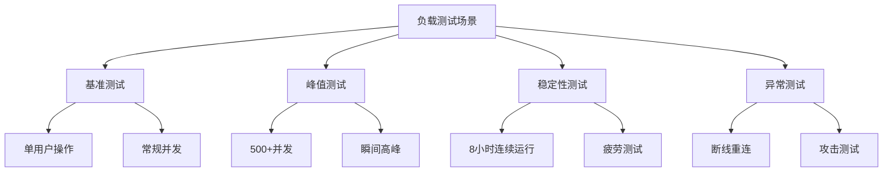
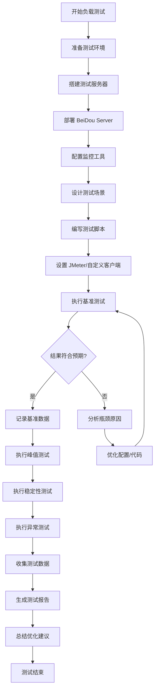
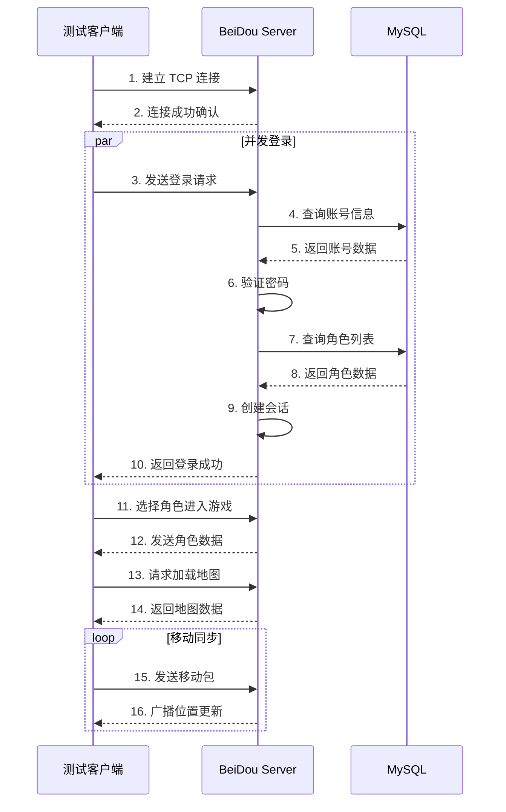
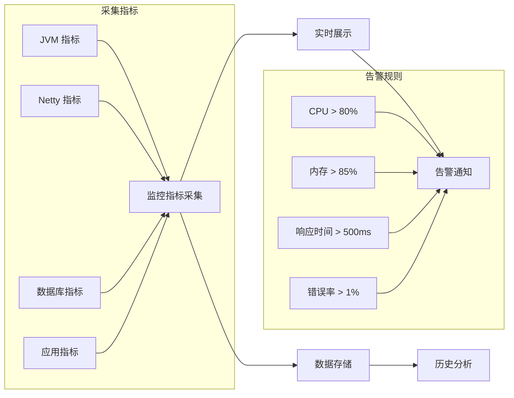

# 负载测试

## 1. 负载测试概述

负载测试是评估系统在预期负载条件下的性能、稳定性和响应能力的测试方法。对于 MapleStory 游戏服务器模拟器而言，负载测试尤为重要，因为游戏服务器需要同时处理大量玩家的并发连接、数据包收发、地图状态同步等复杂操作。

### 1.1 项目技术背景

| 组件 | 技术 |
|------|------|
| 服务器框架 | Spring Boot 3.2.3 + Undertow |
| 网络通信 | Netty 4.1.109.Final |
| 数据库 | MySQL 8.0+ + Druid 连接池 |
| 脚本引擎 | GraalVM JavaScript |
| JDK版本 | Java 21 |

### 1.2 负载测试的重要性

- **验证系统稳定性**：确保服务器在高并发情况下不会崩溃
- **识别性能瓶颈**：发现数据库查询、网络IO、内存使用等问题
- **优化资源配置**：为 JVM 参数、连接池大小等提供数据支撑
- **保障用户体验**：确保玩家在高峰期仍能获得流畅的游戏体验

---

## 2. 测试目标

### 2.1 主要目标

1. **并发连接能力**：验证服务器最大可承载的并发玩家数量
2. **吞吐量测试**：测量服务器处理请求的能力（TPS）
3. **响应时间**：评估各种操作的响应延迟
4. **资源使用**：监控 CPU、内存、网络、数据库连接池的使用情况
5. **稳定性测试**：长时间运行下的系统稳定性

### 2.2 测试指标

| 指标 | 目标值 | 说明 |
|------|--------|------|
| 最大并发连接数 | ≥ 500 | 同时在线玩家数量 |
| 登录响应时间 | ≤ 200ms | 从发起登录到进入游戏的时间 |
| 角色移动延迟 | ≤ 50ms | 位置同步延迟 |
| 战斗操作延迟 | ≤ 100ms | 攻击、技能释放延迟 |
| CPU 使用率 | ≤ 80% | 峰值时不超过 80% |
| 内存使用率 | ≤ 85% | 避免 OOM 风险 |
| 数据库连接池使用 | ≤ 70% | 连接池峰值使用率 |

---

## 3. 测试工具

### 3.1 推荐工具

#### 3.1.1 网络压测工具

| 工具 | 用途 | 特点 |
|------|------|------|
| **JMeter** | 综合压测 | 支持多种协议，可扩展插件 |
| **wrk/wrk2** | HTTP 压测 | 高性能，轻量级 |
| **Netty** | 自定义客户端 | 模拟游戏数据包 |

#### 3.1.2 Java 性能分析工具

| 工具 | 用途 | 特点 |
|------|------|------|
| **JProfiler** | 性能分析 | 功能全面，可视化 |
| **VisualVM** | 监控诊断 | JDK 内置，轻量级 |
| **Async-profiler** | CPU/内存分析 | 低开销，生产可用 |

#### 3.1.3 数据库压测工具

| 工具 | 用途 | 特点 |
|------|------|------|
| **Sysbench** | MySQL 压测 | 高性能，支持 OLTP |
| **mysqlslap** | MySQL 压测 | MySQL 内置工具 |

### 3.2 环境准备

```bash
# 1. 安装 JMeter
# 下载地址: https://jmeter.apache.org/download_jmeter.cgi

# 2. 安装 wrk (Linux/Mac)
# Ubuntu: sudo apt-get install wrk
# Mac: brew install wrk

# 3. 克隆或下载游戏客户端模拟器项目
git clone https://github.com/BeiDou-Server/GameSimulator.git
```

---

## 4. 测试场景设计

### 4.1 测试场景分类



### 4.2 场景说明

#### 场景一：基准测试
- **目的**：获取系统正常负载下的性能基线
- **并发用户**：50-100 人
- **持续时间**：30 分钟
- **操作比例**：登录 10%，移动 40%，战斗 30%，交易 10%，其他 10%

#### 场景二：峰值测试
- **目的**：验证系统在极限负载下的表现
- **并发用户**：500-1000 人
- **持续时间**：10 分钟
- **操作比例**：登录 30%，移动 30%，战斗 25%，其他 15%

#### 场景三：稳定性测试
- **目的**：验证长时间运行的稳定性
- **并发用户**：200 人
- **持续时间**：8-24 小时
- **关注点**：内存泄漏、连接池泄漏、性能衰减

#### 场景四：异常测试
- **目的**：验证系统在异常情况下的表现
- **测试内容**：断线重连、瞬时高峰、网络延迟

---

## 5. 测试用例

### 5.1 登录压测

```java
/**
 * 登录压力测试用例
 * 测试服务器处理大量并发登录的能力
 */
public class LoginLoadTest {

    @Test
    @Parameters({"threadCount", "loopCount"})
    public void testConcurrentLogin(int threadCount, int loopCount) {
        ExecutorService executor = Executors.newFixedThreadPool(threadCount);
        CountDownLatch latch = new CountDownLatch(threadCount * loopCount);
        AtomicInteger successCount = new AtomicInteger(0);
        AtomicInteger failCount = new AtomicInteger(0);
        List<Long> responseTimes = Collections.synchronizedList(new ArrayList<>());

        long startTime = System.currentTimeMillis();

        for (int i = 0; i < threadCount; i++) {
            executor.submit(() -> {
                for (int j = 0; j < loopCount; j++) {
                    long requestTime = System.currentTimeMillis();
                    try {
                        LoginResponse response = loginServer.login("player_" + j, "password");
                        long responseTime = System.currentTimeMillis() - requestTime;
                        responseTimes.add(responseTime);
                        if (response.isSuccess()) {
                            successCount.incrementAndGet();
                        } else {
                            failCount.incrementAndGet();
                        }
                    } catch (Exception e) {
                        failCount.incrementAndGet();
                    }
                    latch.countDown();
                }
            });
        }

        latch.await(10, TimeUnit.MINUTES);
        long duration = System.currentTimeMillis() - startTime;

        // 输出结果
        printResults("登录压测", threadCount * loopCount, successCount.get(),
                     failCount.get(), responseTimes, duration);
    }

    private void printResults(String testName, int total, int success,
                              int fail, List<Long> responseTimes, long duration) {
        System.out.println("=== " + testName + " 结果 ===");
        System.out.println("总请求数: " + total);
        System.out.println("成功: " + success + ", 失败: " + fail);
        System.out.println("成功率: " + (success * 100.0 / total) + "%");
        System.out.println("耗时: " + duration + "ms");
        System.out.println("TPS: " + (total * 1000.0 / duration));

        DoubleSummaryStatistics stats = responseTimes.stream()
            .mapToDouble(Long::doubleValue).summaryStatistics();
        System.out.println("平均响应时间: " + stats.getAverage() + "ms");
        System.out.println("最大响应时间: " + stats.getMax() + "ms");
        System.out.println("最小响应时间: " + stats.getMin() + "ms");
        System.out.println("P99响应时间: " + getPercentile(responseTimes, 99) + "ms");
    }
}
```

### 5.2 角色移动同步测试

```java
/**
 * 角色移动同步压测
 * 测试地图服务器处理大量玩家同时移动的能力
 */
@Test
public void testCharacterMovement() {
    int playerCount = 500;
    int durationSeconds = 60;
    AtomicLong totalMovePackets = new AtomicLong(0);

    NettyClient[] clients = new NettyClient[playerCount];
    ExecutorService executor = Executors.newFixedThreadPool(10);

    // 初始化客户端连接
    for (int i = 0; i < playerCount; i++) {
        clients[i] = new NettyClient("localhost", 8484);
        clients[i].connect();
    }

    // 记录每个玩家的移动次数
    ConcurrentHashMap<Integer, AtomicLong> playerMoveCounts = new ConcurrentHashMap<>();

    // 开始移动测试
    long startTime = System.currentTimeMillis();
    CountDownLatch latch = new CountDownLatch(playerCount);

    for (int i = 0; i < playerCount; i++) {
        final int playerId = i;
        executor.submit(() -> {
            try {
                long moveCount = 0;
                long endTime = startTime + (durationSeconds * 1000);

                while (System.currentTimeMillis() < endTime) {
                    // 发送移动数据包
                    MovePacket packet = new MovePacket(
                        playerId,
                        generateRandomPosition(),
                        System.currentTimeMillis()
                    );
                    clients[playerId].sendPacket(packet);
                    moveCount++;

                    // 模拟移动间隔 (50-100ms)
                    Thread.sleep(50 + new Random().nextInt(50));
                }

                totalMovePackets.addAndGet(moveCount);
                playerMoveCounts.put(playerId, new AtomicLong(moveCount));
            } catch (Exception e) {
                e.printStackTrace();
            } finally {
                latch.countDown();
            }
        });
    }

    latch.await();
    long totalDuration = System.currentTimeMillis() - startTime;

    // 输出结果
    System.out.println("=== 移动同步测试结果 ===");
    System.out.println("玩家数量: " + playerCount);
    System.out.println("总移动次数: " + totalMovePackets.get());
    System.out.println("总耗时: " + totalDuration + "ms");
    System.out.println("移动 TPS: " + (totalMovePackets.get() * 1000 / totalDuration));

    // 清理
    for (NettyClient client : clients) {
        client.disconnect();
    }
    executor.shutdown();
}
```

### 5.3 战斗操作压测

```java
/**
 * 战斗操作压测
 * 测试服务器处理攻击、技能释放等战斗操作的能力
 */
@Test
public void testCombatOperations() {
    int playerCount = 200;
    int monsterCount = 1000;
    AtomicLong totalAttackPackets = new AtomicLong(0);
    AtomicLong totalSkillPackets = new AtomicLong(0);

    // 模拟玩家和怪物
    List<Player> players = createPlayers(playerCount);
    List<Monster> monsters = createMonsters(monsterCount);

    ExecutorService executor = Executors.newFixedThreadPool(20);

    long startTime = System.currentTimeMillis();

    // 玩家攻击测试
    for (Player player : players) {
        executor.submit(() -> {
            while (System.currentTimeMillis() - startTime < 60000) {
                Monster target = monsters.get(new Random().nextInt(monsters.size()));
                AttackPacket packet = new AttackPacket(
                    player.getId(),
                    target.getId(),
                    AttackType.NORMAL_ATTACK,
                    System.currentTimeMillis()
                );
                player.sendPacket(packet);
                totalAttackPackets.incrementAndGet();

                // 随机释放技能
                if (new Random().nextInt(10) < 3) {
                    SkillPacket skillPacket = new SkillPacket(
                        player.getId(),
                        player.getSelectedSkillId(),
                        target.getId()
                    );
                    player.sendPacket(skillPacket);
                    totalSkillPackets.incrementAndGet();
                }

                Thread.sleep(100 + new Random().nextInt(100));
            }
        });
    }

    Thread.sleep(60000);
    long duration = System.currentTimeMillis() - startTime;

    System.out.println("=== 战斗操作压测结果 ===");
    System.out.println("攻击总次数: " + totalAttackPackets.get());
    System.out.println("技能总次数: " + totalSkillPackets.get());
    System.out.println("攻击 TPS: " + (totalAttackPackets.get() * 1000 / duration));
    System.out.println("技能 TPS: " + (totalSkillPackets.get() * 1000 / duration));
}
```

### 5.4 数据库连接池测试

```sql
-- 数据库连接池压力测试
-- 使用 Sysbench 进行 OLTP 混合读写测试

-- 1. 准备测试数据
sysbench /usr/share/sysbench/oltp_read_write.lua \
    --db-driver=mysql \
    --mysql-host=localhost \
    --mysql-port=3306 \
    --mysql-user=root \
    --mysql-password=your_password \
    --mysql-db=beidou \
    --table-size=100000 \
    --tables=10 \
    prepare

-- 2. 运行混合读写测试
sysbench /usr/share/sysbench/oltp_read_write.lua \
    --db-driver=mysql \
    --mysql-host=localhost \
    --mysql-port=3306 \
    --mysql-user=root \
    --mysql-password=your_password \
    --mysql-db=beidou \
    --table-size=100000 \
    --tables=10 \
    --threads=50 \
    --time=300 \
    run

-- 3. 清理测试数据
sysbench /usr/share/sysbench/oltp_read_write.lua \
    --db-driver=mysql \
    cleanup
```

---

## 6. 结果分析

### 6.1 性能指标分析

#### 6.1.1 响应时间分析

| 指标 | 计算方法 | 性能评估 |
|------|----------|----------|
| 平均响应时间 (AVG) | 所有响应时间之和 / 请求数 | 越低越好 |
| 中位数 (P50) | 50% 请求的响应时间 | 反映典型用户体验 |
| P95 | 95% 请求的响应时间 | 关注高百分位 |
| P99 | 99% 请求的响应时间 | 关注极端情况 |
| 最大响应时间 | 最慢请求的响应时间 | 排查异常情况 |

#### 6.1.2 吞吐量分析

```bash
# 使用 JMeter 分析结果
# 生成 HTML 报告
jmeter -g results.jtl -o /path/to/report

# 使用命令行分析
grep -E "^[0-9]" results.jtl | awk -F',' '{sum+=$2; count++} END {
    print "平均响应时间: " sum/count "ms"
}'
```

### 6.2 瓶颈识别

#### 6.2.1 CPU 瓶颈

**特征**：
- CPU 使用率持续 90%+
- 请求队列积压
- 响应时间随负载增加而线性增长

**排查命令**：
```bash
# 查看 CPU 使用情况
top -Hp <java_pid>

# 生成火焰图
async-profiler.sh -d 60 -f cpu.svg -e cpu <java_pid>
```

#### 6.2.2 内存瓶颈

**特征**：
- 内存使用率持续 85%+
- Full GC 频繁
- OOM 异常

**排查命令**：
```bash
# 查看内存使用
jstat -gcutil <java_pid> 1000

# 生成内存堆转储
jmap -dump:format=b,file=heap.hprof <java_pid>

# 分析内存泄漏
jhat heap.hprof
```

#### 6.2.3 网络 IO 瓶颈

**特征**：
- Netty Boss/Worker 线程 busy
- 连接建立失败
- 数据包发送延迟

**排查命令**：
```bash
# 查看网络连接状态
netstat -anp | grep <port>

# 查看 Netty 线程状态
jstack <java_pid> | grep Netty
```

#### 6.2.4 数据库瓶颈

**特征**：
- 数据库连接池耗尽
- SQL 执行缓慢
- Druid 监控显示慢 SQL

**排查命令**：
```sql
-- 查看当前连接数
SHOW STATUS LIKE 'Threads_connected';

-- 查看慢查询
SHOW VARIABLES LIKE 'slow_query_log%';
SELECT * FROM mysql.slow_log ORDER BY start_time DESC LIMIT 10;

-- 查看锁等待
SELECT * FROM information_schema.INNODB_LOCK_WAITS;
```

### 6.3 测试报告模板

```markdown
## 负载测试报告

### 测试基本信息
- 测试时间：
- 测试环境：
- 测试人员：
- 测试版本：

### 测试结果汇总

| 指标 | 目标值 | 实际值 | 结果 |
|------|--------|--------|------|
| 最大并发数 | 500 | 520 | ✅ 通过 |
| 登录响应时间 | ≤200ms | 156ms | ✅ 通过 |
| TPS | ≥1000 | 1280 | ✅ 通过 |

### 性能曲线图
[此处插入 TPS、响应时间、CPU 使用率等曲线图]

### 瓶颈分析
[详细描述发现的性能瓶颈及解决方案]

### 优化建议
1. JVM 参数优化建议
2. 数据库连接池配置建议
3. Netty 参数调优建议

### 结论
[总结测试结论和后续计划]
```

---

## 7. 性能基准

### 7.1 硬件基准配置

| 配置项 | 最低配置 | 推荐配置 |
|--------|----------|----------|
| CPU | 4 核 | 8 核+ |
| 内存 | 8GB | 16GB+ |
| 磁盘 | SSD 100GB | SSD 256GB+ |
| 网络 | 100Mbps | 1Gbps |

### 7.2 JVM 参数基准

```bash
# 推荐 JVM 参数配置
java -server \
    -Xms4g \
    -Xmx4g \
    -XX:+UseG1GC \
    -XX:MaxGCPauseMillis=200 \
    -XX:+HeapDumpOnOutOfMemoryError \
    -XX:HeapDumpPath=/path/to/dumps \
    -XX:+PrintGCDetails \
    -XX:+PrintGCDateStamps \
    -Xloggc:/path/to/logs/gc.log \
    -jar BeiDou.jar
```

### 7.3 性能参考数据

基于标准硬件配置（8核CPU、16GB内存、SSD）：

| 场景 | 并发数 | TPS | 平均响应时间 | 说明 |
|------|--------|-----|--------------|------|
| 登录 | 500 | 800-1200 | 100-200ms | 含角色数据加载 |
| 移动同步 | 500 | 5000+ | 10-30ms | 单地图 |
| 战斗操作 | 200 | 2000+ | 30-80ms | 含伤害计算 |
| 物品交易 | 100 | 500-800 | 50-150ms | 含数据库操作 |

### 7.4 连接池配置基准

```yaml
# application.yml 中的 Druid 配置
spring:
  datasource:
    druid:
      # 连接池大小
      initial-size: 10
      min-idle: 10
      max-active: 50

      # 连接获取超时
      max-wait: 60000

      # 连接有效性检测
      validation-query: SELECT 1
      test-while-idle: true
      test-on-borrow: false
      test-on-return: false

      # 空闲连接回收
      time-between-eviction-runs-millis: 60000
      min-evictable-idle-time-millis: 300000
```

### 7.5 Netty 参数配置基准

```java
// Netty 服务器参数配置
public class NettyServerConfig {

    public static EventLoopGroup bossGroup(int threads) {
        return new NioEventLoopGroup(threads);
    }

    public static EventLoopGroup workerGroup(int threads) {
        return new NioEventLoopGroup(threads, new Executors.DefaultThreadFactory("netty-worker")) {
            @Override
            protected Thread newThread(Runnable r, String name) {
                Thread t = super.newThread(r, name);
                t.setPriority(Thread.NORM_PRIORITY);
                return t;
            }
        };
    }

    public static ServerBootstrap getServerBootstrap(EventLoopGroup boss, EventLoopGroup worker) {
        return new ServerBootstrap()
            .group(boss, worker)
            .channel(NioServerSocketChannel.class)
            .option(ChannelOption.SO_BACKLOG, 1024)
            .option(ChannelOption.SO_KEEPALIVE, true)
            .option(ChannelOption.TCP_NODELAY, true)
            .childOption(ChannelOption.SO_KEEPALIVE, true)
            .childOption(ChannelOption.TCP_NODELAY, true)
            .childOption(ChannelOption.SO_SNDBUF, 65536)
            .childOption(ChannelOption.SO_RCVBUF, 65536);
    }
}
```

---

## 8. Mermaid 测试流程图

### 8.1 完整测试流程



### 8.2 并发登录测试流程



### 8.3 性能监控流程



---

## 附录

### A. 常用监控命令

```bash
# JVM 监控
jstat -gcutil <pid> 1000

# 线程 dump
jstack <pid> > thread_dump.txt

# 内存 dump
jmap -dump:format=b,file=heap.hprof <pid>

# 查看 Netty 线程
jstack <pid> | grep -A 5 "Netty"

# 数据库连接状态
mysql -u root -p -e "SHOW STATUS LIKE 'Threads_connected';"
```

### B. 参考资源

- [JMeter 官方文档](https://jmeter.apache.org/usermanual/)
- [Netty 性能调优指南](https://netty.io/wiki/)
- [MySQL 性能优化指南](https://dev.mysql.com/doc/refman/8.0/en/optimization.html)
- [JVM 调优指南](https://docs.oracle.com/en/java/javase/21/gctuning/)

---

*文档版本: 1.0*
*最后更新: 2026-03-27*
