# 项目架构图和流程图

## 1. 系统整体架构图

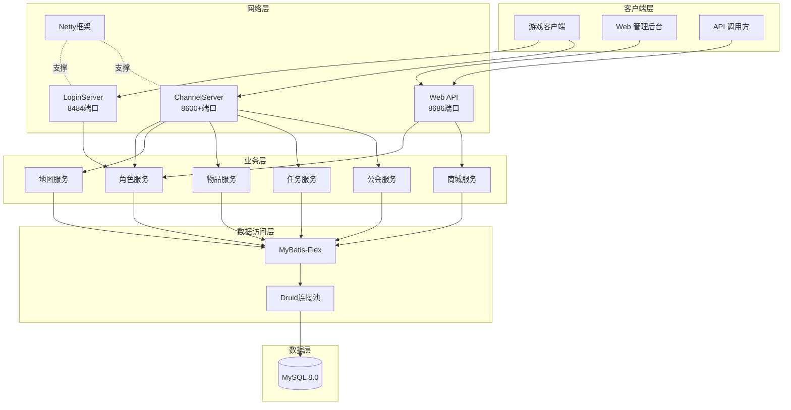

## 2. 服务器架构图

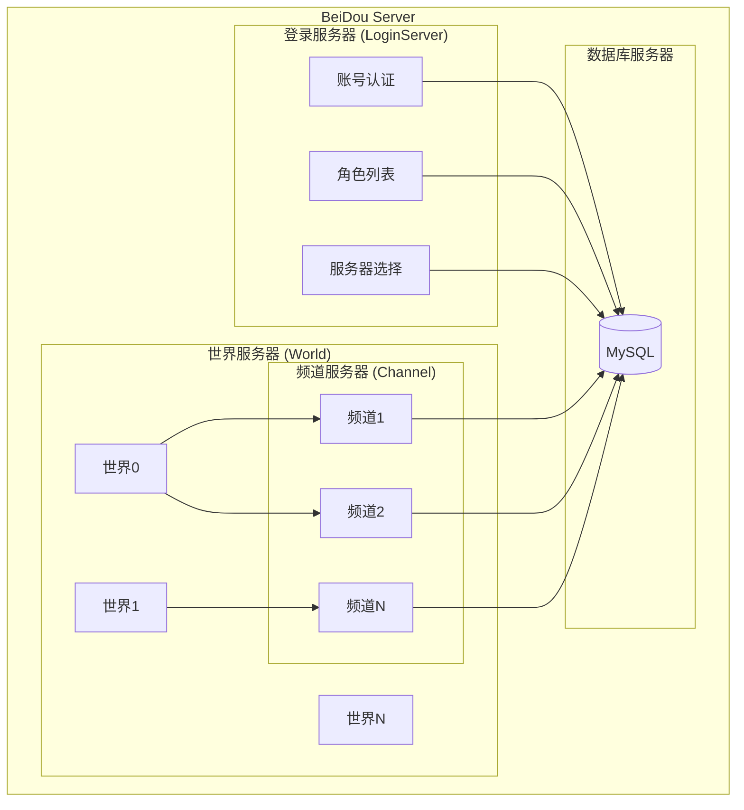

## 3. 玩家登录流程图

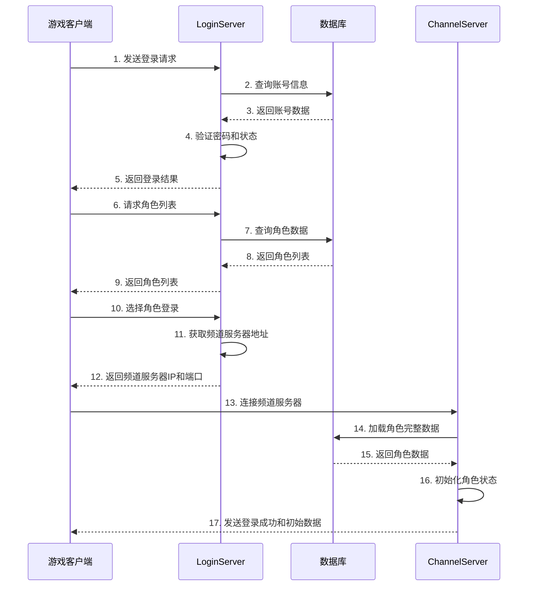

## 4. 封包处理流程图

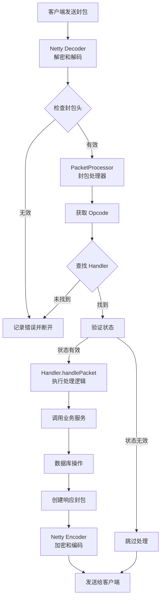

## 5. 角色系统架构图

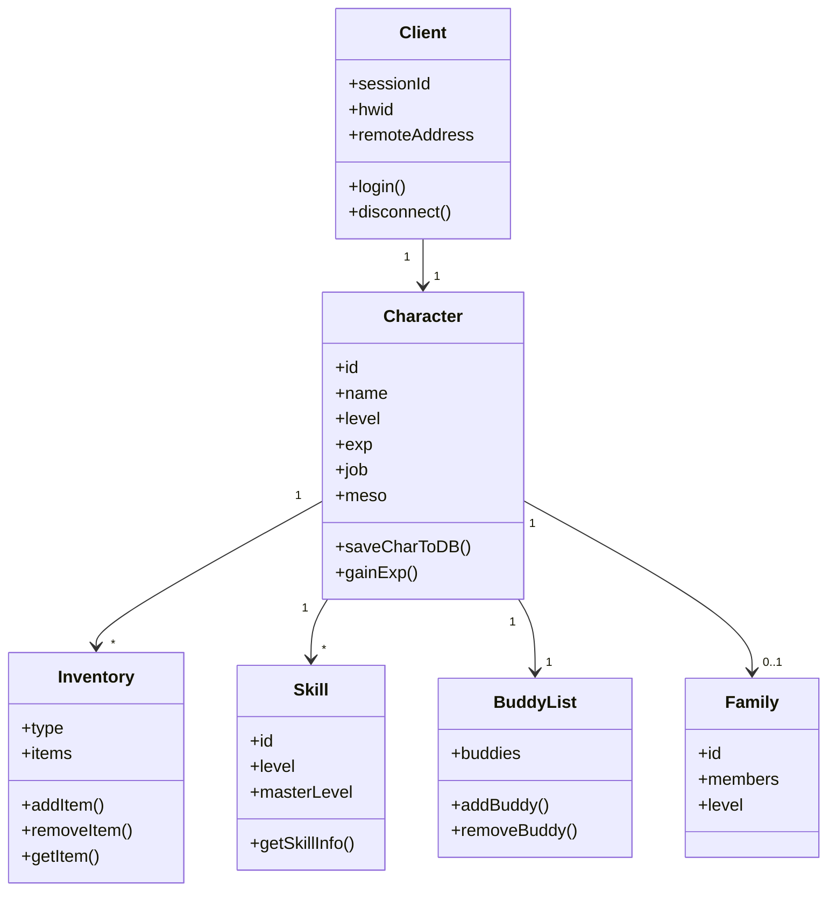

## 6. 地图系统架构图

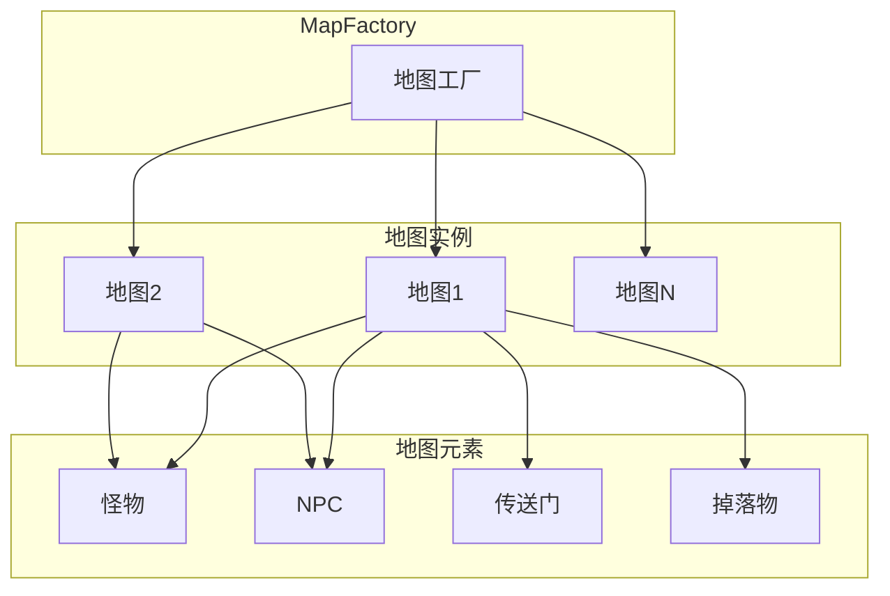

## 7. 公会系统架构图

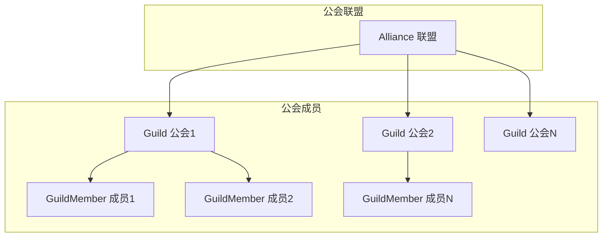

## 8. 脚本执行流程图

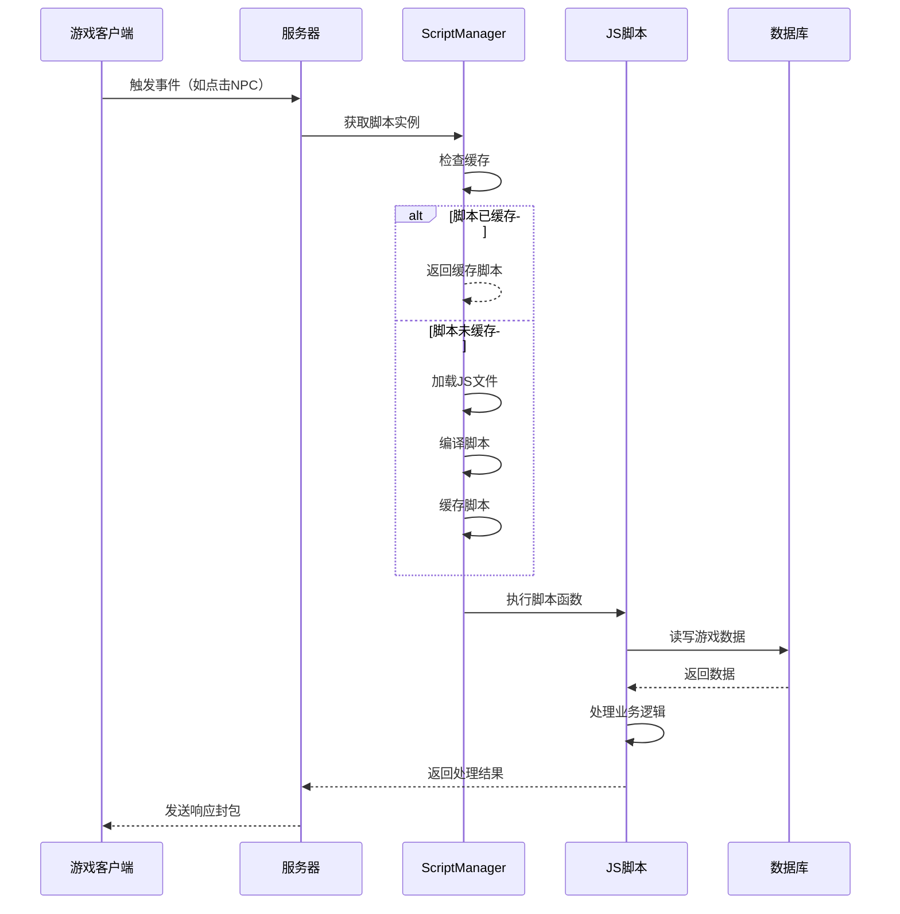

## 9. 任务系统流程图

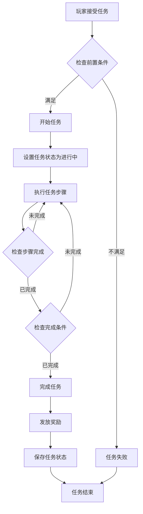

## 10. 数据库访问流程图

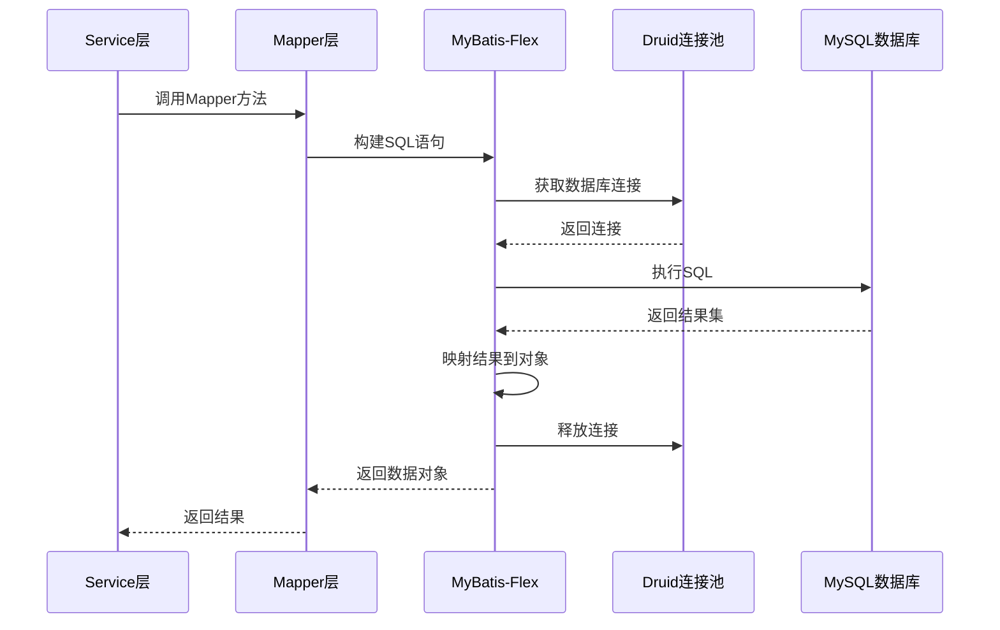

## 11. 并发控制架构图

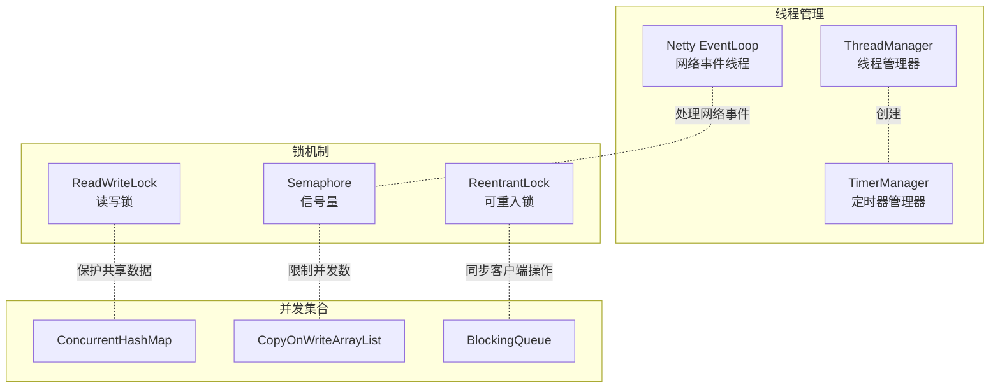

## 12. 系统启动流程图

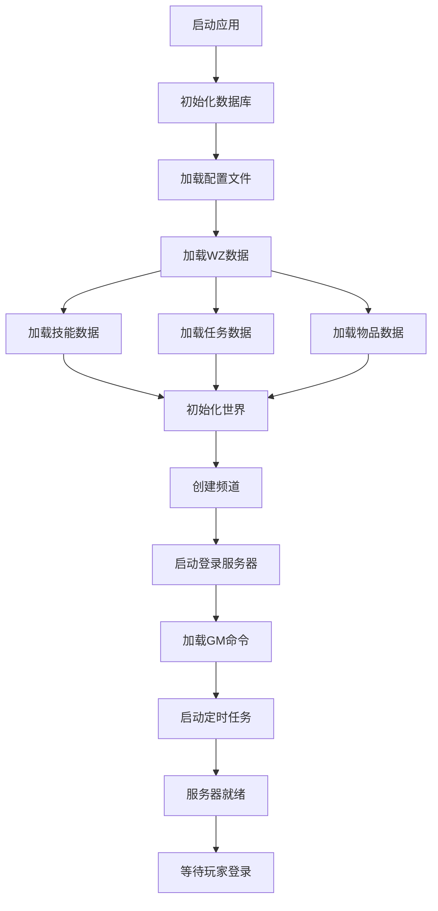

## 13. 玩家切换频道流程图

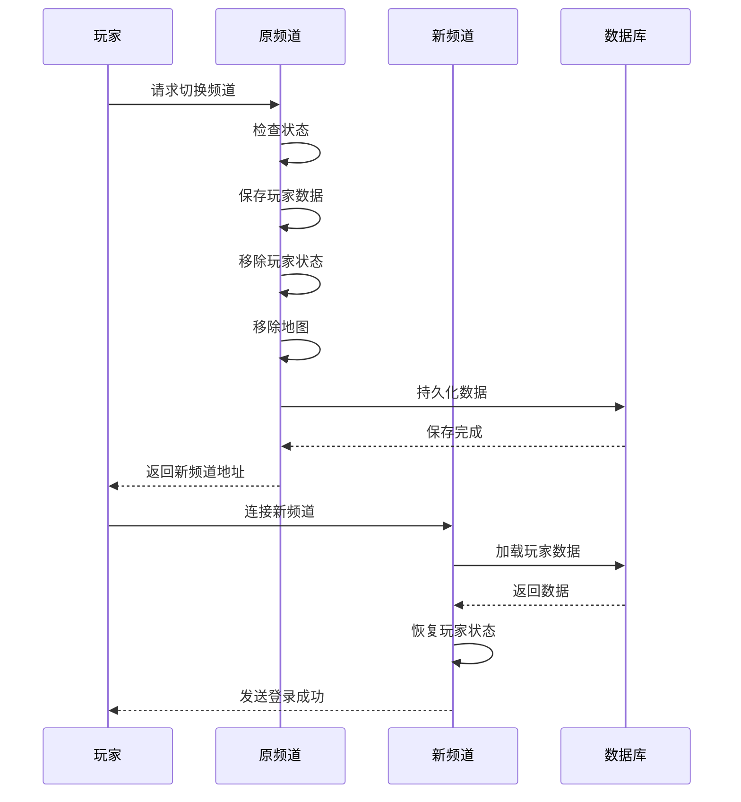

## 14. 物品交易流程图

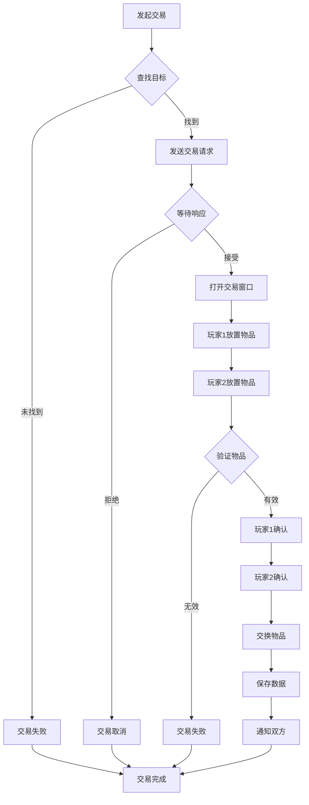

## 15. 怪物AI行为流程图

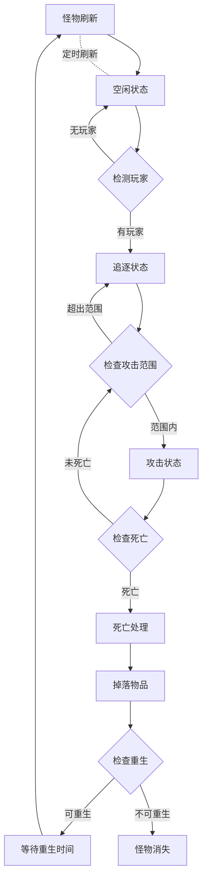

---

*文档版本: 1.0*
*最后更新: 2026-03-25*
*注意: 以上图表使用 Mermaid 语法，支持在支持的 Markdown 查看器中渲染*
