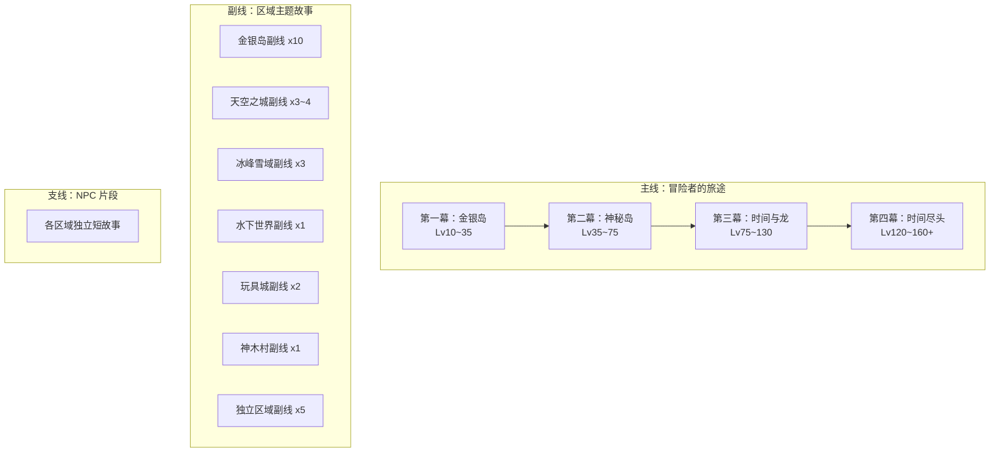

# 冒险岛任务系统重构 — 进度跟踪

## 项目状态

| 阶段 | 内容 | 状态 | 产出文档 |
|------|------|------|---------|
| Phase 0-1 | 第一幕·金银岛细化：主线现状 + 10 条副线 + 支线 + 衔接设计 | **进行中** | [act1-victoria-island.md](act1-victoria-island.md) |
| Phase 0-2 | 第二幕·神秘岛细化：天空之城 + 冰峰雪域 + 水下世界 | 待开始 | act2-ossyria.md |
| Phase 0-3 | 第三幕·时间与龙细化：玩具城 + 神木村 | 待开始 | act3-time-and-dragon.md |
| Phase 0-4 | 第四幕·时间尽头细化：时间神殿 | 待开始 | act4-temple-of-time.md |
| Phase 0-5 | 独立区域副线细化：地球防御总部/武陵/沙漠/童话村/海外 | 待开始 | independent-regions.md |
| Phase 1 | 金银岛副线 XML 实施（parent/order 字段修改） | 待开始 | — |
| Phase 2 | 第一幕→第二幕衔接任务 XML 实施（28283/30040/3042/3043） | **已完成** | wz-zh-CN/Quest.wz/ |
| Phase 3 | 第二幕主线 XML 编排 | 待开始 | — |
| Phase 4 | 第三幕主线 XML 编排 | 待开始 | — |
| Phase 5 | 各区域副线 Boss 线整合与独立区域副线完善 | 待开始 | — |

---

## 设计原则

- **最大化复用**：优先将现有任务编入框架，最小化新建任务
- **不造新实体**：不新增游戏中不存在的 NPC、怪物；尽量不新增物品。所有设计基于现有 WZ 数据中已有的实体
- **因果链条**：每条线的任务之间要有叙事逻辑
- **等级匹配**：Boss 等级与玩家等级差控制在 10 级以内
- **职业共享**：主线和副线不限职业（职业专属内容标注 `[职业限定]`）

---

## 整体架构



## 主线等级路线

```
Lv.1~10    彩虹岛（教程）
Lv.10~35   金银岛（第一幕：职业线 → 地狱大公 Lv32）
    ↓ 记忆者引导 → 维英(3042) → 珂丽尔(3043) → 天空之城
Lv.35~50   天空之城（第二幕·上：城市危机 + 上古魔书前半，无单Boss）
    ↓ 通天塔向下
Lv.45~55   水下世界浅海（第二幕·穿插：海洋异变 → 歇尔夫 Lv45）
    ↓ 通天塔继续向下
Lv.55~75   冰峰雪域（第二幕·下：上古魔书后半 → 雪山魔女 Lv64 → 黑山老妖 Lv74）
    ↓ 阿尔卡斯特引导：前往玩具城
Lv.75~105  玩具城 + 时间之路（第三幕·上：死守玩具城 → 时间门神+黑甲凶灵 Lv108）
    ↓ 时间异变引导：前往神木村
Lv.100~130 神木村（第三幕·下：龙之大陆 → 火焰龙 Lv105 → 大海兽 Lv120）
    ↓ 龙之力量引导：前往时间神殿
Lv.120~160 时间神殿（第四幕：追忆→后悔→忘却 → 品克缤 Lv180）
```

---

## 主线 Boss 总表

| 幕 | 玩家等级 | Boss | Mob ID | Lv | HP |
|---|---|---|---|---|---|
| 一·职业 | Lv20~25 | 印第安老斑鸠 / 沃勒福 / 黑暗独角兽 / 雪之猫女 / 牛魔王 | 9400609~13 | 25 | 2,500 |
| 一·终局 | Lv30~35 | 地狱大公 (Astaroth) | 9400633 | 32 | 180,000 |
| 二·水下穿插 | Lv45~55 | 歇尔夫 (Seruf) | 4220000 | 45 | 7,800 |
| 二·雪域中段 | Lv55~65 | 雪山魔女 (Snow Witch) | 6090001 | 64 | 7,700 |
| 二·雪域终局 | Lv65~75 | 黑山老妖 (Riche) | 6090000 | 74 | 11,000 |
| 三·玩具城 | Lv95~105 | 时间门神 + 黑甲凶灵 | 8160000/8170000 | 108 | 78,000/70,000 |
| 三·神木村 | Lv100~115 | 火焰龙 / 天鹰 | 8180000/8180001 | 105 | 3,700,000 |
| 三·终局 | Lv115~130 | 大海兽 (Leviathan) | 8220003 | 120 | 13,400,000 |
| 四·追忆 | Lv121 | 多多 (Dodo) | — | 121 | 5,900,000 |
| 四·忘却 | Lv131 | 玄冰独角兽 (Lilynouch) | — | 131 | 7,600,000 |
| 四·终极 | Lv141+ | 雷卡 (Lyka) | — | 141 | 9,300,000 |
| 四·最终 | Lv180 | 品克缤 (Pink Bean) | — | 180 | — |

## 可选团队 Boss

| Boss | Lv | HP | 建议等级 |
|---|---|---|---|
| 蝙蝠怪 (Jr. Balrog) | 80 | 50,000 | Lv75+ |
| 驮狼雪人 (Snowman) | 90 | 220,000 | Lv85+ |
| 蝙蝠魔 (Crimson Balrog) | 100 | 100,000 | Lv95+ |
| 皮亚奴斯 (Pianus) | 110 | 30,000,000 | Lv105+ |
| 帕普拉图斯 (Papulatus) | 125 | 23,000,000 | Lv120+ |
| 仙人玩偶 (Master Dummy) | 128 | 15,375,000 | Lv120+ |
| 扎昆 (Zakum) | 140 | 66M~110M | Lv130+ |
| 暗黑龙王 (Horntail) | 160 | 330M+/部位 | Lv155+ |

---

## 第一幕·金银岛（已完成）

详见 [act1-victoria-island.md](act1-victoria-island.md)

### 主线

现有职业任务链（28128~28283）完全保留，不改动。

### 衔接设计

| 步骤 | Quest ID | 任务名 | 改动类型 |
|------|----------|--------|---------|
| 1 | **新建** | 记忆者的发现 | 新建 1 个任务 |
| 2 | 3042 | 转交神秘的材料 | 改编对话 |
| 3 | 3043 | 珂丽尔的忙 | 改编对话，引导至斯皮罗纳 |

### 副线总览（10 条）

| # | 副线 | 等级 | 任务数 | Boss |
|---|------|------|--------|------|
| 1 | 人与妖精 | Lv10~70 | 17 | 浮士德(Lv50) |
| 2 | 金银岛人家 | Lv10~21 | 13 | 无 |
| 3 | 海上堡垒 | Lv10~70 | 27 | 多尔(Lv65) |
| 4 | 蘑菇王国 | Lv30~50 | ~20 | 蘑菇大臣(Lv38) |
| 5 | 林中之城传说 | Lv15~85 | 24 | 蝙蝠怪(Lv80) |
| 6 | 黄金海岸 | Lv35~55 | 9 | 巨居蟹(Lv55) |
| 7 | 勇士部落 | Lv10~52 | 21 | 树妖王(Lv35) |
| 8 | 阿赫的愿望 | Lv35~50 | 23 | 摇滚之魂 |
| 9 | 玛亚与小狮子 | Lv15~50 | 14 | 无 |
| 10 | 帮助废弃都市的居民们 | Lv15~40 | 13 | 无 |

### 新建/改编任务清单

| Quest ID | 任务名 | 类型 |
|----------|--------|------|
| **新建** | 记忆者的发现 | 主线衔接 |
| **新建** | 她的名字 | 副线10·废都居民 |
| **新建** | 最后的温暖 | 副线10·废都居民 |
| 3042 改编 | 转交神秘的材料 | 主线衔接 |
| 3043 改编 | 珂丽尔的忙 | 主线衔接 |
| 2024~2028 改编 | 诅咒娃娃系列 → 调查/追踪/封印链 | 副线1·人与妖精 |
| 8051 改编 | 未知的恋情 → 安魂仪式 | 副线10·废都居民 |

---

## 第二幕·神秘岛（待细化）

核心复用素材：上古魔书主线 (3004~3035，32 个任务)

- 2.1 天空之城篇（Lv35~50）：城市危机 + 上古魔书前半
- 2.2 水下世界篇（Lv45~55）：海洋异变调查
- 2.3 冰峰雪域篇（Lv55~75）：上古魔书后半 → 雪山魔女 → 黑山老妖

副线：波达与何克 / 食人花果汁 / 阿尔法部队 / 女神之塔 / 猎人斯卡德 / 冰雪匠人 / 扎昆之路 / 深海之谜

## 第三幕·时间与龙（待细化）

- 3.1 玩具城篇（Lv75~105）：时间塔修复 + 死守玩具城(7100~7103)
- 3.2 神木村篇（Lv100~130）：龙之巢穴探索

副线：玩具工厂 / 克林的记忆

## 第四幕·时间尽头（待细化）

时间神殿现有 40 个任务，按追忆→后悔→忘却三阶段递进。

## 独立区域副线（待细化）

| 区域 | 等级 | Boss 递进 |
|------|------|---------|
| 地球防御总部 | Lv40~65 | MT-09(Lv54) → 朱诺(Lv65) |
| 武陵+百草堂 | Lv40~80 | 巨型蜈蚣(Lv50) → 肯德熊(Lv71) → 妖怪禅师(Lv77) |
| 阿里安特+玛加提亚 | Lv20~85 | 大宇(Lv38) → 吉米拉(Lv85) |
| 童话村 | Lv35~70 | 鬼怪(Lv70) + 九尾狐(Lv70) |
| 海外 | Lv10~110 | 幽灵船长(Lv100) 等 |
