# 金银岛（Victoria Island）主要 NPC 人物画像与关系图谱

> 本文档基于 WZ 游戏数据（任务对话、NPC 脚本）系统性提取与整理，覆盖金银岛 7 大区域共 55 位主要剧情 NPC。
> 所有引用台词均为游戏内原文。排除出租车、仓库、快乐百宝箱、杜宜、枫叶电视、管理员、NANA、导游妮妮、科迪等通用系统/功能 NPC。

---

## 目录

1. [明珠港（Lith Harbor）](#明珠港)
2. [射手村（Henesys）](#射手村)
3. [勇士部落（Perion）](#勇士部落)
4. [魔法密林（Ellinia）](#魔法密林)
5. [废弃都市（Kerning City）](#废弃都市)
6. [林中之城（Sleepywood）](#林中之城)
7. [诺特勒斯号（Nautilus Harbor）](#诺特勒斯)
8. [跨区域人物关系总图](#跨区域人物关系总图)
9. [附录：NPC ID 对照表](#附录)

---

## 一、明珠港（Lith Harbor, 104000000）

明珠港是冒险者从冒险岛乘船抵达金银岛后的第一站。这里是新旅程的起点，NPC 以引导者和情报提供者为主。

### 1.1 特奥（Teo, NPC 1002001）

- **所在地图**：明珠港
- **职能**：无固定功能性服务，纯剧情/任务 NPC
- **人物形象**：退役的老航海家/冒险家，因关节炎定居明珠港。怀旧、热心，对年轻冒险者有长辈般的关爱。说话直率但不失温情，是个收藏爱好者，对"闪耀的石头"等稀有物品有着执著的热情。
- **核心故事线**：
  - **"玛亚和奇怪的药"系列**（2002→2003→2007→2008）：射手村玛亚身患怪病需要药。玩家受玛亚之托找特奥，特奥要求用"闪耀的石头"交换。玩家辗转勇士部落的索非亚制作后交换，最终将药送回玛亚。串联明珠港—勇士部落—射手村三地。
  - **"特奥的往日回忆"系列**（10030/10031 等）：回忆冒险岁月，考验已转职冒险者的实力。
  - **"小狮子的项链"系列**（8037→8038）：玛亚救治小狮子后请特奥帮忙制作伪装项链。
- **经典台词**：
  - > "在我年轻的时候，也曾经在各地旅行，寻找新的世界。真怀念那时候的时光啊。没有什么事情，比冒险更让人激动的了。"
  - > "噢...这个石头...！就是闪耀的石头吧！！！你到底在哪儿得到了这个石头呢？真了不起的！！！"
- **关联人物**：玛亚（射手村，老友）、索非亚（勇士部落，推荐制作闪耀石头）、坤（明珠港同伴）

### 1.2 坤（Olaf, NPC 1002101）

- **所在地图**：明珠港
- **职能**：新手引导/转职指导
- **人物形象**：爽朗幽默的百科全书式向导，是冒险者踏上金银岛后遇到的第一个重要 NPC。不喜欢"长篇大论"，用问答方式考验新人。对老师（一位传说中的英雄）怀有深深的敬意。
- **核心故事线**：
  - **新手引导线**（1028/1046）：迎接从冒险岛抵达的新手。
  - **转职指导系统**（2081→2077/2078/2079/2080/2212）：问答教授各职业转职条件，派遣玩家前往对应城镇找转职教官。
  - **环游冒险岛**（8053→8059）：鼓励冒险者周游金银岛各大城镇。
  - **枫叶系列**（9801/9806 等）：老师赠予的枫叶枯萎，委托汉斯调查，揭示传说英雄的秘密。
- **经典台词**：
  - > "复杂的听着头就痛.. 哈哈哈！！简单明了的说明吧？"
  - > "很久以前老师给我的这个枫叶……老师虽然没有说得很明白，但是不管与谁相比他都是出色的英雄。"
- **关联人物**：汉斯（魔法密林，枫叶调查委托）、各城镇转职教官（武术教练/赫丽娜/达克鲁/凯琳）

### 1.3 简（Jane, NPC 1002100）

- **所在地图**：明珠港
- **职能**：完成任务链后开放药水商店
- **人物形象**：充满梦想的元气少女。最初渴望冒险但被父亲反对，务实地转变方向立志成为炼金术士——"非常非常优秀的炼金术士！总有一天，我一定超过勇士部落的素菲亚姐！"
- **核心故事线**：
  - **"简和野猪"**（2010）：想用收集物向父亲证明实力，但父亲仍不同意。
  - **"炼金术士，简"系列**（2011→2012→2013）：三次挑战递增难度，从零学习炼金术，最终在明珠港开设药水店。
- **经典台词**：
  - > "后来我放弃了当冒险家的理想，我有了一个新的梦想……我的新梦想是想当非常非常优秀的炼金术士！"
- **关联人物**：索非亚（勇士部落，偶像与超越目标）

### 1.4 比尔（Phil, NPC 1002000）

- **所在地图**：明珠港
- **职能**：城镇向导 + 付费传送
- **人物形象**：明珠港的"活地图"，对金银岛各城镇有详尽了解。对新手提供九折优惠，已转职者全价。脚本中包含对金银岛所有城镇最详细的中文描述。
- **经典台词**：
  - > "你所在的城镇是明珠港！……明珠港是你乘坐维多利亚号登陆金银岛的地方。很多刚从彩虹岛来到这里的新手都会在这里开始他们的旅程。"

### 1.5 智慧爷爷（Mr. Goldstein, NPC 1002003）

- **所在地图**：明珠港
- **职能**：好友名单管理员
- **人物形象**：精明的老商人，推销好友列表扩展服务（24 万金币 / 5 个位置）。被拒绝时会用半开玩笑的方式挖苦。
- **经典台词**：
  - > "我明白了...你的朋友似乎没有我想象的那么多。哈哈哈，开玩笑的！"

### 1.6 吉夫（Chef, NPC 1002006）

- **所在地图**：明珠港
- **职能**：厨师
- **人物形象**：朴实重情义的厨师，对自己手工制作的炸酱面得意洋洋。情人节期间以"单身炸酱面"回报帮他度过节日的冒险者。
- **经典台词**：
  - > "来，拿着，这就是我吉夫大人纯手工制作的特别炸酱面。啧啧，像我做的这么好吃的炸酱面，你上哪儿找去啊~"

### 1.7 明珠港人物关系

- **坤 ↔ 特奥**：明珠港两大核心，坤负责"引进来"（迎接新手），特奥负责"送出去"（通过任务链将玩家引向其他城镇）。
- **特奥 → 玛亚（射手村）→ 索非亚（勇士部落）**：通过"奇怪的药"任务线连成跨区域剧情线。
- **简 → 索非亚（勇士部落）**：简以索非亚为目标偶像。
- **坤 → 汉斯（魔法密林）**：枫叶系列任务将明珠港与魔法密林连接。

---

## 二、射手村（Henesys, 100000000）

射手村是金银岛的中心小镇，以温暖的社区氛围著称。长老斯坦一家是村庄的精神支柱。

### 2.1 长老斯坦（Chief Stan, NPC 1012003）

- **所在地图**：射手村
- **职能**：射手村长老（村长）
- **人物形象**：外表严肃、固执且威严的老者，实则内心柔软、深爱家人。妻子已故，有两个儿子（亚华和阿勒斯）。喜欢用考验测试来访者的诚意，被真诚打动后会爽朗大笑。隐藏的音乐爱好者。
- **核心故事线**：
  - **阿勒斯故事线（2014→2015→2016）**：小儿子因严厉管教离家出走，玩家调解后斯坦交出亡妻金表作为和解信物。
  - **射手村袭击事件（28169→28178）**：被不明势力袭击后武断认定是勇士部落所为，最终承认冲动道歉。
  - **远古之弓传说（28228→28229）**：对金银岛传说了然于胸，亲手制作陶笛帮弓箭手与妖精结交。
- **经典台词**：
  - > "想跟我说说话？我是这个村落的长老，没有时间跟你这样的小家伙聊天。实在想跟我聊聊，就帮我收集守护村落所需的物品吧。"
  - > "是的...你说得对。我是这个村的长老...但是自从阿勒斯离家出走后我的威信不如以前了！"
- **关联人物**：亚华（长子）、阿勒斯（次子，废弃都市）、明明女士（老友）、赫丽娜（转职官）

### 2.2 亚华（Jay, NPC 1012109）

- **所在地图**：射手村
- **职能**：学者、历史学家，长老斯坦的长子
- **人物形象**：温文尔雅的书生气质，沉迷冒险岛历史典籍。以知识为武器，正在撰写新的冒险岛历史书。
- **核心故事线**：
  - **鲍勃·斯奈尔之谜（4928）**：古书中反复出现的名字竟然是一只绿色的蜗牛。
  - **黑暗中的玩偶/灵魂（8061→8068）**：调查僵尸娃娃与灵魂的联系，最终领悟到怪物是"人类不再怀有真挚情感时创造出来的"。
  - **枫叶的主人（9802→9805）**：从古文献中解读枫叶传说。
- **经典台词**：
  - > "通常，这些怪物是在人类不再对它们怀有真挚的情感时创造出来的。从现在开始，我真心希望我们每个人都珍惜我们的周围环境..."
- **关联人物**：长老斯坦（父亲）、阿勒斯（弟弟）、皮亚（借书关系）、布鲁斯（学术交流）

### 2.3 玛亚（Maya, NPC 1012101）

- **所在地图**：射手村民宅（100000001）
- **职能**：草药师、动物照护者
- **人物形象**：善良温柔却身患怪病的女性，常年卧病在家却依然乐观。拥有超乎常人的慈悲心——明知小狮子是怪物却无法置之不理地救助它。
- **核心故事线**：
  - **奇怪的药（2002→2008）**：长期患病，拜托玩家去明珠港找特奥求药。
  - **小狮子系列（8034→8040）**：她最动人的故事线。秘密照料受伤的小狮子莱昂内尔，为它止血、解毒、制作伪装项链。告别时——"莱昂内尔出来的时候一直回头看我，直到我离得太远看不见为止。我忍住眼泪，笑着让它过去。"
- **经典台词**：
  - > "咳咳...啊...哎呀？是冒险者呀！不好意思我可以请你帮个忙吗？我得了一种奇怪的病，用了很多得药都无效听说是没法治了。"
  - > "莱昂内尔出来的时候一直回头看我，直到我离得太远看不见为止。我忍住眼泪，笑着让它过去。"
- **关联人物**：特奥（明珠港，提供药方）、莱昂内尔（收养的小狮子）

### 2.4 明明女士（Mrs. Ming Ming, NPC 1012106）

- **所在地图**：射手村
- **职能**：裁缝、节庆总协调、草药制作
- **人物形象**：射手村最忙碌的女性，永远在为节日做准备。心灵手巧——缝礼服、做装饰品、调配治疗药剂。是村里的"百事通"，了解每个人的喜好。
- **核心故事线**：
  - **节日准备（2062→2063→2076）**：为射手村庆典忙碌，需从魔法密林胡小姐处取得特制酱油。
  - **长老斯坦的喜好（28170）**：一语道破如何安慰斯坦——制作斯坦海伦吉他。
  - **为凯琳准备礼服（2184→2185）**：老友黑巴克委托她为凯琳做生日礼服。
  - **万圣节活动（9522→9527）**：为孩子们缝制幽灵装、组织糖果配送。
- **经典台词**：
  - > "如果别人沮丧的话，那么你可以做一些能够让他开心的事情，这样才能安慰他。"
- **关联人物**：长老斯坦（深知其喜好的老友）、黑巴克（诺特勒斯老友）、胡小姐（魔法密林，特制酱油）

### 2.5 布鲁斯（Bruce, NPC 1012111）

- **所在地图**：射手村
- **职能**：怪物学家
- **人物形象**：热情而略显冒失的中年科学家，对怪物研究充满激情。有一段令人心碎的过往——女儿伊安在遭遇巨型蘑菇袭击时失散多年。
- **核心故事线**：
  - **蘑菇研究（2088）**：科学分析蘑菇盖和芽孢。
  - **寻找女儿（2092→2093）**：伊安通过"玩具刀"恢复记忆，父女团聚。布鲁斯激动落泪——"噢！真的是...呜...呜...真的是我的女儿啊..."
  - **花蘑菇异常调查（21708→21712）**：用科学方法分析蘑菇异变，发现人偶操控的阴谋。
- **经典台词**：
  - > "年轻人~就是你！那里除了你之外还有谁啊！我是研究这个世界上的怪物和动物的科学家。"
- **关联人物**：伊安（Ayan，失散女儿，在勇士部落）、亚华（学术交流）

### 2.6 卡米拉（Camila, NPC 1012108）

- **所在地图**：射手村
- **职能**：园丁、村民
- **人物形象**：温柔胆小的乡村少女，害怕蓝蜗牛但对远方世界充满憧憬。与童话村笔友小荳保持通信往来。
- **核心故事线**：
  - **玻璃珠（2073）**：因害怕蜗牛不敢亲自送生日礼物给青梅竹马的尤塔。
  - **遗失的信（2099→2102）**：风独眼兽偷走笔友来信，焦急地请玩家前往童话村查看。
- **经典台词**：
  - > "天啊...是个坏消息，朋友说以后可能无法再写信给我了。到底发生了什么事情呢？"
- **关联人物**：尤塔（青梅竹马）、小荳（童话村笔友）

### 2.7 皮亚（Pia, NPC 1012102）

- **所在地图**：射手村公园（100000200）
- **职能**：裁缝世家传人、寻宝爱好者
- **人物形象**：活泼好动、性格火爆的少女。出身裁缝世家，是充满幻想的寻宝迷。有借东西不还的坏习惯。
- **核心故事线**：
  - **蜗牛传说（2153→2156）**：坚信彩虹色蜗牛壳能实现愿望，邀请玩家一同寻宝——"一旦把彩虹色蜗牛壳儿拿到手就你我平分！"
  - **为朋友的礼物（2044→2046）**：需要丽娜手中的红色披风做材料，但丽娜扣住了做抵押。
- **经典台词**：
  - > "有没有听到有关彩虹色蜗牛壳儿的传闻？那是只能从冒险岛的古老的蜗牛哪儿才能得到的宝物。具有实现愿望的能力！"
- **关联人物**：丽娜（好友兼"债权人"）、亚华（借书关系）

### 2.8 丽娜（Rina, NPC 1010100）

- **所在地图**：射手村
- **职能**：厨师、烹饪大师
- **人物形象**：手艺精湛的女厨师，以秘制烤鳗鱼闻名。爽朗但精明务实，皮亚借她东西不还就扣住披风做抵押。
- **核心故事线**：
  - **特制烤鳗鱼的秘密（2021）**：为泰素夫制作高级烤鳗鱼，但关键材料不足。
  - **借物纠纷（2044→2046）**：要求玩家替皮亚还清债务才归还红色披风。
- **经典台词**：
  - > "哼...有点儿问题。其实这不是我借来的，是皮亚先借去了我的一些贵重的东西，拿这个披风做抵押。"
- **关联人物**：皮亚（好友兼"债务人"）、泰素夫（冰峰雪域，烤鳗鱼常客）

### 2.9 赫丽娜（Athena Pierce, NPC 1012100）

- **所在地图**：弓箭手培训中心（100000201，射手村内部）
- **职能**：弓箭手转职官（一转至三转）、弓箭手导师、远古贤者
- **人物形象**：赫丽娜是金银岛最古老的精灵贤者之一，活了数百年却依然身处第一线亲自指导每一位弓箭手学徒。她说话沉稳而温和，在严格的考验中总透着母亲般的期许——"从你的眼神中我看到了一位伟大的弓箭手即将诞生"。她拥有"前辈遗传给我的远古书籍"等古代知识，能修复传说中的所罗门之弓，还能通过心灵对话与魔法密林的汉斯远距离沟通。她曾代养过海盗转职官凯琳的幼年，视凯琳如亲生女儿，这段往事是她少有的柔软面。作为教官，她对弟子的成长始终骄傲又审慎："你才刚刚成为弓箭手没多长时间。我为你感到自豪。"
- **核心故事线**：
  - **弓箭手转职线（一转→二转→三转）**：赫丽娜是弓箭手职业成长全程的掌控者。一转时，她以"这是一个重要且最终的选择"作为告诫，确认玩家等级和属性后赐予弓箭手身份；二转时，她感叹"自从上次见到你以来，你长大了许多。我再也看不到以前那个软弱的家伙"，令玩家携带推荐信去找助教通过实战测试后，在猎人与弩弓手之间做出不可逆的选择；三转时，她安排玩家深入密林秘密通道击败她的分身——"因为她是我的克隆，你可以预料到前方将会是一场艰难的战斗"，取得项链后再转交神秘岛的考官进行第二阶段考验。
  - **新手弓箭手修炼四部曲（2136→2137→2138→2139）**：赫丽娜为初转弓箭手设计了循序渐进的四轮实战修炼。从捕猎16只绿水灵起步，逐步提升到猎杀15只漂漂猪。她对学生的评价从"如果你现在就满足就不可能再进步"到"像你这样成长迅速的弓箭手可不多见"，完整展现了一位导师从严格到欣慰的心路历程。
  - **进阶训练线（2403→28220→28223）**：修炼四部曲完成后，赫丽娜将学员推荐至古董收藏商希尔处接受更高阶的训练——"你的路还很长。为了成为一名真正的弓箭手，你愿意接受更多训练吗？"学员完成希尔的课题后回来报告，赫丽娜颔首认可。她同时也推荐新转职弓箭手去专属修炼场接受炎海的特训。
  - **所罗门之弓与黑暗独角兽线（28236→28237→28238→28259）**：这是赫丽娜最重要的战斗剧情线。达克鲁将获得所罗门之弓的弓箭手转介给赫丽娜，她一眼认出这把传说之弓——"那不是所罗门之弓吗？你怎么得到的？"然而弓的力量已被恶魔夺走，赫丽娜凭借"前辈遗传给我的远古书籍"配合猎魔卷轴成功修复了弓的力量。随后她派遣弟子携带复原的所罗门之弓与黑暗独角兽（Amdusias）展开最终决战。击败恶魔后，赫丽娜并未放松——"虽然消灭了黑暗独角兽，但却感觉到了更强的恶魔的力量。我敢肯定是那个解开黑暗独角兽封印的恶魔发出的。我们必须赶在他解开其他恶魔的封印前找到他。"这条线将她从一位教官升格为恶魔封印守护者。
  - **扔掉的信·凯琳往事（2162→2163→2164）**：赫丽娜个人故事中最动人的章节。玩家从诺特勒斯号船上拾获一封写了一半又扔掉的信，由副船长木拉特转交给赫丽娜。她认出这是凯琳的信，随即回忆起尘封的往事：凯琳的父亲戴斯托奈曾是抵御黑魔法师、守护金银岛的英雄。金银岛与天空之城分离后，戴斯托奈将年幼的凯琳托付给赫丽娜，自己踏上追击黑魔法师之路后从此消失。赫丽娜将凯琳养大，凯琳"勇敢无畏，在发明方面也很有天赋"。直到凯琳在长老会上得知父亲的事迹后不辞而别，四处打听父亲下落。赫丽娜最终托玩家将一个"陈旧的音乐盒"送给凯琳——"凯琳好像因为过去招呼都不打一声就离开了射手村而对我充满愧疚。其实她根本无需如此啊。也许看了这个，她就有勇气回射手村来了。"
  - **寻找上古魔书（3025→3026）**：汉斯派遣冒险者找赫丽娜收集古地图碎片。赫丽娜持有碎片，但坦言"这几百年来想当弓箭手的人消耗了我不少的能力，但最近愿意当弓箭手的人越来越多，我的体力快要耗尽了"，需要2个敏捷水晶来恢复能量。这段对话揭示了她的精灵贤者身份——数百年来持续为冒险者赐予力量，且能与汉斯通过心灵对话交流。
  - **感冒药传递线（28190→28191）**：为角色增添了生活化的一面。赫丽娜也会感冒咳嗽——"（*咳咳*）啊，长老斯坦终于给我制成了感冒药水。赶紧把感冒药水给我！"药到病除后，她关心废都居民也遭受流感困扰，委托玩家将药送往达克鲁处。
  - **蘑菇王国危机（2303）**：赫丽娜收到蘑菇王国的求援，将已二转的弓箭手推荐给蘑菇王国守卫队长。
  - **封印石情报（21754）**：战神（Aran）职业线中，赫丽娜协助寻找封印石线索，提到"几百年来受到冒险岛世界所有弓箭手尊敬的"另一位弓箭手前辈。
- **经典台词**：
  - > "年轻的弓箭手啊，你的成长速度真令人惊叹。从你的眼神中我看到了一位伟大的弓箭手即将诞生。"——新手弓箭手第三次修炼
  - > "凯琳好像因为过去招呼都不打一声就离开了射手村而对我充满愧疚。其实她根本无需如此啊。也许看了这个，她就有勇气回射手村来了。"——赫丽娜的礼物
  - > "这几百年来想当弓箭手的人消耗了我不少的能力，但最近愿意当弓箭手的人越来越多，我的体力快要耗尽了。"——赫丽娜的拜托
- **关联人物**：凯琳（Kyrin，诺特勒斯号船长，养女/精神女儿）、戴斯托奈（Destonen，凯琳之父，抗击黑魔法师的英雄，委托赫丽娜养育凯琳）、长老斯坦（射手村长老，合作关系）、汉斯（Grendel，魔法密林大法师，贤者同僚，可心灵对话）、达克鲁（Dark Lord，废都飞侠教官，所罗门之弓线与感冒药线合作者）、武术教练（Dances with Balrog，勇士部落战士教官，恶魔封印协作）、希尔（Hill，古董收藏商，弓箭手进阶训练委托对象）、炎海（Power B. Fore，弓箭手修炼场教官，赫丽娜的下属）、木拉特（Muirhat，诺特勒斯副船长，扔掉的信转交者）

### 2.10 射手村人物关系

- **斯坦家族**（斯坦—亚华—阿勒斯）：村庄精神支柱，父子矛盾与和解贯穿主线。
- **明明女士 ↔ 斯坦**：最亲密的老友，明明深谙斯坦的性格喜好。
- **赫丽娜**：射手村精神守护者，数百年来以弓箭手培训中心为据点。与斯坦并列为射手村两大核心人物——斯坦是世俗行政领袖，赫丽娜是军事/精神导师。养育了后来成为诺特勒斯号船长的凯琳，与各城镇转职教官（汉斯、达克鲁、武术教练）构成金银岛贤者网络。
- **亚华 ↔ 布鲁斯**：知识双子星，共同研究历史与怪物。
- **布鲁斯 → 伊安（勇士部落）**：失散多年的父女。
- **皮亚 ↔ 丽娜**：性格互补的闺蜜，借物纠葛充满生活喜剧感。
- **玛亚**：独居民宅，救助小狮子的故事是射手村最动人的篇章。

---

## 三、勇士部落（Perion, 102000000）

勇士部落是坐落在荒原高地上的战士聚居地，NPC 大多性格刚毅豪放。

### 3.1 武术教练（Dances with Balrog, NPC 1022000）

- **所在地图**：战士圣殿（102000003）
- **职能**：战士转职官（一转至三转）
- **人物形象**：勇士部落的精神领袖与最高武力象征。语气豪迈而严厉，对弱者直言不讳，对强者不吝赞美。对恶魔封印历史了如指掌，是古老封印传说的守护者。
- **核心故事线**：
  - **战士转职线**（2077→一转→二转→三转）：一手掌控战士成长全程。
  - **新手修炼四部曲**（2128→2131）：连续四轮递进式战斗考验。
  - **印第安老斑鸠封印线**（28166→28179→28257）：揭示地下封印恶魔的秘密。
  - **跨职业协作**：为魔法师揭示水源瘟疫元凶，为弓箭手鉴定所罗门之弓。
- **经典台词**：
  - > "从此刻起，你正式踏上了战士之路。这不是一件容易的事情，但只要你有足够的勇气和信心，你将克服所有的困难。"
  - > "从现在开始我不会再称呼你'小'战士了。对于你这样成长迅速的战士此称呼并不合适。"
- **关联人物**：酋长（同为领导层）、麦吉（独立修炼的老战士）、汉斯（魔法密林，跨区合作）

### 3.2 麦吉（Manji, NPC 1022002）

- **所在地图**：勇士部落
- **职能**：独立武者/隐士
- **人物形象**：孤傲而嘴硬心软的老练战士。驻守石山上常年独自修炼，态度冷淡，称呼冒险者为"傻小子"。通晓怪物语言，能翻译牛魔王的技能书——兼具武力与学识。
- **核心故事线**：
  - **英雄的战剑（2047）**：请求找回曾经救命的旧战剑。
  - **师徒线（2235, 2240-2241）**：担心弟子无影在迷宫中的安危，通过冒险者传递书信。
  - **黑暗契约（3070-3071）**：揭示黑暗契约书能使死者复生的可怕力量。
  - **麦吉的考验（6110）**：为四转战士翻译牛魔王技能书作为最终认可。
- **经典台词**：
  - > "想得到变异蘑菇的血？哈...像你这样小伙子恐怕不太可能。如果不是真正的强者，是不可能把它弄到手的..."
  - > "光阴似箭，日月如梭。但是我可以给你我的旧日记。过去的意义在于传递，而不在于珍藏。"
- **关联人物**：无影（弟子，迷宫中追踪蝙蝠怪）、伊安（暗中关心她）、索非亚（变异蘑菇血供应链）

### 3.3 伊安（Ayan, NPC 1022007）

- **所在地图**：勇士部落
- **职能**：勇士部落少女居民
- **人物形象**：柔弱少女与周围豪放战士形成鲜明对比。胆小怕事却心地善良，小时候遭巨型蘑菇袭击后流落至此。懂得音乐的力量，能制作安抚灵魂的特殊乐器。
- **核心故事线**：
  - **寻找女儿（2092→2093）**：实为布鲁斯走失多年的女儿，通过玩具刀恢复记忆，父女团聚。
  - **用音乐安抚灵魂（28247→28249）**：制作特殊麦克风解开藏宝图上的诅咒。
  - **少女的旧铁剑（9866→9867）**：丢失珍贵铁剑，麦吉透露他知道伊安所寻之人但为保护她而隐瞒。
- **经典台词**：
  - > "呀啊啊啊啊啊~~~~！怎么办？！没了！哪儿都找不到！到底去哪了？"
  - > "啊...这个刀是...想起来了！对！我遭受到可怕的巨型蘑菇攻击，拼命逃跑...没想到会来到这里..."
- **关联人物**：布鲁斯（射手村，亲生父亲）、麦吉（暗中牵挂）、无影（所寻找/挂念的人）、酋长（领导者）

### 3.4 酋长（Blackbull, NPC 1020000）

- **所在地图**：勇士部落
- **职能**：部族领袖
- **人物形象**：政治领袖与大家长，质朴务实略带固执。关心盖房子、修缮家园等接地气的事务。年轻时痴迷藏宝图，浪费过大好时光。
- **核心故事线**：
  - **酋长的房子（2000→2001）**：修缮房屋和盖新房。
  - **藏宝图（28245→28247）**：对藏宝图嗤之以鼻后又按捺不住好奇心，最终引荐伊安解谜。
  - **鬼树传闻（2148）**：转述祖辈口传的古老木妖传说。
- **经典台词**：
  - > "世界上没有什么宝物。你问我怎么知道的？我年轻的时候，也捡到过一张地图，年轻时期的大好时光一大半都浪费在上面了。"
- **关联人物**：武术教练（同为核心）、伊安（求助解谜）

### 3.5 索非亚（Sophia, NPC 1022100）

- **所在地图**：勇士部落杂货店（102000002）
- **职能**：杂货商人，炼金匠人
- **人物形象**：务实热情的女性手艺人，能制作"闪耀的石头"。长期站着工作容易疲劳，偶尔想吃甜食犒劳自己。
- **核心故事线**：
  - **闪耀石头（2003→2007）**：制作闪耀石头需要麦吉提供变异蘑菇血。
  - **索非亚的点心（8084）**：请冒险者收集古木树液作甜点材料。
- **经典台词**：
  - > "天啊！你是怎么得到这些材料的呢？特别是变异蘑菇的血，普通能力的人是决不可能得到的..."
- **关联人物**：麦吉（材料供应链）、特奥（明珠港，闪耀石头的需求方）

### 3.6 勇士部落人物关系

- **武术教练 ↔ 麦吉**：勇士部落"双核"——武术教练制度化培养新人，麦吉以个人考验筛选强者。
- **麦吉 → 无影 → 伊安**：隐藏情感暗线。无影是麦吉弟子，伊安珍藏旧铁剑四处寻找无影，麦吉知情但隐瞒以保护伊安。
- **索非亚 ↔ 麦吉**：围绕"闪耀石头"形成功能性合作。
- **武术教练 ↔ 外部城镇**：跨城安全协作的核心节点——与汉斯合作调查疫病、鉴定传说武器。

---

## 四、魔法密林（Ellinia, 101000000）

魔法密林是妖精与魔法师聚居的森林城镇，核心叙事围绕"妖精与人类的关系"展开。

### 4.1 汉斯（Grendel the Really Old, NPC 1032001）

- **所在地图**：魔法密林图书馆（101000003）
- **职能**：法师转职教官，魔法密林最高权威
- **人物形象**：维多利亚岛资历最深的大法师。年迈而睿智，以"呵呵"的笑声拉近与年轻法师的距离。年轻时研究黑魔法导致诅咒娃娃和冤魂森林等一系列灾难，对此深感自责。
- **核心故事线**：
  - **法师成长线**（2080, 2132-2135, 28180-28198）：从新手到击败牛魔王的终极试炼。
  - **冤魂森林事件**（2222, 2227）：前弟子里弗因失恋走火入魔，制造浮士德。汉斯痛心地为里弗辩护。
  - **妖精森林使者**（2120-2121）：委托送守护圣水给神木村塔塔曼。
  - **飞贼犯罪调查**（28211-28215）：金库被盗后发起调查。
- **经典台词**：
  - > "不要责怪里弗。那个孩子原来性格温和善良...是因为受到了残留在森林里的黑魔法的影响。都是我的错，让这么多人都深受黑魔法的痛苦..."
- **关联人物**：里弗（昔日弟子）、妖精艾温（冤魂森林关键人物）、妖精罗雯（辅佐妖精）、塔塔曼（神木村友人）

### 4.2 妖精艾温（Arwen the Fairy, NPC 1032100）

- **所在地图**：魔法密林
- **职能**：妖精族炼金大师
- **人物形象**：魔法密林最复杂的女性角色。对人类根深蒂固的偏见，对闪亮物品有妖精族特有的执着。在冤魂森林事件中展现复杂的情感深度——从"人类愚不可及"到反思自责。
- **核心故事线**：
  - **冤魂森林事件**（2222→2226）：汉斯弟子里弗暗恋艾温遭拒，在黑魔法影响下制造浮士德。艾温最终剪下头发作为道歉信物——"理性虽然没有说话，但是偶尔也需要倾听感情所说的话。"
  - **艾温的玻璃鞋**（2017）：丢失珍藏玻璃鞋，不情愿地请人类帮忙。
  - **神秘织物**（9987, 9992）：秘密帮人类制作神秘织物——"要是其他妖精知道我帮人类制作的话就糟了。"
- **经典台词**：
  - > "人类真的是愚不可及，完全让人无法信任。"
  - > "我不知道。人类的心，为什么人类的感情会这么激烈？...现在我感到的感情却是负罪感。"
- **关联人物**：里弗（被暗恋的对象，悲剧关系）、汉斯（居间调解者）、易德（用其神秘织物制作披风）

### 4.3 妖精维英（Wing the Fairy, NPC 1032106）

- **所在地图**：魔法密林
- **职能**：年轻妖精学徒，擅长药剂调配
- **人物形象**：傲娇、毒舌、嘴硬心软。对人类第一反应永远是排斥，但听到伊卡路斯的名字后态度 180 度转变。是魔法学校学生，会把作业外包给冒险者。
- **核心故事线**：
  - **伊卡路斯与飞天药水**（2085→2087）：为好友调制飞翔秘药——"伊卡路斯是我唯一的一个人类朋友...既然是受伊卡路斯之托来到这里的，那我就特别为你制作吧。"
  - **帮忙写作业**（2089）：让冒险者替她收集作业材料。
- **经典台词**：
  - > "为什么人类会在这种地方？我不想和人类说话，赶紧离开这里吧。"
  - > "伊卡路斯是我唯一的一个人类朋友..."
- **关联人物**：伊卡路斯（废弃都市，唯一认可的人类朋友）

### 4.4 妖精罗雯（Rowen the Fairy, NPC 1032101）

- **所在地图**：魔法密林
- **职能**：汉斯的辅佐妖精，森林管理员
- **人物形象**：对人类持本能疏离但确认可靠后会坦诚合作。务实尽职，在反复收集任务中不好意思地请求帮助。
- **核心故事线**：
  - **诅咒娃娃系列**（2024→2028）：揭露汉斯年轻时研究黑魔法催生的诅咒娃娃灾难，反复委托封印工作。
  - **远古之弓传说**（28230）：向弓箭手讲述所罗门之弓的传说。
- **经典台词**：
  - > "你应该知道我们妖精族对人类没什么好的感情。你这样麻烦妖精，应该有个正当的理由吧。"
- **关联人物**：汉斯（上司）、泰素夫（唯一的人类朋友）

### 4.5 巴缇（Betty, NPC 1032104）

- **所在地图**：魔法密林
- **职能**：生物学家、化石研究员
- **人物形象**：自信活泼且略带自恋的人类女性学者——"虽然我聪明又漂亮"。是一位单亲母亲。
- **核心故事线**：
  - **化石研究系列**（2066→2070）：接收勇士部落芳博士送来的化石箱，完成研究报告。
  - **飞贼犯罪调查**（28212→28213）：鉴定嫌疑人留下的金色羽毛。
- **经典台词**：
  - > "虽然我聪明又漂亮，但也只是一名凡人。这个东西我更是毫无头绪。"
- **关联人物**：芳博士（勇士部落，学术伙伴）、桉（女儿）

### 4.6 胡小姐（Estelle, NPC 1032105）

- **所在地图**：魔法密林南郊（100050000）
- **职能**：独居料理师
- **人物形象**：温柔念旧的孤独女性。珍视母亲留下的酱油配方。白色情人节"一个朋友都没有"的寂寞让人心疼。
- **核心故事线**：
  - **明明女士的节日料理**（2063→2076）：以石榴石换特制酱油。
  - **白色情人节**（9671）：收不到糖果而消沉，收到关心后感动回赠"单身炸酱面"。
- **经典台词**：
  - > "一个朋友都没有...好寂寞啊！呜呜..."
  - > "这是我母亲给我的，非常贵重的，我不会给别人..."
- **关联人物**：明明女士（射手村，节日料理合作）

### 4.7 易德（Francois, NPC 1032002）

- **所在地图**：魔法密林
- **职能**：法师装备制造师
- **人物形象**：热情自豪的匠人，自称经营"生态安全精炼工厂"。用神秘织物制作枫叶披风。
- **经典台词**：
  - > "成功了！哦，我从来没有感到如此活力四射！"
- **关联人物**：妖精艾温（提供神秘织物）、莉萨（神木村师傅）

### 4.8 妖精玛丽（Mar the Fairy, NPC 1032102）

- **所在地图**：生命之林（101000200）
- **职能**：宠物专家
- **人物形象**：最神秘的妖精，隐居生命之林。语气庄严空灵，将宠物蛋称为"小而宝贵的生命"。
- **经典台词**：
  - > "我把这小而宝贵的生命交给在你的手中...请用你的生命来守护它..."

### 4.9 魔法密林人物关系

**种族关系主题**——四位妖精 NPC 对人类的态度形成谱系：
- **罗雯**：务实合作型——信任建立后坦诚合作
- **维英**：傲娇友善型——嘴上排斥，内心珍视伊卡路斯
- **艾温**：困惑反思型——从偏见到反思，在里弗事件中逐渐理解人心
- **玛丽**：超然守护型——超越种族偏见，平等对待一切生命

**两大核心关系**：
- **艾温与里弗**：跨种族单恋悲剧，里弗因暗恋遭拒被黑魔法侵蚀，艾温最终剪发道歉。
- **维英与伊卡路斯**：跨城市的温暖友谊，傲娇妖精唯独为这个人类少年心软。

---

## 五、废弃都市（Kerning City, 103000000）

废弃都市是暗藏秩序的地下都市，表面破败实际有着完整的社会网络。

### 5.1 达克鲁（Dark Lord, NPC 1052001）

- **所在地图**：废都酒吧（103000003）
- **职能**：飞侠转职官（一转至三转）
- **人物形象**：亦正亦邪、傲慢而不失风度的飞侠大师，自称"达克鲁大爷"。知识渊博、交际广泛，是金银岛"公认最灵通的人"。曾是著名音乐家的隐藏身份增添了神秘色彩。
- **核心故事线**：
  - **飞侠转职线**（2079→2140-2143）：从新人到三转的全程指导。一转时他说"你看起来就很鸡贼，确实像是我们团队的一员"。
  - **沃勒福封印事件**（28216→28219）：分析恶魔弱点，指挥冒险者用钱币诱饵设陷阱。
  - **所罗门之弓/恶魔事件**（28234→28236）：用音乐家身份制作怪兽鼓打开恶魔巢穴。
  - **病毒传播调查**（28191→28193）：发现病毒通过水传播的关键线索。
- **经典台词**：
  - > "成为飞侠并不意味着你已经具备强大的实力，目前的你只不过是脱离了入门阶段的小贼而已。"
  - > "飞侠不是毛贼，而是灵巧、敏捷、高雅、强大的侠客。切记！"
- **关联人物**：赫丽娜（射手村，病毒事件合作）、汉斯（魔法密林，恶魔封印协作）、武术教练（勇士部落，弓之事件转介）

### 5.2 伊卡路斯（Icarus, NPC 1052106）

- **所在地图**：废弃都市
- **职能**：城镇居民，追梦少年
- **人物形象**：废弃都市最纯真的存在——沉迷飞行梦想的少年。乐观到近乎天真，三次失败仍不放弃。害怕三眼章鱼——曾被缠住差点窒息。圣诞节因失眠年年被圣诞老人跳过。
- **核心故事线**：
  - **飞行三部曲**（2083→2084→2085→2087）：滑翔翼"有一点技术上的问题"→热气球"发生了预料之外的问题"→最终求助妖精维英的飞天药水，获得伊卡路斯披风。
  - **日常问答**（2090→2091）：无聊时出问答题——"在废弃都市周围看不到的怪物是？"
  - **圣诞节**（4488→4489）：麋鹿诺古请冒险者送温牛奶帮他入睡。
- **经典台词**：
  - > "如果能在那广阔的天空尽情飞翔那该有多好啊...就算一次也好，真想在天上飞翔啊。"
  - > "男子汉伊卡路斯决不会因为这样就轻易放弃梦想的，哈哈哈哈！"
- **关联人物**：妖精维英（魔法密林，好友，飞天药水制作者）

### 5.3 内拉（Nella, NPC 1052103）

- **所在地图**：废弃都市
- **职能**：情报掮客、居民代言人
- **人物形象**：废弃都市的"消息通"——"没有我不知道的事"。初次见面收取 1000 金币情报费。串联废都各商铺老板的互助网络。嘴上精明，也有浪漫一面——会做关于神秘猫咪的奇幻梦境。
- **核心故事线**：
  - **帮助居民系列**（2029→2034）：以中间人身份逐一介绍城中居民的困难。
  - **神秘猫咪潘喜**（2103）：梦见会说话的条纹猫，引导发现魔法密林的潘喜。
- **经典台词**：
  - > "哟？好像是陌生人嘛！我叫内拉，是这个村落的消息通，没有我不知道的事。如果你有1000金币，我可以给你提供这里的所有情报。"
- **关联人物**：休咪（朋友）、后街吉姆（情报网上线）、废都各商铺 NPC

### 5.4 休咪（Shumi, NPC 1052102）

- **所在地图**：废弃都市
- **职能**：城镇居民
- **人物形象**：叫人好气又好笑的"冒失鬼"，整天丢钱——金币→钞票→钱包。对金钱极度敏感，被称为"货币狂人"。找到钱后还要质疑"你没拿走钱吧？让我数数"。
- **核心故事线**：
  - **丢钱三部曲**（2055→2056→2057）：金币有特殊纪念意义，钞票被黑鳄鱼抢走，钱包掉进地洞。
  - **恶魔陷阱协助**（28217→28218）：提供大型钱币模型作诱饵。
- **经典台词**：
  - > "你没拿走钱吧？让我看看。虽然我怀疑你，但是还要数数。一，二，三，四……"
- **关联人物**：内拉（好友）、达克鲁（恶魔事件配合）

### 5.5 后街吉姆（JM From tha Streetz, NPC 1052002）

- **所在地图**：废弃都市
- **职能**：道具制造者、地下情报网首脑
- **人物形象**：充满"街头智慧"的情报头子，开口就"嘘，小声点"。布设情报传递点、安插线人，像谍战片中的地下工作者。脾气火爆，对拉克里斯极度不满。
- **核心故事线**：
  - **怪物与阴谋系列**（2213→2221）：发现废都下水口出现怪物"多尔"，通过情报网调查，最终揭露拉克里斯是幕后"犯人"——"果然罪犯就是她吧？这个笨女人！绿水灵王还不够，这次又是多尔？"
- **经典台词**：
  - > "……嘘，小声点。可能会有人躲在旁边偷听……"
- **关联人物**：休咪、内拉（情报网线人）、拉克里斯（擅自召唤怪物的冒失者）

### 5.6 阿勒斯（Alex, NPC 1052000）

- **所在地图**：废弃都市
- **职能**：城镇居民，离家出走的少年
- **人物形象**：射手村长老斯坦之子，因与父亲闹矛盾离家出走。典型叛逆少年——嘴硬心软，钱花光才后悔。对自己的红头发引以为傲。收到母亲遗物金表时叛逆外壳碎裂，展露柔软内心。
- **核心故事线**：
  - **离家出走系列**（2014→2015→2016）：请冒险者回射手村说服父亲——"如果我就这样回家，肯定被爸爸打扁的。"斯坦交出亡妻金表后，阿勒斯感慨——"应该妈妈健在的时候多尽点孝道..."
- **经典台词**：
  - > "几天前因为实在受不了我爸爸，我就离家出走了……现在想起来好像离家出走是错的。"
  - > "啊...这金表肯定就是我妈妈的遗物...呼...应该妈妈健在的时候多尽点孝道，现在妈妈去世了后悔也没有用啊..."
- **关联人物**：长老斯坦（射手村，父亲）

### 5.7 不认识的女人（Jane Doe, NPC 1052105）

- **所在地图**：废都医院（103000004）
- **职能**：城镇居民（幽灵/亡魂）
- **人物形象**：废弃都市最悲情的角色——滞留在医院、不知自己已死的女性幽灵。照镜子发现看不到倒影时才恐惧地意识到自己可能已经死亡。反复说"这里太冷了"。然而在绝望中仍萌生爱情。
- **核心故事线**：
  - **闹拉医院的秘密**（2071→2072）：照镜子发现没有倒影——"难道...我已经死了？不会！不会！"尝试用道符复活却只会变成僵尸。
  - **未知的恋情**（8051）：漫长时光后感受到一缕温暖的光——"我想我爱上这里的人了。嘿，你愿意做我的小丘比特吗？"
- **经典台词**：
  - > "啊！！这怎么回事……为什么我照镜子看不到自己？难道……我已经死了？不会！不会！"
  - > "虽然有这个道符，我仍然不能复活，还会变成僵尸……但我绝不会忘记你的帮助。"

### 5.8 废弃都市人物关系

- **达克鲁**：城市灵魂人物，跨城事件的关键协调者。
- **后街吉姆 → 内拉 + 休咪**：地下情报网络，揭露多尔事件真相。
- **内拉**：串联城中商铺 NPC 的中间人。
- **伊卡路斯 ↔ 维英（魔法密林）**：跨城跨种族的纯真友谊。
- **阿勒斯 ↔ 长老斯坦（射手村）**：父子和解，母亲遗物金表为纽带。
- **不认识的女人**：城市最深处的悲剧符号。

---

## 六、林中之城（Sleepywood, 105040300）

林中之城位于金银岛地下深处，是通往蚂蚁洞穴、迷宫等危险区域的门户，栖居着性格迥异的隐者群体。

### 6.1 记忆者（The Rememberer, NPC 1061011）

- **所在地图**：林中之城
- **职能**：迷宫任务管理者、蘑菇生态研究者
- **人物形象**：修行"空中漂浮术"的隐士，沉静专注，对环境异变有敏锐洞察。博学而谨慎，确认来者身份后才愿分享情报。
- **核心故事线**：
  - **迷宫守护者**（2105→2115）：接收迷宫通缉任务战果。
  - **蘑菇信号研究**（2246→2257）：发现蘑菇死去时发出的奇特声音，引出蘑菇城线索。
  - **骑士团情报线**（20726）：提供关于人偶师少年的关键情报。
- **经典台词**：
  - > "嘘！安静！我必须集中精神，因为修练空中漂浮术一不小心就会前功尽弃的。"
  - > "最近你看到刺蘑菇了吗？不知道为什么，它们好像比平时更凶暴了..."
- **关联人物**：卡乐卡萨（沙漠情报贩子）、人偶师（目击的神秘少年）

### 6.2 萨比特拉玛（Sabitrama, NPC 1061005）

- **所在地图**：林中之城
- **职能**：草药采集者、炼药师
- **人物形象**：热情洋溢、情绪外露的草药学者——"我......我现在高兴得发抖"。选择住在林中之城因为这里是"草药的圣地"。毕生梦想是找到传说中的古草药档案。
- **核心故事线**：
  - **减肥药与年轻药**（2050→2051）：基础炼药任务。
  - **古草药档案**（8075→8076→8078）：最宏大的故事线。在"太阳无法到达的地方"找到传说级古草药档案，第三种失传草药被封印在红小丑的小珠之中。
- **经典台词**：
  - > "我......我现在高兴得发抖。我这辈子都没这么开心过。这个......是古老的草药......！"
- **关联人物**：克利斯拉玛（兄长，工匠）

### 6.3 葛温（Gwin, NPC 1061013）

- **所在地图**：迷宫深处（105090200）
- **职能**：资深独行冒险家
- **人物形象**：最令人唏嘘的角色——独自深入迷宫、常年不归的老牌冒险家。筋疲力尽却仍不肯放弃。重感情、心思细腻——关心蜗牛鲍勃身上的伤疤，用树枝和动物皮亲手制作纪念旗帜。
- **核心故事线**：
  - **冒险日记**（10054）：将冒险日记赠予来访者。
  - **蜗牛鲍勃**（4929）：讲述鲍勃在他受伤时帮他走出德雷克地区的往事。
  - **千日纪念**（9862→9865）：用简单材料亲手打造纪念旗帜。
- **经典台词**：
  - > "呜呜......是谁找到这么偏僻的地方来了？不对，你是......你不就是以前到这里来帮过我的那个人吗！好久不见！"
  - > "在这个愤世嫉俗的世界里，没有人真正意识到他的存在有多么重要。"
- **关联人物**：鲍勃（救命蜗牛）、明明女士（射手村，送治疗药）、麦吉（旧识）

### 6.4 克利斯拉玛（Chrishrama, NPC 1061000）

- **所在地图**：林中之城
- **职能**：鞋匠/道具制造者、武器修复大师
- **人物形象**：技艺高超但性格直率的匠人——"可别因为我住在这种地方，就低估了我的技艺"。曾为传说英雄特里斯坦打造旧战剑。
- **核心故事线**：
  - **旧战剑唤醒**（2048）：回忆起为特里斯坦打造旧战剑的往事——"几十年前，我听说特里斯坦牺牲的消息时，当时我真的无法相信。那时候帮他做旧战剑的人就是我。"
- **经典台词**：
  - > "你好，可别因为我住在这种地方，就低估了我的技艺。"
- **关联人物**：萨比特拉玛（弟弟，炼药师）、麦吉（勇士部落，旧战剑持有者）、特里斯坦（传说英雄）

### 6.5 日吉（Ilji, NPC 1061019）

- **所在地图**：林中之城
- **职能**：武士修行者
- **人物形象**：出身武士世家的年轻人，坦率、有些怯懦但绝不缺乏热情。崇拜哥哥，梦想击败蝙蝠怪，但连僵尸蘑菇都害怕。观察力敏锐。
- **核心故事线**：
  - **战神情报链**（21726→21729）：调查僵尸蘑菇异常，发现人偶师操控的证据。无意中与人偶师搭话，透露了火独眼兽洞穴位置，间接帮助战神找到人偶师巢穴。
- **经典台词**：
  - > "蚂蚁洞里的僵尸蘑菇......实在长得太可怕了，所以我不敢进去！嗯？连僵尸蘑菇都打不过的话，怎么能打败蝙蝠怪？不，我害怕僵尸蘑菇不是因为它太厉害！"
- **关联人物**：人偶师（无意中透露其巢穴）

### 6.6 林中之城人物关系

- **拉玛兄弟**：克利斯拉玛（兄，工匠）与萨比特拉玛（弟，炼药师），一锻造一炼药，互为补充。
- **人偶师情报网**：四位常驻 NPC 各自从不同角度提供人偶师情报——记忆者目击、萨比特拉玛发现洞穴、克利斯拉玛被捣蛋、日吉搭话。
- **特里斯坦传承线**：特里斯坦（传说英雄）→ 克利斯拉玛打造战剑 → 麦吉保管 → 冒险者带回唤醒。
- **葛温**：独守迷宫深处，通过冒险者与外界保持联系。

---

## 七、诺特勒斯号（Nautilus Harbor, 120000000）

诺特勒斯号是一艘由维尔族闪亮之石驱动的巨型潜水艇，停泊于金银岛近海。船上以海盗转职官凯琳为核心，聚集了一批性格鲜明的船员，共同对抗黑魔法师的恶势力。

### 7.1 凯琳（Kyrin, NPC 1090000）

- **所在地图**：航海室（120000101）
- **职能**：海盗转职官（一转至四转）、诺特勒斯号船长
- **人物形象**：金银岛传奇英雄戴斯托奈之女，幼年被托付给射手村赫丽娜抚养。继承了父亲的勇敢无畏和发明天赋，长大后独自离开射手村寻找失踪的父亲，最终成为诺特勒斯号的年轻船长。说话干练果断，对海盗弟子既严格又充满关怀，对过去不辞而别离开射手村一事心存愧疚。
- **核心故事线**：
  - **海盗转职线**（2212→2191/2192→2193-2196）：从引导新人成为海盗到二转分支考验（格斗家/枪手），再到四转传授超级变身/战舰技能。
  - **扔掉的信**（2162→2164）：凯琳写给赫丽娜的信被捏成一团扔进垃圾桶，被木拉特发现后送回射手村。赫丽娜回赠陈旧的音乐盒，揭示凯琳身世——父亲戴斯托奈为守护金银岛对抗黑魔法师后失踪。
  - **跨职业交流线**（28186-28188, 28207-28209, 28224-28226）：接待来自其他职业的新手冒险家在诺特勒斯号周边完成训练。
  - **贝音的礼物**（28209）：发现贝音一直在地下室加班修理，收集材料为贝音制作"凯琳亨德里克斯吉他"作为感谢。
- **经典台词**：
  - > "还是个小毛孩子的时候就一直嚷嚷着要成为海盗，好像那还是前些日子的事情，你都当上冲锋队长了。"
  - > "祝贺你来进行海盗的转职。在你身上，我看到了一名堂堂正正的海盗的影子。"
- **关联人物**：赫丽娜（养母般的恩师）、戴斯托奈（失踪的父亲）、木拉特（副手/安全官）、黑巴克（看她长大的老船员）、贝音（下属工程师）、谢拉（暗恋者/维尔族王子）

### 7.2 木拉特（Muirhat, NPC 1092007）

- **所在地图**：上层走廊（120000100）
- **职能**：诺特勒斯号安全官/副手
- **人物形象**：凯琳手下的核心军官，严肃正直、责任心极强。对黑魔法师势力的渗透保持高度警惕。发现凯琳丢弃的信件后悄悄安排人送回射手村，展现细心的一面。
- **核心故事线**：
  - **扔掉的信**（2162）：认出船长室专用纸张，安排玩家送回射手村。
  - **黑魔法师追踪线**（2174→2175）：确认黑魔法师手下已渗透诺特勒斯号，派遣冒险者清剿。
  - **金银岛净化战**（2198→2203）：从消灭石头人到月牙牛魔王的六连任务链。
  - **新手海盗严训**（28239→28242）：凯琳安排新手到木拉特处接受进阶训练。
- **经典台词**：
  - > "呵呵...问题严重了。黑魔法师的手下们暗中潜入这里已经有很长一段时间了。"
  - > "黑魔法师及其追随者。凯琳和诺特勒斯船员。他们会互相追逐，直到其中一个消失。"
- **关联人物**：凯琳（上级/船长）、贝音（安全情报合作）、巴勒图（接受跑腿物资）

### 7.3 唐云（Tangyoon, NPC 1092000）

- **所在地图**：餐厅（120000103）
- **职能**：诺特勒斯号厨师
- **人物形象**：热情洋溢的御用大厨，自诩"做饭的天才"。对料理有近乎疯狂的热情——用火独眼兽尾巴做汉堡、风独眼兽尾巴做烤鳗鱼、冰独眼兽尾巴做棒棒冰。做菜时发出"吱吱~唧唧~哈哈~"的欢快声。还在船上秘密养了一个牛棚。
- **核心故事线**：
  - **粮食保卫战**（2179）：仓库被猪偷吃光，急请冒险者消灭 60 头猪。
  - **奇怪料理三部曲**（2204→2206）：持续研发独眼兽系列创意菜品。
- **经典台词**：
  - > "风独眼兽的尾巴做成的烤鳗鱼终于成功了...几乎和真正的鳗鱼区分不开了...我果然是做饭的天才！"

### 7.4 黑巴克（Black Bark, NPC 1092006）

- **所在地图**：会议室（120000201）
- **职能**：资深老船员
- **人物形象**：船上的老前辈，从小看着凯琳长大，有着如父如兄的深厚感情。爽朗豪放，笑声洪亮。与射手村明明女士是老朋友。
- **核心故事线**：
  - **凯琳的生日礼服**（2184→2185）：船员投票送凯琳礼服，黑巴克感慨"小时候的小淑女如今都成为大美女啊"，联系老友明明女士制作。
- **经典台词**：
  - > "哈哈哈~那边的家伙！呼~小时候的小淑女如今都成为大美女啊...真是感动啊~感动！"
- **关联人物**：凯琳（从小看着长大）、明明女士（射手村老朋友，制作礼服）

### 7.5 巴特（Bart, NPC 1094000）

- **所在地图**：诺特勒斯码头（120000000）
- **职能**：甲板哨兵/瞭望员
- **人物形象**：忠诚卫士，以海盗身份为傲。自报家门充满中二气息，但在安全事务上相当靠谱——最先发现黑魔法师手下异动。与海鸥有特殊合作关系。
- **核心故事线**：
  - **黑影调查线**（2171→2172）：在甲板上看到可疑黑影，拉开反渗透序幕。
  - **为海盗正名**（2190）：射手村村民因不明人物人心惶惶，巴特解释海盗是追踪黑魔法师的正义力量——"我们绝对不会危害到你们的。我以凯琳的名字打赌。"
  - **海鸥之审**（6400）：海鸥爷爷四转考验中的关键角色。
- **经典台词**：
  - > "我们乘坐着诺特勒斯号与我们的船长凯琳一起航行在冒险岛的所有海面上寻找黑魔法师的痕迹。"

### 7.6 贝音（Baine, NPC 1092002）

- **所在地图**：下层走廊（120000300）
- **职能**：工程师/技术员
- **人物形象**：干了 10 年以上的资深工程师，对诺特勒斯号每个声音了然于心。工作勤恳，经常连续加班。是船上安全调查的核心技术人员。
- **核心故事线**：
  - **黑影渗透调查**（2171→2175）：最先在船内听到异常声响——"我干这一行有10年多了，还是第一次听到这种声音"，使用听诊器确认后启动调查流程，最终确认黑魔法师渗透。
- **经典台词**：
  - > "你也听见了？在诺特勒斯号上有奇怪的声响。用这个听诊器确认一下吧。我干这一行有10年多了，还是第一次听到这种声音。"
- **关联人物**：凯琳（上级，送他吉他）、巴特（安全调查合作）、木拉特（报告对象）

### 7.7 天书爷爷（Rolonay, NPC 1092012）

- **所在地图**：中层走廊（120000200）
- **职能**：学者/研究员
- **人物形象**：戴眼镜、留大胡子的忙碌学者，说话结巴、语速极快——"啊啊~忙死了忙死了"。专攻时空变形研究，与玩具城帕普拉图斯有学术联系。
- **核心故事线**：
  - **铁片调查**（28173→28174）：鉴定来自黑魔法师的神秘铁片。
  - **时空变形的秘密**（6360→6363）：120 级冲锋队长职业史诗线——冒险者穿越回过去见到年轻时代的帕普拉图斯。
- **经典台词**：
  - > "无论如何，从大人那里感受到奇怪的感觉。好像是因为用不正常的方法打开了次元空间的龟裂，以至在时空的缝隙里受到了特殊能量的影响..."

### 7.8 谢拉（Sharyl, NPC 1092003）

- **所在地图**：下层走廊（120000300）
- **职能**：维尔族王子、闪亮之石管理者
- **人物形象**：因欠凯琳人情而驻留船上，负责控制船的动力核心闪亮之石。说话羞涩急切，暗恋凯琳但屡屡碰壁——送给凯琳的巨大珍珠每次都被退回。
- **核心故事线**：
  - **维尔族与闪亮之石**（2165→2166）：解释诺特勒斯号动力来源。
  - **单恋凯琳**（2169）：通过冒险者送珍珠，被木拉特拦下——"凯琳大人肯定会火冒三丈，又把这个退回来的"。
- **经典台词**：
  - > "那...那个...如果不忙的话能帮帮忙吗？啊，~求求你"

### 7.9 巴勒图（Bartol, NPC 1092011）

- **所在地图**：中层走廊（120000200）
- **职能**：船员、跑腿任务调度者
- **人物形象**：精明狡猾的年轻船员，信条是"这世界上没有免费的午餐"。用情报做交换让玩家帮跑腿。自称怕怪物但对船上事务了如指掌，是连接多个船员的信息枢纽。
- **核心故事线**：
  - **跑腿交易**（2208→2211）：让冒险者给秀林茨送柠檬、给木拉特送金币袋、给黑巴克送古地图。
- **经典台词**：
  - > "你好~！你知道去地球防御本部的事情吗？当然不会免费告诉你啦！！这世界上没有免费的午餐。"

### 7.10 其他船员

- **里德**（Mrs. Reade, 1092009）：清洁管理员，"清理诺特勒斯号三部曲"——换抹布、灭老鼠、给十年不洗澡的捷克泼水"洗澡"。
- **秀林茨**（Shulynch, 1092008）：训练室管理员，接收柠檬快递，参与紧急救援。
- **波尼**（Bonnie, 1092001）：船体维修工，用手指堵住船体破洞等待救援——"手指快没劲了...我放手的话船就要沉下去了..."
- **海鸥爷爷**（Lord Jonathan, 1092019）：隐居的四转考官，用三眼章鱼出算术题、变出九个巴特分身考验海盗。通过考验后传授"空袭"——召唤海鸥朋友进行轰炸支援。

### 7.11 诺特勒斯人物关系

- **指挥链**：凯琳（船长）→ 木拉特（安全官）→ 贝音/巴特（执行层）
- **亲情线**：凯琳 ↔ 赫丽娜（射手村，养育恩情）、黑巴克 → 凯琳（看她长大的长辈）
- **暗恋线**：谢拉 → 凯琳（送珍珠被退），木拉特替凯琳挡下
- **学术线**：天书爷爷 ↔ 金博士/帕普拉图斯（时空研究链）
- **后勤线**：唐云（膳食）、里德（清洁）、波尼（维修）、贝音（工程）
- **对外线**：凯琳与各城镇转职教官保持联络，接待跨职业访客
- **敌对关系**：全船 vs 黑魔法师势力（渗透 → 发现 → 反击）

---

## 八、跨区域人物关系总图

```mermaid
graph TB
    subgraph LithHarbor [明珠港]
        Teo["特奥<br/>Teo"]
        Olaf["坤<br/>Olaf"]
        Jane["简<br/>Jane"]
    end

    subgraph Henesys [射手村]
        Stan["长老斯坦<br/>Chief Stan"]
        Jay["亚华<br/>Jay"]
        Maya["玛亚<br/>Maya"]
        MingMing["明明女士<br/>Mrs. Ming Ming"]
        Bruce["布鲁斯<br/>Bruce"]
        Athena["赫丽娜<br/>Athena Pierce"]
    end

    subgraph Perion [勇士部落]
        DWB["武术教练<br/>Dances w/ Balrog"]
        Manji["麦吉<br/>Manji"]
        Ayan["伊安<br/>Ayan"]
        Sophia["索非亚<br/>Sophia"]
    end

    subgraph Ellinia [魔法密林]
        Grendel["汉斯<br/>Grendel"]
        Arwen["妖精艾温<br/>Arwen"]
        Wing["妖精维英<br/>Wing"]
        Estelle["胡小姐<br/>Estelle"]
    end

    subgraph KerningCity [废弃都市]
        DarkLord["达克鲁<br/>Dark Lord"]
        Icarus["伊卡路斯<br/>Icarus"]
        Alex["阿勒斯<br/>Alex"]
        JM["后街吉姆<br/>JM"]
    end

    subgraph Nautilus [诺特勒斯号]
        Kyrin["凯琳<br/>Kyrin"]
        Muirhat["木拉特<br/>Muirhat"]
        BlackBark["黑巴克<br/>Black Bark"]
        Tangyoon["唐云<br/>Tangyoon"]
        Sharyl["谢拉<br/>Sharyl"]
    end

    subgraph Sleepywood [林中之城]
        Rememberer["记忆者<br/>Rememberer"]
        Chrishrama["克利斯拉玛<br/>Chrishrama"]
        Gwin["葛温<br/>Gwin"]
    end

    %% 赫丽娜-凯琳亲情线
    Athena -->|"养育凯琳长大"| Kyrin
    BlackBark -.-|"看她长大"| Kyrin
    Sharyl -.-|"暗恋（被拒）"| Kyrin

    %% 跨区域血缘关系
    Stan -->|"父子"| Alex
    Stan -->|"父子"| Jay
    Bruce -->|"父女"| Ayan

    %% 跨区域友谊/合作
    Icarus ---|"唯一的人类朋友"| Wing
    Teo ---|"老友·求药"| Maya
    Teo -->|"推荐制作闪耀石头"| Sophia
    MingMing ---|"节日料理合作"| Estelle
    MingMing ---|"老朋友·制礼服"| BlackBark
    Olaf -->|"枫叶调查委托"| Grendel
    Jane -->|"偶像与超越目标"| Sophia

    %% 转职教官贤者网络
    Athena ---|"贤者同僚·心灵对话"| Grendel
    DWB ---|"跨城合作"| Grendel
    DWB ---|"跨城合作"| DarkLord
    DarkLord ---|"病毒事件协作"| Athena
    Athena ---|"所罗门之弓协作"| DarkLord

    %% 师徒/传承
    Manji -->|"保管旧战剑"| Chrishrama
    Arwen -.-|"被暗恋·悲剧"| Grendel

    %% 林中之城
    Gwin ---|"旧识"| Manji
    Gwin ---|"送治疗药"| MingMing

    %% 麦吉隐藏线
    Manji -.-|"暗中关心"| Ayan
```

### 跨区域核心关系线索

| 关系 | 人物 A | 人物 B | 类型 | 故事概要 |
|------|--------|--------|------|----------|
| 父子和解 | 长老斯坦（射手村） | 阿勒斯（废弃都市） | 血缘 | 少年离家出走，通过亡母金表和解 |
| 父女重逢 | 布鲁斯（射手村） | 伊安（勇士部落） | 血缘 | 巨型蘑菇袭击后失散多年，玩具刀唤回记忆 |
| 跨种族友谊 | 伊卡路斯（废弃都市） | 妖精维英（魔法密林） | 友谊 | 傲娇妖精为人类少年制飞天药水实现飞翔梦想 |
| 求药救命 | 特奥（明珠港） | 玛亚（射手村） | 老友 | 闪耀石头换取奇怪的药，三城联动 |
| 节日合作 | 明明女士（射手村） | 胡小姐（魔法密林） | 友谊 | 特制酱油用于射手村庆典料理 |
| 转职教官联盟 | 武术教练/达克鲁/汉斯 | （跨三城） | 同僚 | 病毒调查、恶魔封印、弓之传说等危机中互相协作 |
| 英雄传承 | 克利斯拉玛（林中之城）→ 麦吉（勇士部落） | — | 传承 | 特里斯坦的旧战剑跨越数十年由工匠唤醒 |
| 枫叶之谜 | 坤（明珠港） | 汉斯（魔法密林） | 委托 | 老师赠予的枫叶枯萎，揭示传说英雄的秘密 |
| 偶像追逐 | 简（明珠港） | 索非亚（勇士部落） | 敬仰 | 少女立志超越前辈成为最强炼金术士 |
| 孤独联结 | 葛温（林中之城） | 明明女士（射手村） | 恩情 | 明明女士委托冒险者送治疗药给迷宫深处的独行者 |
| 养育之恩 | 赫丽娜（射手村） | 凯琳（诺特勒斯号） | 养母与养女 | 戴斯托奈托孤，赫丽娜将凯琳养大，凯琳不辞而别后通过音乐盒重续情缘 |
| 礼服情谊 | 黑巴克（诺特勒斯号） | 明明女士（射手村） | 老友 | 老船员请老友为船长凯琳制作生日礼服 |
| 暗恋悲剧 | 谢拉（诺特勒斯号） | 凯琳（诺特勒斯号） | 单恋 | 维尔族王子屡送珍珠屡被退回，木拉特替凯琳挡下 |
| 贤者网络 | 赫丽娜/汉斯/达克鲁/武术教练 | （跨四城） | 同僚 | 数百年精灵贤者与各转职教官构成金银岛守护联盟 |
| 时空研究 | 天书爷爷（诺特勒斯号） | 帕普拉图斯（玩具城） | 学术 | 冲锋队长穿越时空见到年轻帕普拉图斯 |

---

## 九、附录：NPC ID 对照表

| 区域 | NPC ID | 中文名 | 英文名 | 关联任务数 |
|------|--------|--------|--------|-----------|
| **明珠港** | 1002001 | 特奥 | Teo | 33 |
| | 1002101 | 坤 | Olaf | 14 |
| | 1002100 | 简 | Jane | 7 |
| | 1002000 | 比尔 | Phil | — |
| | 1002003 | 智慧爷爷 | Mr. Goldstein | — |
| | 1002006 | 吉夫 | Chef | 1 |
| **射手村** | 1012003 | 长老斯坦 | Chief Stan | 26 |
| | 1012109 | 亚华 | Jay | 20 |
| | 1012101 | 玛亚 | Maya | 15 |
| | 1012106 | 明明女士 | Mrs. Ming Ming | 14 |
| | 1012111 | 布鲁斯 | Bruce | 10 |
| | 1012108 | 卡米拉 | Camila | 7 |
| | 1012102 | 皮亚 | Pia | 7 |
| | 1010100 | 丽娜 | Rina | 7 |
| | 1012100 | 赫丽娜 | Athena Pierce | 32 |
| **勇士部落** | 1022000 | 武术教练 | Dances with Balrog | 29 |
| | 1022002 | 麦吉 | Manji | 24 |
| | 1022007 | 伊安 | Ayan | 17 |
| | 1020000 | 酋长 | Blackbull | 12 |
| | 1022100 | 索非亚 | Sophia | 5 |
| **魔法密林** | 1032001 | 汉斯 | Grendel the Really Old | 55 |
| | 1032101 | 妖精罗雯 | Rowen the Fairy | 15 |
| | 1032104 | 巴缇 | Betty | 15 |
| | 1032106 | 妖精维英 | Wing the Fairy | 11 |
| | 1032100 | 妖精艾温 | Arwen the Fairy | 9 |
| | 1032105 | 胡小姐 | Estelle | 8 |
| | 1032002 | 易德 | Francois | 2 |
| | 1032102 | 妖精玛丽 | Mar the Fairy | 1 |
| **废弃都市** | 1052001 | 达克鲁 | Dark Lord | 33 |
| | 1052106 | 伊卡路斯 | Icarus | 13 |
| | 1052103 | 内拉 | Nella | 13 |
| | 1052102 | 休咪 | Shumi | 6 |
| | 1052002 | 后街吉姆 | JM From tha Streetz | 5 |
| | 1052000 | 阿勒斯 | Alex | 4 |
| | 1052105 | 不认识的女人 | Jane Doe | 3 |
| **林中之城** | 1061011 | 记忆者 | The Rememberer | 42 |
| | 1061013 | 葛温 | Gwin | 8 |
| | 1061005 | 萨比特拉玛 | Sabitrama | 6 |
| | 1061019 | 日吉 | Ilji | 4 |
| | 1061000 | 克利斯拉玛 | Chrishrama | 3 |
| **诺特勒斯号** | 1090000 | 凯琳 | Kyrin | 38 |
| | 1092007 | 木拉特 | Muirhat | 15 |
| | 1094000 | 巴特 | Bart | 8 |
| | 1092012 | 天书爷爷 | Rolonay | 7 |
| | 1092011 | 巴勒图 | Bartol | 6 |
| | 1092000 | 唐云 | Tangyoon | 5 |
| | 1092009 | 里德 | Mrs. Reade | 4 |
| | 1092002 | 贝音 | Baine | 3 |
| | 1092006 | 黑巴克 | Black Bark | 3 |
| | 1092003 | 谢拉 | Sharyl | 3 |
| | 1092008 | 秀林茨 | Shulynch | 2 |
| | 1092001 | 波尼 | Bonnie | 1 |
| | 1092019 | 海鸥爷爷 | Lord Jonathan | 1 |
